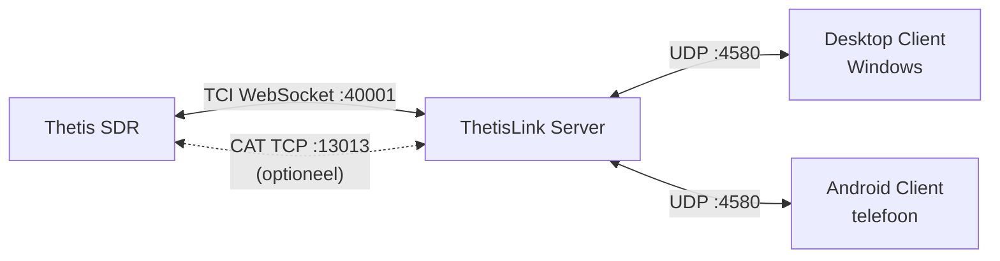

# ThetisLink v1.0.0 - Installatiehandleiding

ThetisLink is een remote bediening voor de ANAN 7000DLE SDR met Thetis. Audio, spectrum, PTT en volledige radiobediening over het netwerk via TCI WebSocket.

**Compatibiliteit:** Werkt met alle HPSDR Protocol 2 apparaten (ANAN-7000DLE, ANAN-8000DLE, ANAN-G2, Hermes-Lite 2, etc.) in combinatie met **Thetis v2.10.3.13** (officiele release door ramdor). Optioneel: Yaesu FT-991A als tweede radio (via COM poort).

**PA3GHM Thetis fork (aanbevolen):** Er is een Thetis fork beschikbaar die alle besturing via TCI afhandelt, waardoor de minder efficiente TCP/IP CAT verbinding volledig wordt geelimineerd. Daarnaast biedt de fork uitgebreide IQ bandbreedte (tot 1536 kHz), push-notificaties en diversity auto-null. Alle uitbreidingen zitten achter een checkbox in Thetis en zijn standaard uit. Zie de Gebruikershandleiding (`User-Manual.md`) voor details.

**Disclaimer:** Deze software bestuurt radiozenders. Gebruik op eigen risico. De auteur is niet verantwoordelijk voor schade aan apparatuur, storing of overtredingen van regelgeving als gevolg van het gebruik van deze software. Controleer alle veiligheidsfuncties (PTT timeout, vermogensgrenzen) voor het zenden.

---

## Wat zit er in dit pakket?

| Bestand | Beschrijving |
|---------|-------------|
| ThetisLink-Server.exe | Server - draait op de PC naast Thetis |
| ThetisLink-Client.exe | Desktop client - Windows |
| ThetisLink-1.0.0.apk | Android client - telefoon/tablet |
| thetislink-server.conf | Voorbeeldconfiguratie server |
| thetislink-client.conf | Voorbeeldconfiguratie client |
| Installatie.pdf | Deze handleiding (Nederlands) |
| User-Manual.pdf | Gebruikershandleiding (Nederlands) |
| Technische-Referentie.pdf | Technische referentie (Nederlands) |
| Installation.pdf | Installation guide (English) |
| User-Manual-EN.pdf | User manual (English) |
| Technical-Reference.pdf | Technical reference (English) |
| LICENSE | Licentie |
| SHA256SUMS.txt | Checksums ter verificatie |

---

## Overzicht



**Thetis -> Server** (TCI WebSocket, eventueel aangevuld met CAT):
- Audio (RX en TX streams), spectrum/waterfall (IQ data), besturing (frequentie, mode, controls)

**Server -> Clients** (UDP poort 4580):
- Alles: audio, spectrum, besturing, apparaatstatus - in een UDP verbinding per client

---

## Vereisten

| Component | Vereiste |
|-----------|---------|
| **Server OS** | Windows 10 of 11 |
| **Thetis** | v2.10.3.13 (ramdor) of PA3GHM fork |
| **SDR hardware** | ANAN 7000DLE of ander HPSDR Protocol 2 apparaat |
| **Desktop client** | Windows 10 of 11 |
| **Android client** | Android 8.0 (Oreo) of hoger, arm64 |
| **Netwerk** | WiFi of LAN, UDP poort 4580 beschikbaar |

Geen administrator-rechten nodig voor server of client. ADB is optioneel (alleen nodig voor APK installatie via command line).

---

## Stap 1: Thetis voorbereiden

### 1.0 PA3GHM Thetis fork installeren (aanbevolen)

De PA3GHM fork is een aangepaste versie van Thetis met ThetisLink-specifieke uitbreidingen. Installatie:

1. Installeer eerst de officiele **Thetis v2.10.3.13** via de standaard installer (als je dat nog niet hebt)
2. Download `Thetis.exe` van de PA3GHM fork (branch `thetislink-tci-extended`)
3. Maak een **backup** van de originele `Thetis.exe` in de Thetis installatiemap (bijv. hernoem naar `Thetis-original.exe`)
4. Kopieer de PA3GHM `Thetis.exe` naar de Thetis installatiemap (overschrijf de originele)
5. Kopieer `ReleaseNotes.txt` naar dezelfde map (overschrijf de bestaande)
6. Start Thetis - in de titelbalk verschijnt "PA3GHM TL-26" achter het versienummer

> De fork wijzigt alleen `Thetis.exe`. Alle andere bestanden (DLL's, database, instellingen) blijven ongewijzigd. Je kunt altijd terug naar de originele versie door de backup terug te zetten.

### 1.1 TCI Server inschakelen

Setup -> Serial/Network/Midi CAT -> Network:
1. Vink **TCI Server Running** aan
2. Poort: **40001** (standaard)

Bij de PA3GHM Thetis fork, op dezelfde tab:
1. Vink **ThetisLink extensions** aan

### 1.2 CAT Server inschakelen (alleen bij standaard Thetis)

Setup -> Serial/Network/Midi CAT -> Network:
1. Vink **TCP/IP CAT Server Running** aan
2. Poort: **13013**

> Alleen nodig bij standaard Thetis. Met de PA3GHM fork en ThetisLink extensions aan gaat alle besturing via TCI en is CAT niet nodig.

---

## Stap 2: Server instellen

### 2.1 Server starten

Kopieer `ThetisLink-Server.exe` naar een map op de Thetis-PC. Dubbelklik om te starten - geen installatie of administrator-rechten nodig.

Bij eerste start wordt automatisch een `thetislink-server.conf` aangemaakt met standaardwaarden. De server opent een GUI-venster waarin je alles configureert.

### 2.2 Verbinding met Thetis configureren

Vul in de server GUI in:

| Instelling | Waarde | Toelichting |
|-----------|--------|-------------|
| **TCI** | `ws://127.0.0.1:40001` | TCI WebSocket adres |
| **CAT** | `127.0.0.1:13013` | CAT TCP adres (niet nodig bij PA3GHM fork) |

Als Thetis op dezelfde PC draait (aanbevolen), zijn de standaardwaarden al correct.

### 2.3 Externe apparaten (optioneel)

In de server GUI kun je externe apparaten aansluiten. Elk apparaat heeft een enable/disable vinkje - uitgeschakelde apparaten behouden hun configuratie maar worden niet opgestart.

| Apparaat | Verbinding | Instelling |
|----------|-----------|-----------|
| Amplitec 6/2 antenneswitch | Serieel (USB) | COM poort, 19200 baud |
| JC-4s antennetuner (*) | Serieel (USB) | COM poort (gebruikt RTS/CTS lijnen) |
| SPE Expert 1.3K-FA PA | Serieel (USB) | COM poort, 115200 baud |
| RF2K-S PA | HTTP REST | IP:poort (bijv. `192.168.1.50:8080`) |
| UltraBeam RCU-06 antennecontroller | Serieel (USB) | COM poort |
| EA7HG Visual Rotor | UDP | IP:poort (bijv. `192.168.1.66:2570`) |
| Yaesu FT-991A | Serieel (USB) | COM poort (zie hieronder) |

> (*) De JC-4s antennetuner heeft geen standaard seriele interface. Aansturing werkt alleen met een eigen USB-serieel uitbreiding die de RTS/CTS lijnen gebruikt voor tune/abort signalen. Dit is geen standaard product - neem contact op voor details.

#### Yaesu FT-991A USB driver

De Yaesu FT-991A gebruikt een **Silicon Labs CP210x** USB-naar-serieel chip. De driver is te downloaden op:

https://www.silabs.com/developer-tools/usb-to-uart-bridge-vcp-drivers

Na installatie van de driver en het aansluiten van de Yaesu via USB verschijnen er **twee COM-poorten** in Apparaatbeheer (bijv. COM5 en COM6). Selecteer de **laagste** van de twee - dit is de CAT/serieel poort. De andere poort is voor USB audio.

Voor Yaesu audio: selecteer in de ThetisLink Server GUI bij het Yaesu apparaat **USB Audio CODEC** als audioapparaat. De server stuurt dit audiokanaal door naar de clients.

### 2.4 Firewall

Bij eerste start vraagt Windows Firewall om toestemming. Sta **privaatnetwerk** toe.

De server luistert op **UDP poort 4580**. Als de firewall-melding niet verschijnt:

1. Windows Defender Firewall -> Geavanceerde instellingen
2. Binnenkomende regel -> Nieuwe regel -> Programma
3. Selecteer `ThetisLink-Server.exe`
4. Toestaan op privaatnetwerk

### 2.5 Windows Defender uitsluiting

Windows Defender scant `ThetisLink-Server.exe` continu omdat het een onbekend programma is. Dit kost onnodig processing power. Sluit de map uit van real-time scanning:

1. Windows Beveiliging -> Virus- en bedreigingsbeveiliging -> Instellingen beheren
2. Scroll naar **Uitsluitingen** -> Uitsluitingen toevoegen of verwijderen
3. Voeg een **Mapuitsluiting** toe voor de map waarin `ThetisLink-Server.exe` staat

### 2.6 Wachtwoord en 2FA

Een wachtwoord is **verplicht**. De server start niet zonder een geldig wachtwoord (minimaal 8 tekens, letters en cijfers). Stel het wachtwoord in via de server GUI onder **Security**. Clients moeten hetzelfde wachtwoord invoeren om te verbinden.

De authenticatie gebruikt HMAC-SHA256 challenge-response: het wachtwoord wordt nooit over het netwerk verstuurd. Brute-force bescherming is ingebouwd per client.

**2FA (optioneel, aanbevolen):** Onder het wachtwoord staat een **2FA (TOTP)** checkbox. Bij het inschakelen verschijnt een QR code. Scan deze met een authenticator app (Google Authenticator, Authy, Microsoft Authenticator, etc.). Na het scannen genereert de app elke 30 seconden een 6-cijferige code.

Bij het verbinden voert de client eerst het wachtwoord in, waarna een tweede invoerveld verschijnt voor de 6-cijferige 2FA code. Zonder de code is verbinden niet mogelijk.

### 2.7 Configuratiebestand

Alle instellingen worden automatisch opgeslagen in `thetislink-server.conf` naast de exe. Dit bestand wordt bij eerste start aangemaakt en bijgewerkt bij elke wijziging in de GUI.

---

## Stap 3: Desktop client installeren (Windows)

> De desktop client is momenteel alleen beschikbaar voor Windows. Een macOS build (Intel) is experimenteel getest maar niet opgenomen in de distributie.

### 3.1 Installatie

Kopieer `ThetisLink-Client.exe` naar een map op de client-PC. Geen installatie nodig.

### 3.2 Eerste keer starten

1. Start `ThetisLink-Client.exe`
2. Selecteer je **microfoon** (Input) en **speaker/headset** (Output) bovenaan
3. Vul het **serveradres** in: `<server-IP>:4580` (bijv. `192.168.1.79:4580`)
4. Voer het **wachtwoord** in (zie stap 2.6)
5. Klik **Connect**
6. Voer de **2FA code** in als TOTP is ingeschakeld op de server (6 cijfers uit je authenticator app)

Als server en client op dezelfde PC draaien: gebruik `127.0.0.1:4580`.

> Bij de eerste verbinding kan het aan beide zijden even duren voordat alles is opgestart - de server moet de TCI verbinding met Thetis opbouwen en alle apparaten initialiseren. Dit is eenmalig; bij volgende verbindingen gaat het direct.

### 3.3 Configuratie

Instellingen worden automatisch opgeslagen in `thetislink-client.conf` naast de exe:
- Server adres, volumes, TX gain, AGC
- Spectrum instellingen (ref, range, zoom, contrast per band)
- Band memories
- TX profielen
- MIDI mappings

---

## Stap 4: Android client installeren

### 4.1 APK installeren

**Via bestandsbeheer:**
1. Kopieer `ThetisLink-1.0.0.apk` naar je telefoon (USB, e-mail, of cloud)
2. Open het APK-bestand op de telefoon
3. Sta "Installeren van onbekende bronnen" toe als gevraagd
4. Installeer

**Via ADB** (met USB-debugging ingeschakeld):
```
adb install ThetisLink-1.0.0.apk
```

### 4.2 Verbinden

1. Open ThetisLink
2. Vul het serveradres in: `<server-IP>:4580`
3. Stel het **wachtwoord** in via Settings (tandwiel icoon)
4. Tik **Connect**
5. Voer de **2FA code** in als TOTP is ingeschakeld (6 cijfers uit je authenticator app)
6. Sta microfoontoegang toe als gevraagd

### 4.3 Bluetooth headset

De Android client detecteert automatisch aangesloten Bluetooth headsets. Na het koppelen van een BT headset wordt deze automatisch gebruikt voor audio in/uit.

### 4.4 Bluetooth PTT knop

ThetisLink ondersteunt Bluetooth remote shutter knoppen (bijv. ZL-01) als draadloze PTT. Deze knoppen zijn verkrijgbaar als eenvoudige one-button Bluetooth afstandsbedieningen voor telefoons. Na het koppelen via Android Bluetooth-instellingen wordt de knop automatisch herkend als PTT.

---

## Bediening

Na een succesvolle verbinding is ThetisLink klaar voor gebruik. Zie de **Gebruikershandleiding** (`User-Manual.md`) voor:

- Audio, PTT en frequentie-instelling
- Spectrum en waterval bediening
- Externe apparaten (Amplitec, UltraBeam, SPE, RF2K, Yaesu, Rotor)
- MIDI controller configuratie
- Diversity ontvangst en DX Cluster
- Macro's en naamconventies

---

## Netwerk

### Bandbreedte

| Situatie | Bandbreedte |
|---------|-------------|
| Audio alleen | ~50 kbps |
| Audio + spectrum | ~500 kbps |

### Latency

Hoe lager de netwerklatency, hoe beter de ervaring - met name voor PTT en audio.

| Netwerk | Verwachting |
|---------|------------|
| LAN / WiFi thuis | Uitstekend (< 5 ms) |
| 4G/5G mobiel | Goed (adaptieve jitter buffer past zich aan) |
| Internet met port forwarding | Goed, afhankelijk van route |

### Gebruik via internet (port forwarding)

Om ThetisLink van buitenshuis te gebruiken moet je router het verkeer doorsturen naar de server-PC:

1. Log in op je router (meestal `192.168.1.1` of `192.168.178.1` in de browser)
2. Zoek de **port forwarding** instelling (soms "NAT", "virtuele server" of "poort doorsturen" genoemd)
3. Maak een regel aan:
   - **Protocol:** UDP
   - **Externe poort:** 4580
   - **Interne poort:** 4580
   - **Intern IP-adres:** het IP van de server-PC (bijv. `192.168.1.79`)
4. Sla op en herstart de router indien nodig

In de client gebruik je dan je **publieke IP-adres** als serveradres. Je publieke IP vind je op bijv. whatismyip.com. Bij een wisselend IP-adres kun je een DynDNS dienst gebruiken (bijv. No-IP, DuckDNS) zodat je altijd via dezelfde naam verbindt.

> **Beveiliging:** Het wachtwoord is altijd verplicht (zie stap 2.6). Bij gebruik via internet wordt 2FA (TOTP) sterk aanbevolen als extra beveiligingslaag. Overweeg als alternatief een VPN-oplossing (bijv. WireGuard) waarmee de server-PC niet direct aan internet wordt blootgesteld.

---

## Problemen oplossen (installatie en verbinding)

| Probleem | Oplossing |
|----------|-----------|
| Geen audio na connect | Controleer of TCI server actief is in Thetis (Setup -> Serial/Network/Midi CAT -> Network) |
| Frequentie verandert niet | Controleer of CAT server actief is (Setup -> Serial/Network/Midi CAT -> Network, poort 13013) |
| Client kan niet verbinden | Firewall blokkeert UDP 4580 - controleer firewall-regels |
| Disconnect na paar seconden | Instabiel WiFi of firewall blokkade. Check loss% onderaan de client |
| Spectrum toont niets | TCI server moet actief zijn. Controleer ook de TCI poort in de server GUI |
| Externe apparaten reageren niet | Check COM poort instelling in server GUI en of het apparaat aan staat |
| Rotor offline | Check IP:poort in server GUI. Visual Rotor software mag niet tegelijk draaien |
| Yaesu reageert niet | Check COM poort in server GUI. Zorg dat geen ander programma de COM poort gebruikt |
| APK installeert niet | Sta "onbekende bronnen" toe in Android-instellingen |

Voor problemen tijdens het gebruik, zie de Gebruikershandleiding (`User-Manual.md`).

---

## Remote beheer (headless server setup)

Voor een onbemande Thetis PC die op afstand beheerd wordt via ThetisLink.

> **Let op:** Automatisch inloggen zonder wachtwoord is alleen verantwoord als de PC fysiek beveiligd is (bijv. in een afgesloten shack) en bij voorkeur op een apart netwerksegment staat. Doe dit niet op een PC die publiek toegankelijk is of op een gedeeld netwerk zonder vertrouwen.

### Automatisch inloggen (zonder wachtwoord)

1. Open PowerShell als Administrator:
   ```powershell
   reg add "HKLM\SOFTWARE\Microsoft\Windows NT\CurrentVersion\PasswordLess\Device" /v DevicePasswordLessBuildVersion /t REG_DWORD /d 0 /f
   ```
2. Run `netplwiz` (Win+R -> `netplwiz`)
3. Vink **"Users must enter a user name and password to use this computer"** UIT -> OK
4. Voer je **account wachtwoord** in (twee keer) - **niet** je PIN!
   - Bij een Microsoft account: je Microsoft wachtwoord
   - Bij een domeinaccount: je domein wachtwoord
   - De Windows Hello PIN werkt hier niet

**Let op:** als er na deze stap twee identieke gebruikers op het inlogscherm verschijnen, open `netplwiz` opnieuw, selecteer de dubbele en klik Remove.

### ThetisLink Server automatisch starten

Leg een snelkoppeling naar `ThetisLink-Server.exe` in de Startup map:
```
Win+R -> shell:startup -> plak snelkoppeling
```

### Remote reboot via ThetisLink

De client kan de server PC herstarten via de reboot knop. Dit vereist een Windows Scheduled Task:

```powershell
schtasks /create /tn "ThetisLinkReboot" /tr "shutdown /r /t 5 /f" /sc once /st 00:00 /ru SYSTEM /rl HIGHEST /f
```

Deze task wordt eenmalig aangemaakt. De server voert `schtasks /run /tn ThetisLinkReboot` uit bij een remote reboot verzoek.

### SSH toegang (voor bestandsbeheer via WinSCP)

Installeer OpenSSH Server op de Thetis PC:

1. **Settings -> Apps -> Optional features -> Add a feature** -> zoek "OpenSSH Server" -> Install
2. Start de service (PowerShell als Administrator):
   ```powershell
   Start-Service sshd
   Set-Service -Name sshd -StartupType 'Automatic'
   ```
3. Verbind via WinSCP op poort 22 met je Windows gebruikersnaam en wachtwoord

---

## Verificatie

Controleer de integriteit van de bestanden:

**Linux/macOS/Git Bash:**
```
sha256sum -c SHA256SUMS.txt
```

**PowerShell (Windows):**
```powershell
Get-Content SHA256SUMS.txt | ForEach-Object {
    $parts = $_ -split '  '
    $expected = $parts[0]; $file = $parts[1]
    $actual = (Get-FileHash $file -Algorithm SHA256).Hash.ToLower()
    if ($actual -eq $expected) { "$file OK" } else { "$file FAILED" }
}
```


