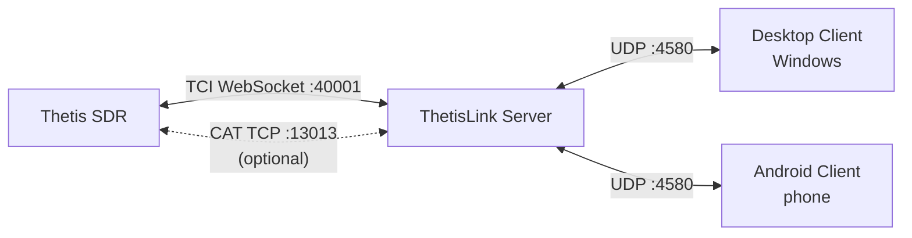

# ThetisLink v0.7.0 - Installation Guide

ThetisLink is a remote control application for the ANAN 7000DLE SDR with Thetis. Audio, spectrum, PTT and full radio control over the network via TCI WebSocket.

**Compatibility:** Works with all HPSDR Protocol 2 devices (ANAN-7000DLE, ANAN-8000DLE, ANAN-G2, Hermes-Lite 2, etc.) in combination with **Thetis v2.10.3.13** (official release by ramdor). Optional: Yaesu FT-991A as a second radio (via COM port).

**PA3GHM Thetis fork (recommended):** A Thetis fork is available that handles all control via TCI, completely eliminating the less efficient TCP/IP CAT connection. In addition, the fork offers extended IQ bandwidth (up to 1536 kHz), push notifications and diversity auto-null. All extensions are behind a checkbox in Thetis and are disabled by default. See the User Manual (`User-Manual-EN.md`) for details.

**Disclaimer:** This software controls radio transmitters. Use at your own risk. The author is not responsible for damage to equipment, interference or violations of regulations resulting from the use of this software. Verify all safety features (PTT timeout, power limits) before transmitting.

---

## What is included in this package?

| File | Description |
|------|-------------|
| ThetisLink-Server.exe | Server - runs on the PC alongside Thetis |
| ThetisLink-Client.exe | Desktop client - Windows |
| ThetisLink-0.7.0.apk | Android client - phone/tablet |
| thetislink-server.conf | Example server configuration |
| thetislink-client.conf | Example client configuration |
| Installation.pdf | Installation guide (English, this document) |
| User-Manual-EN.pdf | User manual (English) |
| Technical-Reference.pdf | Technical reference (English) |
| Installatie.pdf | Installatiehandleiding (Nederlands) |
| User-Manual.pdf | Gebruikershandleiding (Nederlands) |
| Technische-Referentie.pdf | Technische referentie (Nederlands) |
| LICENSE | License |
| SHA256SUMS.txt | Checksums for verification |

---

## Overview



**Thetis -> Server** (TCI WebSocket, optionally supplemented with CAT):
- Audio (RX and TX streams), spectrum/waterfall (IQ data), control (frequency, mode, controls)

**Server -> Clients** (UDP port 4580):
- Everything: audio, spectrum, control, device status - in a single UDP connection per client

---

## Requirements

| Component | Requirement |
|-----------|-------------|
| **Server OS** | Windows 10 or 11 |
| **Thetis** | v2.10.3.13 (ramdor) or PA3GHM fork |
| **SDR hardware** | ANAN 7000DLE or other HPSDR Protocol 2 device |
| **Desktop client** | Windows 10 or 11 |
| **Android client** | Android 8.0 (Oreo) or higher, arm64 |
| **Network** | WiFi or LAN, UDP port 4580 available |

No administrator rights required for server or client. ADB is optional (only needed for APK installation via command line).

---

## Step 1: Preparing Thetis

### 1.0 Installing the PA3GHM Thetis fork (recommended)

The PA3GHM fork is a modified version of Thetis with ThetisLink-specific extensions. Installation:

1. First install the official **Thetis v2.10.3.13** using the standard installer (if you have not already done so)
2. Download `Thetis.exe` from the PA3GHM fork (branch `thetislink-tci-extended`)
3. Make a **backup** of the original `Thetis.exe` in the Thetis installation folder (e.g. rename to `Thetis-original.exe`)
4. Copy the PA3GHM `Thetis.exe` to the Thetis installation folder (overwrite the original)
5. Copy `ReleaseNotes.txt` to the same folder (overwrite the existing file)
6. Start Thetis - the title bar will show "PA3GHM TL-26" after the version number

> The fork only modifies `Thetis.exe`. All other files (DLLs, database, settings) remain unchanged. You can always revert to the original version by restoring the backup.

### 1.1 Enabling the TCI Server

Setup -> Serial/Network/Midi CAT -> Network:
1. Check **TCI Server Running**
2. Port: **40001** (default)

With the PA3GHM Thetis fork, on the same tab:
1. Check **ThetisLink extensions**

### 1.2 Enabling the CAT Server (standard Thetis only)

Setup -> Serial/Network/Midi CAT -> Network:
1. Check **TCP/IP CAT Server Running**
2. Port: **13013**

> Only required with standard Thetis. With the PA3GHM fork and ThetisLink extensions enabled, all control goes through TCI and CAT is not needed.

---

## Step 2: Configuring the Server

### 2.1 Starting the server

Copy `ThetisLink-Server.exe` to a folder on the Thetis PC. Double-click to start - no installation or administrator rights required.

On first start, a `thetislink-server.conf` is automatically created with default values. The server opens a GUI window where you configure everything.

### 2.2 Configuring the connection to Thetis

Enter the following in the server GUI:

| Setting | Value | Notes |
|---------|-------|-------|
| **TCI** | `ws://127.0.0.1:40001` | TCI WebSocket address |
| **CAT** | `127.0.0.1:13013` | CAT TCP address (not needed with PA3GHM fork) |

If Thetis is running on the same PC (recommended), the default values are already correct.

### 2.3 External devices (optional)

In the server GUI you can connect external devices. Each device has an enable/disable checkbox - disabled devices retain their configuration but are not started.

| Device | Connection | Setting |
|--------|-----------|---------|
| Amplitec 6/2 antenna switch | Serial (USB) | COM port, 19200 baud |
| JC-4s antenna tuner (*) | Serial (USB) | COM port (uses RTS/CTS lines) |
| SPE Expert 1.3K-FA PA | Serial (USB) | COM port, 115200 baud |
| RF2K-S PA | HTTP REST | IP:port (e.g. `192.168.1.50:8080`) |
| UltraBeam RCU-06 antenna controller | Serial (USB) | COM port |
| EA7HG Visual Rotor | UDP | IP:port (e.g. `192.168.1.66:2570`) |
| Yaesu FT-991A | Serial (USB) | COM port (see below) |

> (*) The JC-4s antenna tuner does not have a standard serial interface. Control only works with a custom USB-serial extension that uses the RTS/CTS lines for tune/abort signals. This is not a standard product - contact for details.

#### Yaesu FT-991A USB driver

The Yaesu FT-991A uses a **Silicon Labs CP210x** USB-to-serial chip. The driver can be downloaded at:

https://www.silabs.com/developer-tools/usb-to-uart-bridge-vcp-drivers

After installing the driver and connecting the Yaesu via USB, **two COM ports** will appear in Device Manager (e.g. COM5 and COM6). Select the **lowest** of the two - this is the CAT/serial port. The other port is for USB audio.

For Yaesu audio: in the ThetisLink Server GUI, select **USB Audio CODEC** as the audio device for the Yaesu device. The server forwards this audio channel to the clients.

### 2.4 Firewall

On first start, Windows Firewall will ask for permission. Allow **private network**.

The server listens on **UDP port 4580**. If the firewall prompt does not appear:

1. Windows Defender Firewall -> Advanced settings
2. Inbound rules -> New rule -> Program
3. Select `ThetisLink-Server.exe`
4. Allow on private network

### 2.5 Windows Defender exclusion

Windows Defender continuously scans `ThetisLink-Server.exe` because it is an unknown program. This wastes processing power unnecessarily. Exclude the folder from real-time scanning:

1. Windows Security -> Virus & threat protection -> Manage settings
2. Scroll to **Exclusions** -> Add or remove exclusions
3. Add a **Folder exclusion** for the folder containing `ThetisLink-Server.exe`

### 2.6 Password and 2FA

A password is **required**. The server will not start without a valid password (minimum 8 characters, letters and digits). Set the password in the server GUI under **Security**. Clients must enter the same password to connect.

Authentication uses HMAC-SHA256 challenge-response: the password is never sent over the network. Brute-force protection is built in per client.

**2FA (optional, recommended):** Below the password there is a **2FA (TOTP)** checkbox. When enabled, a QR code is displayed. Scan it with an authenticator app (Google Authenticator, Authy, Microsoft Authenticator, etc.). After scanning, the app generates a 6-digit code every 30 seconds.

When connecting, the client first enters the password, after which a second input field appears for the 6-digit 2FA code. Without the code, connecting is not possible.

### 2.7 Configuration file

All settings are automatically saved in `thetislink-server.conf` next to the exe. This file is created on first start and updated with every change in the GUI.

---

## Step 3: Installing the desktop client (Windows)

> The desktop client is currently only available for Windows. A macOS build (Intel) has been experimentally tested but is not included in the distribution.

### 3.1 Installation

Copy `ThetisLink-Client.exe` to a folder on the client PC. No installation required.

### 3.2 First launch

1. Start `ThetisLink-Client.exe`
2. Select your **microphone** (Input) and **speaker/headset** (Output) at the top
3. Enter the **server address**: `<server-IP>:4580` (e.g. `192.168.1.79:4580`)
4. Enter the **password** (see step 2.6)
5. Click **Connect**
6. Enter the **2FA code** if TOTP is enabled on the server (6 digits from your authenticator app)

If server and client are running on the same PC: use `127.0.0.1:4580`.

> On the first connection it may take a moment on both sides before everything is ready - the server needs to establish the TCI connection with Thetis and initialize all devices. This is a one-time delay; subsequent connections are immediate.

### 3.3 Configuration

Settings are automatically saved in `thetislink-client.conf` next to the exe:
- Server address, volumes, TX gain, AGC
- Spectrum settings (ref, range, zoom, contrast per band)
- Band memories
- TX profiles
- MIDI mappings

---

## Step 4: Installing the Android client

### 4.1 Installing the APK

**Via file manager:**
1. Copy `ThetisLink-0.7.0.apk` to your phone (USB, email, or cloud)
2. Open the APK file on the phone
3. Allow "Install from unknown sources" if prompted
4. Install

**Via ADB** (with USB debugging enabled):
```
adb install ThetisLink-0.7.0.apk
```

### 4.2 Connecting

1. Open ThetisLink
2. Enter the server address: `<server-IP>:4580`
3. Set the **password** via Settings (gear icon)
4. Tap **Connect**
5. Enter the **2FA code** if TOTP is enabled (6 digits from your authenticator app)
6. Allow microphone access if prompted

### 4.3 Bluetooth headset

The Android client automatically detects connected Bluetooth headsets. After pairing a BT headset, it is automatically used for audio in/out.

### 4.4 Bluetooth PTT button

ThetisLink supports Bluetooth remote shutter buttons (e.g. ZL-01) as wireless PTT. These buttons are available as simple one-button Bluetooth remote controls for phones. After pairing via Android Bluetooth settings, the button is automatically recognized as PTT.

---

## Operation

After a successful connection, ThetisLink is ready to use. See the **User Manual** (`User-Manual-EN.md`) for:

- Audio, PTT and frequency control
- Spectrum and waterfall operation
- External devices (Amplitec, UltraBeam, SPE, RF2K, Yaesu, Rotor)
- MIDI controller configuration
- Diversity reception and DX Cluster
- Macros and naming conventions

---

## Network

### Bandwidth

| Situation | Bandwidth |
|-----------|-----------|
| Audio only | ~50 kbps |
| Audio + spectrum | ~500 kbps |

### Latency

The lower the network latency, the better the experience - especially for PTT and audio.

| Network | Expectation |
|---------|-------------|
| LAN / home WiFi | Excellent (< 5 ms) |
| 4G/5G mobile | Good (adaptive jitter buffer adjusts) |
| Internet with port forwarding | Good, depending on route |

### Using via internet (port forwarding)

To use ThetisLink from outside your home network, your router must forward traffic to the server PC:

1. Log in to your router (usually `192.168.1.1` or `192.168.178.1` in the browser)
2. Find the **port forwarding** setting (sometimes called "NAT", "virtual server" or "port redirect")
3. Create a rule:
   - **Protocol:** UDP
   - **External port:** 4580
   - **Internal port:** 4580
   - **Internal IP address:** the IP of the server PC (e.g. `192.168.1.79`)
4. Save and restart the router if necessary

In the client, use your **public IP address** as the server address. You can find your public IP at e.g. whatismyip.com. If your IP address changes frequently, you can use a DynDNS service (e.g. No-IP, DuckDNS) so you always connect via the same hostname.

> **Security:** A password is always required (see step 2.6). When using over the internet, 2FA (TOTP) is strongly recommended as an additional security layer. Consider as an alternative a VPN solution (e.g. WireGuard) so that the server PC is not directly exposed to the internet.

---

## Troubleshooting (installation and connection)

| Problem | Solution |
|---------|----------|
| No audio after connect | Check that TCI server is active in Thetis (Setup -> Serial/Network/Midi CAT -> Network) |
| Frequency does not change | Check that CAT server is active (Setup -> Serial/Network/Midi CAT -> Network, port 13013) |
| Client cannot connect | Firewall is blocking UDP 4580 - check firewall rules |
| Disconnect after a few seconds | Unstable WiFi or firewall block. Check loss% at the bottom of the client |
| Spectrum shows nothing | TCI server must be active. Also check the TCI port in the server GUI |
| External devices not responding | Check COM port setting in server GUI and whether the device is powered on |
| Rotor offline | Check IP:port in server GUI. Visual Rotor software must not be running at the same time |
| Yaesu not responding | Check COM port in server GUI. Make sure no other program is using the COM port |
| APK will not install | Allow "unknown sources" in Android settings |

For problems during use, see the User Manual (`User-Manual-EN.md`).

---

## Remote management (headless server setup)

For an unattended Thetis PC managed remotely via ThetisLink.

> **Note:** Automatic login without a password is only appropriate if the PC is physically secured (e.g. in a locked shack) and preferably on a separate network segment. Do not do this on a PC that is publicly accessible or on a shared network without trust.

### Automatic login (without password)

1. Open PowerShell as Administrator:
   ```powershell
   reg add "HKLM\SOFTWARE\Microsoft\Windows NT\CurrentVersion\PasswordLess\Device" /v DevicePasswordLessBuildVersion /t REG_DWORD /d 0 /f
   ```
2. Run `netplwiz` (Win+R -> `netplwiz`)
3. Uncheck **"Users must enter a user name and password to use this computer"** -> OK
4. Enter your **account password** (twice) - **not** your PIN!
   - For a Microsoft account: your Microsoft password
   - For a domain account: your domain password
   - The Windows Hello PIN does not work here

**Note:** If two identical users appear on the login screen after this step, open `netplwiz` again, select the duplicate and click Remove.

### Auto-starting ThetisLink Server

Place a shortcut to `ThetisLink-Server.exe` in the Startup folder:
```
Win+R -> shell:startup -> paste shortcut
```

### Remote reboot via ThetisLink

The client can restart the server PC via the reboot button. This requires a Windows Scheduled Task:

```powershell
schtasks /create /tn "ThetisLinkReboot" /tr "shutdown /r /t 5 /f" /sc once /st 00:00 /ru SYSTEM /rl HIGHEST /f
```

This task is created once. The server executes `schtasks /run /tn ThetisLinkReboot` upon a remote reboot request.

### SSH access (for file management via WinSCP)

Install OpenSSH Server on the Thetis PC:

1. **Settings -> Apps -> Optional features -> Add a feature** -> search for "OpenSSH Server" -> Install
2. Start the service (PowerShell as Administrator):
   ```powershell
   Start-Service sshd
   Set-Service -Name sshd -StartupType 'Automatic'
   ```
3. Connect via WinSCP on port 22 with your Windows username and password

---

## Verification

Verify the integrity of the files:

**Linux/macOS/Git Bash:**
```
sha256sum -c SHA256SUMS.txt
```

**PowerShell (Windows):**
```powershell
Get-Content SHA256SUMS.txt | ForEach-Object {
    $parts = $_ -split '  '
    $expected = $parts[0]; $file = $parts[1]
    $actual = (Get-FileHash $file -Algorithm SHA256).Hash.ToLower()
    if ($actual -eq $expected) { "$file OK" } else { "$file FAILED" }
}
```
