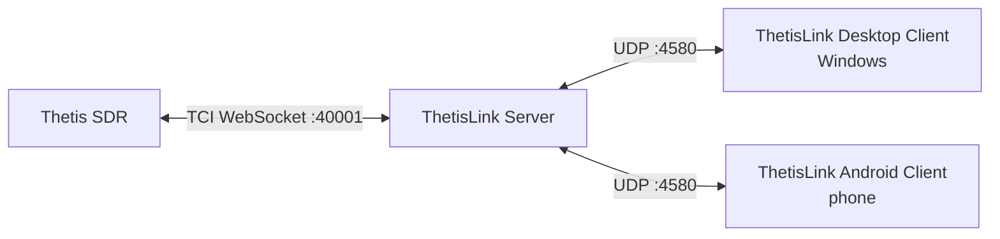

# ThetisLink v2.4.1 - Installation Guide

ThetisLink is a remote control application for the ANAN 7000DLE SDR with Thetis. Audio, spectrum, PTT and full radio control over the network via TCI WebSocket.

**Compatibility:** ThetisLink talks only to **Thetis** (via TCI WebSocket) and not directly to the SDR hardware. It therefore works with any SDR device supported by **Thetis v2.10.3.15** (official release by ramdor) — both HPSDR Protocol 1 (Hermes, Angelia, Orion) and HPSDR Protocol 2 (ANAN-7000DLE, ANAN-8000DLE, ANAN-G2, Hermes-Lite 2, etc.). Optional: Yaesu FT-991A as a second radio (via COM port).

**PA3GHM Thetis fork (optional, recommended for TL2 extensions):** ThetisLink v2.4.0 works fine with stock Thetis v2.10.3.15 over TCI alone — no separate CAT TCP connection is required. The PA3GHM fork is an **optional** drop-in replacement that adds ThetisLink-specific TL2 `_ex` extensions on top of stock Thetis: extended IQ bandwidth up to 1536 kHz (vs the 384 kHz stock cap), `tci_caps_ex` capability broadcast, server-side CTUN auto-recenter (`auto_recenter_ex`), filter-preset and per-RX DDC-rate push notifications, and diversity auto-null with live circle broadcast. All extensions sit behind the **"ThetisLink extensions"** checkbox in Thetis and are disabled by default; with the checkbox unchecked the TCI extension behaviour is preserved (stock v2.10.3.15 — note the fork still carries its own build tag, release notes and About metadata). See the User Manual (`User-Manual-EN.md`) for details.

**Disclaimer:** This software controls radio transmitters. Use at your own risk. The author is not responsible for damage to equipment, interference or violations of regulations resulting from the use of this software. Verify all safety features (PTT timeout, power limits) before transmitting.

---

## What is included in this package?

| File | Description |
|------|-------------|
| ThetisLink-Server.exe | ThetisLink Server - runs on the PC alongside Thetis |
| ThetisLink-Client.exe | ThetisLink Desktop Client - Windows |
| ThetisLink-2.4.1.apk | ThetisLink Android Client - phone/tablet |
| Installation.pdf | Installation guide (English, this document) |
| User-Manual-EN.pdf | User manual (English) |
| Technical-Reference.pdf | Technical reference (English) |
| Installatie.pdf | Installatiehandleiding (Nederlands) |
| User-Manual.pdf | Gebruikershandleiding (Nederlands) |
| Technische-Referentie.pdf | Technische referentie (Nederlands) |
| LICENSE | License |
| SHA256SUMS.txt | Checksums for verification |

> **Configuration files:** `thetislink-server.conf` and `thetislink-client.conf` are **not bundled**. They are created automatically with default values on the first start of the server and client (in the same folder as the exe). This is consistent with v2.0.2 — existing users retain their own settings.

---

## Overview


```mermaid
flowchart LR
    Thetis[Thetis SDR] <-->|"TCI WebSocket :40001"| Server[ThetisLink Server]
    Server <-->|"UDP :4580"| Desktop[ThetisLink Desktop Client<br>Windows]
    Server <-->|"UDP :4580"| Android[ThetisLink Android Client<br>phone]
```

**Thetis -> ThetisLink Server** (single TCI WebSocket connection):
- Audio (RX and TX streams), spectrum/waterfall (IQ data), control (frequency, mode, controls)

**ThetisLink Server -> ThetisLink Clients** (UDP port 4580):
- Everything: audio, spectrum, control, device status - in a single UDP connection per ThetisLink Client

**Connecting from outside your own network** (two methods):
- **Port forwarding** — the router forwards UDP 4580 to the ThetisLink Server PC. Requires your own public IP address.
- **Relay (v2.4.0)** — behind **CGNAT** or without router access: the server and client both connect *outbound* to a relay on a VPS, no port forward needed. Host it yourself, or PA3GHM can temporarily add you on request (limited number of slots).

Both are detailed in [Network](#network) below (sections *Using via internet* and *... with the relay*).

---

## Requirements

| Component | Requirement |
|-----------|-------------|
| **ThetisLink Server OS** | Windows 10 or 11 |
| **Thetis** | v2.10.3.15 (ramdor) or PA3GHM fork |
| **SDR hardware** | Any HPSDR device supported by Thetis (Protocol 1 or 2) |
| **ThetisLink Desktop Client** | Windows 10 or 11 |
| **ThetisLink Android Client** | Android 8.0 (Oreo) or higher, arm64 |
| **Network** | WiFi or LAN, UDP port 4580 available |

No administrator rights required for the ThetisLink Server or ThetisLink Clients. ADB is optional (only needed for APK installation via command line).

---

## Step 1: Preparing Thetis

### 1.0 Installing the PA3GHM Thetis fork (recommended)

The PA3GHM fork is a modified version of Thetis with ThetisLink-specific extensions. **ThetisLink v2.4.0 works best with Thetis-fork build PA3GHM TL2-4** — that build ships the wideband-IQ extension + modulation-filter fan-out that this release relies on. Earlier fork builds also work, with progressively fewer fork-only features available (TL2-3 without wideband, TL2-2 without rx_only_ex push-notify, etc.); stock Thetis v2.10.3.15 remains the fallback. Installation:

1. First install the official **Thetis v2.10.3.15** using the standard installer (if you have not already done so)
2. Download `Thetis.exe` from the PA3GHM fork — **release tag `TL2-4`** at [cjenschede/Thetis](https://github.com/cjenschede/Thetis/releases) (branch `thetislink-tl2`)
3. Make a **backup** of the original `Thetis.exe` in the Thetis installation folder (e.g. rename to `Thetis-original.exe`)
4. Copy the PA3GHM `Thetis.exe` to the Thetis installation folder (overwrite the original)
5. Copy `ReleaseNotes.txt` to the same folder (overwrite the existing file)
6. Start Thetis - the title bar will show "PA3GHM TL2-4" after the version number

> The fork only modifies `Thetis.exe`. All other files (DLLs, database, settings) remain unchanged. You can always revert to the original version by restoring the backup.

### 1.1 Enabling the TCI Server in Thetis

Setup -> Serial/Network/Midi CAT -> Network -> **TCI Server** group:

1. Set the **Bind IP:Port** field to **`0.0.0.0:40001`**
   - `0.0.0.0` = listen on all network interfaces (loopback + LAN)
   - `40001` = the port the ThetisLink Server expects by default
   - **Note:** Thetis ships with `127.0.0.1:50001` by default. Both values must therefore be actively changed.
2. Check **TCI Server Running**

> **Why `0.0.0.0` instead of `127.0.0.1`?** With `0.0.0.0` the Thetis TCI server is reachable for:
> - the **ThetisLink Server** on the same PC (which uses `ws://127.0.0.1:40001`)
> - **network devices** that talk to Thetis directly (e.g. an **RF2K-S PA** on a different LAN IP)
> - **remote access via router/internet** (port-forwarding on port 40001)
>
> With `127.0.0.1` only the local ThetisLink Server path works — network devices and remote access drop out.
>
> If you do not want to bind wide-open, click **IPv4** (button next to the Bind field); Thetis will then fill in your local LAN IP. That restricts reachability to the LAN.

With the PA3GHM Thetis fork, on the same tab:
1. Check **ThetisLink extensions**

> ThetisLink v2.4.0 uses TCI exclusively for radio control. The TCP/IP CAT server in Thetis does not need to be enabled for ThetisLink — it is only required if you want to connect a separate logging program or third-party CAT client to Thetis directly.

---

## Step 2: Configuring the ThetisLink Server (TL2)

### 2.1 Starting the ThetisLink Server

Copy `ThetisLink-Server.exe` to a folder on the Thetis PC. Double-click to start - no installation or administrator rights required.

On first start, a `thetislink-server.conf` is automatically created with default values. The ThetisLink Server opens a GUI window where you configure everything.

### 2.2 Configuring the connection to Thetis

Enter the following in the ThetisLink Server GUI:

| Setting | Value | Notes |
|---------|-------|-------|
| **TCI** | `ws://127.0.0.1:40001` | TCI WebSocket address of Thetis |

If Thetis is running on the same PC (recommended), the default values are already correct, provided you set the Thetis TCI Server to `0.0.0.0:40001` (or `127.0.0.1:40001`) in step 1.1.

### 2.3 External devices (optional)

In the ThetisLink Server GUI you can connect external devices. Each device has an enable/disable checkbox - disabled devices retain their configuration but are not started.

| Device | Connection | Setting |
|--------|-----------|---------|
| Amplitec 6/2 antenna switch | Serial (USB) | COM port, 19200 baud |
| JC-4s / JC-3s antenna tuner (*) | USB-HID | Adafruit MCP2221A breakout (see below) |
| SPE Expert 1.3K-FA PA | Serial (USB) | COM port, 115200 baud |
| RF2K-S PA | HTTP REST | IP:port (e.g. `192.168.1.50:8080`) |
| UltraBeam RCU-06 antenna controller | Serial (USB) | COM port |
| EA7HG Visual Rotor | UDP | IP:port (e.g. `192.168.1.66:2570`) |
| PstRotator (outgoing) | UDP/XML | host:port of the PstRotator PC (e.g. `192.168.1.70:12000`) + local feedback port `12001`; supports any rotor model PstRotator itself drives |
| Yaesu G-1000DXC rotor (**) | USB-HID | Adafruit MCP2221A breakout in 5 V mode, BST82 gate switches on pin 1/2 + DAC on pin 3 + ADC via 1.8 k + 2.2 k divider on pin 4 |
| Yaesu FT-991A | Serial (USB) | COM port (see below) |

> (*) The StockCorner JC-4s and JC-3s tuners do not have a standard serial interface. From v2.0.3 each tuner is driven via an **Adafruit MCP2221A USB-to-HID breakout** with a transistor stage on the grey "start" wire and a 1 MΩ + 1 MΩ voltage divider on the yellow "tune-status" wire. Up to two tuners are supported in parallel; each board receives a unique USB serial number that you program from the server status panel. The full wiring and UI flow is documented in the User Manual (`User-Manual-EN.md`). This is not an off-the-shelf product — contact for details.

> (**) From v2.1.0 the **Yaesu G-1000DXC** can also be driven directly from the ThetisLink server via an **Adafruit MCP2221A breakout in 5 V mode**, without EA7HG or any other controller software in the loop. The breakout carries two BST82 low-side switches (CW/CCW) plus a 5-bit DAC for the speed input and an ADC for position feedback through a 1.8 kΩ + 2.2 kΩ voltage divider (ratio 1.818) — some G-1000DXC units reach ~7.3 V on pin 4 at 450°, so the previously-common 1.8 kΩ + 10 kΩ divider clips at the high angles. The rotor backend supports soft-start/soft-stop ramp, adaptive ADC poll (30 Hz during motion / 1 Hz at idle with a median filter rejecting mains ripple), a shortest-route option for rotors with an overlap range (`max_deg > 360°`) and a Park CCW / Park CW calibration wizard. Full hardware specs and wiring are in the User Manual (`User-Manual-EN.md`, section "Yaesu G-1000DXC via Adafruit MCP2221A"). This is also not an off-the-shelf product — contact for details.

> **Rotor backend choice**: in the Server GUI under *Rotor → backend* choose between **EA7HG Visual Rotor**, **PstRotator (XML/UDP)** or **Yaesu G-1000DXC (MCP2221A)**. One at a time is active; the client panel (compass, GoTo, Stop) looks the same regardless — the choice only affects how the server talks to the rotor hardware. For PstRotator setup see the User Manual, section "Rotor backends → PstRotator (XML/UDP)".

#### Yaesu FT-991A USB driver

The Yaesu FT-991A uses a **Silicon Labs CP210x** USB-to-serial chip. The driver can be downloaded at:

https://www.silabs.com/developer-tools/usb-to-uart-bridge-vcp-drivers

After installing the driver and connecting the Yaesu via USB, **two COM ports** will appear in Device Manager (e.g. COM5 and COM6). Select the **lowest** of the two - this is the CAT/serial port. The other port is for USB audio.

For Yaesu audio: in the ThetisLink Server GUI, select **USB Audio CODEC** as the audio device for the Yaesu device. The ThetisLink Server forwards this audio channel to all connected ThetisLink Clients. A second radio (e.g. FTX-1) may appear as **USB Audio Device** — pick the correct device per radio.

> **Important — disable Windows audio enhancements.** By default Windows applies "audio enhancements" (noise suppression / AGC) to recording devices. On the radio's USB audio device this makes constant band noise fade away after a few seconds with compression artifacts — as if an adaptive filter were applied. Disable it on the server PC:
>
> 1. Windows key → type `mmsys.cpl` → Enter.
> 2. **Recording** tab → select the radio's USB audio device (e.g. *Microphone (USB Audio CODEC)* for the FT-991A) → **Properties**.
> 3. **Enhancements** tab → tick **"Disable all enhancements"** → OK. (Windows 11: Settings → System → Sound → click the recording device → **Audio enhancements → Off**.)
> 4. Repeat for each connected radio audio device.
>
> Without this step the audio still sounds clear, but the noise disappears unnaturally. This is caused by Windows, not by ThetisLink.

> **Two identically-named audio devices.** Two identical radios (e.g. 2× FT-991A) present their USB audio with the **same** name ("USB Audio CODEC"). Add a **`#N` suffix** to the audio name to select the N-th (1-based) device: `yaesu_audio=USB Audio CODEC#1` for radio 1, `yaesu2_audio=USB Audio CODEC#2` for radio 2. Without `#N` = the first device (unchanged behavior). If Windows already gives them distinct names (often a prefix like "2- USB Audio CODEC"), just use that name without `#`. The server startup log lists the device names under `Beschikbare audio-input devices [...]`.

### 2.4 Firewall

On first start, Windows Firewall will ask for permission. Allow **private network**.

The ThetisLink Server listens on **UDP port 4580**. If the firewall prompt does not appear:

1. Windows Defender Firewall -> Advanced settings
2. Inbound rules -> New rule -> Program
3. Select `ThetisLink-Server.exe`
4. Allow on private network

### 2.5 Windows Defender exclusion

Windows Defender continuously scans `ThetisLink-Server.exe` because it is an unknown program. This wastes processing power unnecessarily. Exclude the folder from real-time scanning:

1. Windows Security -> Virus & threat protection -> Manage settings
2. Scroll to **Exclusions** -> Add or remove exclusions
3. Add a **Folder exclusion** for the folder containing `ThetisLink-Server.exe`

### 2.6 Password and 2FA

A password is **required**. The ThetisLink Server will not start without a valid password (minimum 8 characters, letters and digits). Set the password in the ThetisLink Server GUI under **Security**. ThetisLink Clients must enter the same password to connect.

Authentication uses HMAC-SHA256 challenge-response: the password is never sent over the network. Brute-force protection is built in per ThetisLink Client.

**2FA (optional, recommended):** Below the password there is a **2FA (TOTP)** checkbox. When enabled, a QR code is displayed. Scan it with an authenticator app (Google Authenticator, Authy, Microsoft Authenticator, etc.). After scanning, the app generates a 6-digit code every 30 seconds.

When connecting, the ThetisLink Client first enters the password, after which a second input field appears for the 6-digit 2FA code. Without the code, connecting is not possible.

### 2.7 Configuration file

All settings are automatically saved in `thetislink-server.conf` next to the exe. This file is created on first start and updated with every change in the GUI.

---

## Step 3: Installing the ThetisLink Desktop Client (Windows)

> The ThetisLink Desktop Client is currently only available for Windows. A macOS build (Intel) has been experimentally tested but is not included in the distribution.

### 3.1 Installation

Copy `ThetisLink-Client.exe` to a folder on the Desktop Client PC. No installation required.

### 3.2 First launch — guided setup wizard

On the very first start, ThetisLink shows a 4-step **setup wizard**. Subsequent starts skip the wizard automatically and bring you straight to the regular UI.

1. **Find the server.** Servers on the same WiFi/LAN appear automatically in a "Found" dropdown (mDNS / Bonjour discovery). Pick yours, or type the address manually as `<server-IP>:4580` (e.g. `192.168.1.79:4580`).
2. **Enter the password** (see step 2.6). A "Show" checkbox toggles plain-text visibility.
3. **2FA code** — only when the server requires it. Enter the 6-digit code from your authenticator app.
4. **Connected.** Click *Done* to land on the regular UI.

If a step fails, ThetisLink shows a specific error (e.g. "Wrong password", "Server name not found", "Thetis is not running on the server PC") and sends you back to the right step. You can also click **Skip wizard** in the top-right to jump straight to the manual connect form.

If the ThetisLink Server and Desktop Client run on the same PC: use `127.0.0.1:4580`.

> On the first connection it may take a moment on both sides before everything is ready — the Server needs to establish the TCI connection with Thetis and initialise all external devices. This is a one-time delay; subsequent connections are immediate.

The wizard can be re-launched any time via the **Wizard** button on the Server tab.

### 3.3 Configuration

Settings are automatically saved in `thetislink-client.conf` next to the exe:
- Server address, volumes, TX gain, AGC
- Spectrum settings (ref, range, zoom, contrast per band)
- Band memories
- TX profiles
- MIDI mappings
- `language=en` or `language=nl` — UI text for connect-status and connect-error messages (default: en)
- `successful_connects=N` — first-run wizard counter. Wizard is shown when this is `0` or missing. Delete this line (or set it to `0`) to force the wizard on next launch.

### 3.4 Server tab — server status at a glance

The Server tab in the client shows live connection state, audio level bars per channel, and a **Re-run setup wizard** (small "Wizard" button, top-right of the Server-address row). Use it to reconfigure without wiping config.

When the server itself runs on the Thetis PC, its window has two tabs: **Status** (compact server-state panel: bind address, Thetis TCI link, active clients with RTT/loss/jitter, audio routing chips, recent connect attempts, configured devices) and **Logs**. The Status panel is the fastest way to answer support questions like *"is the server listening?"* or *"did my connect attempt arrive?"* — a screenshot of it usually covers 80% of the diagnosis.

---

## Step 4: Installing the ThetisLink Android Client

### 4.1 Installing the APK

**Via file manager:**
1. Copy `ThetisLink-2.4.1.apk` to your phone (USB, email, or cloud)
2. Open the APK file on the phone
3. Allow "Install from unknown sources" if prompted
4. Install

**Via ADB** (with USB debugging enabled):
```
adb install ThetisLink-2.4.1.apk
```

### 4.2 Connecting — guided setup wizard

The Android app shows the same 4-step **setup wizard** on first launch (Find server → Password → 2FA → Connected). On the same WiFi the Server is auto-discovered via mDNS (Bonjour) and appears in a *Choose discovered server* dropdown — no IP typing needed. The system back-button moves to the previous wizard step; on step 1 it asks to skip to the manual form.

Subsequent launches go straight to the regular UI. To re-run the wizard later, tap the **Wizard** button on the Radio screen (next to *Settings / MIDI / About*).

Allow microphone access when prompted on first launch.

### 4.3 Bluetooth headset

The ThetisLink Android Client automatically detects connected Bluetooth headsets. After pairing a BT headset, it is automatically used for audio in/out.

### 4.4 Bluetooth PTT button

ThetisLink supports Bluetooth remote shutter buttons (e.g. ZL-01) as wireless PTT. These buttons are available as simple one-button Bluetooth remote controls for phones. After pairing via Android Bluetooth settings, the button is automatically recognized as PTT.

---

## Operation

After a successful connection, ThetisLink is ready to use. See the **User Manual** (`User-Manual-EN.md`) for:

- Audio, PTT and frequency control
- Spectrum and waterfall operation
- External devices (Amplitec, UltraBeam, SPE, RF2K, Yaesu, Rotor)
- MIDI controller configuration
- Diversity reception and DX Cluster
- Macros and naming conventions

---

## Network

### Local-network discovery (mDNS)

Clients on the same WiFi/LAN automatically find the server via mDNS
(Bonjour / Avahi) — no IP address typing required. The "Found:" dropdown
in the desktop client and the "Choose discovered server" list in the
Android app populate within ~1 second of opening the connect screen.

If you run **multiple ThetisLink servers** on the same network, set a
human-readable label in `thetislink-server.conf` so the dropdown
distinguishes them:

```
friendly_name=Shack PC
```

Without `friendly_name` the OS hostname is used as the label. Manual IP
entry remains available for cross-subnet, VPN, and internet scenarios
where mDNS does not reach.

The Android app requires the `CHANGE_WIFI_MULTICAST_STATE` permission
for mDNS scanning. This is a *normal* Android permission, granted
automatically at install — no runtime prompt.

### Bandwidth

| Situation | Bandwidth |
|-----------|-----------|
| Audio only | ~50 kbps |
| Audio + spectrum | ~500 kbps |

### Latency

The lower the network latency, the better the experience - especially for PTT and audio.

| Network | Expectation |
|---------|-------------|
| LAN / home WiFi | Excellent (< 5 ms) |
| 4G/5G mobile | Good (adaptive jitter buffer adjusts) |
| Internet with port forwarding | Good, depending on route |

### Using via internet (port forwarding)

To use ThetisLink from outside your home network, your router must forward traffic to the ThetisLink Server PC:

1. Log in to your router (usually `192.168.1.1` or `192.168.178.1` in the browser)
2. Find the **port forwarding** setting (sometimes called "NAT", "virtual server" or "port redirect")
3. Create a rule:
   - **Protocol:** UDP
   - **External port:** 4580
   - **Internal port:** 4580
   - **Internal IP address:** the IP of the ThetisLink Server PC (e.g. `192.168.1.79`)
4. Save and restart the router if necessary

In the ThetisLink Client, use your **public IP address** as the ThetisLink Server address. You can find your public IP at e.g. whatismyip.com. If your IP address changes frequently, you can use a DynDNS service (e.g. No-IP, DuckDNS) so you always connect via the same hostname.

> **Security:** A password is always required (see step 2.6). When using over the internet, 2FA (TOTP) is strongly recommended as an additional security layer. Consider as an alternative a VPN solution (e.g. WireGuard) so that the ThetisLink Server PC is not directly exposed to the internet.

### Using via internet with the relay (v2.4.0, recommended for CGNAT / no port forward)

Port forwarding only works if you have your own public IP address and can change your router. If you have **CGNAT** (many fibre and 4G/5G providers give no public IP) or no access to the router, use the **relay** instead. Both the server (station) and the client then connect **outbound** to a relay server on a VPS — nothing incoming needs to be forwarded. See the user manual, section [Internet remote via relay], for how it works; the setup steps are below.

> **Want to try the relay without hosting your own?** For the first users who would like to try it out, PA3GHM can — on request and while slots last — temporarily add you to a test relay. Note this is a **temporary server with a limited number of slots**, so there is no guarantee of availability or continuity. Contact PA3GHM via [QRZ.com](https://www.qrz.com/db/PA3GHM) (callsign PA3GHM). Otherwise, host your own with the steps below.

**A. Hosting the relay (one-time, on a VPS)**

The relay is not a ready-made download but source code + Docker. On a Linux VPS with Docker:

1. Put the relay source on the VPS (clone the repo or extract `thetislink-relay-source.tar.gz`).
2. Copy `.env.example` to `.env` and fill in: a **station key** (the token shared by the station and the client), an **admin password** for the dashboard, and your **domain name** for Caddy/TLS.
3. Start: `docker compose up -d --build`. Caddy automatically obtains a TLS certificate for your domain.
4. The relay then listens on **port 443** (wss for control/spectrum + UDP for audio).

> The full VPS recipe (domain, Caddy, ports, updating) is in `thetislink-relay/DEPLOY-wss.md`. The `.env` file holds secrets and must **never** be made public or committed to a repository.

**B. Pointing the station (ThetisLink Server) at the relay**

In the server settings GUI, the **"Relay"** block:

1. Tick **"Enable outbound relay monitor"**.
2. **Relay URL:** the address of your relay (e.g. `wss://your-relay.duckdns.org` via Caddy, or `ws://<vps-ip>:18080` directly without TLS).
3. **Station name:** a name for this station (e.g. `home-anan`) — the client and station must use exactly the same name.
4. **Relay token:** the station key from the relay `.env`.
5. Leave **"Audio over UDP (low latency)"** on (recommended). Restart the server; the **"Relay:"** field in the status panel shows the connection state.

**C. Pointing the client at the relay**

In the desktop client, Server tab, the collapsible **"Relay connection"** block:

1. Tick **"Connect via relay"**.
2. **Relay URL:** the same relay address as the station.
3. **Station name:** exactly the same station name as the station.
4. **Token:** the same station key.
5. Leave **"Audio over UDP (low latency)"** on; restart the client. On Android the same fields are in the settings.

As long as the station and client are logged in to the relay with the same name and token, you operate everything just like a direct connection. If your network blocks UDP, the audio automatically switches to the TCP tunnel (indicator "TCP fallback") and back once UDP is available again — see the user manual.

**D. Relay dashboard (administration)**

The admin password from the `.env` grants access to the relay's web dashboard (behind TLS): device/station management with per-device usage/quota, and a **"Backup DB"** button to download a consistent copy of the database.

---

## Troubleshooting (installation and connection)

| Problem | Solution |
|---------|----------|
| No audio after connect | Check that the Thetis TCI Server is active (Setup -> Serial/Network/Midi CAT -> Network) and the Bind IP:Port field is set to `0.0.0.0:40001` or `127.0.0.1:40001` |
| Frequency does not change | Check that the Thetis TCI Server is enabled (Setup -> Serial/Network/Midi CAT -> Network, port 40001) and the address in the ThetisLink Server GUI matches (default `ws://127.0.0.1:40001`) |
| ThetisLink Client cannot connect | Firewall is blocking UDP 4580 - check firewall rules on the ThetisLink Server PC |
| Disconnect after a few seconds | Unstable WiFi or firewall block. Check loss% at the bottom of the ThetisLink Client |
| Spectrum shows nothing | The Thetis TCI Server must be active. Also check the TCI port in the ThetisLink Server GUI |
| External devices not responding | Check COM port setting in the ThetisLink Server GUI and whether the device is powered on |
| Rotor offline | Check IP:port in the ThetisLink Server GUI. Visual Rotor software must not be running at the same time |
| Yaesu not responding | Check COM port in the ThetisLink Server GUI. Make sure no other program is using the COM port |
| Yaesu noise fades / compression artifacts | Disable Windows "audio enhancements" on the radio's USB recording device (`mmsys.cpl` → Recording → Properties → Enhancements → disable all). See §2.3 |
| APK will not install | Allow "unknown sources" in Android settings |

For problems during use, see the User Manual (`User-Manual-EN.md`).

---

## Remote management (headless ThetisLink Server PC setup)

For an unattended Thetis + ThetisLink Server PC managed remotely via ThetisLink.

> **Note:** Automatic login without a password is only appropriate if the PC is physically secured (e.g. in a locked shack) and preferably on a separate network segment. Do not do this on a PC that is publicly accessible or on a shared network without trust.

### Automatic login (without password)

1. Open PowerShell as Administrator:
   ```powershell
   reg add "HKLM\SOFTWARE\Microsoft\Windows NT\CurrentVersion\PasswordLess\Device" /v DevicePasswordLessBuildVersion /t REG_DWORD /d 0 /f
   ```
2. Run `netplwiz` (Win+R -> `netplwiz`)
3. Uncheck **"Users must enter a user name and password to use this computer"** -> OK
4. Enter your **account password** (twice) - **not** your PIN!
   - For a Microsoft account: your Microsoft password
   - For a domain account: your domain password
   - The Windows Hello PIN does not work here

**Note:** If two identical users appear on the login screen after this step, open `netplwiz` again, select the duplicate and click Remove.

### Auto-starting ThetisLink Server

Place a shortcut to `ThetisLink-Server.exe` in the Startup folder:
```
Win+R -> shell:startup -> paste shortcut
```

### Remote reboot via ThetisLink

The ThetisLink Client can restart the ThetisLink Server PC via the reboot button. This requires a Windows Scheduled Task:

```powershell
schtasks /create /tn "ThetisLinkReboot" /tr "shutdown /r /t 5 /f" /sc once /st 00:00 /ru SYSTEM /rl HIGHEST /f
```

This task is created once. The ThetisLink Server executes `schtasks /run /tn ThetisLinkReboot` upon a remote reboot request.

### SSH access (for file management via WinSCP)

Install OpenSSH Server on the ThetisLink Server PC:

1. **Settings -> Apps -> Optional features -> Add a feature** -> search for "OpenSSH Server" -> Install
2. Start the service (PowerShell as Administrator):
   ```powershell
   Start-Service sshd
   Set-Service -Name sshd -StartupType 'Automatic'
   ```
3. Connect via WinSCP on port 22 with your Windows username and password

---

## Verification

Verify the integrity of the files:

**Linux/macOS/Git Bash:**
```
sha256sum -c SHA256SUMS.txt
```

**PowerShell (Windows):**
```powershell
Get-Content SHA256SUMS.txt | ForEach-Object {
    $parts = $_ -split '  '
    $expected = $parts[0]; $file = $parts[1]
    $actual = (Get-FileHash $file -Algorithm SHA256).Hash.ToLower()
    if ($actual -eq $expected) { "$file OK" } else { "$file FAILED" }
}
```
