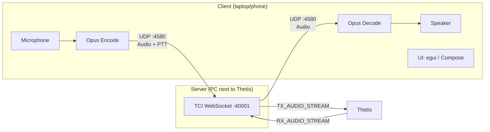
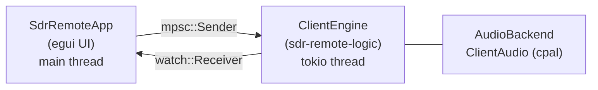
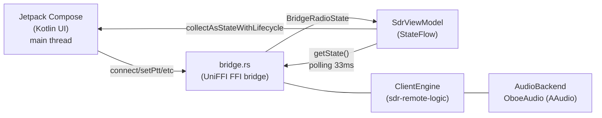
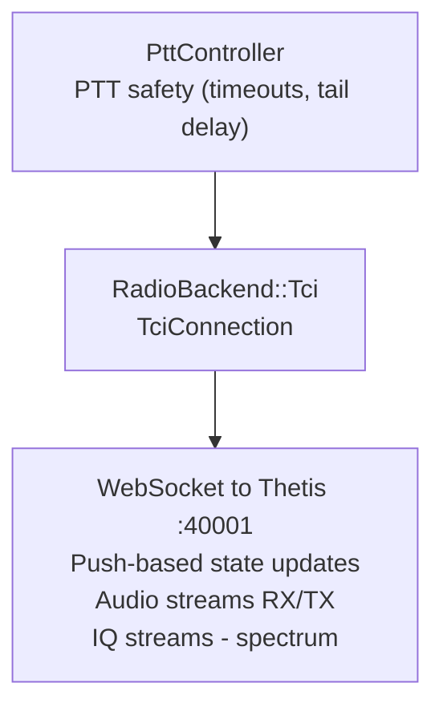
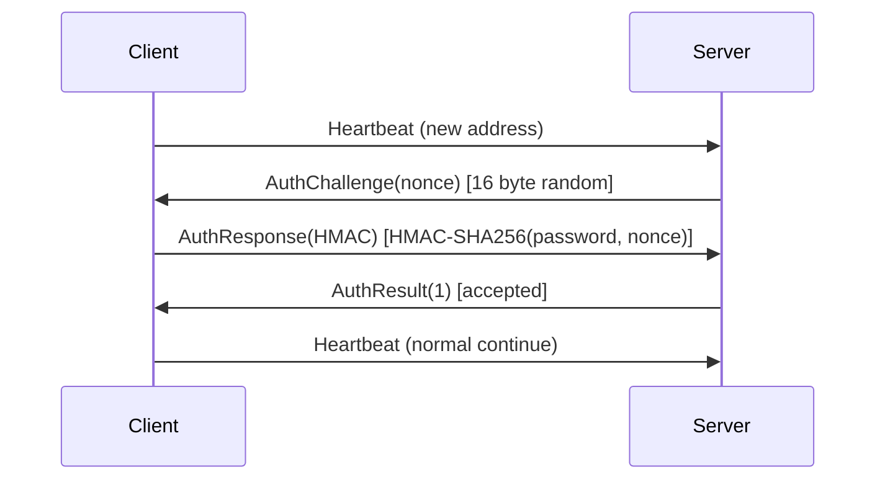
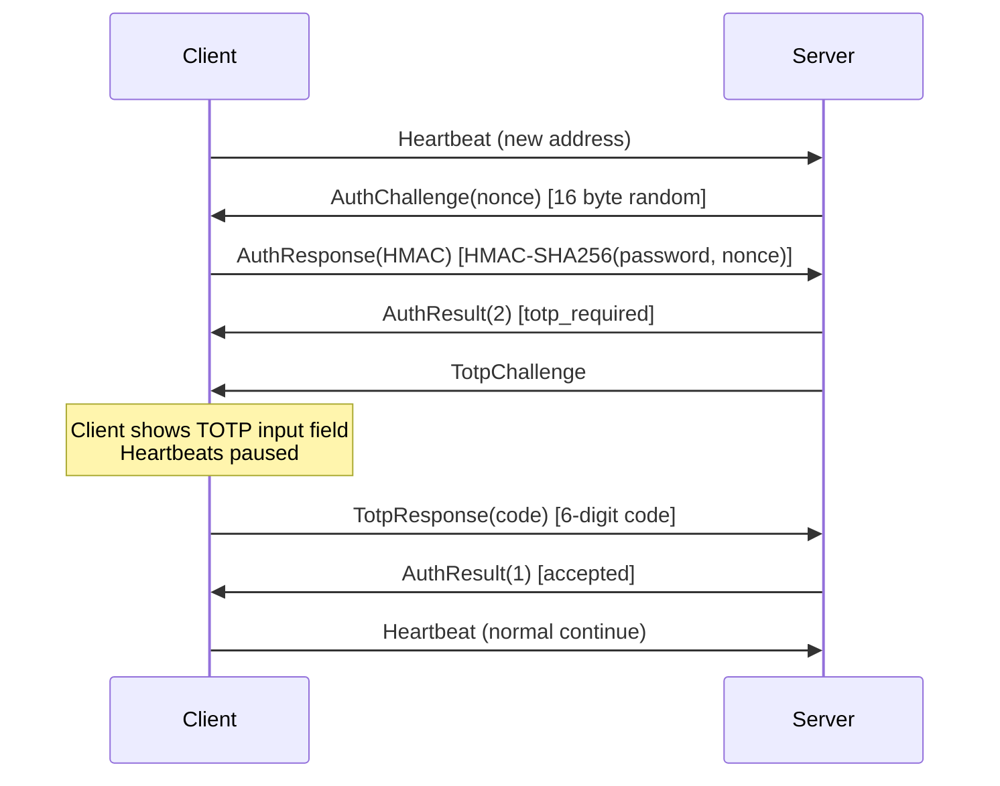

# ThetisLink v2.4.1 - Technical Reference

## 1. Overview

ThetisLink is a system for remote operation of an ANAN 7000DLE + Thetis SDR receiver and a Yaesu FT-991A transceiver over a network connection. It provides bidirectional real-time audio streaming, PTT control, DDC spectrum/waterfall display, full RX2/VFO-B support, diversity, Yaesu memory channel management and radio settings editor over UDP with Opus codec.

**Version:** v2.4.1 (shared version number in `sdr-remote-core::VERSION`)
**Development language:** Rust + Kotlin (Android UI)
**Target platform:** Windows 10/11, macOS (Intel/Apple Silicon), Android 8+ (arm64)
**Design priority:** latency > bandwidth > features

### Thetis compatibility

ThetisLink requires **Thetis v2.10.3.15** or newer (the latest official release by Richard Samphire, MW0LGE / [ramdor/Thetis](https://github.com/ramdor/Thetis)). Older Thetis versions do not fully support the TCI WebSocket protocol — in particular IQ streaming and audio routing do not work correctly.

There is also a **PA3GHM ThetisLink fork** ([cjenschede/Thetis](https://github.com/cjenschede/Thetis/tree/thetislink-tl2), branch `thetislink-tl2`) with extensions specifically for ThetisLink. This fork adds:

- **Extended IQ spectrum**: up to **1536 kHz** IQ bandwidth via TCI (standard Thetis is limited to 384 kHz)
- **TCI `_ex` commands**: CTUN, VFO sync, step attenuator, FM deviation, diversity, DDC sample rate, AGC auto, VFO swap — all via TCI instead of CAT
- **Push notifications**: real-time state updates to TCI clients when Thetis state changes
- **Diversity auto-null**: Smart and Ultra algorithms running server-side in Thetis (DSP speed)
- **BroadcastDiversityPhase/Gain**: real-time circle plot updates during auto-null sweep

All extensions are behind the **"ThetisLink extensions"** checkbox in Setup → Network → IQ Stream. With this option unchecked, the stock TCI extension behaviour of v2.10.3.15 is preserved (the fork still carries its own build tag, release notes and About metadata). The current ThetisLink fork build tag is **TL2-4**.

The default IQ sample rate is 384 kHz. With ThetisLink extensions the user can choose from: 48, 96, 192, 384, 768 or **1536 kHz** — selectable per receiver via the DDC sample rate dropdown in the client.

**Repos:**
- ThetisLink: [cjenschede/ThetisLink](https://github.com/cjenschede/ThetisLink) (public release repo, tag `v2.4.1`)
- Thetis fork: [cjenschede/Thetis](https://github.com/cjenschede/Thetis) (branch `thetislink-tl2`)
- Original Thetis: [ramdor/Thetis](https://github.com/ramdor/Thetis)

### v2.4.0 highlights

**Relay v2 (low-latency UDP audio + automatic TCP fallback), an admin dashboard, expanded connection monitoring and desktop themes.** Backwards-compatible with v2.3.x — wire `VERSION` stays 3; all relay additions live in the relay layer and its tunnel, not in the radio protocol. Relayed audio + PTT now travel over bare UDP (previously wss/TCP) with automatic make-before-break UDP↔wss fallback when a network blocks or degrades UDP, plus a transport indicator on desktop and Android; UDP session tokens rotate over wss before expiry. A web admin dashboard manages stations/devices with per-device usage and quotas and a one-click database backup (`VACUUM INTO`, Argon2id login, CSRF, per-IP rate-limit, internal-only behind the TLS proxy). The **Statistics panel is greatly expanded**: per-stream jitter, jitter-buffer depth, packet count and loss for Thetis RX / Yaesu 1-2 / VRX1-2, plus RTT, up/down bandwidth with a per-packet-type breakdown and the live transport indicator (desktop + Android). This release also brings a large **Yaesu** step-up: **SSB transmit over the USB audio** (FT-991A: per-PTT SSB MIC SELECT=REAR + PORT SELECT=USB, restored on release; FTX-1: internal auto modulation-source left untouched; FM auto-DATA only, not SSB; hybrid per-PTT routing + Exit), a client-side **TX compressor + AGC** per radio and a **clarifier (RIT/XIT)** — plus a big **Android Yaesu-parity** push (dual-radio selector, full DSP panel, touch frequency tuning, internal ATU). **Mobile data-saving** stops the Thetis RX stream to Yaesu-only clients and streams Yaesu data only while its window is active. The desktop client also gains selectable UI themes (Classic/Dark/Slate/Custom) and off-screen-window self-heal. No Thetis-fork update is required (stock v2.10.3.15 suffices).

### v2.3.0 highlights

**Synchronous AM (SAM-PLL) + AM auto-tune + TX modulation bandwidth.** Backwards-compatible with v2.1.x/v2.2.0 — wire `VERSION` stays 3; the new packet/control types (`0x2A`/`0x2B`, control `0x75`–`0x79`) are purely additive and capability-gated. The VRX SAM mode is now a real synchronous-AM demodulator (critically-damped carrier-tracking PLL, ±3 kHz capture); SAM auto-tune-to-carrier (two-speed noise-robust AFC) follows the carrier with the client VFO; each VRX has an independent NB/WB/Auto audio rate. The main-radio TX modulation bandwidth is settable from the desktop Thetis tab (Follow RX, or independent low/high, 0–8 kHz). The Android client is unchanged (no VRX) and no Thetis-fork update is required (stock v2.10.3.14+ suffices).

### v2.2.0 highlights

**Virtual receivers (VRX) and a second Yaesu radio (FT-991A + FTX-1).** Backwards-compatible with v2.1.x — wire `VERSION` stays 3; the new packet types (`0x21`–`0x29`) are purely additive and per-client subscription-gated, so a v2.1.x peer never receives them. Server, desktop client and Android client carry `VERSION = "2.2.0"`; pair with **Thetis fork PA3GHM TL2-4** for the full feature-set, stock Thetis remains supported.

- **Virtual receivers (VRX1/VRX2)** — two independent receivers carved from the wideband DDC I/Q stream by an FFT channelizer (`vrx-rs` crate), each with its own frequency, mode (USB/LSB/AM/SAM/FM), filter, high-res spectrum/waterfall and S-meter in a joint pop-out window; NB (8 kHz) / WB (16 kHz) Opus audio; per-DDC-bucket frequency memory and state persistence. See §28 and the illustrated explainer at <https://cjenschede.github.io/ThetisLink/VRX-explained.html>.
- **Dual-radio (slot 1)** — a second Yaesu runs as an independent channel with auto-detected model (`ID;` → `0670` = FT-991A, `0840` = FTX-1), per-radio audio/CAT/memory, a `RadioInfo` broadcast for panel naming, FTX-1 WIRES-X EX-menu fields and a server-side software squelch (FM-family only). See §29.
- **Switchable RX bandwidth + `#N` device index** — one switch sets narrow/wide RX audio for Thetis, the VRX channels and the Yaesu radios together (receive only); a `#N` suffix disambiguates two identically-named USB Audio CODEC devices. WAV recording rate auto-scales.

### v2.1.0 highlights

**Yaesu G-1000DXC rotor via MCP2221A, opt-in wideband Thetis RX, Amplitec reconnect, RX2 filter fixes.** Backwards-compatible with v2.0.4 — wire protocol unchanged; all extensions are server-side and visible through the existing Rotor / Amplitec / TCI channels. Server, desktop client and Android client carry the same `VERSION = "2.1.0"`; pair with **Thetis fork PA3GHM TL2-4** for the full feature-set, fall back to stock Thetis without losing safety guarantees.

- **Yaesu G-1000DXC rotor via Adafruit MCP2221A** — third rotor backend alongside EA7HG and PstRotator. Direct control of the Yaesu EXT CONTROL DIN-7 connector through an MCP2221A breakout in **5 V mode** (3 V solder-jumper cut, 5 V pad bridged on the Adafruit underside). GPIO0/1 → BST82 SOT-23 low-side switches on pin 1 (R/CW) and pin 2 (L/CCW), with 100 kΩ gate pull-down to prevent spurious rotation during USB reset. GP2 (5-bit DAC) → speed pin 3 with DAC-Vref = Vdd. GP3 (10-bit ADC, internal Vrm = 4.096 V) ← position-feedback pin 4 through a **1.8 kΩ + 2.2 kΩ** divider (ratio 1.818, max measurable ~7.45 V — some G-1000DXC units exceed the schema-spec of 4.5 V and reach ~7.3 V on pin 4 at 450°). The server-side poll thread combines adaptive sample rate (30 Hz motion / 1 Hz idle, median filter rejecting 50/100 Hz mains ripple), soft-start / soft-stop ramp (`ramp_pct_per_sec`, 1-200 %/s, default 50), 1° GoTo deadband with deceleration-distance-based landing, shortest-route option for `max_deg > 360°` (target ± 360 evaluated against the mechanical distance), and a manual-mode override that lets the server-UI test buttons + speed slider win over the ramp loop. The driver publishes the same `Rotor` facade as the other backends, so the existing Rotor window on both clients works without modification.
- **Opt-in wideband Thetis RX audio** — checkbox in the Server tab raises the RX audio sample rate above the stock 48 kHz when the Thetis-fork extension is present. Default off; stock-Thetis path unchanged. Requires Thetis fork **PA3GHM TL2-4** for the wideband-IQ command.
- **Modular multi-tuner wizard** — `Vec<TunerConfig>` schema replaces the previous 2-tuner-hardcoded path. Per-slot Add via board-scan + classification (Tuner / Rotor / Unprogrammed) + EEPROM write of the chosen function. Per-slot Rename, Delete (with server restart) and threshold/hysteresis slider. The MCP2221A block in the Status panel is collapsible; open/closed state persists across restarts.
- **Amplitec 6/2 reconnect + offline start** — serial worker thread has a 5-second retry loop. On a power-cycle of the Amplitec the driver marks `connected = false` and keeps retrying until the device returns — no server restart needed. On server start with the Amplitec offline the instance is still created so the window appears; the connection follows automatically once the port becomes available.
- **RX2 mode-switch filter restore** — the client's `handleModulation` path now honours the server's filter-band update during a mode switch (USB → CW, etc.) instead of carrying over the stale filter edges of the previous mode.
- **RX2 spectrum filter-drag isolation** — per-channel filter-edge drag-state keys decouple RX1 and RX2; a drag on RX2 no longer pulls RX1's filter along.
- **Yaesu EQ profile mic-gain persistence** — the mic-gain slider is now saved with the band/treble values when an EQ profile is stored.
- **Yaesu TX resampler anti-alias** — sharper filter curve on the client TX resampler reduces aliasing artefacts in the transmitted audio.
- **Status panel scroll stability** — `try_lock` contention on the SessionManager previously rendered a 1-line "snapshot busy…" placeholder, which made the ScrollArea clamp its scroll position whenever a parent section briefly shrank. A snapshot cache now absorbs lock failures and keeps the section height constant.
- **Graceful server auto-restart** — Drop handlers on all hardware Arcs (Yaesu, Amplitec, Tuner, SPE, RF2K, UltraBeam) now run before the child process spawns, so cpal audio streams and the TCI WebSocket release cleanly. Audio on the new instance works on the first attempt without a manual stop+start cycle.
- **UI polish** — all CollapsingHeader widgets replaced by `chevron_label` with a geometric triangle glyph (ASCII-only, no egui-default-font tofu). Server Settings tab wrapped in a ScrollArea for smaller displays. Amplitec antenna rename via right-click context menu, plus auto-scale buttons for long names. Client frequency-digit hover blocks the parent ScrollArea so mouse-wheel digit edits no longer scroll the surrounding panel. Rotor-poll log spam (per-tick `set_direction` + 5-second ADC stats) demoted to `debug!`.
- **Hardware note — Yaesu rotor printje** — builders reproducing the same setup: use **1.8 kΩ + 2.2 kΩ** for the position-feedback divider (ratio 1.818). The initial 1.8 kΩ + 10 kΩ design (ratio 1.18) clipped above ~365° on some G-1000DXC units where pin 4 climbs above 4.8 V. A 10 µF capacitor in parallel with the 2.2 kΩ resistor suppresses the 100 Hz mains-rectifier ripple on the position signal. After any divider change **recalibrate** via Park CCW + Park CW — the stored `v_at_0deg` / `v_at_max_deg` values depend on the ratio.

### v2.0.4 highlights

**Bandwidth toolkit, preventive TX-inhibit, power-cap, PstRotator.** Backwards-compatible with v2.0.3 — wire-protocol additive only (one new `ControlId::DxSpotsEnabled = 0x65`). Server, desktop client and Android client all carry the same `VERSION = "2.0.4"`; pair with **Thetis fork PA3GHM TL2-3** for the full feature-set, fall back to stock Thetis without losing safety guarantees.

- **Preventive RX-only TX-inhibit** — new `rx_only_ex` TCI command lets ThetisLink set Thetis' "Receive only" flag directly on an RX-only Amplitec-A position. MOX, spacebar, hardware-PTT and VOX are refused at the source, not flipped back reactively. Server-side state machine handles takeover, level-maintain (echo-gated) and release, including a bootstrap-stale clear within ~1 ms of cap detection. The Thetis-fork `RXOnly` setter now broadcasts a TCI push-notify so external Setup → "Receive only" toggles are visible to ThetisLink in real time. The reactive `ZZTX0` catch-all remains the safety floor for stock Thetis.
- **Reactive RF power-cap per Amplitec position** — `amplitec_max_w[]` per position; the active PA's own `DriveDown` button (SPE Expert or RF2K-S) is sent until the FWD-meter is under the cap. Mode-multipliers SSB/CW × 1.0, AM × 0.5, FM/DIG × 0.4. Rate-limited to one step per second to let the PA-meter settle — brief CW-bursts under that interval may pass the reactive cap; preventive coverage exists on RX-only positions only. Per-PA `DriveDown` counter is restored as `DriveUp` when the operator switches away from the position. New first-class GUI editor in the Amplitec tab replaces file-edit workflows.
- **PstRotator UDP/XML rotor backend** — native PstRotator protocol alongside the existing rotctl-TCP backend. Per-installation choice via `rotor_backend = pstrotator`. Integer-degree AZIMUTH commands; AZ/EL replies parsed fallible; offline-timeout marks status `false`. Host field is a **numeric IP address** (no DNS resolution — `SocketAddr::parse` only accepts numeric literals).
- **Server-tab bandwidth monitor** — live Down (RX) and Up (TX) Kbit/s, updated every 500 ms; the Down row is clickable to expand a per-`PacketType` breakdown refreshed every 5 s. The monitor counts UDP application-payload bytes (header + opus/control/spectrum); the operating-system network meter typically reads 1.5-2× higher because it includes IP/UDP/Ethernet headers. Use the relative changes between settings, not the absolute number, when comparing to OS-level reporting.
- **DX-cluster spot broadcast storm fix (~90 Kbit/s → ~6 Kbit/s)** — the server used to re-send all cached spots every equipment-tick (5 Hz); now it dedups on `(callsign, freq, mode)` and triggers a full age-refresh every 10 s. A new per-client opt-out (`ControlId::DxSpotsEnabled = 0x65`, default ON) lets metered-link users disable the stream entirely. Desktop checkbox in the Server tab; Android switch in Settings. The Android opt-out resets to ON on app restart (no preference persistence).
- **WebSDR favorites edit-toggle** — explicit Edit / Done flow for renaming favorites; commits on `lost_focus` and survives reconnect.
- **Server-log cleanup** — `PowerCap state` now logs only on `(pos, mode, pa_in_operate, cap)` transitions (was: every 2 s heartbeat). DX-cluster reconnect emits one line per failure plus one line on recovery (was: three lines per backoff cycle). Both reduce log noise during long runs without losing transition visibility.

### v2.0.3 highlights

**Multi-tuner release + wire-protocol breaking change.** Wire-protocol `VERSION` u8 bumped from 2 → 3 (S-meter payload rearranged). v2.0.2 clients against a v2.0.3 server (or vice versa) receive a localised `ProtocolVersionMismatch` modal ("Server is too old" / "Client is too old") instead of garbled audio or a silent connect failure — the server sends a 4-byte back-channel rejection packet `[MAGIC, VERSION, 0xFF, 0x00]` so the client can detect the mismatch.

- **Multi-tuner runtime** — up to two physical StockCorner JC-4s / JC-3s tuners in parallel via Adafruit MCP2221A USB-HID breakouts (replaces the v2.0.2 serial-port RTS/CTS flow). Per-tuner threshold + hysteresis sliders on the yellow tune-status wire (1 MΩ + 1 MΩ divider, default 2.25 V / 0.50 V). Board scan + serial programming UI in the status panel. Automatic USB reconnect with 5 s retry interval. Collapsible MCP2221A section with its open/closed state persisted across restarts.
- **S-meter overhaul** — multi-source subscription via `rx_channel_sensors_ex` (Sig peak-hold, Avg true-mean, MaxBin), S9-frequency band shift driven by the fork-broadcast `s9_frequency_ex` (fallback 50 MHz against stock), TX FWD-power keeps updating under Sig/MaxBin selection.
- **CTUN coupled-recenter + RX1/RX2 spectrum mirror** — both RX spectra stay in sync during rapid tuning, Auto FFT retuned to ~25 FPS, connect-time balancing so RX1 and RX2 come up at the same moment.
- **MIDI client-side VFO coalesce + auto-recenter handshake** — extreme MIDI wheel input no longer fills Thetis' VFO queue; auto-recenter ownership handshake with the Thetis fork now also works when no ThetisLink server is connected.
- **PA active_pa + drive-snapshot persistence** — survives process kill / power loss without waiting for the next `start_server()` write.
- **Status-panel protocol version-mismatch banner** — previously silent, now a visible row and ringbuffer entry.
- **Hardware-doc update** — the impedance of the yellow-line voltage divider was raised from 10 kΩ + 10 kΩ to **1 MΩ + 1 MΩ** (ratio 1:1, ×2 in voltage, unchanged; only much less loading on the JC-Control LED circuit).
- **Cleanup** — `assume_tuned` / `TUNER_DONE_ASSUMED` (state 5) / 500 ms assume-deadline pad retired now that feedback-driven detection works reliably in production. `tuner_port` / `tuner_enabled` legacy COM-port settings UI removed from the Settings tab (multi-tuner config now lives in the status panel). Legacy config keys (`tuner_assume_tuned`, `tuner_port`, `threshold_ratio`, `baseline_override`) are silently ignored so existing config files do not break.
- **Compliance** — vendored Rust crate `mcp2221-hal` v0.1.0 (Copyright © 2025 Rob Wells), dual-licensed `MIT OR Apache-2.0` — ThetisLink uses the **MIT** branch (Apache-2.0 not compatible with GPL-2.0-only). Attribution in `NOTICE.md`, full MIT text in `compliance/THIRD-PARTY-LICENSES.html`, SPDX SBOM in `compliance/sbom.spdx.json`.

### v2.0.2 highlights

Hotfix release. `TciConnection::handle_notification` was logging every `DiversityPhaseEx`, `DiversityGainEx` and `DiversityGainMultiEx` notification at INFO. Thetis pushes these on every diversity tick (~10-20 Hz) regardless of whether the value changed, so the server log accumulated hundreds of thousands of identical lines per session (~650k for a multi-hour run). The three notification handlers now compare the incoming value to the cached one and only emit INFO on a real edge — unchanged pushes go to debug (suppressed at the default log level). State propagation, broadcasts and wire protocol stay identical; this is purely a logging-level fix. Fully interoperable with v2.0.0 / v2.0.1.

### v2.0.1 highlights

The v2.0.1 release focuses on the **connect experience**: getting a fresh user from "I installed the app" to "I'm transmitting" with less friction. Key changes on top of v2.0.0:

- **First-run connection wizard** — 4 visible steps (Find server → Password → 2FA → Connected). Subsequent starts skip the wizard automatically.
- **mDNS local-network discovery** — `_thetislink._udp.local.` published by the server and browsed by both clients. The "Found" dropdown auto-populates on the same WiFi/LAN, removing manual IP typing as a first-time hurdle. Failure is silent; manual entry stays available.
- **Differentiated connect-error feedback** — 9 connect-states (DnsResolutionFailed, NoUdpResponse, WrongPassword, WrongTotp, ProtocolVersionMismatch, TciUnreachable, …) each rendered through a shared NL/EN i18n helper. Hints are platform-aware (desktop points at the Thetis tab; Android points at the Radio-screen Power button).
- **Server Status panel** — new tab in the server UI showing bind address, Thetis TCI link state, active clients with RTT/loss/jitter and `connected_since`, audio-routing chips per channel with frame counters, recent connect-attempt ringbuffer (N=10) and configured devices.
- **Smart TciUnreachable hint** — the server reports `THETIS_RUNNING` and `THETIS_STARTING` bits so the client knows whether to suggest "press Start to launch Thetis" vs "check TCI server in Thetis Setup", and to suppress the error during the normal launch grace period.
- **Server-side RX2 audio filter** — multi-channel bundler now respects the per-client `rx2_enabled` flag, so a client with RX2 turned off no longer receives the CH2 audio stream (audible RX2 + silent extra bandwidth use, present in v2.0.0).
- **Re-run setup wizard** — small button on the desktop Server tab and the Android Radio screen for restarting the wizard without wiping config.
- **Documentation** — Installation / Installatie sections rewritten around the wizard, mDNS, language toggle, `successful_connects` config gate and the new Status/Logs split.

Wire protocol stays VERSION = 2; v2.0.0 clients and servers remain fully interoperable with v2.0.1 (no breaking change).

### v2.0.0 highlights

The v2.0.0 release is a major step compared to the v0.x line. Key changes:

- **Wire protocol VERSION = 2** — breaking change. v0.x clients/servers do not interoperate with v2.0.0. See §5.
- **TCI as single transport** — the CAT (TCP) path has been fully removed. All radio commands and audio go via TCI WebSocket :40001. See §9.
- **Server-side CTUN auto-recenter** (fork) — when CTUN is on and the VFO drifts to the edge of the visible spectrum, the TL-server toggles CTUN (`ZZCN`/`ZZCO` via the TCI `run_cat_ex` relay) to force a recenter. The `auto_recenter_ex` capability is advertise-only. See §13.
- **Yaesu FT-991A auto-DFM with memory-restore** — on PTT the server temporarily switches FM → DATA-FM and on PTT-off restores via `MC<nnn>;` so memory mode and the active channel remain. See §26.
- **DDC sample rate dropdown per RX** — 48/96/192/384/768/1536 kHz, selectable per receiver (RX1/RX2). 768 and 1536 kHz only with the fork. See §16.
- **Filter preset tracking** (fork) — F1..VAR2/NONE labels are read back from Thetis and visible in the client.
- **Diversity live circle broadcast** (fork) — real-time phase/gain updates during Smart/Ultra auto-null sweep. See §22.
- **Android EQ auto-switch** — mic profile and BT-headset profile switch automatically based on the selected output device.
- **ZL-01 BT remote PTT** — supported as PTT input on Android.
- **TX meter SWR colour-coded** — green &lt;1:2, orange 1:2..1:3, red &gt;1:3.
- **DX cluster click-to-tune** — 15 px snap on the spectrum.
- **CW keyer + macros + stop** — keyer with macro buttons and an immediate-stop button.

---

## 2. Architecture

ThetisLink v2.4.0 uses a single TCI WebSocket connection to Thetis for audio, IQ and all radio commands. With the PA3GHM fork the additional `_ex` commands extend the surface (CTUN auto-recenter, diversity, per-RX DDC sample rate, `rx_only_ex` preventive TX-inhibit). No parallel CAT connection is required against either stock v2.10.3.15 or the fork.



Audio, IQ and all commands flow over the single TCI WebSocket (RX_AUDIO_STREAM / TX_AUDIO_STREAM plus text TCI commands). ThetisLink no longer maintains a separate CAT connection.

### Client Architecture



The UI reads state via a `watch` channel (non-blocking borrow) and sends commands via an `mpsc` channel. The engine owns all network and audio state. This makes the business logic platform-independent: the Android client only implements `AudioBackend` (Oboe) and the UI (Compose), the engine remains identical.

### Android Client Architecture



**UniFFI bridge:** `sdr_remote.udl` defines the FFI interface. `uniffi-bindgen` generates Kotlin bindings. The bridge runs the `ClientEngine` in a tokio runtime on a background thread. UI polls state via `getState()` at 30fps.

**Audio:** Oboe (AAudio) with `PerformanceMode::LowLatency`, `SharingMode::Exclusive`. Capture: `InputPreset::VoiceRecognition` (no AGC/noise suppression). Playback: `Usage::Media`.

### Server Architecture



---

## 3. Workspace Structure

```
sdr-remote/
├── Cargo.toml                  # Workspace root
├── Technische-Referentie.md    # Dutch technical reference (source)
├── sdr-remote-core/            # Shared library (protocol, codec, jitter, auth)
│   └── src/
│       ├── lib.rs              # Constants (sample rates, frame sizes, port)
│       ├── protocol.rs         # Packet format, serialization, deserialization
│       ├── codec.rs            # Opus encode/decode wrapper
│       ├── jitter.rs           # Adaptive jitter buffer
│       └── auth.rs             # HMAC-SHA256 authentication
├── sdr-remote-logic/           # Platform-independent client engine
│   └── src/
│       ├── lib.rs              # Crate root
│       ├── state.rs            # RadioState (read-only, broadcast via watch channel)
│       ├── commands.rs         # Command enum (UI -> engine via mpsc channel)
│       ├── audio.rs            # AudioBackend trait (platform abstraction)
│       └── engine.rs           # ClientEngine (network, codec, resampling, jitter)
├── sdr-remote-server/          # Windows server (runs next to Thetis)
│   └── src/
│       ├── main.rs             # Startup, argument parsing, shutdown
│       ├── network.rs          # UDP send/receive, resampling, playout timer
│       ├── tci.rs              # TciConnection: TCI WebSocket client + state + streams
│       ├── tci_commands.rs     # TCI command sender (audio/IQ/_ex commands)
│       ├── tci_parser.rs       # TCI text/binary parser
│       ├── ctun_recenter.rs    # CTUN auto-recenter (auto_recenter_ex cap)
│       ├── audio_loops.rs      # Audio bundling + IQ consumer loops
│       ├── ptt.rs              # PttController: PTT safety (contains TciConnection)
│       ├── session.rs          # Client session management (multi-client)
│       ├── spectrum.rs         # SpectrumProcessor: DDC FFT pipeline + test generator
│       ├── dxcluster.rs        # DX Cluster telnet client
│       ├── macros.rs           # CW keyer macros
│       ├── yaesu.rs            # Yaesu FT-991A CAT serial controller (auto-DFM)
│       ├── amplitec.rs         # Amplitec antenna switch
│       ├── rf2k.rs             # RF2K-S PA HTTP controller
│       ├── spe_expert.rs       # SPE Expert 1.3K-FA serial controller
│       ├── ultrabeam.rs        # UltraBeam RCU-06 serial controller
│       ├── rotor.rs            # EA7HG Visual Rotor UDP controller
│       ├── tuner.rs            # JC-4s/JC-3s tuner controllers (MCP2221A USB-HID)
│       ├── mcp2221_debug.rs    # MCP2221A USB-HID bridge (GP2 + GP1 ADC)
│       ├── mcp2221_scan.rs     # USB-HID board scan + serial programming
│       ├── config.rs           # Server configuration (persistent)
│       └── ui/                 # Server GUI (egui)
├── sdr-remote-client/          # Desktop client (egui)
│   └── src/
│       ├── main.rs             # Startup, engine + UI threading
│       ├── audio.rs            # cpal AudioBackend impl + device listing
│       ├── ui.rs               # egui UI, config storage
│       ├── websdr.rs           # Win32 window + wry WebView (embedded WebSDR/KiwiSDR)
│       └── catsync.rs          # WebSDR channel communication, favorites, debounced freq sync
└── sdr-remote-android/         # Android client (Kotlin/Compose + Rust via UniFFI)
    ├── src/
    │   ├── lib.rs              # JNI entrypoint, Android logging
    │   ├── bridge.rs           # UniFFI bridge (Rust <-> Kotlin)
    │   ├── audio_oboe.rs       # Oboe AudioBackend impl (AAudio)
    │   └── sdr_remote.udl      # UniFFI interface definition
    └── android/                # Android Studio project
        └── app/src/main/java/com/sdrremote/
            ├── MainActivity.kt
            ├── viewmodel/SdrViewModel.kt
            └── ui/
                ├── screens/MainScreen.kt
                └── components/         # Compose UI components
```

---

## 4. Dependencies

| Crate | Version | Purpose |
|-------|---------|---------|
| `tokio` | 1 (full) | Async runtime (UDP, TCP, timers) |
| `audiopus` | 0.3.0-rc.0 | Opus codec bindings (8kHz narrowband, 16kHz wideband) |
| `cpal` | 0.15 | Audio I/O (WASAPI on Windows, desktop client) |
| `rubato` | 0.14 | Resampling (sinc interpolation) |
| `ringbuf` | 0.4 | Lock-free SPSC ring buffer (audio thread <-> network thread) |
| `eframe`/`egui` | 0.29 | Desktop client UI |
| `bytemuck` | 1 | Zero-copy byte casting |
| `log`/`env_logger` | 0.4/0.11 | Logging |
| `anyhow` | 1 | Error handling |
| `oboe` | 0.6 | Audio I/O (AAudio on Android) |
| `uniffi` | 0.28 | Rust <-> Kotlin FFI bridge |
| `rustfft` | 6 | FFT for spectrum processing (server) |
| `tokio-tungstenite` | 0.24 | WebSocket client for TCI (server) |
| `futures-util` | 0.3 | StreamExt/SinkExt for WebSocket (server) |
| `serialport` | 4.7 | Serial USB communication (devices) |
| `midir` | 0.10 | MIDI interface |
| `wry` | 0.x | WebView for embedded WebSDR/KiwiSDR window (client) |
| `hmac`/`sha2` | — | HMAC-SHA256 authentication |
| `rand` | — | Random nonce generation |

**Build optimization:** Dependencies are also optimized in dev mode (`[profile.dev.package."*"] opt-level = 2`) because Opus and rubato are too slow without optimization.

---

## 5. UDP Protocol

Binary hand-written protocol on UDP port **4580**. All multi-byte values are big-endian. Maximum packet size: 33,000 bytes (for spectrum data).

### Header (4 bytes)

Every packet starts with the same header:

| Offset | Size | Field | Value |
|--------|------|-------|-------|
| 0 | 1 | Magic | `0xAA` |
| 1 | 1 | Version | `2` (was `1` in v0.x; v1 clients are not wire-compatible with v2 servers and vice versa) |
| 2 | 1 | PacketType | See below |
| 3 | 1 | Flags | Bit 0 = PTT active |

### Packet Types

#### Audio Packet (0x01) — variable length

Carries encoded Opus audio + PTT status. Sent 50 times per second (every 20ms).

| Offset | Size | Field | Description |
|--------|------|-------|-------------|
| 0-3 | 4 | Header | Magic, version, type=0x01, flags |
| 4-7 | 4 | Sequence | Incrementing sequence number (u32, wrapping) |
| 8-11 | 4 | Timestamp | Milliseconds since start (u32) |
| 12-13 | 2 | OpusLen | Length of opus data in bytes (u16) |
| 14+ | N | OpusData | Opus-encoded audio |

**Total:** 14 + N bytes (typically ~40-60 bytes at 12.8 kbps narrowband, ~60-80 bytes at wideband)

PTT-only packets (without audio) have OpusLen=0 and are used for PTT burst on state change.

#### AudioRx2 (0x0E)

RX2 audio from the second receiver. Same binary format as Audio.

#### AudioYaesu (0x16)

Yaesu FT-991A audio stream. Same binary format as Audio.

#### Heartbeat (0x02) — 16-20 bytes

Periodically (every 500ms) sent by client for connection monitoring and RTT measurement.

| Offset | Size | Field | Description |
|--------|------|-------|-------------|
| 0-3 | 4 | Header | Magic, version, type=0x02, flags |
| 4-7 | 4 | Sequence | Heartbeat sequence number (u32) |
| 8-11 | 4 | LocalTime | Client timestamp in ms (u32) |
| 12-13 | 2 | RTT | Last measured RTT in ms (u16) |
| 14 | 1 | LossPercent | Estimated packet loss % (u8) |
| 15 | 1 | JitterMs | Estimated jitter in ms (u8) |
| 16-19 | 4 | Capabilities | Client capability flags (u32, optional) |

Backward compatible: old clients without capabilities (16 bytes) are accepted.

#### HeartbeatAck (0x03) — 12-16 bytes

Server response to Heartbeat. Echoes the client's timestamp back for RTT calculation.

| Offset | Size | Field | Description |
|--------|------|-------|-------------|
| 0-3 | 4 | Header | Magic, version, type=0x03, flags |
| 4-7 | 4 | EchoSequence | Echoed heartbeat sequence |
| 8-11 | 4 | EchoTime | Echoed client timestamp |
| 12-15 | 4 | Capabilities | Negotiated capabilities (u32, optional) |

**Capability flags:**

| Bit | Name | Description |
|-----|------|-------------|
| 0 | WIDEBAND_AUDIO | 16kHz wideband Opus |
| 1 | SPECTRUM | Spectrum/waterfall data |
| 2 | RX2 | RX2/VFO-B dual receiver |

Negotiation via intersection: server only sends flags both sides support.

#### Control Packet (0x04) — 7 bytes

Sends control commands (bidirectional).

| Offset | Size | Field | Description |
|--------|------|-------|-------------|
| 0-3 | 4 | Header | Magic, version, type=0x04, flags |
| 4 | 1 | ControlId | Control type (see below) |
| 5-6 | 2 | Value | Value (u16) |

**ControlId values — Thetis RX1:**

| ID | Name | Values | TCI command |
|----|------|--------|-------------|
| 0x01 | Rx1AfGain | 0-100 | `volume` / `rx_volume:0,0,dB` |
| 0x02 | PowerOnOff | 0/1 | `start;` / `stop;` |
| 0x03 | TxProfile | 0-99 | `tx_profile_ex` push + set |
| 0x04 | NoiseReduction | 0-4 (0=off, 1=NR1..4=NR4) | `rx_nr_enable_ex:0,enabled,level` |
| 0x05 | AutoNotchFilter | 0/1 | `rx_anf_enable:0,bool` |
| 0x06 | DriveLevel | 0-100 | `drive:0,level` |
| 0x0D | ThetisStarting | 0/1 | `start;` / `stop;` |
| 0x1E | MonitorOn | 0/1 | `mon_enable:bool` |
| 0x1F | ThetisTune | 0/1 | `tune:0,bool` |

**ControlId values — Spectrum:**

| ID | Name | Values | Description |
|----|------|--------|-------------|
| 0x07 | SpectrumEnable | 0/1 | Spectrum on/off per client |
| 0x08 | SpectrumFps | 5-30 | Frame rate |
| 0x09 | SpectrumZoom | 10-10240 | Zoom level (value/10 = factor, e.g. 320=32x) |
| 0x0A | SpectrumPan | 0-10000 | Pan position ((pan+0.5)x10000, 5000=center) |
| 0x0B | FilterLow | signed Hz | Filter low cut (i16 as u16) |
| 0x0C | FilterHigh | signed Hz | Filter high cut (i16 as u16) |
| 0x1A | SpectrumMaxBins | 64-32768 | Max bins per packet (0=default 8192) |
| 0x1C | SpectrumFftSize | 32/64/128/256 | FFT size in K (0=auto) |
| 0x1D | SpectrumBinDepth | 8/16 | Bin depth: 8=u8 (1 byte/bin), 16=u16 (2 bytes/bin) |

**ControlId values — RX2/VFO-B:**

| ID | Name | Values | Description |
|----|------|--------|-------------|
| 0x0E | Rx2Enable | 0/1 | RX2 on/off |
| 0x0F | Rx2AfGain | 0-100 | RX2 AF volume — TCI `rx_volume:1,0,dB` |
| 0x10 | Rx2SpectrumZoom | 10-10240 | Zoom |
| 0x11 | Rx2SpectrumPan | 0-10000 | Pan |
| 0x12 | Rx2FilterLow | signed Hz | RX2 filter low |
| 0x13 | Rx2FilterHigh | signed Hz | RX2 filter high |
| 0x14 | VfoSync | 0/1 | VFO-B follows VFO-A |
| 0x15 | Rx2SpectrumEnable | 0/1 | RX2 spectrum |
| 0x16 | Rx2SpectrumFps | 5-30 | RX2 spectrum FPS |
| 0x17 | Rx2NoiseReduction | 0-4 | RX2 NR level |
| 0x18 | Rx2AutoNotchFilter | 0/1 | RX2 ANF |
| 0x19 | VfoSwap | trigger | VFO A<->B swap — TCI `vfo_swap_ex` |
| 0x1B | Rx2SpectrumMaxBins | 64-32768 | RX2 max bins |
| 0x3D | DdcSampleRateRx1 | kHz (e.g. 384) | Per-RX DDC rate (stock `iq_samplerate`, fork `ddc_sample_rate_ex`) |
| 0x3E | DdcSampleRateRx2 | kHz | Per-RX DDC rate RX2 |
| 0x3F | Rx2SpectrumFftSize | 32/64/128/256 | FFT size in K (RX2) |

**ControlId values — TCI Controls (v0.5.3):**

| ID | Name | Values | TCI command |
|----|------|--------|-------------|
| 0x30 | AgcMode | 0-5 (off/long/slow/med/fast/custom) | `agc_mode` |
| 0x31 | AgcGain | 0-120 | `agc_gain` |
| 0x32 | RitEnable | 0/1 | `rit_enable` |
| 0x33 | RitOffset | i16 as u16 (Hz) | `rit_offset` |
| 0x34 | XitEnable | 0/1 | `xit_enable` |
| 0x35 | XitOffset | i16 as u16 (Hz) | `xit_offset` |
| 0x36 | SqlEnable | 0/1 | `sql_enable` |
| 0x37 | SqlLevel | 0-160 | `sql_level` |
| 0x38 | NoiseBlanker | 0/1 | `rx_nb_enable` |
| 0x39 | CwKeyerSpeed | 1-60 WPM | `cw_keyer_speed` |
| 0x3A | VfoLock | 0/1 | `vfo_lock` |
| 0x3B | Binaural | 0/1 | `rx_bin_enable` |
| 0x3C | ApfEnable | 0/1 | `rx_apf_enable` |

**ControlId values — Diversity:**

| ID | Name | Values | Description |
|----|------|--------|-------------|
| 0x40 | DiversityEnable | 0/1 | Diversity on/off |
| 0x41 | DiversityRef | 0=RX2, 1=RX1 | Reference source |
| 0x42 | DiversitySource | 0=RX1+RX2, 1=RX1, 2=RX2 | RX source |
| 0x43 | DiversityGainRx1 | gain x1000 | E.g. 2500 = 2.500 |
| 0x44 | DiversityGainRx2 | gain x1000 | E.g. 2500 = 2.500 |
| 0x45 | DiversityPhase | phase x100 + 18000 | 18000=0deg, 0=-180deg, 36000=+180deg |
| 0x46 | DiversityRead | trigger | Read diversity state from Thetis |
| 0x47 | DiversityGainMulti | 100-1000 (×100, = 1.00..10.00) | Diversity gain multiplier (`diversity_gain_multi_ex`, fork-only) |
| 0x48 | AgcAutoRx1 | 0/1 | AGC auto mode RX1 |
| 0x49 | AgcAutoRx2 | 0/1 | AGC auto mode RX2 |
| 0x4A | DiversityAutoNull | 1=start | Start Smart auto-null (Thetis-side) |

**ControlId values — RX2 TCI Controls:**

| ID | Name | Values | TCI command |
|----|------|--------|-------------|
| 0x50 | Rx2AgcMode | 0-5 | `agc_mode` rx=1 |
| 0x51 | Rx2AgcGain | 0-120 | `agc_gain` rx=1 |
| 0x52 | Rx2SqlEnable | 0/1 | `sql_enable` rx=1 |
| 0x53 | Rx2SqlLevel | 0-160 | `sql_level` rx=1 |
| 0x54 | Rx2NoiseBlanker | 0/1 | `rx_nb_enable` rx=1 |
| 0x55 | Rx2Binaural | 0/1 | `rx_bin_enable` rx=1 |
| 0x56 | Rx2ApfEnable | 0/1 | `rx_apf_enable` rx=1 |
| 0x57 | Rx2VfoLock | 0/1 | `vfo_lock` rx=1 |

**ControlId values — Extra Controls (v0.6.x):**

| ID | Name | Values | Description |
|----|------|--------|-------------|
| 0x58 | TuneDrive | 0-100 | Tune drive level |
| 0x59 | MonitorVolume | 0-100 | Monitor volume |
| 0x5A | Mute | 0/1 | Master mute |
| 0x5B | RxMute | 0/1 | RX mute |
| 0x5C | ManualNotchFilter | 0/1 | Manual notch filter RX1 |
| 0x5D | RxBalance | -100..+100 (as u16) | RX audio balance |
| 0x5E | CwKey | 0/1 | CW key down/up |
| 0x5F | CwMacroStop | trigger | Stop CW macro |
| 0x60 | Rx2ManualNotchFilter | 0/1 | Manual notch filter RX2 |
| 0x61 | ThetisSwr | SWR x100 | SWR broadcast during TX (e.g. 150 = 1.50:1) |
| 0x62 | AudioMode | 0-2 | Audio routing (0=Mono, 1=Binaural, 2=Split) |
| 0x63 | AllowZoomBelow2x | 0/1 | Per-client setup-vink for sub-2× zoom (smear trade-off; used by `auto_recenter_ex`) |

**ControlId values — Yaesu:**

| ID | Name | Values | Description |
|----|------|--------|-------------|
| 0x20 | YaesuEnable | 0/1 | Yaesu audio+state stream |
| 0x21 | YaesuPtt | 0/1 | Yaesu TX |
| 0x22 | YaesuFreq | — | Uses FrequencyPacket format |
| 0x23 | YaesuMicGain | gain x10 | ThetisLink TX gain (200 = 20.0x) |
| 0x24 | YaesuMode | mode nr | Operating mode |
| 0x25 | YaesuReadMemories | trigger | Read all memories |
| 0x26 | YaesuRecallMemory | 1-99 | Memory channel recall |
| 0x27 | YaesuWriteMemories | trigger | Write all memories |
| 0x28 | YaesuSelectVfo | 0=A, 1=B, 2=swap | VFO selection |
| 0x29 | YaesuSquelch | 0-255 | Squelch level |
| 0x2A | YaesuRfGain | 0-255 | RF gain |
| 0x2B | YaesuRadioMicGain | 0-100 | Radio mic gain (not ThetisLink TX gain) |
| 0x2C | YaesuRfPower | 0-100 | RF power |
| 0x2D | YaesuButton | button ID | Raw CAT button |
| 0x2E | YaesuReadMenus | trigger | Read all 153 EX menu items |
| 0x2F | YaesuSetMenu | menu nr | Set EX menu item |

Control packets are **bidirectional**: client->server sends changes, server->client broadcasts current state.

#### Disconnect Packet (0x05) — 4 bytes

Clean disconnect. Header only, no payload.

#### PttDenied Packet (0x06) — 4 bytes

Server -> client. Sent when a client requests PTT while another client holds the TX lock.

#### Frequency Packet (0x07) — 12 bytes

Bidirectional: server->client (readback) and client->server (set).

| Offset | Size | Field | Description |
|--------|------|-------|-------------|
| 0-3 | 4 | Header | Magic, version, type=0x07, flags |
| 4-11 | 8 | FrequencyHz | VFO-A frequency in Hz (u64) |

#### FrequencyRx2 (0x0F) — 12 bytes

Same format as Frequency, for VFO-B.

#### FrequencyYaesu (0x18) — 12 bytes

Same format, for Yaesu frequency setting.

#### Mode Packet (0x08) — 5 bytes

Bidirectional. Mode values: 00=LSB, 01=USB, 05=FM, 06=AM (Thetis ZZMD values).

| Offset | Size | Field | Description |
|--------|------|-------|-------------|
| 0-3 | 4 | Header | Magic, version, type=0x08, flags |
| 4 | 1 | Mode | Operating mode (u8) |

#### ModeRx2 (0x10) — 5 bytes

Same format, for RX2 mode.

#### S-meter Packet (0x09) — 6 bytes

Server->client. Raw value 0-260 (12 per S-unit, S9=108). During TX: forward power in watts x10.

| Offset | Size | Field | Description |
|--------|------|-------|-------------|
| 0-3 | 4 | Header | Magic, version, type=0x09, flags |
| 4-5 | 2 | Level | S-meter level or TX power (u16) |

#### SmeterRx2 (0x11) — 6 bytes

Same format, RX2 S-meter.

#### Spectrum Packet (0x0A) — 18 + N bytes

Server->client. Spectrum data centered on VFO frequency (DDC I/Q mode). Number of bins is dynamic per client (depending on screen resolution x zoom).

| Offset | Size | Field | Description |
|--------|------|-------|-------------|
| 0-3 | 4 | Header | Magic, version, type=0x0A, flags |
| 4-5 | 2 | Sequence | Frame sequence number (u16, wrapping) |
| 6-7 | 2 | NumBins | Number of spectrum bins (u16, 512-32768) |
| 8-11 | 4 | CenterFreqHz | Center frequency in Hz (u32) |
| 12-15 | 4 | SpanHz | Span in Hz (u32, = DDC sample rate) |
| 16 | 1 | RefLevel | Reference level dBm (i8) |
| 17 | 1 | DbPerUnit | Bin depth: 1=u8 (1 byte/bin), 2=u16 (2 bytes/bin) |
| 18+ | NxB | Bins | Log power values (u8: 0-255 or u16: 0-65535, maps -150...-30 dB) |

**Dynamic bins:** Desktop client automatically calculates `screen_width x zoom` (range 512-32768). Server extracts the correct number of bins from the FFT smoothed buffer per client.

#### FullSpectrum (0x0B) / FullSpectrumRx2 (0x13)

Full DDC spectrum row for waterfall history. Same format as Spectrum.

#### SpectrumRx2 (0x12)

RX2 spectrum data. Same format as Spectrum.

#### EquipmentStatus (0x0C) — variable length

Server -> client, every 200ms. Status of external device.

| Field | Type | Description |
|-------|------|-------------|
| device_type | u8 | DeviceType enum |
| switch_a | u8 | Device-specific |
| switch_b | u8 | Device-specific |
| connected | bool | Hardware online |
| labels | Option\<String\> | Comma-separated extra data |

#### EquipmentCommand (0x0D) — variable length

Client -> server. Command to external device.

| Field | Type | Description |
|-------|------|-------------|
| device_type | u8 | Target device |
| command_id | u8 | Command (device-specific) |
| data | Vec\<u8\> | Parameters (variable length) |

#### Spot (0x14) — variable length

DX cluster spot (server -> client).

#### TxProfiles (0x15) — variable length

TX profile list with names (server -> client).

#### YaesuState (0x17) — variable length

Yaesu radio state (server -> client).

#### YaesuMemoryData (0x19) — variable length

Yaesu memory data (server -> client, tab-separated text).

#### AudioBinR (0x1A) — [deprecated]

Binaural right channel audio. Replaced by AudioMultiCh (0x1B).

#### AudioMultiCh (0x1B) — variable length

Multi-channel audio: bundles 1-4 mono Opus frames in a single UDP packet. Perfect sync: all channels share a sequence number and timestamp.

| Offset | Size | Field | Description |
|--------|------|-------|-------------|
| 0-3 | 4 | Header | Magic, version, type=0x1B, flags |
| 4-7 | 4 | Sequence | Incrementing sequence number (u32, wrapping) |
| 8-11 | 4 | Timestamp | Milliseconds since start (u32) |
| 12 | 1 | ChannelCount | Number of channels (1-4) |
| 13+ | variable | Channels | Per channel: channel_id(1) + opus_len(2) + opus_data(N) |

**Channel IDs:**

| ID | Channel | Description |
|----|---------|-------------|
| 0 | RX1 | RX1 mono (or RX1-L with binaural) |
| 1 | BinR | RX1-R binaural right (only present when BIN on) |
| 2 | RX2 | RX2 mono |
| 3 | Yaesu | Reserved for future bundling |

**Per-client filtering:** Server sends all channels, client filters based on platform and audio routing mode. Android receives only CH0 (RX1) by default.

#### Authentication Packets

| Type ID | Name | Direction | Payload |
|---------|------|-----------|---------|
| 0x30 | AuthChallenge | Server -> Client | 16-byte nonce |
| 0x31 | AuthResponse | Client -> Server | 32-byte HMAC |
| 0x32 | AuthResult | Server -> Client | 1 byte: 0=rejected, 1=accepted, 2=totp_required |
| 0x33 | TotpChallenge | Server -> Client | (no payload, signals TOTP input) |
| 0x34 | TotpResponse | Client -> Server | 2-byte length + UTF-8 TOTP code (6 digits) |

### Protocol additions (v2.2.0)

Wire protocol `VERSION` stays **3** in v2.2.0 — the VRX and second-radio features are **purely additive**. The new packet types reuse the previously-unused `0x21`–`0x29` range and — the actual backward-compatibility guarantee — are sent only to clients that explicitly subscribe (per-client gating, see below), so a v2.1.x peer never receives them in the first place. No existing packet layout changed, so a v2.1.x client and a v2.2.0 server interoperate fully.

#### New packet types

| ID | Name | Direction | Layout / notes |
|----|------|-----------|----------------|
| 0x21 | AudioVrx | Server -> Client | VRX audio. `header(4) + sequence(4) + timestamp(4) + vrx_id(1) + opus_len(2) + opus_data(N)` = 15 + N bytes. `vrx_id` multiplexes VRX1/VRX2 on the same socket. Narrowband (8 kHz) or wideband (16 kHz) via the header `AUDIO_WIDEBAND` flag. |
| 0x22 | FrequencyVrx | Client -> Server | VRX absolute listen frequency. `header(4) + vrx_id(1) + frequency_hz(8)` = 13 bytes. The server computes the bin offset relative to the current DDC center. |
| 0x23 | SpectrumVrx1 | Server -> Client | VRX1 high-resolution extracted spectrum view. Same layout as `Spectrum` (0x0A). |
| 0x24 | SpectrumVrx2 | Server -> Client | VRX2 high-resolution extracted spectrum view. Same layout as `Spectrum`. |
| 0x25 | AudioYaesu2 | Server -> Client | Slot-1 (second radio) audio. Byte-identical layout to `AudioYaesu` (0x16). |
| 0x26 | YaesuState2 | Server -> Client | Slot-1 radio state. Byte-identical layout to `YaesuState` (0x17). |
| 0x27 | FrequencyYaesu2 | Client -> Server | Slot-1 frequency set. Byte-identical layout to `FrequencyYaesu` (0x18). |
| 0x28 | YaesuMemoryData2 | Server -> Client | Slot-1 memory data (tab-separated text). Same layout as `YaesuMemoryData` (0x19). |
| 0x29 | RadioInfo | Server -> Client | Per-radio model info: `slot(1) + model(1)` (model 0 = FT-991A, 1 = FTX-1). Lets a dual-radio-aware client label the panels correctly. Kept as a separate packet so the byte-identical slot-0 `YaesuState` stays unchanged. |

#### New ControlId values

The second-radio controls mirror the slot-0 Yaesu controls (`0x20`–`0x2F`) on the free range `0x80`–`0x8F`; the VRX controls live on `0x67`–`0x74`. Three earlier-reserved IDs are also now in use.

| ID | Name | Values | Description |
|----|------|--------|-------------|
| 0x66 | ThetisWidebandAudio | 0/1 | RX audio bandwidth: 0 = narrowband 8 kHz (default), 1 = wideband 16 kHz. Requires `WIDEBAND_AUDIO` capability on both sides. |
| 0x67 | VrxEnable | 0/1 | VRX1 enable + **audio-subscription gate**. When 1, server runs the channelizer on RX1 IQ and streams VRX audio. |
| 0x68 | VrxMode | 0=USB, 1=LSB, 2=AM, 3=SAM, 4=FM | VRX1 demod mode |
| 0x69 | VrxVolume | volume x100 (0..200) | VRX1 mix volume (applied client-side at mix time) |
| 0x6A | VrxEnable2 | 0/1 | VRX2 enable + audio-subscription gate (RX2 IQ + VFO-B) |
| 0x6B | VrxMode2 | 0=USB, 1=LSB, 2=AM, 3=SAM, 4=FM | VRX2 demod mode |
| 0x6C | VrxVolume2 | volume x100 | VRX2 mix gain (client-side) |
| 0x6D | VrxFilterLow | signed Hz (i16 as u16) | VRX1 SSB filter low edge |
| 0x6E | VrxFilterHigh | signed Hz | VRX1 SSB filter high edge |
| 0x6F | VrxFilterLow2 | signed Hz | VRX2 SSB filter low edge |
| 0x70 | VrxFilterHigh2 | signed Hz | VRX2 SSB filter high edge |
| 0x71 | VrxSpectrumEnable | 0/1 | VRX1 high-res spectrum extraction + spectrum-subscription gate |
| 0x72 | VrxSpectrumEnable2 | 0/1 | VRX2 high-res spectrum extraction gate |
| 0x73 | VrxSpectrumSpanKhz | kHz (u16) | VRX1 high-res spectrum window width |
| 0x74 | VrxSpectrumSpanKhz2 | kHz (u16) | VRX2 high-res spectrum window width |
| 0x80 | Yaesu2Enable | 0/1 | Slot-1 stream enable + **slot-1 subscription gate**. Mirror of `YaesuEnable` (0x20). |
| 0x81..0x8F | Yaesu2Ptt … Yaesu2SetMenu | (per slot-0 mirror) | 1:1 mirror of slot-0 Yaesu controls `0x21`–`0x2F` (PTT, freq, mic gain, mode, memory read/recall/write, VFO select, squelch, RF gain, radio mic gain, RF power, raw button, read/set EX menu). |

#### Per-client subscription gating

The new packet types are **never broadcast to every client** — each is sent only to clients that explicitly opted in, using the same mechanism that gates the second radio:

- **VRX audio** (`AudioVrx`): a client only receives it after sending `VrxEnable` (VRX1) or `VrxEnable2` (VRX2) with value 1. Server-side `SessionManager::vrx_audio_addrs(ch)` filters the broadcast list to subscribed, authenticated clients only.
- **VRX high-res spectrum** (`SpectrumVrx1/2`): gated by `VrxSpectrumEnable` / `VrxSpectrumEnable2` via `vrx_spectrum_addrs(ch)`.
- **Second radio** (`AudioYaesu2` / `YaesuState2` / `YaesuMemoryData2`): gated by `Yaesu2Enable` (default off) via `yaesu2_addrs()`, exactly as slot-0 Yaesu uses `YaesuEnable` + `yaesu_addrs()`.

Because the default for every gate is **off**, a v2.1.x client (which never sends `VrxEnable*` / `Yaesu2Enable`) receives none of the `0x21`–`0x29` packet types — no parse errors, no log spam, no wasted bandwidth.

---

## 6. Opus Codec Configuration

### Narrowband (RX audio)

| Parameter | Value | Reason |
|-----------|-------|--------|
| Sample rate | 8 kHz | Narrowband, sufficient for SSB/CW reception |
| Channels | Mono | Single audio channel |
| Application | VOIP | Optimized for voice |
| Bitrate | 12,800 bps | Just above 12.4k FEC threshold |
| Bandwidth | Narrowband | Matches 8 kHz |
| Frame duration | 20 ms | 160 samples per frame |
| FEC | On | In-band Forward Error Correction |
| DTX | On | Discontinuous Transmission (silence suppression) |
| Expected loss | 10% | Optimizes FEC overhead |

### Wideband (TX audio)

| Parameter | Value | Reason |
|-----------|-------|--------|
| Sample rate | 16 kHz | Wideband, better voice quality for TX |
| Channels | Mono | Single audio channel |
| Application | VOIP | Optimized for voice |
| Bitrate | ~24 kbps | Wideband quality |
| Frame duration | 20 ms | 320 samples per frame |
| FEC | On | In-band Forward Error Correction |

### Constants (`sdr-remote-core/src/lib.rs`)

| Constant | Value | Description |
|----------|-------|-------------|
| `NETWORK_SAMPLE_RATE` | 8000 | Narrowband Opus rate |
| `NETWORK_SAMPLE_RATE_WIDEBAND` | 16000 | Wideband Opus rate |
| `DEVICE_SAMPLE_RATE` | 48000 | Audio device rate |
| `FRAME_DURATION_MS` | 20 | Opus frame duration |
| `FRAME_SAMPLES` | 160 | 8kHz x 20ms |
| `FRAME_SAMPLES_WIDEBAND` | 320 | 16kHz x 20ms |
| `DEVICE_FRAME_SAMPLES` | 960 | 48kHz x 20ms |
| `DEFAULT_PORT` | 4580 | Server UDP port |
| `MAX_PACKET_SIZE` | 33000 | Max UDP packet size |
| `DEFAULT_SPECTRUM_BINS` | 8192 | Default spectrum bins |
| `MAX_SPECTRUM_SEND_BINS` | 32768 | Max spectrum bins per packet |
| `DDC_FFT_SIZE` | 262144 | FFT size for DDC I/Q |
| `FULL_SPECTRUM_BINS` | 8192 | Full waterfall row bins |
| `DEFAULT_SPECTRUM_FPS` | 15 | Default spectrum FPS |

**Bandwidth:** ~30 kbps per direction (narrowband RX), ~60 kbps total including overhead.

---

## 7. Resampling

All resampling uses **rubato SincFixedIn** with sinc interpolation for high audio quality.

### Parameters

| Parameter | Value |
|-----------|-------|
| Sinc length | 128 taps |
| Cutoff frequency | 0.95 (relative to Nyquist) |
| Oversampling factor | 128 |
| Interpolation | Cubic |
| Window function | Blackman |

### Why SincFixedIn (and not FftFixedIn)

`FftFixedIn` with only 320 input samples (16kHz x 20ms) has too little FFT resolution for a good anti-aliasing filter. Frequencies above 4kHz fold back as audible artifacts. `SincFixedIn` with 128-point sinc filter and Blackman window gives cleaner audio, regardless of the input frame size.

### Resample paths

| Path | From | To | Where |
|------|------|----|-------|
| Server RX (TCI -> client) | 48kHz (TCI) | 8kHz | TCI RX_AUDIO_STREAM -> Opus narrowband encoder |
| Server TX (client -> TCI) | 16kHz (Opus wideband) | 48kHz | Opus wideband decode -> TCI TX_AUDIO_STREAM |
| Client TX (48kHz mic) | 48kHz | 16kHz | Resample ratio 3:1 |
| Client TX (16kHz headset) | 16kHz | 16kHz | **1:1 (no resample needed)** |
| Client RX | 8kHz | Device rate (e.g. 44.1kHz) | Opus decode -> Speaker playback |

---

## 8. PTT Safety (5 layers)

PTT safety is critical: a stuck transmitter can damage the final amplifier and interferes with other users.

### Layer 1: PTT flag in every audio packet

Every audio packet (50x/sec) carries the PTT status in the flags byte. The server checks this on every received packet.

### Layer 2: Burst on state change

On PTT on/off the client sends **5 copies** of the audio packet. This guarantees the server sees the state change, even with packet loss.

### Layer 3: Packet timeout (500ms)

If the server receives **no packets for 500ms** while PTT is active, PTT is automatically disabled. Log level: WARN.

### Layer 4: Heartbeat timeout (2s)

If the server receives **no heartbeat for 2 seconds**, the connection is considered lost and PTT is disabled. Log level: ERROR (emergency).

### Layer 5: PTT tail delay (150ms)

When PTT is released, the server waits **150ms** before disabling PTT via TCI (`TRX:0,false;`). This gives the audio pipeline (jitter buffer + resampling) time to drain, so the last audio is not cut off.

### Safety check loop

The server performs a safety check every **100ms** (PTT timeouts + state polling) and every **1 second** a session timeout check + reconnect attempt.

---

## 9. TCI Protocol

TCI (Transceiver Control Interface) is a WebSocket-based protocol built into Thetis. Default on `ws://127.0.0.1:40001`.

### Stock vs fork TCI sub-protocol

ThetisLink v2.4.0 talks TCI to both **stock Thetis v2.10.3.15** and the **PA3GHM fork (TL2-4)**. The base protocol is identical — but the fork adds an `_ex` extension layer that ThetisLink uses when available, including the `rx_only_ex` preventive TX-inhibit (TL2-3+) and the wideband-IQ extension (TL2-4).

**Capability negotiation:** at connect time the client requests `tci_caps_ex;`. With the fork (and the "ThetisLink extensions" Setup checkbox enabled) Thetis responds with a list of supported `_ex` capabilities (`auto_recenter_ex`, `rx_filter_preset_ex`, `ddc_sample_rate_ex`, `diversity_ex`, ...). Stock Thetis does not implement `tci_caps_ex` and the request times out → ThetisLink falls back to stock-mode behaviour.

| Feature | Stock TCI | Fork TCI (`_ex`) |
|---------|-----------|------------------|
| Capability discovery | n/a | `tci_caps_ex;` returns supported extensions |
| CTUN auto-recenter | not available (no recenter) | server-driven via `ZZCN`/`ZZCO` toggle, `auto_recenter_ex` advertise-only (no command, no push) |
| RX filter preset (F1..VAR2/NONE) | not exposed | `rx_filter_preset_ex` push + set |
| DDC sample rate | global, `IQ_SAMPLERATE` | per-RX, `ddc_sample_rate_ex:<rx>,<rate>;` |
| Max IQ rate | 384 kHz | 1536 kHz |
| Diversity auto-null | client-side sweep | server-side Smart/Ultra in DSP |
| Diversity live circle | n/a | `diversity_phase_ex` / `diversity_gain_ex` push during sweep |
| TX profile name push | n/a | `tx_profiles_ex` / `tx_profile_ex` push |
| Server-initiated shutdown | n/a | `run_cat_ex:ZZBY;` |
| AllowZoomBelow2x gate | always permitted | gated on SetupForm ControlId `0x63` |

**Behavioural impact for the user:**
- With the fork → no separate CAT process needed for ThetisLink-internal control; everything flows over the single TCI WebSocket.
- Without the fork → ThetisLink still works but loses the fork-only features above (DDC > 384 kHz, server-side recenter, filter preset readback, live diversity circle).
- **External CAT clients** (logging software, N1MM, etc.) connect directly to the Thetis CAT TCP server — independent of which TCI mode ThetisLink uses. See §10.

### Connection

1. WebSocket connect to Thetis TCI server
2. Wait for `READY;` notification
3. Subscribe to sensors: `RX_SENSORS_ENABLE:true,100;`, `TX_SENSORS_ENABLE:true,100;`
4. Start audio: `AUDIO_SAMPLERATE:48000;`, `AUDIO_START:0;`, `AUDIO_START:1;`
5. Start IQ: `IQ_SAMPLERATE:{rate};`, `IQ_START:0;`

### Push-based State Updates (text messages)

| TCI notification | Description | Mapped state |
|-----------------|-------------|-------------|
| `vfo:0,0,freq;` | VFO-A frequency | vfo_a_freq |
| `vfo:0,1,freq;` / `vfo:1,0,freq;` | VFO-B frequency | vfo_b_freq |
| `modulation:0,mode;` | Operating mode RX1 | vfo_a_mode |
| `modulation:1,mode;` | Operating mode RX2 | vfo_b_mode |
| `trx:0,bool;` | TX active | tx_active |
| `drive:0,val;` | Drive level | drive_level |
| `rx_filter_band:0,lo,hi;` | RX1 filter boundaries | filter_low_hz, filter_high_hz |
| `rx_filter_band:1,lo,hi;` | RX2 filter boundaries | rx2_filter_low/high |
| `dds:0,freq;` | DDC center frequency RX1 | dds_freq[0] |
| `dds:1,freq;` | DDC center frequency RX2 | dds_freq[1] |
| `rx_channel_sensors:R,C,dBm;` | S-meter (dBm) | smeter |
| `tx_sensors:R,mic,pwr,peak,swr;` | TX telemetry | fwd_power, swr |
| `start;` / `stop;` | Thetis start/stop | thetis_starting |
| `mon_enable:bool;` | TX Monitor | mon_on |
| `agc_mode:R,mode;` | AGC mode | agc_mode |
| `agc_gain:R,gain;` | AGC gain | agc_gain |
| `rit_enable:R,bool;` | RIT | rit_enable |
| `rit_offset:R,hz;` | RIT offset | rit_offset |
| `xit_enable:R,bool;` | XIT | xit_enable |
| `xit_offset:R,hz;` | XIT offset | xit_offset |
| `sql_enable:R,bool;` | Squelch enable | sql_enable |
| `sql_level:R,level;` | Squelch level | sql_level |
| `rx_nb_enable:R,bool;` | Noise Blanker | nb_enable |
| `cw_keyer_speed:speed;` | CW keyer speed | cw_keyer_speed |
| `vfo_lock:bool;` | VFO lock | vfo_lock |
| `rx_bin_enable:R,bool;` | Binaural | binaural |
| `rx_apf_enable:R,bool;` | Audio Peak Filter | apf_enable |
| `tx_profiles_ex:names;` | TX profile names (list) | tx_profile_names |
| `tx_profile_ex:name;` | Active TX profile name | tx_profile_name |
| `rx_channel_enable:R,C,bool;` | RX channel enable | — |
| `volume:db;` | Master volume | — |

### Binary Streams

| Stream type | Type code | Data |
|------------|-----------|------|
| `IQ_STREAM` | 0 | Complex float32 I/Q pairs |
| `RX_AUDIO_STREAM` | 1 | PCM int16/int32/float32 |
| `TX_AUDIO_STREAM` | 2 | PCM int16/int32/float32 |
| `TX_CHRONO` | 3 | Server sends TX audio as response |

TCI binary header: 16 x u32 = 64 bytes. Stream type at offset 24, sample format at offset 8 (0=int16, 2=int32, 3=float32).

### Commands via TCI

| Action | TCI command |
|--------|-------------|
| PTT on/off | `TRX:0,true;` / `TRX:0,false;` |
| VFO-A freq | `VFO:0,0,{freq};` |
| VFO-B freq | `VFO:0,1,{freq};` |
| Mode | `MODULATION:0,{mode_str};` |
| Drive | `DRIVE:0,{val};` |
| Filter | `RX_FILTER_BAND:0,{lo},{hi};` |
| NR | `RX_NB_ENABLE:0,{bool};` |
| ANF | `RX_ANF_ENABLE:0,{bool};` |
| Tune | `TUNE:0,{bool};` |
| Monitor | `MON_ENABLE:{bool};` |
| AGC mode | `AGC_MODE:{R},{mode};` |
| AGC gain | `AGC_GAIN:{R},{gain};` |
| RIT | `RIT_ENABLE:{R},{bool};` / `RIT_OFFSET:{R},{hz};` |
| XIT | `XIT_ENABLE:{R},{bool};` / `XIT_OFFSET:{R},{hz};` |
| Squelch | `SQL_ENABLE:{R},{bool};` / `SQL_LEVEL:{R},{level};` |
| NB | `RX_NB_ENABLE:{R},{bool};` |
| CW speed | `CW_KEYER_SPEED:{speed};` |
| VFO lock | `VFO_LOCK:{bool};` |
| Binaural | `RX_BIN_ENABLE:{R},{bool};` |
| APF | `RX_APF_ENABLE:{R},{bool};` |

---

## 10. Legacy CAT Reference (historical)

Earlier ThetisLink versions (≤ v1.x) used a parallel TCP CAT connection alongside TCI for commands TCI did not support. **ThetisLink v2.0.0 removed the CAT path entirely** — all radio control flows over the single TCI WebSocket from §9. The ZZ-command listing below is retained as a Thetis CAT reference for users who connect external CAT clients (logging software, N1MM, etc.) directly to the Thetis CAT server (Thetis Setup → Serial/Network/Midi CAT → Network → TCP/IP CAT Server).

| ZZ command | TCI counterpart used by ThetisLink v2.0.3 |
|------------|-------------------------------------------|
| `ZZLA` / `ZZLB` (RX1/RX2 AF volume) | `volume` / `rx_volume:1,...` |
| `ZZBY` (shutdown) | `run_cat_ex:ZZBY;` (server-initiated only) |
| `ZZCT` (CTUN) | `rx_ctun_ex` push + `rx_ctun_ex:rx,enabled;` set |
| `ZZPS` (power) | `start;` / `stop;` |
| `ZZTP` (TX profile) | `tx_profile_ex` push + `tx_profile_ex:name;` |
| `ZZTX` (PTT) | `trx:0,true;` / `trx:0,false;` |
| `ZZFA` / `ZZFB` (VFO A/B freq) | `vfo:0,0,Hz;` / `vfo:0,1,Hz;` |
| `ZZMD` / `ZZME` (RX1/RX2 mode) | `modulation:0,mode;` / `modulation:1,mode;` |
| `ZZRM1`/`ZZRM2`/`ZZRM5` (S-meter / TX power) | TCI binary `MeterPacket` push |
| `ZZPC` (drive) | `drive:0,level;` |
| `ZZNE`/`ZZNV` (NR level RX1/RX2) | `rx_nr_enable_ex:0/1,enabled,level;` |
| `ZZNT`/`ZZNU` (ANF RX1/RX2) | `rx_anf_enable:0/1,bool;` |
| `ZZFL`/`ZZFH` / `ZZFS`/`ZZFR` (filter low/high) | `rx_filter_band:0/1,low,high;` |
| `ZZVS2` (VFO swap) | `vfo_swap_ex;` (stock-supported, no cap advertised) |

The only CAT-shaped escape hatch in v2.0.3 is `run_cat_ex:<ZZ-cmd>;` over TCI: this is a TCI-only relay that asks Thetis to execute a ZZ command on its own internal CAT parser (response returns over TCI). Used by the server for niche operations such as `ZZCN0/ZZCN1` (CTUN auto-recenter) and `ZZBY` (Thetis shutdown).

---

## 11. Jitter Buffer

Adaptive jitter buffer based on RFC 3550 jitter estimation with dual-alpha EMA.

### Operation

1. **Push:** Received packets are sorted by sequence number in a `BTreeMap`
2. **Pull:** Frames are delivered in order, one per 20ms playout tick
3. **Initialization:** Waits until `target_depth` frames are buffered before playout starts
4. **Missing frames:** Triggers Opus FEC (Forward Error Correction) or PLC (Packet Loss Concealment)
5. **Late packets:** Discarded if the sequence number has already passed

### Configuration

| Parameter | Value | Description |
|-----------|-------|-------------|
| min_depth | 3 frames | Minimum 60ms buffer |
| max_depth | 20 frames | Maximum 400ms buffer (mobile networks) |
| initial_fill | 25 frames | Grace period after init/reset |

### Jitter estimation (dual-alpha EMA)

```
ts_diff_ms = (packet.timestamp - last_timestamp) / 8.0    // 8kHz sample rate
arrival_diff = packet.arrival_ms - last_arrival_ms
deviation = |arrival_diff - ts_diff_ms|
alpha = if deviation > jitter_estimate { 0.25 } else { 1/16 }  // Fast up, slow down
jitter_estimate += (deviation - jitter_estimate) * alpha
```

The dual-alpha approach ensures the buffer grows immediately on a latency spike (4G in a tunnel) but shrinks slowly when the network stabilizes. Prevents stuttering without unnecessary latency on LAN.

### Spike peak hold

In addition to the EMA jitter estimate there is a spike peak hold with instant attack and ~1 minute exponential decay:

```
if deviation > spike_peak:
    spike_peak = deviation          // instant attack
else:
    spike_peak *= 1.0 - (1.0 / 3000.0)  // At 50 pkt/sec: 3000 = 1 minute decay
```

Target depth uses the higher of jitter_estimate and spike_peak:

```
desired = (max(jitter_estimate, spike_peak) / 15.0) + 2
target_depth = clamp(desired, min_depth, max_depth)
```

### Overflow recovery

On variable networks (WiFi, 4G/5G) packets can arrive in bursts causing the buffer to fill up. Because playout rate == arrival rate (both 50 frames/sec) the buffer does not drain back to target depth on its own.

**3-part solution:**
1. **`pull()` gradual recovery:** If `depth > target_depth + 4`, drop 1 frame per pull(). Spreads recovery over multiple ticks — no audible click/stutter.
2. **`push()` hard limit:** `max_depth + 10` — prevents extreme buildup.
3. **Underflow recovery:** When buffer is empty, playout pauses (`refilling = true`) until buffer is back at target depth.

### Sequence wrapping

32-bit sequence numbers with correct wraparound detection:
```rust
fn is_seq_before(a: u32, b: u32) -> bool {
    a.wrapping_sub(b) > 0x8000_0000
}
```

---

## 12. Client UI

The desktop client uses **egui** (via eframe) for a cross-platform GUI.

### Screen layout

```
+─────────────────────────────────+
│  ThetisLink                     │
+─────────────────────────────────+
│  Server: [192.168.1.79:4580]    │
│  Status: Connected              │
+─────────────────────────────────+
│         +─────────+             │
│         │   PTT   │             │
│         +─────────+             │
│    (mouse or spacebar)          │
+─────────────────────────────────+
│  14.345.000 Hz  S9+10 / TX 50W │
│  Step: [100] [1k] [10k] [100k] │
│  Mode: [LSB] [USB] [AM] [FM]   │
│  M1  M2  M3  M4  M5  [Save]    │
+─────────────────────────────────+
│  [POWER ON]  [NR2]  [ANF] [AGC]│
│  [MON] [TUNE] [NB] [APF] [BIN] │
│  TX Profile: [Normal]           │
│  Drive:  ═══════●══  75%       │
│  AGC: Fast  Gain: 80           │
│  RIT: +150 Hz  XIT: OFF        │
│  SQL: 50  CW: 25 WPM           │
+─────────────────────────────────+
│  RX Volume: ────●────── 20%    │
│  TX Gain:   ──────●──── 50%    │
+─────────────────────────────────+
│  MIC: ████████░░░░░░ -12 dB    │
│  RX:  ██████░░░░░░░░ -18 dB    │
+─────────────────────────────────+
│  RTT:        12 ms              │
│  Jitter:     2.3 ms             │
│  Buffer:     3 frames           │
│  RX packets: 14523              │
+─────────────────────────────────+
```

### Thetis Controls

All controls are bidirectional: server receives push updates via TCI and broadcasts to all clients.

| Control | UI element | Behavior |
|---------|-----------|----------|
| **Power** | Toggle button | Green = on, red = off |
| **NR** | Cycle button | Click: OFF -> NR1 -> NR2 -> NR3 -> NR4 -> OFF |
| **ANF** | Toggle button | Highlighted when active |
| **AGC (TX)** | Toggle button | TX Automatic Gain Control on/off |
| **TX Profile** | Toggle button | Cycles between profiles, shows name |
| **Drive** | Slider | 0-100% |
| **Monitor** | Toggle button | TX Monitor on/off |
| **Tune** | Toggle button | Thetis TUNE |
| **AGC Mode** | Cycle button | OFF/Long/Slow/Med/Fast/Custom |
| **AGC Gain** | Slider | 0-120 |
| **RIT** | Toggle + offset | Enable + Hz offset |
| **XIT** | Toggle + offset | Enable + Hz offset |
| **SQL** | Toggle + level | Squelch enable + level (0-160) |
| **NB** | Toggle button | Noise Blanker |
| **CW Speed** | Slider | 1-60 WPM |
| **VFO Lock** | Toggle button | VFO lock |
| **Binaural** | Toggle button | Binaural mode |
| **APF** | Toggle button | Audio Peak Filter |
| **Diversity** | Panel | Enable, ref, source, gain, phase |

### PTT operation

- **Mouse click:** Press PTT button = TX, release (anywhere) = RX
- **Spacebar:** Hold down = TX, release = RX
- PTT button turns **red** during TX

### S-meter / TX Power Indicator

The meter bar is context-dependent based on PTT status:
- **RX:** S-meter with 0-260 scale (12 per S-unit, S9=108). Green up to S9, red above S9.
- **TX:** Forward power bar with 0-100W scale. Fully red.

### Configuration file

`thetislink-client.conf` (or `sdr-remote-client.conf`) next to the executable, key=value format:

```
server=192.168.1.79:4580
password=MySecret
volume=0.20
tx_gain=0.50
input_device=Microphone (RODE NT-USB)
output_device=Speakers (Realtek(R) Audio)
tx_profiles=21:Normal,25:Remote
mem1=3630000,0
mem2=7073000,0
mem3=14345000,1
spectrum_enabled=false
websdr_favorites=https://websdr.ewi.utwente.nl:8901/,https://kiwisdr.example.com:8073/
```

| Key | Description | Default |
|-----|-------------|---------|
| `server` | Server address:port | `127.0.0.1:4580` |
| `password` | Server password (required, obfuscated after saving) | empty |
| `volume` | RX volume 0.0-1.0 | `0.2` |
| `tx_gain` | TX gain 0.0-3.0 (0-300%) | `0.5` |
| `input_device` | Microphone device name (exact match) | (system default) |
| `output_device` | Speaker device name (exact match) | (system default) |
| `tx_profiles` | TX profile index:name pairs (comma-separated) | `00:Default` |
| `memN` | Memory N: frequency_hz,mode (N=1-5) | empty |
| `spectrum_enabled` | Spectrum display on/off | `false` |
| `websdr_favorites` | Favorite WebSDR/KiwiSDR URLs (comma-separated) | empty |

**TX Profiles:** The index corresponds to the position in Thetis' TX profile dropdown (0-based). In TCI mode, profile names are automatically received via `tx_profiles_ex`.

### Embedded WebSDR/KiwiSDR WebView

The desktop client provides an integrated WebView window (via `wry`, Win32 + WebView2) that allows websdr.org and KiwiSDR receivers to be operated directly from ThetisLink.

- **Frequency sync:** Tuning in ThetisLink sends the frequency (debounced, 500ms) via JavaScript injection
- **Auto-detection:** SDR type (websdr.org or KiwiSDR) is automatically recognized
- **TX mute:** On PTT the WebSDR audio is immediately muted via JavaScript (no network delay)
- **Favorites:** Persistent list in config file
- **Spectrum zoom:** On opening, the WebSDR spectrum is automatically set to maximum zoom

---

## 13. Server Architecture

### Startup

```bash
ThetisLink-Server.exe --tci ws://127.0.0.1:40001
```

The server connects via the single TCI WebSocket to Thetis for audio, IQ and all commands. There is no separate CAT connection (removed in v2.0.0).

### Session Management

The server supports **multiple simultaneous clients** with single-TX arbitration.

- Multiple clients can connect simultaneously and receive RX audio
- TX (PTT) is first-come-first-served: first client to press PTT gets the TX lock
- Other clients receive a `PttDenied` packet
- On disconnect or timeout: TX lock is released
- Session timeout: **15 seconds** without activity (mobile resilience)
- On new client: jitter buffer and Opus decoder are reset

### Connect flow

1. Client sends first Heartbeat to server address
2. Server sends AuthChallenge -> client responds with AuthResponse (HMAC-SHA256)
3. If TOTP enabled: Server sends AuthResult(2) + TotpChallenge -> client shows input field -> client sends TotpResponse
4. Server registers client session (`TouchResult::NewClient`)
4. Server resets jitter buffer + decoder
5. Server responds with HeartbeatAck (+ negotiated capabilities)
6. Client marks connection as "Connected" on receiving HeartbeatAck

### Disconnect flow (timeout)

1. Client receives no HeartbeatAck AND no audio packets for longer than **max(6s, rtt x 8)**
2. Client marks as "Disconnected" but buffer drains via PLC so audio resumes smoothly if packets return
3. Server notices timeout after **15 seconds** and removes session

### Packet loss tracking

Client calculates loss per heartbeat window (500ms) with EMA smoothing (alpha=0.3):
```
raw_loss = (expected_packets - received_packets) / expected_packets x 100
smoothed_loss = smoothed_loss x 0.7 + raw_loss x 0.3
```

### Spectrum throttling on packet loss

Server adjusts spectrum FPS per client based on reported loss:
- **0-5% loss:** Normal FPS
- **5-15% loss:** Half FPS (skip every other frame)
- **>15% loss:** Spectrum paused — audio has priority

### Server-side CTUN auto-recenter (fork)

With the PA3GHM fork enabled and `auto_recenter_ex` advertised in `tci_caps_ex`, the **TL-server owns CTUN recentering**. The capability flag is advertise-only — there is no `auto_recenter_ex:` command handler in Thetis and no `pan_ex` push contract. The server polls VFO/DDC state and toggles CTUN to force Thetis to recenter the bandscope on the current VFO.

- **Trigger evaluation** (`ctun_recenter::evaluate_trigger`): the server checks per-RX whether the VFO is leaving the safety band of the visible spectrum, gated on `effective_zoom`, `vfo_freq`, `dds_freq`, `ddc_sample_rate` and `tx_active`. PTT (local or external `thetis_tx_active`) blocks recenter.
- **Recenter action**: a brief CTUN OFF/ON burst toggled via the TCI `run_cat_ex` relay:
  - **RX1**: `ZZCN0` → 50 ms → `ZZCN1`
  - **RX2**: `ZZCO0` → 50 ms → `ZZCO1` (note: **not** `ZZCP`, which is compander)
  - During the burst a 200 ms `recentering` flag is set per RX so a second trigger cannot interrupt the toggle.
- **Gating**: only active when the fork advertises `auto_recenter_ex`. The **AllowZoomBelow2x** SetupForm checkbox (ControlId `0x63`) is the per-client setup-vink that controls whether sub-2× zoom is permitted while recenter is on (smear trade-off).
- **Band-switch detection**: VFO jumps larger than the DDC bandwidth force CTUN re-enable (Thetis can drop CTUN per band internally).
- **Stock fallback**: without `auto_recenter_ex` the server skips recenter entirely. The client may still scroll/pan the visible window manually; there is no automatic recenter against stock v2.10.3.15.

---

## 14. Audio Pipeline

### Ring buffers

| Buffer | Capacity | Purpose |
|--------|---------|---------|
| Capture | 2s @ device rate | Mic -> network thread |
| Playback | 2s @ device rate | Network thread -> speaker |

Lock-free SPSC (Single Producer Single Consumer) ring buffers separate the audio callback thread from the tokio network thread.

### Capture processing (client TX)

1. cpal/Oboe callback captures audio from microphone
2. Multi-channel -> mono (first channel)
3. Push to capture ring buffer
4. Network loop (20ms tick): pop to accumulation buffer
5. Process complete frames: resample -> AGC (optional) -> TX gain -> Opus wideband 16kHz encode -> UDP send
6. Incomplete frames remain in accumulation buffer for next tick

**Important:** The accumulation buffer prevents sample loss. Earlier implementation with `pop_slice` on a large buffer lost the remainder after each frame, causing choppy audio.

### Server RX (TCI -> client)

1. TCI RX_AUDIO_STREAM arrival (48kHz PCM float32)
2. Resample 48kHz -> 8kHz
3. Opus narrowband encode
4. UDP send as Audio packet (0x01) to all connected clients

### Server TX (client -> TCI)

1. UDP Audio packet received -> push to jitter buffer
2. Playout timer (every 20ms): pull 1 frame from jitter buffer
3. Opus wideband 16kHz decode
4. Resample 16kHz -> 48kHz
5. Send via TCI TX_AUDIO_STREAM to Thetis

### Client RX playout

1. UDP Audio packets received -> push to jitter buffer
2. Playout timer (every 20ms): pull 1 frame from jitter buffer
3. Opus narrowband 8kHz decode
4. Resample 8kHz -> device rate
5. Push to playback ring buffer
6. Audio callback reads from playback ring buffer

### RX1/RX2 Audio

The server sends RX1 and RX2 as separate packet types (`Audio` 0x01 and `AudioRx2` 0x0E). The client decodes and mixes them:
- RX1 audio -> left or mono
- RX2 audio -> right or mono

### Yaesu Audio

Yaesu RX audio is sent as a separate packet type (`AudioYaesu` 0x16). The server captures from the Yaesu USB Audio CODEC and encodes with Opus narrowband 8kHz. TX audio for the Yaesu uses Opus wideband 16kHz.

### TX Automatic Gain Control (AGC)

Switchable client-side AGC in the TX audio path. Signal path:

```
Mic capture -> resample 16kHz -> [AGC] -> TX gain -> Opus wideband encode -> UDP
```

AGC is placed before TX gain so the gain slider acts as additional boost/attenuation on top of the normalized signal.

Peak-based envelope follower with noise gate:

| Parameter | Value | Description |
|-----------|-------|-------------|
| Target | -12 dB (0.25) | Desired peak level after AGC |
| Max gain | +20 dB (10x) | Maximum amplification |
| Min gain | -20 dB (0.1x) | Minimum amplification |
| Attack | 0.3 | Fast response to loud peaks |
| Release | 0.01 | Slow return to higher gain |
| Noise gate | -60 dB (0.001) | No gain boost during silence |

### Jitter Buffer Reset on Device Switch

When switching audio device (microphone or speaker), all jitter buffers are reset to prevent frame buildup. Without reset the buffer can accumulate up to 38+ frames (~760ms delay).

### RX Volume Synchronization

The RX Volume (RX1 AF Gain) is bidirectionally synchronized between Thetis and all clients via TCI:

1. **Server -> Client:** Thetis pushes `volume:dB;` (or `rx_volume:0,0,dB;` for stock .14+) → server forwards as ControlPacket → client update
2. **Client -> Server:** Slider change → ControlPacket(Rx1AfGain) → server sends `rx_volume:0,0,dB;` over TCI

**Sync protocol:** Client only sends volume to server after the first value from the server has been received (`rx_volume_synced` flag). This prevents the client from pushing its local value to Thetis on connect.

---

## 15. External Devices

ThetisLink defines 7 wire-protocol `DeviceType` values (0x01..0x07). Status is read by the server and forwarded to all connected clients. Each device can be individually enabled/disabled in the server settings. The `Rotor` value (0x06) covers three different rotor backends, mutually exclusive via the `rotor_backend` setting in the server config.

### DeviceType enum

| Value | Device | Connection |
|-------|--------|------------|
| 0x01 | Amplitec 6/2 Antenna Switch | Serial USB-TTL, 9600 baud |
| 0x02 | JC-4s / JC-3s Antenna Tuner (up to 2 in parallel) | Adafruit MCP2221A USB-HID |
| 0x03 | SPE Expert 1.3K-FA Linear Amplifier | Serial USB, 115200 baud |
| 0x04 | RF2K-S Linear Amplifier | TCP/IP |
| 0x05 | UltraBeam RCU-06 Antenna Controller | Serial USB, 19200 baud |
| 0x06 | Rotor (3 backends, one active at a time): EA7HG Visual Rotor / PstRotator (XML/UDP) / Yaesu G-1000DXC (MCP2221A, v2.1.0+) | UDP / UDP-XML / USB-HID depending on backend |
| 0x07 | RemoteServer | Internal (no external hardware — server-side reboot/shutdown control) |

### Amplitec 6/2 Antenna Switch

6-port coax switch with two independent switches (A and B).

**ThetisLink protocol:**
- **Status:** switch_a = position A (1-6), switch_b = position B (1-6), labels = CSV with position names
- **Commands:** SetSwitchA (0x01, value=position 1-6), SetSwitchB (0x02, value=position 1-6)

### JC-4s / JC-3s Antenna Tuners (MCP2221A USB-HID bridge)

From v2.0.3 up to two StockCorner JC-4s / JC-3s tuners are driven in parallel via one **Adafruit MCP2221A USB-to-HID breakout** per tuner (replacing the v2.0.2 serial RTS/CTS flow). The control protocol is identical for JC-4s and JC-3s; the model label is cosmetic.

**Hardware (per tuner):**
- GP2 (digital out) → series gate resistor → transistor (2N7000 / MMBT3904) → grey "start" wire to GND.
- GP1 (ADC) → midpoint of 1 MΩ + 1 MΩ 1:1 voltage divider on the yellow "tune-status" wire (idle ≈ 4.5 V, tune-active ≈ 0 V).
- Full wiring schematics with component values and BJT/MOSFET variants: see the internal MCP2221A-JC4s wiring reference (available on request from PA3GHM).

**Native library:** `mcp2221-hal` v0.1.0 — vendored at `vendor/mcp2221-hal/`, dual-licensed `MIT OR Apache-2.0`; ThetisLink uses the MIT branch (Apache-2.0 is not compatible with GPL-2.0-only). See `NOTICE.md` and `compliance/THIRD-PARTY-LICENSES.html` for attribution.

**Tune on/off** relays to Thetis via TCI `tune:0,true;` / `tune:0,false;` (forwarded over a tokio channel).

**Tuner states:**

| State | Value | Description | Color in UI |
|-------|-------|-------------|------------|
| Idle | 0 | No tune active | Grey |
| Tuning | 1 | Tune in progress | Blue |
| DoneOk | 2 | Tune successful | Green |
| Timeout | 3 | No ACK within 3s or no completion within 30s | Amber (3s, then Idle) |
| Aborted | 4 | User aborted | Amber (3s, then Idle) |

State `5` (DoneAssumed) existed in v2.0.2 for the assume-tuned workaround and has been removed in v2.0.3; older clients that still expect state 5 will never see it from a v2.0.3 server.

**Per-tuner config keys** (in `thetislink-server.conf`):
- `tuner{1,2}_enabled` — slot on/off
- `tuner{1,2}_model` — `jc-4s` / `jc-3s` (cosmetic label)
- `tuner{1,2}_mcp_serial` — USB serial of the assigned MCP2221A board
- `tuner{1,2}_amplitec_pos` — Amplitec-A position (1..6) the tuner sits behind
- `tuner{1,2}_threshold_v` — switch level on the yellow wire (default 2.25 V)
- `tuner{1,2}_hysteresis_v` — dead band around the threshold (default 0.50 V)
- `mcp2221_section_expanded` — open/closed state of the status panel MCP section

Legacy v2.0.2 keys (`tuner_assume_tuned`, `tuner{1,2}_assume_tuned`, `threshold_ratio`, `baseline_override`) are silently ignored on load — existing config files do not break.

**PA protection:** during tuning SPE Expert or RF2K-S is automatically put in Standby and restored to Operate afterwards.

**Stale detection:** DoneOk turns grey if the VFO frequency has shifted more than 25 kHz from the last successful tune (tracked per tuner slot so a second tuner does not inherit the first tuner's frequency).

**USB auto-reconnect:** the tuner thread retries every 5 s while the bridge is disconnected; a successful reconnect resets the timer. No exponential back-off.

### SPE Expert 1.3K-FA Linear Amplifier

Linear amplifier, 1300W.

**Hardware protocol:** Proprietary binary protocol with `0xAA 0xAA` preamble + command byte + data + XOR checksum.

| Command | Byte | Description |
|---------|------|-------------|
| Status query | 0x00 | Full status |
| Operate | 0x01 | Operate mode |
| Standby | 0x02 | Standby |
| Tune | 0x03 | Start tune cycle |
| Antenna | 0x04 | Switch antenna |
| Input | 0x05 | Switch input |
| Power level | 0x06 | L/M/H |
| Band up/down | 0x07/0x08 | Band switching |
| Power on/off | 0x09/0x0A | On/off |

**Status:** band, antenna, input, power level, forward/reflected power, SWR, temperature, voltage, current, alarm/warning flags, ATU bypass.

**UI:** Power bar with peak-hold and automatic scale (L=500W, M=1000W, H=1500W), telemetry, optional protocol log.

### RF2K-S Linear Amplifier

RF2K-S (RFKIT) solid-state linear amplifier.

**Connection:** TCP/IP (e.g. `192.168.1.50:8080`).

**Status:** band, frequency, temperature, voltage, current, forward/reflected power, SWR, error state, antenna type/number, tuner mode/setup, max power, device name.

**Commands:** rf2k_operate(bool), rf2k_tune, rf2k_ant1..4/ext, rf2k_error_reset, rf2k_close, rf2k_drive_up/down, rf2k_tuner (mode/bypass/reset/store/L/C/K control).

**UI:** Band and frequency display, forward/reflected power with SWR, temperature, voltage, current, antenna selection (4 + ext), built-in tuner control, error status with reset button.

### UltraBeam RCU-06 Antenna Controller

Controller for UltraBeam steerable Yagi antenna. Controls element lengths via stepper motors over a long (typically 50 m) cable to the mast. The RCU-06 itself tracks motor positions via encoders on that cable; ThetisLink only relays user commands and reads back status.

**Hardware protocol:** Proprietary framed binary protocol over RS-232 (USB-serial, 19200 baud). Frame format: `STX` (0xF5) + DLE-quoted (`SEQ`, `COM`, `DAT…`, `CHK`) + `ETX` (0xFA). DLE byte is `0xF6`. Checksum init `0x55`, per-byte `chk = (chk ^ b) + 1` over `SEQ + COM + DAT…`; verifying receive is "compute over `SEQ + COM + DAT… + CHK` should yield 1".

| Command | ID | Description |
|---------|----|----|
| Status query | 1 | Band, direction, per-motor moving bitfield, controller state, frequency |
| Retract | 2 | Retract all elements (transport position) |
| Set frequency | 3 | kHz + direction (normal / 180° / bidirectional) |
| Read elements | 9 | Element positions in mm (6 × u16) |
| Motor progress | 10 | Distance travelled (mm) + completion (0..60), single combined value for both motors |
| Modify element | 12 | Manually set one element length |

**Status response (14 bytes DAT) — per-motor bitfield (v2.0.0):**

| Byte | Field | Notes |
|------|-------|-------|
| 0 | fw_major | Firmware major (e.g. 0x42 = 66) |
| 1 | fw_minor | Firmware minor (e.g. 0x04 = 4) |
| 2 | operation | 0=normal, 2=user_adj, 3=setup |
| 3-4 | frequency_khz | LE u16, kHz |
| 5 | band | 0=6m … 10=160m |
| 6 | direction | 0=normal, 1=180°, 2=bidir |
| 7 | flags | bit 0 = "any motor moving" / busy flag |
| 8 | controller_state | Internal state byte (typically 0x22 / 0x23); not motion |
| **9** | **motors_moving** | **Per-motor bitfield: bit 0 = motor 1, bit 1 = motor 2.** 0x00 = idle, 0x01 = only M1 moving, 0x02 = only M2, 0x03 = both. |
| 10 | freq_max_mhz | Maximum frequency (MHz) |
| 11-13 | trailing / reserved | Ignored by ThetisLink |

Pre-v2.0.0 the parser read byte 8 as `motors_moving` — that byte is actually a controller-state value that is non-zero even when idle, so the motor-progress poll triggered continuously and the per-motor display was meaningless. From v2.0.0 the parser reads byte 9 (validated by tracking byte transitions during a 40m → 20m band-switch and a retract operation: the bit that stays set longer corresponds to the motor with the larger element-position delta).

**Motor progress (CMD 10) is a single combined value** for both motors. The RCU-06 firmware does not expose per-motor progress. ThetisLink shows two M1 / M2 status indicators (driven by the byte 9 bitfield) plus one shared progress bar.

**Unsolicited broadcasts:** Approximately every 84-148 seconds the RCU-06 sends a 3-burst sequence of unsolicited frames containing the same DAT as a CMD_STATUS response but with `COM = 0x00` and a checksum that uses a different init/algorithm — `read_packet` reports these as "Checksum mismatch (got 129)". The poll loop recovers automatically within ~30 seconds. Logged at debug level. No functional impact (motor positions are tracked by the RCU-06 itself, independent of our PC link).

**UI:** Frequency/band display, direction indicator (forward/reverse), per-motor M1 + M2 indicators, shared motor-progress bar, element lengths per element, retract button.

### EA7HG Visual Rotor

Rotor controller for rotatable antennas. Arduino Mega 2560 with W5100 LAN module.

**Connection:** UDP, port 2570. Based on Prosistel protocol.

**Commands:**

| Command | Description |
|---------|-------------|
| `AA?` + CR | Position query. Response: `STX A,?,<angle>,<status> CR` |
| `AAG<nnn>` + CR | GoTo angle (nnn = 000-360 degrees) |
| `AAG999` + CR | Emergency stop |

**Important:** No STX (0x02) prefix when sending. The response from the Arduino does include STX.

**Status:** `R` = Ready (stationary), `B` = Busy (rotating).

**Polling:** Every 200ms. Offline after 3 seconds without response.

**ThetisLink protocol:**
- **Status labels:** `angle_x10,rotating,target_x10` (angle in tenths of degrees, 0-3600)
- **Commands:** CMD_ROTOR_GOTO (0x01, data=angle_x10 LE u16), CMD_ROTOR_STOP (0x02), CMD_ROTOR_CW (0x03), CMD_ROTOR_CCW (0x04)

**UI:** Clickable compass circle with green needle (current position), yellow line (target position), N/E/S/W labels with 30-degree tick marks, STOP button, GoTo text field.

---

## 16. Spectrum/Waterfall

### TCI IQ Mode

In TCI mode the server receives IQ data via the TCI WebSocket (`IQ_STREAM`). The server processes complex float32 I/Q pairs via the FFT pipeline.

```
TCI IQ_STREAM (receiver 0 or 1) -> Complex float32 I/Q pairs -> Accumulation
-> Blackman-Harris window -> Complex FFT forward (rustfft)
-> FFT-shift (DC to center)
-> |c|^2 normalization (/ N^2)
-> dB scale -> 0-255 mapping (-150 dB -> 0, -30 dB -> 255)
-> EMA smoothing (alpha=0.4)
-> Per-client extract_view(zoom, pan) -> max 32768 bins
-> Rate limit (fps per client)
-> SpectrumPacket -> clients
```

### TCI IQ Stream

Spectrum data comes via the TCI WebSocket IQ stream.

- **Source:** TCI `IQ_STREAM` command, receiver 0 (RX1) and receiver 1 (RX2)
- **Sample format:** Float32 I/Q pairs
- **Sample rate:** see "DDC sample rate per RX" below
- **Consumer:** Dedicated tokio task drains IQ channels to the spectrum processor

### DDC sample rate per RX

The IQ sample rate is configurable per receiver via the **DDC sample rate dropdown** in the client (Spectrum panel).

| Sample rate | Stock v2.10.3.15 | PA3GHM fork (TL2-4) | Notes |
|-------------|------------------|---------------------|-------|
| 48 kHz | yes | yes | minimal IQ window, lowest CPU/network |
| 96 kHz | yes | yes | |
| 192 kHz | yes | yes | |
| 384 kHz | yes | yes | default |
| 768 kHz | no | yes | requires `tci_caps_ex` + `ddc_sample_rate_ex` |
| 1536 kHz | no | yes | maximum, requires fork |

- **Stock TCI** (`IQ_SAMPLERATE`): the rate is global per Thetis instance. Setting it for RX1 also affects RX2; the client dropdown clamps to the global value.
- **Fork TCI `_ex`** (`ddc_sample_rate_ex:<rx>,<rate>;`): rate is selectable independently per RX0 and RX1. The server emits a push update (`ddc_sample_rate_ex:<rx>,<rate>;`) so other clients see the change live.
- **Network impact**: Float32 I/Q at 1536 kHz is ~12 MB/s raw. Opus on the audio path is unaffected; only the IQ stream scales with the rate. ThetisLink streams IQ from the server's process memory to the client's spectrum processor — there is no IQ over UDP to the client; only `SpectrumPacket` (binned + smoothed) goes over the wire.
- **FFT size**: `ddc_fft_size()` scales with sample rate; the bins/pixel ratio remains constant across rates.

### FFT Configuration

Dynamic FFT size based on sample rate (`ddc_fft_size()` in `lib.rs`):

```rust
pub fn ddc_fft_size(sample_rate_hz: u32) -> usize {
    let target = (sample_rate_hz as usize) * 2 / 3;
    target.next_power_of_two().max(4096)
}
```

87.5% overlap (hop = FFT size / 8) for Thetis-quality frequency resolution.

**Configurable FFT size (client -> server):**

| FFT size | Hz/bin @384kHz | FFT/sec | Data window |
|----------|---------------|---------|-------------|
| 32768 | 11.7 | ~47 | 85ms |
| 65536 | 5.9 | ~23 | 171ms |
| 131072 | 2.9 | ~12 | 341ms |
| 262144 (auto) | 1.5 | ~6 | 683ms |

### Server-Side Zoom/Pan

Each client has its own zoom/pan state on the server. The smoothed buffer is calculated once per FFT frame; a view is extracted per client:

- **extract_view(zoom, pan, max_bins)**: selects visible bins, decimates to max 32768
- **Float stride**: `stride = visible as f64 / max_bins as f64` — covers full visible range
- **Max-per-group**: preserves signal peaks during decimation
- **center_freq_hz + span_hz**: per-view frequency metadata in Hz precision

### Frequency Tracking

- Server receives VFO frequency via TCI push (`vfo:0,0,freq;`)
- `center_freq_hz` in SpectrumPacket = Hz precision
- DDS center freq from TCI `dds:0,freq;` or HPSDR HP packet NCO phaseword
- Band change detection: buffer reset on jump > sample_rate/4

### VFO Marker Stability

- Client `pending_freq` tracking prevents VFO marker bounce during tuning
- `pending_freq` is only cleared when spectrum center is within 500 Hz of pending value
- During pending: VFO marker pinned to display center
- `tune_base_hz`: scroll-tuning accumulates on actual VFO (not display-VFO)

### Desktop Client Rendering

- **Spectrum plot** (150px): cyan spectrum line, max-per-pixel aggregation (bins -> pixels)
- **Waterfall** (150px): scrolling texture with ring buffer, contrast setting
- **VFO marker**: red vertical line, stable during tuning (pending_freq pinning)
- **Filter passband**: grey background + yellow border lines, signed Hz offsets
- **Band markers**: only visible when band is within display range
- **Band highlight**: memory buttons turn blue at active band
- **Dynamic freq axis**: tick spacing adapts to zoom level
- **Scroll-to-tune**: scroll wheel in spectrum or waterfall = +/- 1 kHz
- **Drag-to-tune**: click and drag in spectrum = VFO follows mouse (100 Hz snap)
- **Click-to-tune**: single click on spectrum -> VFO moves (1 kHz snap)
- **Zoom/Pan sliders**: server-side zoom (1x-1024x), pan with 100ms debounce
- **Ref level (-80..0 dB) / range (20..130 dB) sliders**: configurable display range
- **Waterfall contrast slider**: power curve adjustment
- **Colormap**: black -> blue -> cyan -> yellow -> red -> white (5-point linear)

### TX Spectrum Auto-Override

On PTT the server automatically overrides the spectrum display:
- **TX:** Ref level -30 dBm, range 100 dB (120 dB with PA active)
- **RX:** User settings restored

### Android Client

- **SpectrumPlot**: Compose Canvas, 120dp high
- **WaterfallView**: Bitmap ring buffer, 100dp high
- **FPS**: 5 fps default (saves 4G bandwidth)
- **Toggle**: Button in MainScreen
- **Click-to-tune**: tap on spectrum -> VFO moves

### Test Spectrum Generator

Without IQ data the server generates simulated spectrum:
- DDC test: signals around VFO (+/- 10 kHz, +/- 30 kHz, +/- 50 kHz, +/- 65 kHz) + noise floor
- Available for UI development without hardware

---

## 17. RX2/VFO-B Support

### Overview

ThetisLink provides full support for the second receiver (RX2) of the ANAN 7000DLE. This includes independent audio, spectrum/waterfall, and all controls.

### Audio

In TCI mode the server receives RX2 audio via `RX_AUDIO_STREAM` with receiver=1. The server encodes this separately and sends as `AudioRx2` (0x0E) to clients that have RX2 enabled.

### Spectrum

RX2 spectrum is processed in an independent `Rx2SpectrumProcessor`, identical to the RX1 pipeline but with its own state:
- IQ data from TCI `IQ_STREAM` receiver=1
- Own zoom/pan/fps per client
- Own smoothed buffer and FFT pipeline

### Per-client RX2 spectrum state

| Setting | Range | Default |
|---------|-------|---------|
| rx2_spectrum_enabled | bool | false |
| rx2_spectrum_fps | 5-30 | 10 |
| rx2_spectrum_zoom | 1.0-1024.0 | 1.0 |
| rx2_spectrum_pan | -0.5 to 0.5 | 0.0 |

### RX2 TCI Commands

| TCI command | Function | Range |
|-------------|----------|-------|
| `vfo:0,1,Hz;` | VFO-B frequency | u64 Hz |
| `modulation:1,mode;` | RX2 mode | LSB/USB/CW/AM/FM/DIGU/DIGL/SAM |
| `rx_volume:1,0,dB;` | RX2 AF volume | -60..0 dB (0..100% in UI) |
| `rx_filter_band:1,low,high;` | RX2 filter low/high cut | Signed Hz |
| `rx_nr_enable_ex:1,enabled,level;` | RX2 NR level | 0-4 (0=off, 1-4=NR1-NR4) |
| `rx_anf_enable:1,bool;` | RX2 ANF | true/false |
| `MeterPacket` push | RX2 S-meter | dBm via binary push |

### Desktop Client: Joined/Split Popout Windows

Two display modes:

**Split mode:** Clicking "Pop-out" opens two separate windows (RX1 + RX2).

**Joined mode:** After clicking "Join" both windows are merged:

```
+──────────────────────────────────────────────────────────+
│  VFO-A controls          │  [Join]  VFO-B controls       │
│  14.345.000 Hz  S9+10    │  7.073.000 Hz  S7             │
│  [LSB] [USB] [AM] [FM]   │  [LSB] [USB] [AM] [FM]       │
+──────────────────────────────────────────────────────────+
│  ═══════════════════ RX1 Spectrum ═══════════════════    │
│  ═══════════════════ RX2 Spectrum ═══════════════════    │
+──────────────────────────────────────────────────────────+
```

### VFO Sync / Swap

- **VfoSync** (ControlId 0x14): VFO-B automatically follows VFO-A frequency
- **VfoSwap** (ControlId 0x19): swaps VFO A and B frequencies (maps to TCI `vfo_swap_ex;`)

### Diversity

Full diversity support with controls for enable, reference source (RX1/RX2), source (RX1+RX2/RX1/RX2), gain per receiver (3 decimals), and phase adjustment. Interactive circle plot (desktop + Android) shows real-time phase/gain vector.

**Smart Auto-Null** (Thetis-side, ~9 seconds):
1. Equalize — diversity off, RX1/RX2 meters separate, gain set automatically
2. Coarse sweep — 450 degrees (360+90 overlap) AVG sweep in configurable steps
3. Fine phase — +/-15 degrees around coarse null in 1 degree steps
4. Gain optimization — +/-6dB around equalized gain in 0.5dB steps
5. Comparison — diversity off/on with result in dB

Parameters configurable via `diversity-smart.txt` (A-line):
`A coarseStep coarseSettle fineRange fineStep fineSettle gainRange gainStep gainSettle`

During the sweep Thetis broadcasts real-time `diversity_phase_ex` and `diversity_gain_ex` to all TCI clients, causing the circle plot to animate live.

---

## 18. Multi-channel Audio (v0.6.5)

Replaces the separate Audio (0x01), AudioRx2 (0x0E) and AudioBinR (0x1A) packets with a single **AudioMultiCh (0x1B)** packet that bundles per-channel mono Opus frames. Each channel is independently encoded and included in the same UDP packet.

### Channel IDs

| ID | Channel | Codec | Sample rate | Present when |
|----|---------|-------|-------------|--------------|
| 0 | RX1 | Opus narrowband | 8 kHz | Always (Thetis RX) |
| 1 | BinR | Opus narrowband | 8 kHz | Binaural on (RX1 right channel) |
| 2 | RX2 | Opus narrowband | 8 kHz | RX2 enabled |
| 3 | Yaesu RX | Opus narrowband | 8 kHz | Yaesu FT-991A connected |

CH3 (Yaesu) is added when an FT-991A is connected via USB serial + USB Audio CODEC. The Yaesu RX path runs in parallel with the Thetis RX path; the client mixes CH0 (or CH1/2) and CH3 according to the user's audio routing settings. On Yaesu PTT the server captures from the client mic into Yaesu CH3 TX (Opus wideband 16 kHz, see §26) and routes Thetis RX away from the speaker for the duration of TX.

### Advantages

- **Zero L/R desync:** Binaural left and right are in the same packet with identical sequence/timestamp. No jitter difference between channels.
- **Atomic delivery:** All channels from the same timestamp arrive together or are lost together.
- **Per-client filtering:** Server sends all channels; client takes only what it needs. Android receives only CH0 (RX1) by default to save bandwidth.
- **Backward compatible:** Old Audio/AudioRx2 packets are still accepted as fallback.

### Packet format

See section 5 (UDP Protocol), AudioMultiCh (0x1B).

---

## 19. Audio Routing: Mono/BIN/Split (v0.6.5)

Client-side audio routing via the **Audio** dropdown (desktop) or settings (Android). Determines how received channels are mixed to the speaker.

### Modes

| Mode | Behavior | Required channels |
|------|----------|------------------|
| **Mono** | RX1 mono to both ears. RX2 mono to both ears (mix). | CH0 (+CH2 if RX2 on) |
| **BIN** | RX1-L left ear, BinR right ear (binaural). RX2 mono to both ears. | CH0, CH1, (+CH2) |
| **Split** | RX1 left ear, RX2 right ear. | CH0, CH2 |

### BIN mode and TX

Binaural is automatically disabled during TX. This is a workaround for a Thetis side-effect: BIN on during TX causes audio artifacts. The server disables `rx_bin_enable` on PTT-on and restores it on PTT-off. This is transparent to the user.

### ControlId

`AudioMode` (0x62): value 0=Mono, 1=BIN, 2=Split. Client-side only, not sent to server.

---

## 20. FEC Recovery (v0.6.5)

Improved lost-frame reconstruction via Opus Forward Error Correction in the jitter buffer.

### Mechanism

1. Jitter buffer detects a missing frame (sequence gap)
2. **Peek-ahead:** buffer checks if the next frame is already available
3. If the next frame is available: `decode_fec()` on that frame with `fec=true` reconstructs the missing frame from the embedded FEC data
4. If not available: standard PLC (Packet Loss Concealment) via `decode(None)`

### Properties

- Transparent improvement: no extra bandwidth, FEC data is already in the Opus frame (set via `set_inband_fec(true)` and `set_expected_packet_loss(10)`)
- Effective for spread loss (1-2 frames lost, next intact)
- Not effective for burst loss (multiple consecutive frames lost)

---

## 21. Audio Recording and Playback (v0.6.6)

WAV recorder for RX audio on the server, with playback to speaker or TX.

### Recording

- Per audio source: **RX1**, **RX2**, **Yaesu 1**, **Yaesu 2**, **VRX1**, **VRX2** (v2.4.0) — each with its own checkbox in the Server tab, shown only when that source is available/enabled
- Format: WAV, 16-bit mono (PCM). The sample rate follows the decoded stream rate — typically **8 kHz** (narrowband) or **16 kHz** (wideband), i.e. it tracks the RX-bandwidth setting; it is fixed on the first write of each file
- Filename: automatically with timestamp, e.g. `rx1_2026-04-05_14-30-00.wav`
- Recording starts/stops via checkboxes in the client GUI
- Raw PCM after Opus decode, before resampling to device rate

### Playback

Two modes:

| Mode | Description | PTT |
|------|-------------|-----|
| **Speaker** | Plays WAV via the local speaker. No network, no PTT. | Not needed |
| **TX inject** | Injects WAV audio into the TX pipeline (replaces microphone). Only active during PTT. | Required |

With TX inject the WAV data is mixed frame-by-frame (20ms) into the TX audio stream, as if it came from the microphone. Stops automatically at end of file or on PTT-off.

---

## 22. Ultra Diversity Auto-Null (v0.6.6)

Alternative to Smart Auto-Null: a continuous sweep algorithm that is more accurate by compensating for AVG meter lag.

### Algorithm

1. **Forward sweep** — 0 to 450 degrees in 1 degree steps, continuous (no per-step settle), reads AVG S-meter at each step
2. **Backward sweep** — 450 back to 0 degrees in 1 degree steps, same approach
3. **True null** — average of forward and backward minimum-phase. This compensates the AVG meter lag: forward measures "too late" (after the true minimum), backward measures "too early", the average is the actual minimum.
4. **Gain optimization** — sweep gain around the equalized value at the found null phase
5. **Comparison** — diversity off vs. on, result in dB difference

### Difference from Smart Auto-Null

| | Smart Auto-Null | Ultra Auto-Null |
|-|-----------------|-----------------|
| Steps | Coarse (configurable) + fine (1 degree) | 1 degree over full range |
| Settle | Per-step settle time | No settle, continuous |
| Direction | Forward only | Forward + backward |
| Accuracy | Depends on settle tuning | Compensates AVG lag automatically |
| Location | Thetis-side | Server-side |

---

## 23. Spectrum Colors (v0.6.7)

Level-dependent spectrum colors matching the waterfall colormap.

### Color gradient

Spectrum line and waterfall use the same normalization and the same color gradient:

| Level | Color |
|-------|-------|
| Low (noise floor) | Blue |
| Below average | Cyan |
| Average | Yellow |
| High (signal) | Red |
| Very high (strong signal) | White |

### Normalization

Each bin is normalized with the same `ref_db` and `range_db` parameters as the waterfall:

```
t = clamp((bin_db - ref_db + range_db) / range_db, 0.0, 1.0)
```

A `color_floor` of 0.25 ensures the noise floor is not black but dark blue, for better visibility.

### Platform-consistent

Desktop (egui) and Android (Compose Canvas) use identical color calculation. The colormap is hardcoded (not configurable).

---

## 24. CAT-to-TCI Translation (historical, v0.6.7)

In v0.6.7 the server learned to internally translate ZZ-style CAT commands to their TCI equivalents when the auxiliary CAT connection was unavailable. **In v2.0.0 the auxiliary CAT path is removed entirely**, so this translation layer is no longer needed at runtime — every internal command is already a TCI command. The legacy mapping below remains useful for users connecting external CAT clients to the Thetis CAT server (Thetis-side, not ThetisLink-side).

| Legacy CAT | TCI equivalent |
|------------|----------------|
| `ZZFA{freq}` | `vfo:0,0,{freq}` |
| `ZZFB{freq}` | `vfo:0,1,{freq}` |
| `ZZMD{mode}` | `modulation:0,0,{mode}` |
| `ZZME{mode}` | `modulation:0,1,{mode}` |
| `ZZTU{0/1}` | `tune:0,{true/false}` |
| `ZZTX{0/1}` | `trx:0,{true/false}` |

The v0.6.7 helper still ships in source as `cat_to_tci()` (in `ptt.rs`) for the single edge-case where a server-internal call site historically used a ZZ string; it now feeds straight into the TCI sender.

---

## 25. Remote Shutdown (v0.6.7)

In addition to remote reboot (existing), remote shutdown is now also available. Both commands go via EquipmentCommand packets.

### Commands

| Command | ID | Execution | Delay |
|---------|-----|-----------|-------|
| Reboot | `CMD_SERVER_REBOOT` (0x01) | `shutdown /r /t 5 /f` | 5 seconds |
| Shutdown | `CMD_SERVER_SHUTDOWN` (0x02) | `shutdown /s /t 5 /f` | 5 seconds |

### UI

- **Desktop client:** buttons in the Server tab (confirmation dialog)
- **Android:** buttons in the Settings menu (confirmation dialog)

The server executes the command on the Windows host where the server is running. The `/f` flag forces all applications to close.

---

## 26. Yaesu FT-991A Integration

### Overview

The FT-991A is controlled via USB serial (CP210x) and USB Audio CODEC. The server communicates via CAT ASCII commands (38400 baud, 8N1, hardware flow control RTS/CTS) on the Enhanced COM Port.

### Audio paths

| Path | Direction | Codec | Sample rate | Bandwidth |
|------|-----------|-------|-------------|-----------|
| Yaesu RX | 991A USB -> server -> client | Opus narrowband | 8 kHz | ~13 kbps |
| Yaesu TX | Client mic -> server -> 991A USB | Opus wideband | 16 kHz | ~24 kbps |

**FM -> DATA-FM transparency (auto-DFM):** On Yaesu PTT the server automatically switches from FM to DATA-FM (needed for USB mic) and restores after PTT-off. The user only sees FM in all lists.

Detailed flow (PTT-toggle, server-driven). The server uses **cached** Yaesu status (populated by the 500 ms `IF;` poll loop and incremental updates). It does not actively read state at PTT transitions.

1. **PTT-on** (cached fields read: `mode_char`, `auto_dfm_active`, `vfo_select` for memory-mode flag, `memory_channel`):
   - If `mode_char == '4'` (FM) **and** `auto_dfm_active == false`:
     - Send `MD0A;` (DATA-FM on the FT-991A — mode digit `A`, **not** `MD08;`).
     - Sleep 50 ms so the radio's mode-change transient settles before TX comes up.
     - Set cached `auto_dfm_active = true` and `auto_dfm_saved_memory_channel` = `memory_channel` if currently in memory mode (`vfo_select == 1`) and `memory_channel > 0`, else 0.
     - Send `TX1;`.
   - If already in DATA-FM (`auto_dfm_active == true` from a previous toggle, or never in FM): just send `TX1;`, no mode change.
   - If `mode_char == '4'` in memory mode but `memory_channel == 0`: a warning is logged ("state not initialised") and no MC-restore will be possible at PTT-off. This catches the IF-poll-init-transient (~100 ms after cold-boot) where the cached memory channel has not arrived yet.
2. **TX**: Yaesu USB CODEC plays out client mic audio at 16 kHz Opus.
3. **PTT-off** (cached field read: `auto_dfm_saved_memory_channel`):
   - If `auto_dfm_active == true`:
     - Send `TX0;`.
     - Sleep 100 ms for the TX-transition to settle before mode-change.
     - Send `MD04;` to restore FM.
     - If `auto_dfm_saved_memory_channel > 0`: sleep 50 ms, then send `MC<nnn>;` (zero-padded, e.g. `MC012;`) to recall the saved memory channel. The radio re-enters memory mode with channel name, scanning state etc. preserved.
     - Clear cached `auto_dfm_active = false` and `auto_dfm_saved_memory_channel = 0`.
   - Else (radio was not auto-DFM'd by us): send `TX0;` and stop.
4. **Edge cases**:
   - Mode-change in memory mode forces the FT-991A out of memory mode into the VFO of that channel — this is unavoidable for getting USB mic audio routed. The MC-restore at PTT-off recovers memory mode.
   - If serial reconnect happens during TX, the cached memory channel is dropped. The user lands in DATA-FM/VFO and has to re-recall the memory channel manually.

The `auto_dfm_active: bool` and `auto_dfm_saved_memory_channel: u16` fields live on the cached Yaesu status struct (0 = no saved channel).

### Memory Channel Editor

Reads/writes memory channels via the **MT command** (Memory Tag):
- **Read:** `MT{nnn};` -> response with freq, mode, tone, shift + 12-char name
- **Write:** `MT{nnn}{freq}{clar}{mode}0{tone}{tonenum}{shift}0{TAG12};`
- **Recall:** `MC{nnn};` switches to memory mode + selects channel
- On recall via ThetisLink the radio stays in memory mode (scanning works)

Fields per channel: name, RX freq, TX freq (calculated from offset), mode, offset direction, offset freq, tone mode, CTCSS tone, AGC, NB, DNR, IPO, ATT, tuner, skip, step.

### EX Menu Editor (153 items)

All 153 setup menu items are readable and settable via the **EX command**:
- **Read:** `EX{nnn};` -> response `EX{nnn}{P2};`
- **Write:** `EX{nnn}{P2};` with P2 in fixed field length (1-8 digits)
- Enumeration items show a dropdown, numeric items a text field
- Changed values marked with * (deviation from default)
- Read-only items (RADIO ID) are shown in grey
- **Warning:** menu 031-033 (CAT RATE/TOT/RTS) changes may break the connection

### Radio Controls (Yaesu Popout Window)

| Control | CAT command | Notes |
|---------|-------------|-------|
| A/B (swap) | `SV;` | Swaps VFO A <-> B frequencies |
| V/M | `VM;` | Toggle VFO <-> Memory mode |
| Mode (8 buttons) | `MD0{x};` | LSB/USB/CW/CW-R/FM/AM/DIG-U/DIG-L |
| Band +/- | `BU0;`/`BD0;` | Band up/down (VFO-A) |
| Mem +/- | `MC{n+/-1};` | Step through memory channels 1-99 |
| A=B | `AB;` | Copy VFO A -> B |
| Split | `ST1;`/`ST0;` | Split mode toggle |
| Scan | `SC1;`/`SC0;` | Memory/VFO scan toggle |
| Tune | `AC002;`/`AC000;` | Tuner on/off |
| SQL | `SQ0{nnn};` | Squelch slider (0-255) |
| PWR | `PC{nnn};` | RF power slider (0-100) |
| MIC | `MG{nnn};` | Mic gain slider (0-100) |
| RF Gain | `RG0{nnn};` | RF gain slider (0-255) |

### VFO/Memory Status

Server polls `IF;` every 500ms. P7 field gives the mode:
- **VFO** (green) — normal
- **VFO Split** (orange) — split mode active
- **MEM nn name freq** (blue) — memory mode with channel name

### Auto-reconnect

On power loss of the 991A:
1. Serial thread detects 5s no response -> status disconnected
2. Client shows "Power OFF"
3. Every 3s the server attempts to reconnect
4. On success: serial + audio capture + output are rebuilt
5. Persistent audio channels survive reconnects (network loops do not need to restart)

---

## 27. Network Authentication (HMAC-SHA256 + TOTP 2FA)

### Challenge-Response

ThetisLink uses mandatory password authentication via a pre-shared key (PSK) with optional TOTP two-factor authentication:



With TOTP 2FA enabled:



The client stops heartbeats while waiting for TOTP input to prevent the server from resetting the auth session.

### Properties

- **Password required** - server does not start without a valid password (min. 8 characters, letters + digits)
- **TOTP 2FA optional** - TOTP-SHA1, 6 digits, 30 second period, +/-1 period clock skew tolerance
- **No overhead** on data packets (audio/spectrum) - only IP:port check after auth
- **Brute-force protection** - 5 attempts per client (IP:port), then 60s block
- **Password** never goes over the network (only HMAC of random nonce)
- **Obfuscated storage** in config files (XOR with fixed key + hex encoding)
- **Constant-time comparison** to prevent timing side-channel attacks

### Implementation Details

- Nonce: 16 bytes (`NONCE_SIZE`), generated with `rand::thread_rng()`
- HMAC output: 32 bytes (`HMAC_SIZE`), SHA-256
- TOTP: SHA-1, 6 digits, 30s period (RFC 6238 compatible)
- TOTP secret: 20 bytes random, stored as base32
- TOTP URI: `otpauth://totp/ThetisLink?secret=BASE32&issuer=ThetisLink`
- QR code in server GUI for easy scanning with authenticator app
- Obfuscation key: `ThetisLink-PSK-2026` (XOR per byte, not cryptographic)
- AuthResult codes: 0=rejected, 1=accepted, 2=totp_required

### Configuration

**Server** (`thetislink-server.conf`, automatically saved via GUI):
```
password=<obfuscated>
totp_enabled=true
totp_secret=<obfuscated>
```

**Client** (`thetislink-client.conf` or password field):
```
password=<obfuscated>
```

**Android:** Settings dialog -> Server password. TOTP code is requested on connection.

Passwords and TOTP secrets are automatically obfuscated on saving.

---

## 28. Virtual Receivers (VRX) (v2.2.0)

Two independent **virtual receivers** — VRX1 on RX1/VFO-A and VRX2 on RX2/VFO-B — are carved out of the wideband DDC I/Q stream by an FFT channelizer (the new `vrx-rs` crate). Each VRX has its own listen frequency, demod mode, filter, high-resolution spectrum/waterfall, S-meter and audio, mixed into the main RX audio alongside RX1/RX2 and the connected Yaesu radios. State (enable/frequency/mode/filter) persists across reconnects.

For the full illustrated treatment of the signal chain — from radio wave to sound — and of the server -> client network path, see the public explainers:
- [How a VRX works](https://cjenschede.github.io/ThetisLink/VRX-explained.html)
- [The network path](https://cjenschede.github.io/ThetisLink/Network-explained.html)

### FFT-channelizer principle

The channelizer turns one wideband complex I/Q stream into a narrowband audio channel at a tunable carrier offset, without running a full-spectrum FFT per VRX:

```
Wideband DDC I/Q (96 / 192 / 384 / 768 / 1536 kHz)
  -> accumulate into FFT frames -> forward FFT
  -> select the bins around the VRX carrier offset (bin selection)
  -> iFFT of the selected band -> per-mode demodulation
  -> 8 kHz (NB) or 16 kHz (WB) audio -> Opus encode -> AudioVrx
```

The forward FFT cost is amortised across the input batch; adding a VRX channel only adds a per-channel iFFT + demod + Opus encode, not another whole-spectrum FFT. This is the same architectural pattern WebSDR / OpenWebRX use at larger scale.

### Bin width and output rates

- **62.5 Hz audio bins.** The iFFT size is chosen so the bin width is exactly 62.5 Hz at both output rates: 128-point iFFT at 8 kHz (NB) and 256-point iFFT at 16 kHz (WB). The forward FFT size scales with the input DDC rate so the FFT and iFFT bin widths match (`fft_n = ifft_n x input_rate / output_rate`). Filter edges are quantised to multiples of 62.5 Hz so they map straight onto bin indices.
- **NB output (8 kHz, Opus narrowband)** is the default — SSB/CW, ~4 kHz audio bandwidth.
- **WB output (16 kHz, Opus wideband)** is selected for AM/FM-quality audio. WB is also driven by the global RX-bandwidth switch (ControlId `ThetisWidebandAudio` 0x66, §5).

### Demodulation modes

`VrxMode` supports USB, LSB, AM, SAM and FM. SSB extracts a single sideband and emits the real part; AM demodulates by envelope; SAM coherently in-phase (assumes the user is tuned on carrier — no PLL tracking); FM emits the phase derivative between successive complex baseband samples (`atan2` quadrant-correct as of the v2.2.0 fix).

### Protocol surface

- **Audio:** `AudioVrx` (0x21), `vrx_id` selecting VRX1/VRX2, NB or WB.
- **Tuning:** `FrequencyVrx` (0x22) sets the absolute listen frequency; the server converts to a bin offset against the live DDC center. Per-DDC-bucket frequency memory keeps each VRX where it was when you return to a band.
- **High-res spectrum:** `SpectrumVrx1/2` (0x23/0x24), enabled and width-controlled by `VrxSpectrumEnable*` (0x71/0x72) + `VrxSpectrumSpanKhz*` (0x73/0x74).
- **Controls:** `VrxEnable*`, `VrxMode*`, `VrxVolume*`, `VrxFilterLow/High*` (0x67–0x70).

All VRX audio and spectrum is gated per client (see §5, *Per-client subscription gating*), so older clients never receive any VRX packet type.

---

## 29. Dual-radio: second Yaesu (slot 1) (v2.2.0)

A second Yaesu radio runs alongside the first as an **independent channel** (slot 1), each with its own CAT serial port, USB audio device, frequency, mode, PTT and memory set. Slot 0 is the existing radio (packets `0x16`–`0x19`, unchanged); slot 1 uses the additive packet variants `0x25`–`0x29` and the mirrored controls `0x80`–`0x8F`.

### Model autodetect via `ID;`

The radio model is detected from the CAT `ID;` response on bring-up (`RadioModel::from_id_code`):

| `ID;` code | Model |
|------------|-------|
| `0670` | FT-991A |
| `0840` | FTX-1 |

The Yaesu CAT dialect is largely shared, so `RadioModel` only carries the few per-model differences (autodetect code, audio device name, mode-code extras and a few command-format quirks — e.g. the FTX-1 uses 5-digit memory channels `MC0{ch:05};` and a power-head prefix `PC{head}{nnn};`, where the 991A uses 3-digit `MC{ch:03};` and `PC{nnn};`). Detection probes the serial port with a baud fallback. A bring-up probe logs a warning if the detected model does not match the configured slot (a likely USB-enumeration swap). An unknown but responsive Yaesu `ID` defaults the slot model to **FTX-1** (`detect_model` → `unwrap_or(Ftx1)`), parsed with the shared, 991A-compatible CAT dialect.

Two identically-named `USB Audio CODEC` devices (one per radio) can be disambiguated with a `#N` index suffix in the audio-device selector.

### Per-radio packet variants and RadioInfo

Slot 1 carries its own audio (`AudioYaesu2` 0x25), state (`YaesuState2` 0x26), frequency set (`FrequencyYaesu2` 0x27) and memory data (`YaesuMemoryData2` 0x28) — each byte-identical in layout to its slot-0 counterpart. The server also broadcasts `RadioInfo` (0x29) — `slot + model` — so a dual-radio-aware client can label each panel correctly ("991A 1" / "FTX1" etc.). All slot-1 traffic is gated behind `Yaesu2Enable` (default off), so an unaware or older client never receives it.

### FTX-1 software squelch

The FTX-1's hardware squelch does not gate its USB audio, so an FM channel would stream noise continuously. A **server-side software squelch** addresses this:

- The fast poll loop adds `RI0;` alongside `SM0;` for the FTX-1 (the 991A has no `RI` and is not polled for it). The `RI` P8 field reports the radio's busy state -> `squelch_open`.
- When the squelch is closed the audio loop fades the FTX-1 (Yaesu) USB audio to silence (a short gate envelope, ~200 ms full fade) instead of cutting abruptly; only the fade edges are logged. This gates the radio's own USB audio path only — it does not touch the VRX or Thetis audio.
- **FM-family modes only.** Gating applies to internal mode 5 (FM / FM-N / DATA-FM). On SSB/CW/AM/data the busy flag is meaningless, so audio always passes through. `squelch_open` defaults to **true** (open), so a radio without `RI` (the 991A) or any channel before the first poll is never gated.

The FTX-1 **WIRES-X** EX-menu fields are added to the EX editor (§26).

---

## 30. Known Limitations

1. **HPSDR protocol coverage:** ThetisLink talks to Thetis (via TCI), not to the SDR hardware directly. Both HPSDR Protocol 1 (Hermes, Angelia, Orion) and Protocol 2 (ANAN 7000DLE, 8000DLE, G2, Hermes-Lite 2, etc.) are therefore supported as long as Thetis itself supports the device.

2. **Single TX:** Only one client can transmit at a time. Other clients receive PttDenied.

3. **Yaesu EX menu items 031-033:** Changing CAT RATE/TOT/RTS via ThetisLink may break the serial connection to the radio.

4. **macOS:** Experimental support. cpal works with CoreAudio but some USB audio devices are not correctly detected.
