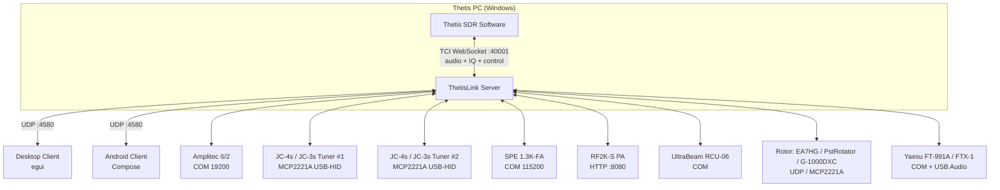

# ThetisLink v2.8.0 - User Manual

## Table of Contents

1. [Overview](#overview)
2. [Server configuration](#server-configuration)
3. [Starting the server](#starting-the-server)
4. [Connecting the client](#connecting-the-client)
5. [Internet remote via relay](#internet-remote-via-relay-v240)
6. [Operation](#operation)
7. [Devices](#devices)
8. [Yaesu FT-991A / FTX-1](#yaesu-ft-991a--ftx-1)
9. [Diversity reception](#diversity-reception)
10. [DX Cluster](#dx-cluster)
11. [Macros](#macros)
12. [Naming conventions](#naming-conventions)

---

## Overview

ThetisLink is a remote control application for the ANAN 7000DLE SDR with Thetis. It consists of:

- **ThetisLink Server** — runs on the Thetis PC (Windows), controls the radio via TCI
- **ThetisLink Client** — desktop client (Windows/macOS/Linux) with spectrum, waterfall and full control
- **ThetisLink Android** — mobile client app

The server communicates with Thetis via TCI WebSocket for both control and audio. Audio is transmitted via the Opus codec over UDP with minimal latency.

### Thetis version

ThetisLink has been tested with and requires **Thetis v2.10.3.15** (official release by ramdor). This is the base version: all core functionality (audio, spectrum, PTT, TCI control) works fully with unmodified Thetis.

Optionally there is the **PA3GHM Thetis fork** with ThetisLink-specific extensions. These extensions are behind the "ThetisLink extensions" checkbox in Thetis (Setup > Network > IQ Stream). With the checkbox unchecked, the stock TCI extension behaviour is preserved (the fork still carries its own build tag, release notes and About metadata). ThetisLink automatically detects whether extensions are available and switches over. Advantages of the fork:

- Extended IQ bandwidth up to **1536 kHz** (stock cap is 384 kHz), selectable per RX
- Server-side **CTUN auto-recenter** — DDC follows the VFO automatically on rapid tuning
- **Diversity auto-null suite**: Auto/Smart/Ultra with live circle broadcast for remote tuning visualisation
- **`tci_caps_ex` capability broadcast** — clients auto-detect which extensions the build offers
- Filter-preset push (`rx_filter_preset_ex`), per-RX DDC-rate push (`ddc_sample_rate_ex`)
- Additional TCI `_ex` commands for NB2, AGC-auto, VFO-swap, FM-deviation, step/preamp att

### Distribution

ThetisLink is distributed as a zip file with the following contents:

| File | Description |
|---------|-------------|
| `ThetisLink-Server.exe` | Server executable (Windows) |
| `ThetisLink-Client.exe` | Desktop client executable |
| `ThetisLink-2.8.0.apk` | Android client app |
| `Installation.pdf` | Installation guide (English) |
| `User-Manual-EN.pdf` | User manual (English, this document) |
| `Technical-Reference.pdf` | Technical reference (English) |
| `Installatie.pdf` | Installatiehandleiding (Nederlands) |
| `User-Manual.pdf` | Gebruikershandleiding (Nederlands) |
| `Technische-Referentie.pdf` | Technische referentie (Nederlands) |
| `LICENSE` | License (GPL-2.0-or-later) |
| `SHA256SUMS.txt` | SHA-256 checksums for binary verification |

> **Configuration files:** `thetislink-server.conf` and `thetislink-client.conf` are not bundled. They are created automatically with default values on the first start of the server and client (in the same folder as the exe).

### System requirements

- **Server:** Windows 10/11, Thetis v2.10.3.15 or PA3GHM fork, ANAN 7000DLE (or compatible)
- **Client:** Windows/macOS/Linux or Android 8+
- **Network:** WiFi or LAN, UDP port 4580

---

This manual assumes that ThetisLink has been installed and configured according to the **Installation Guide** (`Installation.md`). There you will find: installation of the server, desktop client and Android app, Thetis TCI configuration, firewall settings and network/port forwarding.

---

### Architecture



All audio (RX/TX), IQ spectrum data and control go through a single TCI WebSocket connection. ThetisLink does not use a separate CAT TCP connection — TCI covers all required commands, with both stock Thetis v2.10.3.15 and the PA3GHM fork. No VB-Cable or other drivers required.

> **The network path, illustrated:** an illustrated explanation of how audio, spectrum and control travel over the network is published online: **[The network path](https://cjenschede.github.io/ThetisLink/Network-explained.html)**.

---


## Server configuration

The basic connection with Thetis (TCI/CAT addresses, device COM ports) is set up during installation — see `Installation.md`. Below are the advanced configuration options.

### DX Cluster

| Setting | Example | Description |
|---|---|---|
| `dxcluster_server` | `dxc.pi4cc.nl:8000` | DX cluster server address |
| `dxcluster_callsign` | `PA3GHM` | Callsign for cluster login |
| `dxcluster_enabled` | `true` | DX cluster on/off |
| `dxcluster_expiry_min` | `10` | Spot expiry time in minutes |

### Amplitec labels

```
amplitec_label1=JC-4s
amplitec_label2=A2
amplitec_label3=A3
amplitec_label4=A4
amplitec_label5=DummyL
amplitec_label6=UltraBeam
```

> **Important:** See [Naming conventions](#naming-conventions) for special integrations.

---

## Starting the server

1. Start Thetis and enable TCI (Setup > Serial/Network/Midi CAT > Network → TCI Server)
2. Start `ThetisLink-Server.exe`
3. Check the connection settings
4. Check the desired devices
5. Click **Start**
6. The server listens on UDP port 4580

### Server UI

The server displays:
- Connection status (TCI WebSocket)
- Active device windows (Tuner, Amplitec, SPE, RF2K, UltraBeam, Rotor, Yaesu)
- Macro buttons (2 rows of 12)
- Uptime and client info

---

## Connecting the client

1. Start the client.
2. On first run the client scans the local network via **mDNS** for running ThetisLink servers. Discovered servers appear automatically in a dropdown.
3. Select a server from the list, or enter the IP address manually (e.g. `192.168.1.79:4580`).
4. Click **Connect**.

The client automatically receives:
- Real-time spectrum and waterfall
- VFO frequency, mode and filter
- S-meter values
- Device status (Amplitec, UltraBeam, Yaesu, etc.)
- DX cluster spots

### Auto-discovery not working (mDNS)

If the mDNS dropdown stays empty but typing the IP manually works fine: mDNS uses UDP multicast (`224.0.0.251:5353`), which is sometimes blocked.

- **WiFi routers with AP isolation / client isolation**: multicast between clients is dropped. Disable that option in the router config or use a wired connection.
- **Intermittent on WiFi** (works right after boot, fails after a few minutes): typically a laptop WiFi driver / power-management issue dropping the multicast subscription. Workaround: UTP cable, or update the WiFi driver / disable-enable the NIC.
- **Cross-subnet**: mDNS uses TTL=1 and does not cross routers. Server and client must be in the same IP subnet.

Manually entered IP addresses work regardless of mDNS, so you do not need to wait for a fix if discovery fails.

---

## Internet remote via relay (v2.4.0)

On the same network (LAN/WiFi) the client connects directly to the server — no relay needed. To connect **over the internet** from somewhere outside your own network there are two routes:

1. **Port forward** on the home router to the server PC (UDP 4580). Only works if you have a public IP and can change the router config.
2. **Relay** (new in v2.4.0). Both the server (station) and the client connect **outbound** to a small relay server on a VPS. No port forward needed, and it works behind **CGNAT** too (where your provider does not give you a public IP of your own). This is the recommended route for internet remote.

The relay runs on its own server (VPS) that you host yourself — it is not shipped as a ready-made download, but as source code + a Docker image (see the installation guide and `thetislink-relay/DEPLOY-wss.md`). One relay serves one or more stations; the server PC does not need to be reachable from the outside.

The server supports both routes at the same time: once a relay is configured, **each client decides for itself** whether to connect directly or via the relay. A single server can therefore serve several clients at once, some direct and some via the relay — you do not have to pick one route for the whole setup.

> **Want to try the relay without hosting your own?** For the first users who would like to try it out, PA3GHM can — on request and while slots last — temporarily add you to a test relay. Note this is a **temporary server with a limited number of slots**, so there is no guarantee of availability or continuity. Contact PA3GHM via [QRZ.com](https://www.qrz.com/db/PA3GHM) (callsign PA3GHM).

### How it connects

Both the station (server) and the client open an outbound connection to the relay:

- **Control + spectrum** run over a secure WebSocket (**wss**, TCP port 443) — encrypted by the relay's TLS (Caddy handles the certificate).
- **Audio + PTT** run over **UDP** (port 443) for minimal latency, just like on the LAN.

The relay pairs the client with the right station based on a **room/station name** and a **station key**. You enter these once on the server and client (exact fields and steps: see `Installation.md`). As long as both are logged in to the relay with the same room and key, the connection behaves exactly like a direct LAN connection.

### Automatic fallback to TCP (make-before-break)

Some networks (corporate WiFi, guest networks, restrictive mobile carriers) block UDP. Without a countermeasure the audio would drop while control and spectrum keep working. From v2.4.0 ThetisLink handles this automatically:

- If the client notices that **no UDP audio** is arriving anymore, it asks the station to send the audio **through the wss (TCP) tunnel**. The switch is *make-before-break*: the new path is established before the old one is released, so you do not hear a gap in the audio.
- As soon as UDP is available again, the connection switches **back automatically** to UDP (the lowest latency).
- The fallback applies only to audio/PTT; control and spectrum already ran over wss.

**Transport indicator.** You can always see which path the audio is using now:

- **Desktop:** in the **Server tab**, next to "Audio streams:" — grey **"Transport: UDP"** in the normal state, or amber **"TCP fallback"** when the audio is temporarily routed through the tunnel.
- **Android:** in the statistics panel, next to "Statistics:" — the same amber **"TCP fallback"** message.

If you see "TCP fallback" during normal LAN use without a relay, nothing is wrong — the indicator is only meaningful on a relay connection. If it stays on "TCP fallback" on a relay connection, your network is blocking UDP structurally; the audio keeps working, just with slightly more latency.

> **Disabling UDP (optional).** If you know in advance that your network blocks UDP, you can set the client/Android to **wss-only** so it does not try UDP first. By default UDP is on (lowest latency) with automatic fallback as a safety net.

### Relay administration (dashboard)

Whoever hosts the relay has a **web dashboard** for administration, reachable through the relay (behind TLS, only accessible internally/secured — not from the public internet without login):

- **Log in** with an admin password (stored securely with Argon2id hashing, not as plain text).
- **Devices/stations** management: set the maximum number of admitted devices and block devices.
- **Usage and quota** per station and device: view data usage and, per station, set the maximum number of devices/clients and a monthly data limit.
- **Database backup** button ("Backup DB"): downloads a consistent copy of the relay database (via `VACUUM INTO`, so without stopping the relay). Handy for a periodic safeguard. Sensitive admin actions such as this export are noted in the relay log with the requester's IP.

The relay configuration (station keys, admin password) lives in a `.env` file on the VPS. This file contains secrets and must **never** end up public or in a repository — see `Installation.md`.

---

## Operation

### VFO and frequency

- **Frequency display:** click to enter a frequency directly
- **Step buttons:** +/- in steps of 10 Hz, 100 Hz, 500 Hz, 1 kHz, 10 kHz
- **Scroll wheel:** on the spectrum = 1 kHz steps
- **Click on spectrum:** tune to that frequency
- **Waterfall click (Android):** tune to click position

### Band memory

Per band the following is automatically saved:
- Frequency
- Mode (LSB/USB/CW/AM/FM/DIG)
- Filter width
- NR level

When changing bands these are automatically restored. In addition there are 5 free memory slots (M1-M5).

### Mode

On the main Radio tab: LSB, USB, AM, SAM, FM. The pop-out windows add the full set: LSB, USB, CW-L, CW-U, AM, SAM, FM, DIGU, DIGL. (DATA-FM is a Yaesu-radio mode, not a Thetis mode — see the Yaesu section.)

### CW keyer (v2.0.0)

In CW mode a remote keyer is available over TCI:

- **CW key down/up:** an assigned button or MIDI pad triggers `keyer:0,true,duration_ms;` for a dit/dah, or a PTT-style press-and-release. The server log shows every key event.
- **CW macros:** pre-programmed text strings (CQ call, RST report, own call/QTH) are sent to Thetis via `cw_macros:0,text;`. Thetis sends them at the current keyer speed (`cw_keyer_speed:wpm;`).
- **Stop:** `cw_macros_stop;` cancels a running macro mid-character.

Speed and macro content are adjustable in the client.

### Filter

The filter width is adjustable with +/- buttons. Presets are available per mode:
- **CW:** 50, 100, 250, 500, 1000 Hz
- **SSB:** 1800, 2100, 2400, 2700, 3000, 3300, 3600, 4000 Hz
- **AM:** 4000, 6000, 8000, 10000, 12000 Hz
- **FM:** 5000, 10000 Hz

**Filter preset tracking (v2.0.0, with fork):** with the PA3GHM fork the current Thetis filter preset (F1, F2, F3, VAR1, VAR2 or NONE) is synchronised live to the client. The client shows which preset Thetis currently has active and you can switch via the same button set — no manual double-setting between client and Thetis UI needed.

### Volume

- **RX Volume:** receive level (TCI `volume` / `rx_volume`)
- **TX Gain:** microphone preamplification
- **Drive:** transmit power 0-100%
- **Mic AGC:** automatic microphone gain (on/off)

### Noise Reduction & Notch

- **NR:** cyclic: OFF > NR1 > NR2 > NR3 > NR4
- **ANF:** Auto Notch Filter on/off

### PTT (Push-to-Talk)

ThetisLink offers three PTT modes:

- **Push-to-talk (spacebar):** hold the spacebar to transmit, release to stop
- **Toggle:** click the PTT button to switch between transmit and receive
- **MIDI PTT:** separate MIDI PTT mode via an assigned MIDI controller button, independent of the desktop PTT mode

**Android — external BT remote (ZL-01 or similar):** a Bluetooth button that behaves as an external touch device can be used as a PTT button. ThetisLink intercepts the touch events and maps them to PTT down/up. Only works while the screen is active (touch events are only delivered to a wakeful screen on Android).

**PTT spike suppression (v2.4.0):** on a tablet/laptop with a built-in speaker and microphone in one chassis, the switch-on plop at PTT-on can be transmitted. Enable **"Built-in speaker + mic (PTT spike protection)"** in the client: on PTT the speaker is muted instantly and the first few milliseconds of mic audio are discarded, so the spike is not transmitted. The **mic gate-delay** is separately adjustable for Thetis and Yaesu. Leave the option **off** for a headset or well-isolated audio (0 ms, no added latency). Since **v2.4.2** the receive audio of the other receivers stays audible during transmit; the internal-speaker mute applies **only** when this spike-protection option is enabled.

### TX meter (v2.0.0)

During TX the S-meter switches to a TX meter showing:
- **Power** in watts (e.g. `TX  100W`)
- **SWR** colour-coded — below 1:2 green, 1:2-1:3 orange, above 1:3 red (e.g. `SWR 1.50`)

The SWR value is broadcast by Thetis over TCI during every TX burst and is visible in real time on every connected client.

### Starting Thetis from the client

The **Thetis tab** opens with the power button: a short press switches Thetis on or off, holding it for 2 seconds shuts Thetis down on the server PC. If Thetis is not running yet, the server launches it (set the path to `Thetis.exe` in the server GUI).

Next to it sits **Start Thetis automatically**. With that box ticked the client sends that launch itself, **once per client start**, and only when the server reports Thetis is not running. If you deliberately power Thetis off afterwards it stays off — also when the connection drops and returns. The box is off by default.

**Android** has the same: the power button sits on the Radio screen with the **Start Thetis automatically** checkbox directly below it, under the same once-per-app-start rule.

> When Thetis is not running the client says **"Thetis is not running"**. When Thetis does run but its TCI server is off you get **"Thetis TCI not connected"** — fix that in Thetis under Setup → Network → TCI. An attached Yaesu radio is independent of this and stays operable.

### TX modulation bandwidth (v2.3.0)

In the desktop client's **Thetis tab** you set the main radio's **TX modulation bandwidth**. Two options:

- **Follow RX bandwidth:** the TX modulation filter mirrors the RX filter 1:1. The manual fields are then greyed out. The screen shows the followed band, e.g. `TX follows RX: 0 .. 2800 Hz`.
- **Independent:** set the modulation's low and high edges (Low/High) yourself.

The range is **0–8 kHz**. The TX audio runs at 16 kS/s, so modulation can reach 8 kHz; if the RX filter is wider, the TX band is clamped to 8 kHz and the screen flags it (`(RX wider — TX max 8 kHz)`). In the symmetric modes (AM/SAM/DSB/FM) the filter is symmetric around the carrier — drag one edge in the spectrum and the other moves with it, just like in Thetis.

> **Tip:** while transmitting (PTT active) mode changes are not forwarded to Thetis; the mode buttons are greyed out. This avoids a desync where Thetis stays on the old mode while the indicator shows the new one.

### Spectrum and waterfall

- **Zoom:** adjustable, provides more accurate frequency display
- **Pan:** shift the visible spectrum left/right (0 = centered on VFO)
- **Reference level:** shift the dB range up/down
- **Auto Ref:** automatic reference level adjustment based on noise floor
- **Contrast:** waterfall brightness per band (remembered)
- **DDC sample rate (v2.0.0):** dropdown for the DDC IQ bandwidth. Stock Thetis offers 384 kHz; with the PA3GHM fork the per-RX selection is 48, 96, 192, 384, 768 or 1536 kHz. Higher rates show more spectrum but load network and CPU more heavily.

**Server-side CTUN auto-recenter (v2.0.0, with fork):** when the fork extension `auto_recenter_ex` is active, the server itself recenters the DDC when the VFO moves rapidly outside the current DDC zone. No manual action needed — the spectrum window follows the VFO automatically.

#### TX spectrum override

During transmission (TX) the spectrum is automatically adjusted for good display of the transmit signal:
- **Reference level:** overridden to -30 dB
- **Range:** overridden to 120 dB
- **Auto Ref:** automatically disabled during TX and the setting is saved
- After releasing PTT the original settings (including Auto Ref) are restored with a short delay, so the spectrum returns stably

### Popout windows

The client supports a separate window per channel:
- **RX1 spectrum** — RX1 spectrum + waterfall with controls only
- **RX2 spectrum** — RX2 spectrum + waterfall with controls only
- **Joined** — RX1 and RX2 side by side with shared controls
- **VRX1 / VRX2** — from v2.5.0 each virtual receiver has its **own** window (see [Virtual receivers](#virtual-receivers-vrx-v220))
- **Yaesu 1 / Yaesu 2** — a control window per connected Yaesu radio

In popout windows the following are available:
- S-meter (bar or analog needle meter — from v2.5.0 you **click the meter itself** to switch, and the choice is remembered per channel)
- All band/mode/filter/NR/ANF controls
- VFO A<>B swap button (bottom-left with analog needle meter)

**Independent audio and spectrum per channel (v2.5.0).** Each channel (RX1, RX2, VRX1, VRX2, Yaesu 1/2) is its own subscription: its audio and its spectrum/waterfall are enabled independently. Opening a window turns that channel's data on; closing it turns the data off again, so you only spend network and CPU on the channels you are actually using.

**Window positions are remembered (v2.5.0).** Every pop-out (including the Yaesu windows) restores to the position and size where you last left it.

### Arrange windows (v2.5.0)

**Arrange windows** lays out your open windows onto a grid on the screen instead of dragging each one by hand. *(A matrix placer since **v2.6.0**.)* Click **Arrange**, pick a **grid size** (up to 12×12; **up to 18×18 since v2.8.0**) with the drag-picker, select a window and **paint it onto the cells** — a single window may span several adjacent cells and is stretched over that block. **Drag from the first to the last cell to fill a whole rectangle in one gesture** (with a live preview); a single click places one cell, right-click (or click again) clears. The **main window** can be arranged too, and the palette lists every available window — a window that is off is opened automatically when you *Apply*. On a **multi-monitor** setup each screen has its own grid.

Since **v2.6.0** the same matrix arranger is also built into the **server GUI** (the *Arrange* button while running) to arrange the server's own device windows (tuner, Amplitec, SPE, RF2K-S, UltraBeam, rotor).

**UI scale (v2.8.0).** Next to the arrange button sits a **UI scale** from 50 % to 150 %. It
enlarges or shrinks only the *contents* of the windows, not where they sit on screen — so a
saved layout survives a change of scale. On a high-resolution display a smaller scale fits
considerably more on screen, which is also why the grid goes up to 18×18: at 100 % twelve
columns are already wider than a window needs. `Ctrl +` and `Ctrl -` do the same thing and are
remembered just as well. The scale applies to the pop-out windows too, since they share the
same view.

**The same in the server (v2.8.0).** The server GUI now has the same three things as the
client: the UI scale, the grid up to 18×18 and the five arrangement memories. They come from
shared code, so they behave identically — what you learn in one applies to the other.

**Arrangement memory (v2.8.0).** Below the grid are five slots that hold a whole layout. **Store** writes the current position and size of every open window into that slot; **Recall** puts them all back — including reopening a window that has since been closed. Give a slot a name (*Day*, *Contest*, *Digital*) so you can tell them apart. This stores actual positions rather than the grid, so a layout you fine-tuned by hand afterwards comes back exactly as you left it. The grid you painted is now remembered across restarts as well.

### VFO B / RX2

Full second receiver support:
- Independent frequency, mode, filter, S-meter
- Own spectrum and waterfall
- VFO Sync: VFO B automatically follows VFO A
- A<>B: swap VFO A and B

**Single-receiver radios (v2.5.0).** If your Thetis radio has only one receiver, set **"Radio has a second receiver (RX2)"** to off in the server settings (default: on). ThetisLink then hides RX2 and VRX2 everywhere — no empty second-receiver chips or windows — so the UI matches the hardware. When no Thetis is configured at all, none of the RX1/RX2/VRX chips are shown.

### Virtual receivers (VRX, v2.2.0)

In addition to the two physical receivers (RX1/RX2), from v2.2.0 ThetisLink offers two **virtual receivers**: **VRX1** (tied to RX1/VFO-A) and **VRX2** (tied to RX2/VFO-B). A VRX is an independent receiver carved out of the wideband DDC IQ stream — so you can roam freely within the current DDC bandwidth without moving the main VFO. Handy, for example, to follow a second station on the same band while your main reception stays put.

**Separate windows (v2.5.0):** VRX1 and VRX2 each open in their **own** pop-out window, so you can place them independently — on different parts of the screen or on different monitors (see [Arrange windows](#arrange-windows-v250)). Each window's position and size are remembered. (Before v2.5.0 both were shown together in one joint pop-out.)

**Per-VRX settings:**
- **On/off** per VRX — a VRX only consumes network and CPU once you enable it.
- **Frequency:** its own listen frequency, freely set within the DDC bandwidth. The last-used VRX frequency is remembered per DDC position, so when you return to the same spot it resumes where you left off.
- **Mode:** USB, LSB, AM, SAM or FM.
- **Filter:** its own filter width per VRX.
- **Volume:** its own mix level; the VRX audio is mixed into the main audio alongside RX1/RX2 (and any connected Yaesu).

**Spectrum, waterfall and S-meter:** each VRX has its own **high-resolution spectrum + waterfall** around its listen frequency and its own S-meter. The high-resolution view is requested per VRX; the client then shows a zoomed-in spectrum (with adjustable zoom, reference level, range and waterfall contrast).

**Narrow or wide audio:** the VRX audio is Opus narrowband (8 kHz) or wideband (16 kHz). From v2.3.0 you choose this **per VRX** (NB/WB/Auto) — see [Per-VRX audio bandwidth](#per-vrx-audio-bandwidth-v230) below.

**Persistence:** the VRX settings (on/off, frequency, mode and filter) are saved and restored across reconnects.

> **How exactly does a VRX work?** An illustrated explanation of the whole VRX signal chain — from radio wave to sound — is published online: **[How a VRX works](https://cjenschede.github.io/ThetisLink/VRX-explained.html)**.

### Synchronous AM (SAM) with a carrier PLL (v2.3.0)

In **SAM** mode a VRX uses a real synchronous-AM demodulator from v2.3.0: a **phase-locked loop (PLL)** locks onto the AM station's carrier and demodulates against that recovered carrier. The result is cleaner AM than the previous pseudo-SAM — even a few Hz off the carrier the beat note disappears, and reception stays stable through selective fading. The loop captures the carrier within a range of about ±3 kHz.

**Auto-tune to the carrier:** you can let SAM **follow the carrier** — the listen frequency (and your VFO) then snaps onto the carrier and keeps tracking it, even as the station slowly drifts. This is a per-VRX choice; with it off the frequency stays where you set it and only the PLL pulls the phase straight.

### Per-VRX audio bandwidth (v2.3.0)

From v2.3.0 each VRX has its **own audio-bandwidth choice**: **NB** (narrowband, 8 kHz), **WB** (wideband, 16 kHz) or **Auto**. This is independent of the global [RX bandwidth](#rx-bandwidth-narrowwide-v220) switch, so you can set VRX1 narrow and VRX2 wide, for example. In **Auto** the VRX widens to wideband as soon as you open the filter past roughly 4 kHz, and returns to narrowband for a narrower filter.

### RX bandwidth (narrow/wide, v2.2.0)

A single switch in the client sets the **RX audio bandwidth** for the Thetis receiver, the VRX channels and the connected Yaesu radios at the same time: narrowband (8 kHz) or wideband (16 kHz). This applies to receive only — transmit audio always stays wideband. The sample rate of a WAV recording auto-scales with this setting.

### WebSDR/KiwiSDR (Desktop)

Built-in WebView for WebSDR and KiwiSDR reception:
- Frequency synchronization: WebSDR follows the VFO
- Automatically muted during transmission
- Favorites list with star icon
- **Reload button (v2.4.0):** quickly reloads the WebSDR page after a network interruption, without restarting the client

### MIDI Controller

Desktop and Android support USB MIDI controllers:
- **Scan** button searches for available MIDI devices
- **Learn** mode: press a MIDI button/slider, assign a function
- Available functions (a large set): PTT (with LED), VFO tune (main / RX2 / VRX / Yaesu), volumes and balance, drive, NR/ANF/NB/APF, AGC mode + gain, mode, band, power, spectrum zoom/pan/ref-level/waterfall-contrast, filter widen/narrow, VFO lock, RIT/XIT toggle + offset, squelch toggle + level, CW speed, Tune toggle + drive, mute, and per-Yaesu volume/RF-gain/mic-gain/PTT
- Encoder steps: 1 Hz, 10 Hz, 100 Hz, 500 Hz, 1 kHz
- **MIDI PTT mode:** separate PTT mode for MIDI, independent of the spacebar PTT mode

### Theme and UI colors (v2.4.0)

The desktop client has a **theme selector** in the Server tab. Besides the default style there are predefined dark variants, plus a fully customizable own theme:

- **Classic** — the original ThetisLink style.
- **Dark** / **Slate** — darker variants with less brightness, easier on the eyes at night.
- **Custom** — pick your own colors. The color pickers let you set:
  - **Background** — the window background.
  - **Widgets** — the fill color of buttons and fields.
  - **Text** — the text color.
  - **Slider knob** — the accent color of the sliders and their rail.

The choice is saved in `thetislink-client.conf` and restored on the next start. The theme is purely cosmetic — spectrum and waterfall colors (the signal-level palette) stay unchanged so signals remain equally readable on any background.

### Language (v2.5.0)

ThetisLink is multilingual. The interface defaults to **English**, with translations to **Dutch, German and French**. On the **desktop** you pick the language with a **language picker in the Server tab** (below *Relay connection*, above *Theme*); the choice is saved in `thetislink-client.conf`. The **Android** app follows your phone's language automatically, falling back to English if it is set to another language. Ham terminology, mode names (LSB, CW-L, …) and product names are deliberately left untranslated.

Since **v2.6.0** the **server GUI** is multilingual too (EN/NL/DE/FR): pick the language with the **language picker in the settings screen** (below *Theme*). The server defaults to **Dutch**. The settings screen and the device pop-outs (tuner, Amplitec, SPE, UltraBeam, rotor, macro editor) are translated.

---

## Devices

### Amplitec 6/2 Antenna Switch

Serial USB connection (19200 baud). Displays:
- Current switch position port A and B
- 6 antenna positions with configurable labels
- Switch buttons per port

### StockCorner JC-4s / JC-3s automatic tuners (multi-tuner via MCP2221A)

From v2.0.3 the server supports **two physical tuners in parallel**, each via its own Adafruit MCP2221A USB-HID breakout. JC-4s and JC-3s use the same control protocol — the model label is cosmetic only. For each tuner slot you assign a board serial number and (optionally) the Amplitec-A antenna position the tuner physically sits behind; the server then automatically routes a Tune action to the correct physical tuner.

**Hardware wiring (per tuner):**
- **GP2** → through a gate resistor to the gate (2N7000) or base (MMBT3904) of a transistor; on `HIGH` the transistor pulls the **grey "start" wire** of the JC-Control to GND (mechanically equivalent to pressing the start button).
- **GP1** → ADC input on the midpoint of a **1 MΩ + 1 MΩ 1:1 voltage divider** on the **yellow "tune-status" wire**. Idle ≈ 4.5 V, tune-active ≈ 0 V; the high impedance does not appreciably load the JC-Control LED circuit.
- **GND** → common ground with the JC-Control.
- The full schematic (with both 2N7000 and MMBT3904 variants) lives in the technical reference.

**First-time setup:**
1. Plug in all MCP2221A boards and open the **MCP2221A tuner bridges** section at the bottom of the server status panel (expand with the triangle; the open/closed state is remembered across restarts).
2. Click **Scan** under "Detected MCP2221A boards" — every board on the USB bus is listed with its HID path and current serial number.
3. For each **anonymous** board (empty serial): enter a unique name under "Set serial:" (for example `JC-4s loop` or `JC-3s vertical`) and click **Program serial**. The board persists the name in EEPROM; click **Scan** again to confirm the new name.
4. For each **Tuner1** / **Tuner2** block: pick the board for that slot under "MCP serial:" and pick the antenna position (1–6) the tuner sits behind under "Amplitec pos:". Both actions trigger an auto-restart so the bridge re-opens against the chosen board.

**Per-tuner status row shows:**
- Header: tuner label + "Connected" / "Not connected" / "Error: …"
- **MCP serial** dropdown and **Amplitec pos** dropdown.
- **Live:** current voltage on the yellow wire (V, post-divider).
- **Threshold** slider (0.5–4.5 V, default 2.25 V): the switch level on the yellow wire.
- **Hysteresis** slider (0.1–2.0 V, default 0.50 V): dead band around the threshold to reject transient noise.
- **Edges:** the derived edges (`active < … V`, `idle > … V`). When the combination is impossible (e.g. threshold 0.5 V + hysteresis 2.0 V → active < 0 V) an amber **⚠ clamped** warning appears with a hover tip explaining the combo will never trigger — reduce the hysteresis or move the threshold away from the boundary.

**Tune sequence (per tuner):**
1. PA standby (SPE/RF2K) if either is in Operate.
2. GP2 HIGH (start asserted) and wait for the yellow wire to drop below the active edge = tuner ACK.
3. GP2 LOW (start released).
4. Thetis carrier ON (`ZZTU1;`).
5. Wait for the yellow wire to return above the idle edge = tune complete.
6. Thetis carrier OFF (`ZZTU0;`).
7. PA back to Operate.

A timeout fires if the tuner does not ACK within 3 s after GP2 HIGH (status **Timeout**), or if the tune cycle does not complete within 30 s (idem). **Abort** breaks the cycle and forces GP2 back to LOW. A single ADC poll is rate-limited to 100 ms per board; the tuner thread explicitly checks the sample timestamp to avoid double-counting rate-limited cached samples.

**USB auto-reconnect:** once a bridge has been "Connected" at least once and the link drops afterwards (cable unplugged, sleep mode, hub reset, …), the tuner thread retries the open every 5 s on its own. A successful reconnect resets the timer so a subsequent drop is retried immediately — no server restart needed.

> **Tune-button visibility:** The Tune button in the main screen is only visible when at least one Amplitec label contains a tuner-recognising word (`JC-4s`, `JC4s`, `JC-3s`, `JC3s`, or `Tuner`). Routing to the correct physical tuner slot happens automatically based on the active Amplitec-A position — see [Naming conventions](#naming-conventions).

### SPE Expert 1.3K-FA

Serial USB connection. Displays:
- Power, SWR, temperature
- Antenna selection
- Operate/Standby status

### RF2K-S

TCP/IP connection (port 8080). ThetisLink supports both the original RF2K-S firmware and the modified v190 firmware with extended drive control.

**Original firmware — basic functionality:**
- Band and frequency readout
- Operate/Standby switching
- Tuner control (mode, L/C values)
- Error status and antenna selection
- Power, SWR, temperature

**Modified firmware (v190+) — additional functionality:**
- Drive power readout and adjustment (increment/decrement)
- Drive configuration per band and modulation type (SSB/AM/Continuous)
- Debug telemetry (bias voltage, PSU voltage, uptime)
- Controller version with hardware revision

ThetisLink automatically detects which firmware is active. With the original firmware everything works except drive control.

The RF2K-S can be reset via the server UI when needed.

### UltraBeam RCU-06

Serial USB connection (19200 baud). Functions:
- **Frequency display** with band indication
- **Direction buttons:** Normal, 180 degrees, Bi-Dir
- **Frequency step buttons:** -100, -50, -25, +25, +50, +100 kHz
- **Sync VFO:** set the UltraBeam to the current VFO frequency (A or B, depending on Amplitec switch position)
- **Auto:** automatic frequency tracking of the active VFO
  - Minimum step: 25 kHz (prevents motor overload)
  - VFO selection is automatically determined via the Amplitec (see [Naming conventions](#naming-conventions))
- **Band presets:** quick-select buttons per band
- **Motor indicators M1 / M2 (v2.0.0):** two badges next to the progress bar showing per-motor activity. Orange = motor running, grey = motor idle. During a large band change (e.g. 80m → 10m) you typically see both orange briefly, and when one motor reaches its target first you see that badge turn grey while the other keeps running.
- **Motor progress:** shared progress bar during element movement. The RCU-06 only exposes a single combined progress value for both motors — exact per-motor progress is not available from the controller.
- **Retract:** retract all elements (with confirmation)
- **Element display:** current element lengths in mm

### Rotor backends

ThetisLink supports three rotor backends. In the server config window under *Rotor → backend* you choose which one to use; one at a time is active.

The client panel (compass, GoTo, Stop) looks the same regardless — the backend choice only affects how the server talks to the rotor hardware.

#### EA7HG Visual Rotor

Direct UDP connection to EA7HG Visual Rotor software (Prosistel protocol). Enter the Visual Rotor address (e.g. `192.168.1.60:3010`); no further configuration needed.

#### Yaesu G-1000DXC via Adafruit MCP2221A (v2.1.0+)

Direct control of the Yaesu G-1000DXC EXT CONTROL connector from the ThetisLink server PC through an Adafruit MCP2221A breakout (5 V mod). No additional controller PCB or third-party software required. Replaces EA7HG for owners who prefer to keep ThetisLink in-process.

**Hardware**

- Adafruit MCP2221A breakout (#4471) with the 3 V solder jumper on the underside cut and the 5 V pad bridged
- 2× BST82 (SOT-23) low-side switches on pin 1 (R/CW) and pin 2 (L/CCW) of the Yaesu DIN-7
- 2× 100 kΩ gate pull-downs (prevent spurious rotation during USB reset)
- 1× 1.8 kΩ + 1× 2.2 kΩ voltage divider on pin 4 (position feedback) to GP3 ADC; **not** 1.8 kΩ + 10 kΩ — that clips above ~365° on rotors where pin 4 climbs above 4.8 V
- Optional: 10 µF capacitor in parallel with the 2.2 kΩ to suppress 100 Hz mains-rectifier ripple
- 7-pin mini-DIN cable to the rotor

**Server setup**

1. Open the **MCP2221A** section in the Status panel.
2. Click **Scan** — the Adafruit appears as an "Unprogrammed" board.
3. Select *function = Rotor*, enter a name (e.g. `rotor1`), click **Add**. The board's USB serial is written as `rot_<name>` into its EEPROM.
4. Restart the server so the board is picked up.
5. Under *Rotor → backend* select **Yaesu G-1000DXC (MCP2221A)**.

**Calibration**

Before GoTo works the voltage-to-degrees mapping must be captured:

1. Manually rotate to the CCW endpoint (mechanically hard against the stop, 0°).
2. Click **Park CCW (0°)** in the rotor row.
3. Manually rotate to the CW endpoint (450° on a G-1000DXC).
4. Click **Park CW (450°)**.

The server saves the two voltages as `v_at_0deg` and `v_at_max_deg` in `thetislink-server.conf`. Re-calibrate after any hardware change (divider ratio).

**Per-rotor configuration**

- *max°* — full-scale of the rotor (default 450 for G-1000DXC)
- *ramp* — soft-start / soft-stop rate in %/sec (1-200, default 50). Lower = friendlier to heavy antennas; higher = more responsive.
- *shortest route* — only visible when `max_deg > 360`. When enabled, a GoTo picks the shortest mechanical route through the overlap zone (e.g. currently 350°, target 30° → CW via 390° instead of CCW via 0°). Default off so "go to 30°" lands literally on 30° physical.

**Diagnostics**

The rotor row shows the live position in whole degrees, the median pin-4 voltage, the latest raw ADC sample and the peak-to-peak spread (noise indicator). During a GoTo you can see the soft-start ramp-up and the soft-stop ramp-down in the DAC slider. At idle the server polls at 1 Hz (60-sample median); during motion at 30 Hz (10-sample median).

**Test buttons + speed slider**

The CW / CCW / Stop buttons and DAC speed slider in the rotor row are decoupled from the GoTo loop. As soon as you move the slider or press a test button the server switches into *manual mode* and respects your value until the next client GoTo / Stop / CW / CCW command arrives.

#### PstRotator (XML/UDP)

PstRotator (yo3dmu) supports nearly all rotor hardware brands. Recommended when you don't use EA7HG Visual Rotor, or when you want to drive a rotor that is not directly supported by ThetisLink.

**Requirements**

- PstRotator (or a variant such as PstRotatorAZ for azimuth-only) runs on a PC in the same LAN. That can be the same PC as the ThetisLink server, or a different one.

**Setup in the ThetisLink server** (Connections → Rotor)

1. *Backend* = **PstRotator (XML/UDP)**.
2. *PstRotator host* = IP address of the PC running PstRotator.
3. *Port* = `12000` (PstRotator default).
4. *Feedback port (local)* = `12001` (= PstRotator's listener port + 1).
5. *Has elevation* = on only for an AZ+ELE rotor (PstRotator); off for PstRotatorAZ.

**Setup in PstRotator**

1. *Communication → UDP Control Port…* → `12000`.
2. Tick *Setup → UDP Control*.
3. In the UDP settings, enter the **IP address of the ThetisLink server PC**. PstRotator sends its position feedback to this IP on port 12001.

**Firewall**

- ThetisLink server PC: allow inbound UDP 12001 for `ThetisLink-Server.exe`. An app-level allow through Microsoft Defender Firewall (`Allow an app through firewall`) covers this automatically.
- PstRotator PC: allow inbound UDP 12000 for `PstRotator.exe` or `PstRotatorAZ.exe`. PstRotator typically asks for this on first launch.

**Known limitation — no target indicator for PstRotator-initiated GoTos.** When you click a target in PstRotator's own compass circle, TL2 only sees the running position feedback (`AZ:nnn.n`), not the target itself. The target line in TL2's rotor window is therefore not drawn for such GoTos — only the needle follows. This is a limitation of PstRotator's outgoing feedback protocol, not a TL2 bug.

### External input: PstRotator or Log4OM directly into the Adafruit rotor (v2.1.1+)

From v2.1.1 the server runs a combined UDP+TCP listener on port `12001` (configurable via `pstrotator_listen_enabled` / `pstrotator_listen_port` in `thetislink-server.conf`) in parallel with the active rotor backend. This lets Log4OM or any external PstRotator-compatible application **drive the Adafruit rotor directly**, regardless of which backend is selected. The listener auto-detects four protocol formats per packet:

| Protocol | Goto command | Query | Used by |
|---|---|---|---|
| Yaesu GS-232A/B | `M<nnn>\r` | `C\r` → `+<nnn>\r` | Most ham software |
| Prosistel binary (EA7HG) | `\x02AG<nnn>\r` or `AAG<nnn>\r` | `\x02A?\r` → `\x02A,?,<nnn>,<R\|B>\r` | PstRotator EA7HG mode |
| PstRotator native XML | `<PST><AZIMUTH>nnn</AZIMUTH></PST>` | `<PST>AZ?</PST>` → `AZ:<nnn.n>\r` | PstRotator native, Log4OM |
| AZ text | `AZ:nnn.n\r` | — | PstRotator UDP output |

The TCP path is bidirectional: when a TL2 client (desktop, Android, or server UI) sets a new target, the listener pushes `M<nnn>\r` or `\x02AG<nnn>\r` (depending on the detected protocol) back to PstRotator. **Note:** PstRotator's client-mode UI may not visualise externally-pushed targets — that is a protocol-design limitation of GS-232A / Prosistel, not a TL2 issue.

#### Setup PstRotator → Adafruit rotor (no PstRotator as backend)

When the rotor backend is set to **Yaesu G-1000DXC (Adafruit MCP2221A)**:

1. In the TL2 server UI: enable the PstRotator listener (default port `12001`).
2. In PstRotator: pick a controller type. **Recommended: TCP client** (Setup → "Start as TCP client") with host = TL2-IP and port `12001`. Alternative: any controller with UDP output (EA7HG, GS-232A) on the same port.
3. PstRotator commands the Adafruit rotor directly through the listener. The server log shows `compass X° → mech Y°` for every click.

#### Setup Log4OM → Adafruit rotor (no PstRotator needed at all)

Log4OM only supports PstRotator as a rotor protocol. The trick: make Log4OM think TL2 **is** PstRotator.

1. **Close PstRotator** on the Win4OM PC (stop it entirely).
2. In **Log4OM → Settings → External Services → PstRotator** (or equivalent rotator-control panel):
   - **Host** = TL2 server IP (e.g. `192.168.1.97`) — **change from `localhost` / `127.0.0.1`**
   - **Port** = `12001` (TL2's PstRotator listener port)
3. Done — click a DX spot in Log4OM and the Adafruit rotor turns directly to the computed bearing.

For each spot, Log4OM sends a handful of PstRotator XML packets (azimuth + callsign + name + QTH + frequency + mode + grid + comment + continent). TL2 processes only the azimuth and silently ignores the metadata tags. No intermediate program needed, no UDP simulator drift, single configuration step.

#### Limitations and known behaviour

- **Toggling requires a server restart.** Listener threads are spawned only at server start. Changing `pstrotator_listen_enabled` in the UI or conf file takes effect after a server restart. Stopping is immediate (server-stop releases the port within ~500 ms).
- **Manual rotate (`R\r` / `L\r` in GS-232A) is ignored.** The listener only accepts target-driven commands. Continuous rotation without an endpoint is a hardware-button function and must go through the TL2 rotor UI itself.
- **Stop commands are forwarded** (`S\r` in GS-232A, `\x02AR\r` / `AAR\r` / `AG999` in Prosistel, `<STOP>` in PstRotator-XML) — they immediately halt the rotor through the active backend.

#### Diagnostics

The raw RX-packet log line is at debug level by default, so the server log is not flooded by the 2 Hz status-query traffic. For diagnostics: run the server with `RUST_LOG=debug` to see the full RX stream. Goto events, connect/disconnect and parse warnings on truly unknown packets always remain visible at info level.

---

## Yaesu FT-991A / FTX-1

ThetisLink can control a Yaesu FT-991A transceiver as a second radio alongside the ANAN. The Yaesu is connected via a serial USB COM port.

### Functions

- **Frequency:** read and set the current frequency
- **Mode:** read and set (LSB, USB, CW, AM, FM, DATA-FM, DIG)
- **VFO A/B:** switch between VFO A and VFO B
- **Memory channels:** automatically loaded when the Yaesu is enabled in the server. **(v2.8.0)** The server reads the channels **once, when the radio connects**, and every client is then served from that copy — previously each client that connected made the radio walk all its channels again, which took a second or so during which no other CAT command could get through. The **per-channel tones** are fetched at the same moment, so a client gets a complete list straight away; the radio briefly steps through the channels that have a tone mode and returns to where it was. The list starts **empty** for both radios at startup — so what you see demonstrably came from the radio rather than from an old file; **Load file** still brings in a saved list when you want one. The consequence of reading once: a channel you edit **on the radio's own front panel** is not noticed until you press **Read radio**, which always fetches a fresh list. **On the FTX-1 that does not hold for the tone:** there the list is authoritative and the radio is not, so a tone you change on the front panel is ignored on a read as long as the list already holds a value there — and shortly afterwards ThetisLink puts the list's value back on the radio, undoing your change on the set. To keep a tone you chose on the radio itself, set it in the list as well. The server log reports how many read tones were ignored for this reason. Channels with a name are displayed in the UI. **The table (v2.8.0):** a row's colour says where the **radio** is, not which row you last touched. **Green** = the radio is on this channel now. **Amber** = the channel you left when you changed frequency and slid into VFO; click it to come back. **Grey** = the rest. The whole row is clickable, not just the number, and **double-clicking** opens the edit fields (with **Close** to leave them). Edit + "Write radio" updates frequency, name, mode, shift and tone-mode (on/off) per channel. **Tones (v2.7.0):** on the FT-991A, ThetisLink now writes the CTCSS tone and the DCS code per channel as well, not just the tone-mode flag. **Read tones** fetches the tones of the channels that have a tone mode; the radio briefly steps through those channels and returns to the one it was on (a running scan is paused and resumed). **The FTX-1 (v2.8.0):** this radio cannot *store* a tone in a memory channel over CAT — its `MW` command has a field for the tone mode but none for the tone frequency — so writing a memory also resets that channel's tone to 100.0 Hz in the radio. ThetisLink therefore keeps the tones in its own list and **re-applies the right one every time the radio lands on a channel**, which means transmitting through ThetisLink works normally. Be aware of what that does not cover: the radio **on its own, without ThetisLink running**, will transmit 100.0 Hz on channels that were written. Because of that cost, *writing to the radio* is **switched off by default**. **Write radio** still hands your list to the server — its tones are applied per channel and work normally — but nothing goes into the set. So an edited frequency or name lives in the server's list only; to put it in the radio itself, tick the box in the server settings (Yaesu tab), where the condition is explained. Reading is always allowed.  **A memory can be written but not erased:** no CAT command exists for clearing a memory channel, so that can only be done on the radio itself. Deleting a row from the table removes it from your list only; the channel stays in the radio exactly as it was.  **Time-out timer (v2.8.0):** if the radio has a TX time-out set, ThetisLink releases PTT just before that limit instead of transmitting on while the set has already stopped. The setting is read from the EX menu when the radio connects (991A 036, FTX-1 030112). The **FTX-1** also reports its real transmit state, so ThetisLink lets go on a fault or when you key the set's own PTT as well; the FT-991A has no such readback, so there the time-out timer is the only net. **If you change frequency while on a memory channel (v2.5.0), ThetisLink copies the channel to VFO-A (keeping its mode) and follows your new frequency — you slide seamlessly from memory to VFO (991A + FTX-1).**
- **Menu editor:** read and modify Yaesu menu settings via the server UI **(v2.8.0)** The server reads the EX settings **once, when the radio connects**, and keeps them; a client is then served straight from that copy instead of waiting for a fresh scan. That mainly shows on the FTX-1, where it is 405 parameters. Change a setting through ThetisLink and the copy is updated immediately — no re-scan needed. **Read radio** still fetches a fresh scan, for instance after you changed something on the set itself.
- **Audio:** the Yaesu USB audio is captured by the server and sent via the AudioRx2 channel to the client, where it is mixed with the ANAN RX signal
- **Auto-DFM during TX (v2.0.0):** see subsection below

### Channel buttons and volume in the main window (v2.7.0)

The buttons at the top of the main window are named after what they do. Every
channel is a block with the **channel name as a heading** and two buttons under it:

- **audio** — that channel's sound on or off. Off saves bandwidth.
- **window** — open or close that channel's window.

This applies to all six channels: RX1, RX2, VRX1, VRX2 and both Yaesu radios.
Previously the channel name itself was the audio switch, with `spec` below it for
RX/VRX and `win` for a Yaesu — two names for one and the same thing.

Two things moved or disappeared with it:

- The separate **VRX** button next to *Arrange*, which toggled both VRX windows at
  once, is gone. Use the `window` button of VRX1 and VRX2.
- The **audio button now also sits inside every channel window**, next to the
  volume. It is the same switch: toggling it in the window or in the main window
  makes no difference.

**The master volume now applies to every channel** — RX1, RX2, both VRX channels
and both Yaesu slots — on top of each channel's own volume. Up to v2.6.x it only
affected RX. With a single audio channel the slider is simply labelled *Volume*.

RX1 also gained its own slider in the **Radio tab**, under the S-meter, labelled
**`VFO A:`** — which is what lets the master slider stop changing meaning depending
on which windows are open. Note this is a *different* control from **`RX1 Vol:`** on
the *Thetis* tab: that one drives the volume inside Thetis, while `VFO A:` is your
share of the mix.

### Auto-DFM PTT toggle (FM ↔ DATA-FM)

On the FT-991A, USB-mic TX in plain FM mode does not work — only DATA-FM accepts USB-mic audio. To work FM remotely you would therefore need to leave the radio permanently in DATA-FM, which also forces RX audio to DATA-FM (no squelch, different filtering).

From v2.0.0 ThetisLink toggles this automatically:

- **PTT press** while in FM ('4'): the server sends `MD0A;` (DATA-FM) → short settle → `TX1;`. Yaesu now transmits via the USB-mic audio path.
- **PTT release** after an auto-DFM cycle: the server sends `TX0;` → settle → `MD04;` (back to FM). RX audio is plain FM again.
- **Memory mode:** if the radio is in Memory mode on an FM channel, the server captures the channel number on PTT-on and restores it via `MC<nnn>;` after PTT-off, so Memory mode and the original channel are preserved across the cycle.

Auto-DFM is inactive in DATA-FM ('A'), USB ('2'), FM-N ('B') and other modes — they keep their normal TX path.

Known limits: a mode change during active TX can confuse the auto-restore; avoid pressing mode buttons while PTT is active. After a server crash during TX you must manually return to FM (the server cannot automatically recover its in-flight state).

### SSB transmit over the USB audio (v2.4.0)

From v2.4.0 the Yaesu can also transmit in **SSB (LSB/USB)** remotely using the USB microphone audio — previously the radio only accepted USB-mic TX in (DATA-)FM. On transmit the server automatically selects the right modulation source:

- **FT-991A:** on PTT in SSB (LSB/USB) ThetisLink switches **SSB MIC SELECT = REAR** and **SSB PORT SELECT = USB** (EX106/EX109), so the USB audio modulates the transmitter; the original routing is restored on release. (AM uses the same idea via the AM menus.)
- **FTX-1:** ThetisLink leaves the FTX-1's **internal automatic modulation source** untouched — it selects the USB audio itself, so no menu setting is forced.
- **Note:** the automatic DATA switch applies only to **FM → DATA-FM**, not to SSB. SSB stays in the normal SSB mode and uses the REAR/USB routing above.

SSB-over-USB routing is applied **per PTT** by default and restored between overs (presence-based restore in opt-out mode). The **Exit** button returns the radio to its fixed MIC/DATA baseline. The TX-audio output is retried until the USB CODEC device is free.

### TX audio processing: compressor + AGC (v2.4.0)

For the Yaesu transmit branch the client (desktop and Android) offers a **speech compressor** and an **AGC toggle**, alongside the existing **TX EQ** — all adjustable **per radio**. This adds punch to the USB modulation without touching the Yaesu's own settings. The AGC control cycles cleanly FAST → MID → SLOW → AUTO.

### Clarifier (RIT/XIT) (v2.4.0)

Both Yaesu radios have a **clarifier**: enable RIT and/or XIT, adjust the offset in steps and clear it with one button. Useful to shift transmit and receive independently without moving the VFO. **If you turn the physical CLAR knob on the 991A itself (v2.5.0), the client now follows that offset too** — the 991A does not report the offset separately, so ThetisLink reads it from the IF status message, including in memory mode.

### Yaesu on the main screen (v2.5.0)

From v2.5.0 each connected Yaesu has an **enable checkbox and a window button on the main screen**, next to the RX/VRX chips (shown only when the radio is present). So you no longer have to dig into a menu to open a radio — one click enables it and opens its control window. Every window title reads **"Yaesu 1: &lt;type&gt;"** / **"Yaesu 2: &lt;type&gt;"**, where the type (991A / FTX1) comes from the server, so the two radios are always labelled correctly and a future third model follows automatically.

### Audio and control split (v2.5.0)

You can now **mute a Yaesu's audio while keeping its control window live**. The S-meter, CAT status and all controls keep updating even with the audio off — handy to keep an eye on a radio (or work it) without listening to it, and without wasting bandwidth on the audio stream. Audio and the control/state stream are separate subscriptions on the server.

### Power on/standby (v2.5.0)

- **FT-991A:** the control window has a **Power** button that toggles the radio between **on and standby** (CAT `PS1;` / `PS0;`). In standby the 991A keeps its USB link alive, so ThetisLink can switch it back on remotely.
- **FTX-1:** the FTX-1 does **not** stay reachable over USB when powered off (the whole USB link drops), so it cannot be switched back on remotely. Its window therefore shows the power state as a **label only** — there is no remote on/off for the FTX-1.

### TX power per band (v2.5.0)

The Yaesu **TX-power slider** now follows the radio's **actual per-band maximum**. At connect the server reads the radio's maximum-power menu settings (HF / 50 / 144 / 430 MHz), and the slider range adjusts to the band you are on — so you cannot set more than the radio allows on that band, and the full usable range stays available where the radio permits it. The radio enforces the limit itself; ThetisLink only shows the correct range.

### High-SWR alarm (v2.5.0)

When a connected Yaesu reports a **high SWR** while transmitting, the client sounds a short repeating **warning beep** (880 Hz, mixed into the audio you already hear) so you notice a bad match even when you are not watching the meter. The high-SWR state comes from the radio's own **Hi-SWR flag** (FT-991A via `RI0`, FTX-1 via its `RI` status) — the radio's own calibrated trip point, so there is no threshold to tune. (Note: the FT-991A only trips its Hi-SWR flag at a fairly high mismatch, around 5:1, since that is where the radio's own protection engages.) The beep stops on its own shortly after the SWR clears.

### Yaesu control on Android (v2.4.0)

The Android client now has almost the same Yaesu control set as the desktop: a **radio 1 / radio 2 selector** (dual-radio), a full collapsible **DSP panel** (ATT/AGC/NB/NR/IPO/Contour/APF/Notch/Proc/AMC), **touch frequency tuning** (a large tappable digit tuner + stepper), the internal **ATU** (Tune + ATU on/off) and the **clarifier**.

**v2.5.0 additions:** the **FT-991A power/standby button** is now on Android too (tap the power indicator to toggle on ↔ standby). And when **no Thetis is configured**, the Radio tab opens straight onto the Yaesu — the "Yaesu active" toggle then becomes a plain **audio on/off** switch, matching the desktop behaviour for a Yaesu-only setup. The Yaesu **EQ sliders are now half-height** for a more compact panel, and you can **recall a memory channel by tapping it** in the list. The **EQ sliders and the memory-channel list are collapsible** behind a chevron (so you don't nudge them by accident while scrolling), and the app **exits cleanly** when you swipe it away.

### Mobile data-saving (v2.4.0)

To limit mobile data use, the server no longer sends the Thetis RX audio to clients that only listen to a Yaesu, and Yaesu data is streamed only while the Yaesu window is open/active (with a short spectrum grace on resume). So on 4G/5G you do not pay for streams you are not using.

### Configuration

```
yaesu_port=COM5
yaesu_enabled=true
```

The Yaesu audio is automatically played on the client when the device is enabled.

### Second radio (FT-991A + FTX-1, dual-radio, v2.2.0)

From v2.2.0 a **second Yaesu radio** can run alongside the first as an **independent channel** (slot 1). Each radio has its own CAT COM port, its own USB audio and its own frequency, mode, PTT and memory channels. You can use two FT-991As, two FTX-1s or a mix.

**Automatic model detection:** at start-up the server reads the radio model via the CAT command `ID;`. The response determines the model:

| ID response | Model |
|---|---|
| `0670` | FT-991A |
| `0840` | FTX-1 |

If the detected model does not match the configured slot, the server logs a warning (the two USB radios may have been swapped during enumeration). The server also broadcasts a `RadioInfo` message to the clients, so dual-radio-aware clients label the panels with the correct model.

### FTX-1 software squelch (v2.2.0)

The **FTX-1's hardware squelch does not gate its USB audio** — so on an FM channel it streams noise continuously. ThetisLink therefore adds a **server-side software squelch** that polls the radio's busy state (CAT `RI` response) and fades the audio to silence as soon as the squelch is closed.

- Works in the **FM family only** (FM, FM-N, DATA-FM). In SSB, CW, AM and data modes the busy flag is meaningless, so audio always passes through there.
- The squelch knob on the radio itself is the threshold; the server simply follows whether the radio reports "busy".
- The gate fades softly (with a short hang time) so rapid open/close does not cause flutter.

### FTX-1 WIRES-X (EX menu)

The FTX-1's **WIRES-X EX-menu fields** are added to the menu editor, so you can read and modify the radio's WIRES-X settings via the server UI.

### Distinguishing two identical "USB Audio CODEC" devices (`#N`)

Two Yaesu radios both present themselves in Windows as a device with the same name ("USB Audio CODEC"). To tell them apart in the audio-device selector, use a **`#N` index suffix** after the name:

```
USB Audio CODEC      → the first device with that name
USB Audio CODEC#1    → same (first match)
USB Audio CODEC#2    → the second device with that name
```

The server picks the **Nth device** matching the name (`#2` = the second). Without a suffix the first matching device is used. The server log shows the chosen device name per radio, so you can verify which CODEC belongs to which radio.

---

## Diversity reception

ThetisLink supports diversity reception via RX1 and RX2. This combines two antennas (for example the ANAN on two different antenna inputs) for improved reception.

### Usage

1. Enable RX2 via the client
2. Set both VFOs to the same frequency (or use VFO Sync)
3. The server sends independent spectrum and audio streams for RX1 and RX2
4. Use the volume controls to set the balance between RX1 and RX2

Diversity also works in combination with the popout windows (Joined view) for a clear display of both receivers.

### Auto-Null (Diversity)

In addition to manual diversity adjustment, the Auto-Null dropdown offers four modes:

- **Fast / Slow:** a single-pass automatic null search — Fast trades accuracy for speed, Slow is more thorough.
- **Smart:** performs an AVG sweep over 360° + 90° in steps of 5° with settle time per step. Takes approximately 9 seconds. Reliable and accurate.
- **Ultra:** continuous forward/backward sweep without settle time, considerably faster (approximately 5 seconds). Suitable when you want to quickly find a null.

Both algorithms are available in the dropdown next to the **Auto Null** button. After completion the result is shown in dB improvement: green means a good null, orange means little difference from the starting situation.

On Android there is a **Smart Null** button that shows the result in dB after completion.

**Live circle broadcast (v2.0.0, with fork):** during a Smart or Ultra sweep the PA3GHM fork streams the current phase/gain position in real time. The client shows the live measurement as a moving dot on the circle plot, so you can see the algorithm walking the search space. This also works when another client started the sweep — all connected clients see the same live trace.

---

### Audio recording and playback

The client has a built-in audio recorder and player:

- **Record** button in the Server tab with per-channel checkboxes: **RX1**, **RX2**, **Yaesu 1**, **Yaesu 2**, **VRX1** and **VRX2** (v2.4.0) — each box appears only when that channel is available/enabled. Select which channels you want to record
- Recordings are saved as WAV files (mono) next to the client executable, with a timestamp in the filename. The sample rate follows the [RX bandwidth](#rx-bandwidth-narrowwide-v220) setting — 8 kHz (narrow) or 16 kHz (wide)
- **Play** button plays back the last recording:
  - **Without PTT:** the recorded audio is played through the speakers, mixed with the receive audio
  - **With PTT held:** the recording replaces the microphone (TX inject) — useful for testing your own modulation or repeating a CQ message
- **Stop** button cancels playback. At the end of the recording it stops automatically.
- **Play volume** slider (0–2×) next to Play/Stop trims the level of a recording sent to the transmitter (v2.4.2).
- On TX inject the recording goes out **clean at line level**: it bypasses the microphone processing chain (5-band EQ, compressor, AGC and the mic-gain boost), so an already line-level recording is no longer overmodulated. For the main radio, Thetis's transmit **TX-EQ is bypassed for the duration and restored to its exact prior state afterwards**; for a Yaesu the mic EQ is skipped the same way (v2.4.2).
- While a recording is being transmitted, the audio level bar shows the **transmitted level**, not the (muted) microphone (v2.4.2).

---

### Spectrum and waterfall colors

The spectrum and waterfall use a signal level-dependent color scale:

- **Blue** (weak signal) -> **cyan** -> **yellow** -> **red** -> **white** (strong signal)
- Both the spectrum line and the waterfall use the same color scale
- The colors are identical on desktop and Android

---

### Remote management

In the Server tab there is a **Remote Reboot / Shutdown** button with which you can remotely restart or shut down the server PC:

- After clicking, choose between **reboot** or **shutdown**
- For reboot a `ThetisLinkReboot` scheduled task is required on the server PC (see Installation.md for the configuration)

---

### Audio mode (Mono/BIN/Split)

In the RX1 section there is a dropdown for the audio mode:

- **Mono:** RX1 and RX2 audio are mixed on both ears (default)
- **BIN:** RX1 binaural audio on left and right + RX2 (requires Thetis to be in BIN mode)
- **Split:** RX1 on the left ear, RX2 on the right ear, with independent volume controls per channel

---

## DX Cluster

ThetisLink connects directly to a DX cluster server (telnet). Spots are:
- Displayed on the spectrum as colored dotted lines with callsign labels
- Filtered on the band of VFO A and VFO B
- Automatically removed after the configured expiry time

**Spot colors per mode:**
- CW: yellow
- SSB/Phone: green
- FT8/FT4/Digital: cyan
- Other: white

Spots are also forwarded to Thetis via TCI `SPOT:` command, so they also appear on the Thetis panorama.

**Click-to-tune (v2.0.0):** click a spot label on the spectrum (15-pixel snap zone) to tune the VFO directly to the spot frequency. The snap zone accounts for label overlap: clicks closer to another label go to that label. Clicks outside any snap zone fall back to normal click-to-tune (rounded to 1 kHz).

---

## Macros

The server supports 24 programmable macro buttons in 2 rows:
- **Row 1:** F1 through F12 (typically VFO A presets)
- **Row 2:** ^F1 through ^F12 (typically VFO B presets)

### Macro actions

Each macro can contain a sequence of actions:
- **CAT command:** e.g. `ZZFA00014292000;` (set VFO A to 14.292 MHz)
- **Delay:** e.g. `delay:200` (wait 200ms)
- **Tune:** start the tuner bound to the active Amplitec-A position (one or two physical tuners; see [StockCorner JC-4s / JC-3s automatic tuners](#stockcorner-jc-4s--jc-3s-automatic-tuners-multi-tuner-via-mcp2221a))

### Macro configuration

Macros are stored in `thetislink-macros.conf`:
```
macro_0_label=20m 14292
macro_0=ZZFA00014292000; ZZMD01;
```

### Common CAT commands

| Command | Description |
|---|---|
| `ZZFA00014292000;` | VFO A to 14.292 MHz |
| `ZZFB00007073000;` | VFO B to 7.073 MHz |
| `ZZMD00;` | VFO A mode to CW |
| `ZZMD01;` | VFO A mode to LSB |
| `ZZME00;` | VFO B mode to CW |
| `ZZME01;` | VFO B mode to LSB |

> **Note:** Use `ZZFA`/`ZZMD` for VFO A and `ZZFB`/`ZZME` for VFO B. A common mistake is using ZZMD in VFO B macros — this then changes the mode of VFO A!

---

## Naming conventions

ThetisLink uses the Amplitec antenna label names for automatic integrations between devices. If the label names are incorrect nothing breaks, but certain automatic functions will not work.

### UltraBeam integration

The Amplitec label for the UltraBeam antenna output must contain one of these words (case insensitive):
- `UltraBeam`
- `Ultra Beam`
- `UB`

**What this provides:**
- The **Sync VFO** button and **Auto** tracking in the UltraBeam panel automatically choose the correct VFO:
  - If Amplitec port **B** is on the UltraBeam position -> follows **VFO B**
  - If Amplitec port **A** is on the UltraBeam position -> follows **VFO A**
  - No match -> default **VFO A**

### JC-4s / JC-3s tuner integration (multi-tuner)

The Amplitec label for each tuner output must contain one of these words (case-insensitive):
- `JC-4s`
- `JC4s`
- `JC-3s`
- `JC3s`
- `Tuner`

**What this provides:**
- The **Tune** button in the main screen is only visible when at least one Amplitec label contains one of these words.
- When the Amplitec-A is switched to a position bound to a physical tuner slot in the server status panel (see [tuner section](#stockcorner-jc-4s--jc-3s-automatic-tuners-multi-tuner-via-mcp2221a)), the server automatically routes the Tune action to the correct physical tuner — the other one stays idle.

**Example configuration (two tuners):**
```
amplitec_label1=JC-4s loop
amplitec_label2=JC-3s vertical
amplitec_label3=Dipole
amplitec_label4=Beverage
amplitec_label5=DummyLoad
amplitec_label6=UltraBeam
```

In this example:
- Position 1 = JC-4s loop → bound to **Tuner1** in the server status panel, MCP serial `JC-4s loop`.
- Position 2 = JC-3s vertical → bound to **Tuner2**, MCP serial `JC-3s vertical`.
- Position 6 = UltraBeam → Sync VFO / Auto tracking for the UltraBeam (see [UltraBeam integration](#ultrabeam-integration)).

Pressing Tune with Amplitec-A on position 1 physically drives Tuner1; on position 2 drives Tuner2. Only one tuner runs at a time — PA orchestration and RF carrier are coordinated by the active tuner.

---

## Troubleshooting

For connection and installation problems (server won't start, client cannot connect, firewall, COM ports, password and 2FA), see `Installation.md`.

### Audio stutters

High loss% (visible at the bottom of the client) indicates a network problem. Try a wired connection instead of WiFi. On mobile (4G/5G) the jitter buffer adjusts automatically, but with high packet loss audio will continue to stutter.

### BT headset not recognized (Android)

Re-pair the headset via Android Bluetooth settings and restart the ThetisLink app.

**EQ profile auto-switch (v2.0.0):** ThetisLink Android keeps two separate TX-EQ profiles — one for the internal mic (`mic_profile_android_mic`) and one for the BT headset (`mic_profile_android_bt`). On PTT-on the app detects whether an active BT headset is present and automatically selects the corresponding profile. Configure both profiles via Setup → TX EQ; if in doubt which profile is active, check the PTT status display of the app.

### UltraBeam timeout when stepping quickly

The UltraBeam RCU-06 has a limited serial command speed. When pressing step buttons in rapid succession, intermediate commands are skipped and only the last one is sent. This is normal behavior and prevents motor overload.

### Spectrum and waterfall out of sync

If the spectrum (line) and the waterfall are not in sync when panning, restart the client and verify that both server and client run the current version.

---

## Version history

| Version | Highlights |
|---|---|
| **2.8.0** | **The radio's data is there the moment you connect, PTT is released when the radio already has, and the FTX-1's tones work in practice.** Memory channels, tones and EX settings are read **once, when the radio connects**, and every client is served from the server's copy instead of making the radio walk its channels again. **Time-out timer:** if the radio has one set, ThetisLink releases PTT just before that limit rather than transmitting on while the set has stopped; the FTX-1 also reports its real transmit state, so a fault or the set's own PTT ends the transmission here too. **FTX-1 tones:** that radio cannot store a tone in a memory channel over CAT, so ThetisLink keeps them in its own list and applies the right one each time the radio lands on a channel - writing to its memory bank is off by default and asks you to accept the cost first. The **memory table shows where the radio is**: green for the channel it is on, amber for the one you left when you tuned into VFO, and one click anywhere in the row brings you back; double-click opens the edit fields. The **window arranger is now one implementation** shared by the desktop client and the server GUI, which gains the UI scale, the 18×18 grid and five arrangement memories. Fixed: the **V/M button overwrote a memory channel** (in every release since 2.0.0, with no confirmation and nothing in the log), the FTX-1 did not actually leave memory mode on a frequency change, the EX menu dropdown dropped choices it could not parse (leaving the TX time-out unsettable), and three **Android** faults that shipped in the 2.7.0 APK: a Yaesu stayed silent when switched on, the memory list disappeared behind the EX menu, and the FTX-1's EX settings showed bare numbers. Wire protocol stays **VERSION 3** with **no new control ids**; backwards-compatible with 2.7.x. Stock Thetis v2.10.3.15 suffices. |
| **2.7.0** | **VRX audio reliability, CTCSS/DCS from the client, rebuilt level meters and a shared full-band spectrum row.** VRX audio now starts reliably and stays clean after retuning - three independent causes sat under one symptom - and a VRX stays inside the DDC band with the spectrum drawing the edge honestly. **CTCSS and DCS can be read and written per memory channel** on the FT-991A (all 104 DCS codes; *Read tones* walks the channels, pauses a running scan and returns to where the radio was). The **level bars measure the link** rather than the volume slider, fall back to zero within about half a second once a stream stops, and the **Yaesu receive path is calibrated per radio model**. The **full-band spectrum row is shared** by the RX window and the VRX on the same DDC, with a checkbox to switch it off. Wire protocol stays **VERSION 3** (three additive control ids); backwards-compatible with 2.6.x. |
| **2.6.0** | **The window arranger became a matrix placer, reached the server GUI, and the server went multilingual.** Grid picker up to 12×12, cell painting with spanning, rectangle drag-selection in one motion, the main window included, per monitor. The **server GUI gained the same arranger** plus translations (EN/NL/DE/FR). The **analogue S-meter was reworked** (fixed aspect, tight around the scale) and the audio level bars gained a **peak-hold marker**. Fixed: switching on a 991A no longer took tens of seconds, memories load reliably and automatically, and the expander arrows remember their state. Wire protocol stays **VERSION 3**; backwards-compatible with 2.5.x. |
| **2.5.0** | **Independent per-channel windows (own audio + spectrum), separate VRX windows + an Arrange-windows drag-grid (per monitor), click-to-toggle S-meter, Yaesu on the main screen with power/standby + per-band TX power, a single-receiver setting, and a high-SWR alarm.** Backwards-compatible with v2.4.x — wire protocol VERSION stays 3; the additions are backward-compatible — old clients ignore the new trailing `YaesuStatePacket` fields (`tx_power_max` + `hi_swr`), and the new controls are per-client gated (`Rx1Enable` `0x91`, `YaesuStateEnable`/`Yaesu2StateEnable` `0x92/0x93`, `YaesuPowerOnOff`/`Yaesu2PowerOnOff` `0x94/0x95`), plus a `SINGLE_RECEIVER` heartbeat flag. Stock Thetis v2.10.3.15 suffices; no fork change. **Each channel** (RX1/RX2/VRX1/VRX2/Yaesu 1–2) is its own subscription — opening a window turns its audio + spectrum on, closing turns them off. **VRX1/VRX2 now get their own windows** (were a joint pop-out) and an **Arrange-windows** view snaps all open windows into a layout, assignable **per monitor**. **S-meter type is switched by clicking the meter** and remembered per channel. **Yaesu on the main screen** (enable + window button, presence-gated), **"Yaesu N: type" naming from the server**, **audio/control split** (mute the audio while the control window + S-meter/CAT stay live), **991A power/standby** (`PS`; the FTX-1 is label-only because its USB link drops when off), and a **per-band TX-power slider** (reads the radio's HF/50/144/430 max-power menus at connect). **High-SWR warning beep** for the Yaesu radios (991A `RI0`, FTX-1 `RI`). A **single-receiver server setting** hides RX2/VRX2 for a one-receiver radio. **Android**: the 991A power/standby button, plus a Yaesu-first Radio tab when no Thetis is configured (the toggle becomes audio on/off). **Multilingual** (English base + NL/DE/FR; desktop language picker in the Server tab, Android follows the phone's language with an English fallback). **Yaesu controls now grey out per band/mode** (FT-991A OM-verified: IPO/ATT/ATU HF-50 MHz only, BK-IN/APF CW-only, Contour greyed in CW) and the 991A **CW/CW-R modes are now labelled CW-L/CW-U**. **Memory→VFO**: changing frequency on a memory channel copies it to VFO-A (keeping its mode) and follows your new frequency (991A + FTX-1). The client **now also follows the physical CLAR knob** on the 991A (read from the IF status message, including in memory mode). |
| **2.4.4** | **Per-radio WebSDR + Yaesu Mem+/Mem- skips empty channels + delete-row popup.** No wire-protocol change (`VERSION` stays 3, fully interoperable with v2.4.x); stock Thetis v2.10.3.15 suffices; no fork change; Android functionally unchanged (APK rebuilt). The **WebSDR selection is now remembered per radio** (Thetis / FT-991A / FTX-1 independent; favourites stay a shared pool). **Yaesu Mem+ / Mem- now skips empty memory channels** — it jumps to the next/previous filled channel instead of getting stuck on a gap (991A and FTX-1). **Deleting a memory row shows a short popup** (removed from the local list only; a channel can only be erased on the radio's front panel, not over CAT) instead of a permanent line above the table. The **spacebar now keys the Yaesu radio when its pop-out window has focus**, and the main-window PTT button no longer lights up when no Thetis is configured. |
| **2.4.3** | **Relay connection clarity + colour-coded client list + slider mouse-wheel.** No wire-protocol change (`VERSION` stays 3, fully interoperable with v2.4.x); stock Thetis v2.10.3.15 suffices; no fork change; desktop + Android both updated (APK rebuilt). When connected via the relay, the connection area shows **"Via relay: &lt;station&gt;"** + relay status instead of the (irrelevant) direct server IP. The server's client list **colour-codes** each client by connection type (direct = blue, relay = cyan). **Mouse-wheel scroll on every desktop slider.** A **restart notice** now appears when toggling the relay on _or_ off (desktop + Android). Docs clarify that the server serves **both** direct and relayed clients at once — each client chooses independently. |
| **2.4.2** | **Bug-fix patch (recorded-audio playback to the radio).** One additive wire-protocol control (`ThetisTxeq = 0x90`); `VERSION` stays 3, so a direct connection stays interoperable with v2.4.0/v2.4.1. Stock Thetis v2.10.3.15 suffices; no fork change; Android functionally unchanged (APK rebuilt). **Recorded audio transmitted through the radio is no longer overmodulated** — playback now bypasses the live-mic chain (EQ/compressor/AGC + 4× boost) and goes out clean at line level for Thetis and both Yaesu radios; **playback to the 2nd Yaesu (FTX-1)** now comes through; **Thetis TX-EQ is bypassed automatically during playback and restored to its exact prior state afterwards**; a **play-volume slider** (0–2×) and a **transmit-level meter during playback** were added; **RX audio stays audible during TX** (the internal-speaker mute is now tied to PTT spike-protection). |
| **2.4.1** | **Bug-fix patch.** Fully interoperable with v2.4.0 (wire protocol VERSION 3 unchanged; stock Thetis v2.10.3.15 suffices). The **rotor (MCP2221A)** can now be linked from a clean config (the link screen was missing — only tuners had one); the **Settings button** no longer disappears after an MCP2221A scan; **recorded audio played through the radio** (TX inject) no longer plays too slowly/stuttering (the TX path ignored the recording's sample rate — speaker playback was already correct); **FT-991A memory 100–117** (PMS channels) is now read as well (it stopped at 099). FTX-1 unchanged. |
| **2.4.0** | **A broad release: relay v2 (low-latency UDP audio + automatic TCP fallback + admin dashboard), Yaesu SSB-over-USB + TX compressor/AGC + clarifier, a large Android Yaesu-parity push, greatly expanded connection monitoring, and desktop themes.** Backwards-compatible with v2.3.x — wire protocol VERSION 3 unchanged; all relay additions live in the separate relay layer and tunnel, not in the radio protocol. **Relay** (self-hosted VPS, source + Docker): station and client connect outbound (wss/TCP 443 for control+spectrum, UDP 443 for audio+PTT), works behind CGNAT/without port forward. **Automatic UDP→wss fallback** (make-before-break) with a **transport indicator** on desktop and Android; UDP tokens rotate periodically. **Admin dashboard** with Argon2id login, device/station management with per-device usage/quota, and a **database backup** button. **Yaesu**: **SSB transmit over the USB audio** (991A switches SSB MIC SELECT=REAR + PORT SELECT=USB per PTT; FTX-1 leaves its internal auto modulation-source untouched; auto-DATA is FM→DATA-FM only, not SSB; hybrid per-PTT routing + Exit), client-side **TX compressor + AGC** per radio, **clarifier (RIT/XIT)**. **Android Yaesu parity**: dual-radio selector, full DSP panel, touch frequency tuning, internal ATU. **Mobile data-saving** (no Thetis RX to Yaesu-only clients; Yaesu data only while its window is open). **Connection monitoring** greatly expanded (per-stream jitter/buffer/packets/loss + bandwidth breakdown, desktop+Android). **Desktop themes** (Classic/Dark/Slate/Custom). Robustness: main-window self-heal, jitter-buffer resync on stream restart, spectrum bin-count safety net. **WebSDR reload button.** No Thetis-fork change — stock v2.10.3.15 suffices. |
| **2.3.0** | **Synchronous AM (SAM-PLL) + AM auto-tune + settable TX modulation bandwidth.** Backwards-compatible with v2.1.x/v2.2.0 — wire protocol VERSION 3 unchanged; new packet/control types (0x2A/0x2B, control 0x75–0x79) are additive and per-client gated. **SAM** is now a real synchronous-AM demodulator (critically-damped carrier-tracking PLL, WDSP `amd.c` style, ±3 kHz capture) instead of pseudo-SAM; **auto-tune-to-carrier** makes the listen frequency/VFO follow the carrier via a two-speed noise-robust AFC. **Per-VRX audio bandwidth** NB/WB/Auto, independent per channel. **Settable TX modulation bandwidth** in the desktop Thetis tab (Follow RX or independent low/high, 0–8 kHz), with a symmetric filter mirror in AM/SAM/DSB/FM. Fixes: mode change during PTT no longer forwarded (Thetis desync workaround), Follow RX available immediately on connect, automatic recovery of pop-out windows from a disconnected monitor + manual "Recenter windows" button. Android unchanged (no VRX). No Thetis-fork change — stock v2.10.3.14+ suffices. |
| **2.2.0** | **Virtual receivers (VRX) + second Yaesu radio (FT-991A + FTX-1).** Backwards-compatible with v2.1.x — wire protocol VERSION 3 unchanged; the new packet types (0x21–0x29) are additive and per-client gated, so v2.1.x clients never receive them. **VRX1/VRX2** virtual receivers carved from the wideband DDC stream by an FFT channelizer, each with its own frequency, mode (USB/LSB/AM/SAM/FM), filter, high-res spectrum/waterfall and S-meter in a joint pop-out; NB/WB Opus audio; per-bucket frequency memory + persistence. **Dual-radio** second Yaesu channel with model auto-detect (`ID;` 0670/0840), per-radio audio/CAT/memory, `RadioInfo` panel naming, **FTX-1 WIRES-X** EX-menu and a **software squelch** (FM-family only). **Switchable RX bandwidth** (Thetis + VRX + Yaesu, receive only) and a **`#N` audio-device index** for identical USB codecs; dynamic WAV recording rate. Illustrated VRX explainers online (see Documentation). Pair with **Thetis fork PA3GHM TL2-4**; stock Thetis remains supported. |
| **2.1.0** | **Yaesu G-1000DXC rotor via MCP2221A, opt-in wideband Thetis RX, Amplitec reconnect, RX2 filter fixes.** Backwards-compatible with v2.0.4 — wire protocol unchanged; 2.0.4 clients talk to a 2.1.0 server and vice versa. **Yaesu G-1000DXC rotor backend** as a third option alongside EA7HG and PstRotator: direct control via an Adafruit MCP2221A breakout (5 V mod), with soft-start / soft-stop ramp (1–200 %/s, default 50 %), adaptive ADC poll-rate (30 Hz during motion / 1 Hz when idle, with median filter rejecting 50/100 Hz mains ripple), shortest-route option for rotors with an overlap range (`max_deg > 360°`), and a calibration wizard (Park CCW / Park CW). **Opt-in wideband Thetis RX** via the fork extension — does not break the stock-Thetis path. **Amplitec 6/2 reconnect** after power-cycle, plus the window appears even when the device is offline at server start (was: window stayed invisible until server restart). **RX2 mode-switch filter restore** (modulation handler honours the server's filter-band update during the mode switch) plus per-channel filter-edge drag (RX1 / RX2 drag state decoupled). **Yaesu EQ profile mic-gain persistence** (mic slider saved alongside band/treble); **sharper TX resampler anti-alias filter**. **Modular multi-tuner wizard** with per-slot Add/Rename/Delete, classification scan, collapsible MCP2221A panel. **Status panel scroll stability** (snapshot cache on lock contention; the expanded MCP2221A section no longer jumps back up while scrolling). UI polish: chevron labels on all collapsible toggles, Settings-tab ScrollArea, Amplitec antenna rename via right-click. Pair with **Thetis fork PA3GHM TL2-4** for the full feature-set; stock Thetis remains supported. |
| **2.0.4** | **Bandwidth toolkit, preventive TX-inhibit, power-cap, PstRotator.** Backwards-compatible with v2.0.3 — wire-protocol additive only. **Preventive RX-only TX-inhibit** via the new `rx_only_ex` TCI command (requires Thetis fork PA3GHM TL2-3): MOX, spacebar, hardware-PTT and VOX refused at the source on an RX-only Amplitec position rather than reactively flipped back; stock Thetis falls back to the reactive `ZZTX0` catch-all. **Reactive RF power-cap per position** with PA-native DriveDown (SPE + RF2K-S), mode-multipliers (SSB/CW × 1.0, AM × 0.5, FM/DIG × 0.4); rate-limited to one step per second — brief CW-bursts (<1 s) can pass the reactive cap, preventive coverage exists only on RX-only positions. **PstRotator UDP/XML rotor backend** (host = numeric IP address, no DNS resolution). **Server-tab bandwidth monitor** (Down/Up Kbit/s, clickable for per-stream breakdown) — counts UDP application-payload bytes (the Windows network meter reads ~1.5-2× higher because it includes IP/UDP/Ethernet headers). **Per-client DX-spots opt-out** (Desktop + Android Settings), with server-side dedup (~90 Kbit/s broadcast storm → ~6 Kbit/s). **WebSDR favorites edit-toggle**. Server-log cleanup (PowerCap state-change-only + DXC reconnect one-line-per-cycle). |
| **2.0.3** | **Multi-tuner release + wire-protocol breaking change.** Two physical StockCorner JC-4s/JC-3s tuners in parallel via Adafruit MCP2221A USB-HID breakouts (replaces the v2.0.2 serial-port RTS/CTS flow); per-tuner threshold + hysteresis sliders on the yellow tune-status wire (1 MΩ + 1 MΩ divider, default 2.25 V / 0.50 V); board scan + serial programming UI; automatic USB reconnect; collapsible MCP2221A section in the status panel. Also: S-meter rewritten with three sources (Sig peak-hold, Avg true-mean, MaxBin), `rx_channel_sensors_ex` subscription, S9-frequency band shift; CTUN coupled-recenter + RX1/RX2 spectrum mirror; MIDI client-side VFO coalesce + auto-recenter handshake with the Thetis fork; per-PA drive-snapshot persistence across process restarts; collapsible window states remembered. **Wire-protocol u8 bumped from 2 → 3** (S-meter payload rearranged); v2.0.2 clients against a v2.0.3 server (and vice versa) receive `ProtocolVersionMismatch` with a localised message ("Server is too old" / "Client is too old"). |
| **2.0.2** | **Log-spam hotfix:** server-side `DiversityPhaseEx`, `DiversityGainEx` and `DiversityGainMultiEx` notifications now log INFO only on a real value change. Thetis pushes these on every diversity tick (~10-20 Hz), which previously filled the server log at hundreds of thousands of lines per session. Functional behaviour and wire protocol unchanged — fully interoperable with v2.0.0 / v2.0.1. |
| 2.0.1 | **Connect-experience release:** first-run 4-step setup wizard (Find server → Password → 2FA → Connected), mDNS local-network discovery (auto-find servers on the same WiFi/LAN), 9 differentiated connect-states with platform-aware NL/EN hints, server Status panel (bind addr, TCI state, active clients with RTT/loss/jitter, audio-routing chips, recent connect attempts), smart TciUnreachable hint (knows if Thetis is running, starting up or stopped), server-side RX2 audio filter fix (no phantom CH2 stream when RX2 is off), Re-run setup wizard button. Wire protocol unchanged (VERSION = 2) — fully interoperable with 2.0.0. |
| 2.0.0 | **TL2 release:** Yaesu auto-DFM PTT toggle (FM ↔ DATA-FM with memory restore), server-side CTUN auto-recenter, live diversity null-circle broadcast (Smart/Ultra), filter preset push (F1..VAR2/NONE), per-RX DDC sample rate (48..1536 kHz), `tci_caps_ex` capability broadcast, DX cluster click-to-tune, SWR display in TX meter, CW keyer + macros over TCI, single-TCI-only architecture (no separate CAT anymore), wire protocol VERSION = 2 |
| 1.0.0 | First public release on `cjenschede/ThetisLink` |
| 0.5.0 | Yaesu FT-991A support, Bluetooth headset (Android), diversity reception fix, TCI controls, RF2K-S reset, PTT modes, DX Cluster |
| 0.4.9 | Wideband Opus TX, device switch fix |
| 0.4.2 | Configurable FFT format, dynamic spectrum bins, Android power button fix |
| 0.4.1 | WebSDR/KiwiSDR integration, frequency sync, TX spectrum auto-override |
| 0.4.0 | TCI WebSocket, waterfall click-to-tune Android |
| 0.3.2 | MIDI controller support, PTT toggle with LED, Mic AGC |
| 0.3.1 | Band memory, FM filter fix, macOS client |
| 0.3.0 | Full RX2/VFO-B support, DDC spectrum+waterfall |
