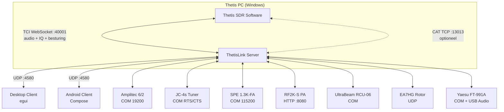

# ThetisLink v1.0.0 — Gebruikershandleiding

## Inhoudsopgave

1. [Overzicht](#overzicht)
2. [Server configuratie](#server-configuratie)
3. [Server starten](#server-starten)
4. [Client verbinden](#client-verbinden)
5. [Bediening](#bediening)
6. [Apparaten](#apparaten)
7. [Yaesu FT-991A](#yaesu-ft-991a)
8. [Diversity ontvangst](#diversity-ontvangst)
9. [DX Cluster](#dx-cluster)
10. [Macro's](#macros)
11. [Naamconventies](#naamconventies)

---

## Overzicht

ThetisLink is een remote bediening voor de ANAN 7000DLE SDR met Thetis. Het bestaat uit:

- **ThetisLink Server** — draait op de Thetis PC (Windows), bestuurt de radio via TCI
- **ThetisLink Client** — desktop client (Windows/macOS/Linux) met spectrum, waterval en volledige bediening
- **ThetisLink Android** — mobiele client app

De server communiceert met Thetis via TCI WebSocket voor zowel besturing als audio. Audio wordt via Opus codec over UDP verzonden met minimale latency.

### Thetis versie

ThetisLink is getest met en vereist **Thetis v2.10.3.13** (officiële release door ramdor). Dit is de basisversie: alle kernfunctionaliteit (audio, spectrum, PTT, TCI besturing) werkt volledig met ongewijzigde Thetis.

Optioneel is er de **PA3GHM Thetis fork** met ThetisLink-specifieke uitbreidingen. Deze uitbreidingen zitten achter de "ThetisLink extensions" checkbox in Thetis (Setup > Network > IQ Stream). Met de vink uit gedraagt Thetis zich identiek aan de originele release. ThetisLink detecteert automatisch of extensions beschikbaar zijn en schakelt over. Voordelen van de fork:

- Volledige TCI besturing zonder auxiliary CAT verbinding
- Extra TCI commando's voor NB2, DDC sample rate en extended IQ
- Push-notificaties vanuit Thetis naar ThetisLink clients

### Distributie

ThetisLink wordt gedistribueerd als een zip bestand met de volgende inhoud:

| Bestand | Beschrijving |
|---------|-------------|
| `ThetisLink-Server.exe` | Server executable (Windows) |
| `ThetisLink-Client.exe` | Desktop client executable |
| `ThetisLink-1.0.0.apk` | Android client app |
| `thetislink-server.conf` | Server configuratie (voorbeeld) |
| `thetislink-client.conf` | Client configuratie (voorbeeld) |
| `Installatie.pdf` | Installatiehandleiding (Nederlands) |
| `User-Manual.pdf` | Gebruikershandleiding (Nederlands, dit document) |
| `Technische-Referentie.pdf` | Technische referentie (Nederlands) |
| `Installation.pdf` | Installation guide (English) |
| `User-Manual-EN.pdf` | User manual (English) |
| `Technical-Reference.pdf` | Technical reference (English) |
| `LICENSE` | Licentie |

### Systeemvereisten

- **Server:** Windows 10/11, Thetis v2.10.3.13 of PA3GHM fork, ANAN 7000DLE (of compatibel)
- **Client:** Windows/macOS/Linux of Android 8+
- **Netwerk:** WiFi of LAN, UDP poort 4580

---

Deze handleiding gaat ervan uit dat ThetisLink is geinstalleerd en geconfigureerd volgens de **Installatiehandleiding** (`Installatie.md`). Daar vind je: installatie van server, desktop client en Android app, Thetis TCI/CAT configuratie, firewall-instellingen en netwerk/port forwarding.

---

### Architectuur 



Alle audio (RX/TX), IQ spectrum data en besturing gaan via de TCI WebSocket verbinding. De CAT verbinding is alleen nodig bij standaard Thetis (zonder PA3GHM fork). Geen VB-Cable of andere drivers nodig.

---


## Server configuratie

De basisverbinding met Thetis (TCI/CAT adressen, apparaat COM-poorten) wordt ingesteld tijdens de installatie — zie `Installatie.md`. Hieronder de geavanceerde configuratie-opties.

### DX Cluster

| Instelling | Voorbeeld | Beschrijving |
|---|---|---|
| `dxcluster_server` | `dxc.pi4cc.nl:8000` | DX cluster server adres |
| `dxcluster_callsign` | `PA3GHM` | Callsign voor cluster login |
| `dxcluster_enabled` | `true` | DX cluster aan/uit |
| `dxcluster_expiry_min` | `10` | Spot verlooptijd in minuten |

### Amplitec labels

```
amplitec_label1=JC-4s
amplitec_label2=A2
amplitec_label3=A3
amplitec_label4=A4
amplitec_label5=DummyL
amplitec_label6=UltraBeam
```

> **Belangrijk:** Zie [Naamconventies](#naamconventies) voor speciale integraties.

---

## Server starten

1. Start Thetis en schakel TCI in (Setup > CAT > TCI)
2. Start `ThetisLink-Server.exe`
3. Controleer de verbindingsinstellingen
4. Vink de gewenste apparaten aan
5. Klik **Start**
6. De server luistert op UDP poort 4580

### Server UI

De server toont:
- Verbindingsstatus (TCI/CAT)
- Actieve apparaat vensters (Tuner, Amplitec, SPE, RF2K, UltraBeam, Rotor, Yaesu)
- Macro knoppen (2 rijen van 12)
- Uptime en client info

---

## Client verbinden

1. Start de client
2. Voer het server IP-adres in (bijv. `192.168.1.79`)
3. Klik **Connect**

De client ontvangt automatisch:
- Real-time spectrum en waterval
- VFO frequentie, mode en filter
- S-meter waarden
- Apparaat status (Amplitec, UltraBeam, Yaesu, etc.)
- DX cluster spots

---

## Bediening

### VFO en frequentie

- **Frequentie display:** klik om direct een frequentie in te voeren
- **Stap knoppen:** +/- in stappen van 10 Hz, 100 Hz, 1 kHz, 10 kHz
- **Scroll wheel:** op het spectrum = 1 kHz stappen
- **Klik op spectrum:** tune naar die frequentie
- **Waterval klik (Android):** tune naar klik-positie

### Band geheugen

Per band wordt automatisch opgeslagen:
- Frequentie
- Mode (LSB/USB/CW/AM/FM/DIG)
- Filter breedte
- NR niveau

Bij bandwisseling worden deze automatisch hersteld. Daarnaast zijn er 5 vrije geheugenplaatsen (M1-M5).

### Mode

Selecteerbaar: LSB, USB, CW, AM, FM, DIG

### Filter

De filterbreedte is instelbaar met +/- knoppen. Presets zijn beschikbaar per mode:
- **CW:** 50, 100, 200, 500, 1000 Hz
- **SSB:** 1800, 2400, 2700, 3100, 3600 Hz
- **AM/FM:** 6000, 8000, 10000, 12000 Hz

### Volume

- **RX Volume:** ontvangstniveau (ZZLA commando)
- **TX Gain:** microfoon voorversterking
- **Drive:** zendvermogen 0-100%
- **Mic AGC:** automatische microfoon gain (aan/uit)

### Noise Reduction & Notch

- **NR:** cyclisch: UIT > NR1 > NR2 > NR3 > NR4
- **ANF:** Auto Notch Filter aan/uit

### PTT (Push-to-Talk)

ThetisLink biedt drie PTT modi:

- **Push-to-talk (spatiebalk):** houd de spatiebalk ingedrukt om te zenden, laat los om te stoppen
- **Toggle:** klik op de PTT-knop om te wisselen tussen zenden en ontvangen
- **MIDI PTT:** aparte MIDI PTT-modus via een toegewezen MIDI controller knop, onafhankelijk van de desktop PTT-modus

### Spectrum en waterval

- **Zoom:** verstelbaar, geeft nauwkeuriger frequentieweergave
- **Pan:** verschuif het zichtbare spectrum links/rechts (0 = gecentreerd op VFO)
- **Referentieniveau:** verschuif het dB bereik omhoog/omlaag
- **Auto Ref:** automatische referentieniveau-aanpassing op basis van ruisvloer
- **Contrast:** waterval helderheid per band (wordt onthouden)

#### TX spectrum override

Tijdens zenden (TX) wordt het spectrum automatisch aangepast voor goede weergave van het zendsignaal:
- **Referentieniveau:** wordt overschreven naar -30 dB
- **Bereik:** wordt overschreven naar 120 dB
- **Auto Ref:** wordt automatisch uitgeschakeld tijdens TX en de instelling wordt opgeslagen
- Na het loslaten van PTT worden de originele instellingen (inclusief Auto Ref) hersteld met een korte vertraging, zodat het spectrum stabiel terugkeert

### Popout vensters

De client ondersteunt losse vensters:
- **RX1 spectrum** — alleen RX1 spectrum + waterval met bediening
- **RX2 spectrum** — alleen RX2 spectrum + waterval met bediening
- **Joined** — RX1 en RX2 naast elkaar met gedeelde bediening

In popout vensters zijn beschikbaar:
- S-meter (bar of analoog naaldmeter, wisselbaar via toggle knop)
- Alle band/mode/filter/NR/ANF bediening
- VFO A<>B wisselknop (links-onder bij analoge naaldmeter)

### VFO B / RX2

Volledige tweede ontvanger ondersteuning:
- Onafhankelijke frequentie, mode, filter, S-meter
- Eigen spectrum en waterval
- VFO Sync: VFO B volgt automatisch VFO A
- A<>B: wissel VFO A en B

### WebSDR/KiwiSDR (Desktop)

Ingebouwde WebView voor WebSDR en KiwiSDR ontvangst:
- Frequentie synchronisatie: WebSDR volgt de VFO
- Automatisch muten tijdens zenden
- Favorietenlijst met ster-icoon

### MIDI Controller

Desktop en Android ondersteunen USB MIDI controllers:
- **Scan** knop zoekt beschikbare MIDI apparaten
- **Learn** modus: druk op een MIDI knop/slider, wijs een functie toe
- Beschikbare functies: PTT (met LED), VFO tune, volumes, drive, NR, ANF, mode, band, power
- Encoder stappen: 1 Hz, 10 Hz, 100 Hz, 1 kHz
- **MIDI PTT modus:** aparte PTT-modus voor MIDI, onafhankelijk van de spatiebalk PTT-modus

---

## Apparaten

### Amplitec 6/2 Antenne Schakelaar

Serieel USB verbinding (19200 baud). Toont:
- Huidige schakelstand poort A en B
- 6 antenne posities met configureerbare labels
- Schakel knoppen per poort

### JC-4s Automatische Tuner

Serieel USB verbinding. Functies:
- **Tune** knop: start afstemming
- **Abort** knop: breek afstemming af
- Status weergave: Tuning, Done, Timeout, Aborted
- Log venster (optioneel)

De tuner werkt samen met eindversterkers (SPE/RF2K) voor veilig tunen: de PA gaat automatisch naar standby tijdens het tunen.

> **Tuner knop zichtbaarheid:** De Tune-knop in het hoofdscherm is alleen zichtbaar als een Amplitec label het woord "JC-4s" (of "JC4s" of "Tuner") bevat. Zie [Naamconventies](#naamconventies).

### SPE Expert 1.3K-FA

Serieel USB verbinding. Toont:
- Vermogen, SWR, temperatuur
- Antenne selectie
- Operate/Standby status

### RF2K-S

TCP/IP verbinding (poort 8080). ThetisLink ondersteunt zowel de originele RF2K-S firmware als de aangepaste v190 firmware met uitgebreide drive control.

**Originele firmware — basisfunctionaliteit:**
- Band- en frequentie-uitlezing
- Operate/Standby schakelen
- Tuner bediening (mode, L/C waarden)
- Error status en antenne selectie
- Vermogen, SWR, temperatuur

**Aangepaste firmware (v190+) — extra functionaliteit:**
- Drive vermogen uitlezen en aanpassen (increment/decrement)
- Drive configuratie per band en modulatietype (SSB/AM/Continuous)
- Debug telemetrie (bias spanning, PSU spanning, uptime)
- Controller versie met hardware revisie

ThetisLink detecteert automatisch welke firmware actief is. Met de originele firmware werkt alles behalve drive-bediening.

De RF2K-S kan gereset worden via de server UI wanneer dat nodig is.

### UltraBeam RCU-06

Serieel USB verbinding (19200 baud). Functies:
- **Frequentie display** met band indicatie
- **Direction knoppen:** Normal, 180 graden, Bi-Dir
- **Frequentie stap knoppen:** -100, -50, -25, +25, +50, +100 kHz
- **Sync VFO:** stel de UltraBeam in op de huidige VFO frequentie (A of B, afhankelijk van Amplitec schakelstand)
- **Auto:** automatische frequentie-tracking van de actieve VFO
  - Minimale stap: 25 kHz (voorkomt overbelasting van de motoren)
  - VFO selectie wordt automatisch bepaald via de Amplitec (zie [Naamconventies](#naamconventies))
- **Band presets:** snelkeuze knoppen per band
- **Motor voortgang:** progressiebalk tijdens element verplaatsing
- **Retract:** trek alle elementen in (met bevestiging)
- **Element weergave:** actuele element lengtes in mm

### EA7HG Visual Rotor

UDP verbinding. Toont:
- Kompas cirkel met huidige richting
- Azimuth en elevatie
- Klik op kompas om te draaien
- Handmatige invoer voor doelrichting

---

## Yaesu FT-991A

ThetisLink kan een Yaesu FT-991A transceiver aansturen als tweede radio naast de ANAN. De Yaesu wordt verbonden via een serieel USB COM-poort.

### Functies

- **Frequentie:** uitlezen en instellen van de huidige frequentie
- **Mode:** uitlezen en instellen (LSB, USB, CW, AM, FM, DIG)
- **VFO A/B:** schakelen tussen VFO A en VFO B
- **Geheugenkanalen:** worden automatisch ingeladen bij het inschakelen van de Yaesu in de server. Kanalen met naam worden weergegeven in de UI
- **Menu editor:** Yaesu menu-instellingen uitlezen en wijzigen via de server UI
- **Audio:** de Yaesu USB audio wordt door de server gecaptured en via het AudioRx2 kanaal naar de client gestuurd, waar het gemixt wordt met het ANAN RX-signaal

### Configuratie

```
yaesu_port=COM5
yaesu_enabled=true
```

De Yaesu audio wordt automatisch afgespeeld op de client als het apparaat is ingeschakeld.

---

## Diversity ontvangst

ThetisLink ondersteunt diversity ontvangst via RX1 en RX2. Dit combineert twee antennes (bijvoorbeeld de ANAN op twee verschillende antenne-ingangen) voor verbeterde ontvangst.

### Gebruik

1. Schakel RX2 in via de client
2. Stel beide VFO's in op dezelfde frequentie (of gebruik VFO Sync)
3. De server stuurt onafhankelijke spectrum- en audiostreams voor RX1 en RX2
4. Gebruik de volume-regelaars om de balans tussen RX1 en RX2 in te stellen

Diversity werkt ook in combinatie met de popout vensters (Joined view) voor een overzichtelijke weergave van beide ontvangers.

### Smart en Ultra Auto-Null (Diversity)

Naast handmatige diversity-instelling biedt ThetisLink twee automatische null-algoritmen:

- **Smart:** voert een AVG sweep uit over 360° + 90° in stappen van 5° met settle-tijd per stap. Duurt circa 9 seconden. Betrouwbaar en nauwkeurig.
- **Ultra:** continue forward/backward sweep zonder settle-tijd, aanzienlijk sneller (circa 5 seconden). Geschikt als je snel een nulpunt wilt vinden.

Beide algoritmen zijn beschikbaar in de dropdown naast de **Auto Null** knop. Na afloop wordt het resultaat getoond in dB verbetering: groen betekent een goed nulpunt, oranje betekent weinig verschil met de uitgangssituatie.

Op Android is er een **Smart Null** knop die het resultaat in dB toont na afloop.

---

### Audio opname en afspelen

De client heeft een ingebouwde audio recorder en speler:

- **Record** knop in de Server tab met checkboxes voor **RX1**, **RX2** en **Yaesu** — selecteer welke audiokanalen je wilt opnemen
- Opnames worden opgeslagen als WAV bestanden (8 kHz, mono) naast de client executable, met een timestamp in de bestandsnaam
- **Play** knop speelt de laatste opname af:
  - **Zonder PTT:** het opgenomen geluid wordt via de speakers afgespeeld, gemixt met de ontvangst-audio
  - **Met PTT ingedrukt:** de opname vervangt de microfoon (TX inject) — handig om je eigen modulatie te testen of een CQ-bericht te herhalen
- **Stop** knop breekt het afspelen af. Aan het einde van de opname stopt het automatisch.

---

### Spectrum en waterval kleuren

Het spectrum en de waterval gebruiken een signaalniveau-afhankelijke kleurschaal:

- **Blauw** (zwak signaal) → **cyaan** → **geel** → **rood** → **wit** (sterk signaal)
- Zowel de spectrumlijn als de waterval gebruiken dezelfde kleurschaal
- De kleuren zijn identiek op desktop en Android

---

### Remote beheer

In de Server tab zit een **Remote Reboot / Shutdown** knop waarmee je de server-PC op afstand kunt herstarten of afsluiten:

- Na het klikken kies je tussen **herstart** of **afsluiten**
- Voor reboot is een `ThetisLinkReboot` scheduled task vereist op de server-PC (zie Installatie.md voor de configuratie)

---

### Audio modus (Mono/BIN/Split)

In de RX1 sectie zit een dropdown voor de audio-modus:

- **Mono:** RX1 en RX2 audio worden gemixt op beide oren (standaard)
- **BIN:** RX1 binaural audio op links en rechts + RX2 (vereist dat Thetis in BIN-modus staat)
- **Split:** RX1 op het linkeroor, RX2 op het rechteroor, met onafhankelijke volume-regelaars per kanaal

---

## DX Cluster

ThetisLink verbindt direct met een DX cluster server (telnet). Spots worden:
- Op het spectrum weergegeven als gekleurde stippellijnen met callsign labels
- Gefilterd op de band van VFO A en VFO B
- Automatisch verwijderd na de ingestelde verlooptijd

**Spot kleuren per mode:**
- CW: geel
- SSB/Phone: groen
- FT8/FT4/Digital: cyaan
- Overig: wit

Spots worden ook naar Thetis doorgestuurd via TCI `SPOT:` commando, zodat ze ook op het Thetis panorama verschijnen.

---

## Macro's

De server ondersteunt 24 programmeerbare macro knoppen in 2 rijen:
- **Rij 1:** F1 t/m F12 (typisch VFO A presets)
- **Rij 2:** ^F1 t/m ^F12 (typisch VFO B presets)

### Macro acties

Elke macro kan een reeks acties bevatten:
- **CAT commando:** bijv. `ZZFA00014292000;` (stel VFO A in op 14.292 MHz)
- **Delay:** bijv. `delay:200` (wacht 200ms)
- **Tune:** start de JC-4s tuner

### Macro configuratie

Macro's worden opgeslagen in `thetislink-macros.conf`:
```
macro_0_label=20m 14292
macro_0=ZZFA00014292000; ZZMD01;
```

### Veelgebruikte CAT commando's

| Commando | Beschrijving |
|---|---|
| `ZZFA00014292000;` | VFO A naar 14.292 MHz |
| `ZZFB00007073000;` | VFO B naar 7.073 MHz |
| `ZZMD00;` | VFO A mode naar CW |
| `ZZMD01;` | VFO A mode naar LSB |
| `ZZME00;` | VFO B mode naar CW |
| `ZZME01;` | VFO B mode naar LSB |

> **Let op:** Gebruik `ZZFA`/`ZZMD` voor VFO A en `ZZFB`/`ZZME` voor VFO B. Een veelgemaakte fout is ZZMD gebruiken in VFO B macro's — dit wijzigt dan de mode van VFO A!

---

## Naamconventies

ThetisLink gebruikt de Amplitec antenne label namen voor automatische integraties tussen apparaten. Als de labelnamen niet kloppen gaat er niets stuk, maar werken bepaalde automatische functies niet.

### UltraBeam integratie

De Amplitec label voor de UltraBeam antenne-uitgang moet een van deze woorden bevatten (niet hoofdlettergevoelig):
- `UltraBeam`
- `Ultra Beam`
- `UB`

**Wat dit oplevert:**
- De **Sync VFO** knop en **Auto** tracking in het UltraBeam panel kiezen automatisch de juiste VFO:
  - Als Amplitec poort **B** op de UltraBeam positie staat -> volgt **VFO B**
  - Als Amplitec poort **A** op de UltraBeam positie staat -> volgt **VFO A**
  - Geen match -> default **VFO A**

### JC-4s Tuner integratie

De Amplitec label voor de JC-4s tuner uitgang moet bevatten:
- `JC-4s`
- `JC4s`
- `Tuner`

**Wat dit oplevert:**
- De **Tune** knop in het hoofdscherm is alleen zichtbaar als een Amplitec label een van deze woorden bevat
- Automatische antenna selection voor safe tune

**Voorbeeld configuratie:**
```
amplitec_label1=JC-4s
amplitec_label2=Dipole
amplitec_label3=Vertical
amplitec_label4=Beverage
amplitec_label5=DummyLoad
amplitec_label6=UltraBeam
```

In dit voorbeeld staat de JC-4s tuner op positie 1 en de UltraBeam op positie 6. Als je de Amplitec poort B schakelt naar positie 6, volgt de UltraBeam automatisch VFO B.

---

## Probleemoplossing

Voor verbindings- en installatieproblemen (server start niet, client kan niet verbinden, firewall, COM-poorten, wachtwoord en 2FA), zie `Installatie.md`.

### Audio hakkelt

Hoge loss% (zichtbaar onderaan de client) duidt op een netwerkprobleem. Probeer een bedrade verbinding in plaats van WiFi. Op mobiel (4G/5G) past de jitter buffer zich automatisch aan, maar bij hoge packet loss blijft audio haperen.

### BT headset niet herkend (Android)

Koppel de headset opnieuw via Android Bluetooth-instellingen en herstart de ThetisLink app.

### UltraBeam timeout bij snel stappen

De UltraBeam RCU-06 heeft een beperkte serieel commando snelheid. Bij snel achter elkaar drukken op stap-knoppen worden tussenliggende commando's overgeslagen en alleen het laatste verzonden. Dit is normaal gedrag en voorkomt overbelasting.

### Spectrum en waterval lopen niet synchroon

Als het spectrum (lijn) en de waterval niet synchroon lopen bij het pannen, controleer de client versie. Dit is opgelost in v0.4.2+.

---

## Versiegeschiedenis

| Versie | Hoogtepunten |
|---|---|
| 0.5.0 | Yaesu FT-991A ondersteuning, Bluetooth headset (Android), diversity ontvangst fix, TCI besturingselementen, RF2K-S reset, PTT modi, DX Cluster |
| 0.4.9 | Wideband Opus TX, device switch fix |
| 0.4.2 | Configureerbaar FFT formaat, dynamische spectrum bins, Android power knop fix |
| 0.4.1 | WebSDR/KiwiSDR integratie, frequentie sync, TX spectrum auto-override |
| 0.4.0 | TCI WebSocket, waterval click-to-tune Android |
| 0.3.2 | MIDI controller ondersteuning, PTT toggle met LED, Mic AGC |
| 0.3.1 | Band geheugen, FM filter fix, macOS client |
| 0.3.0 | Volledige RX2/VFO-B ondersteuning, DDC spectrum+waterval |


