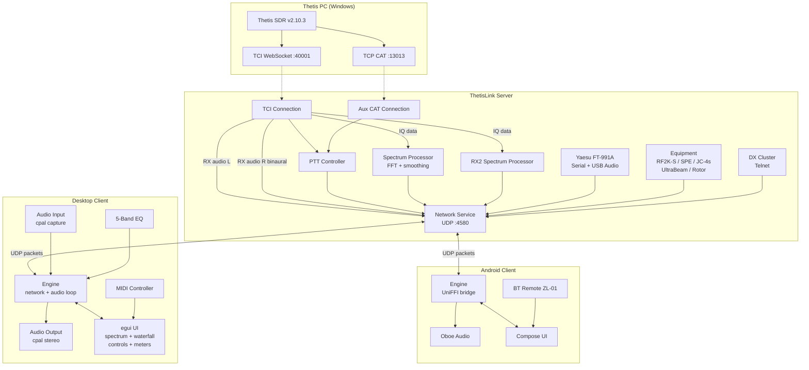
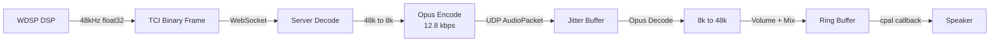
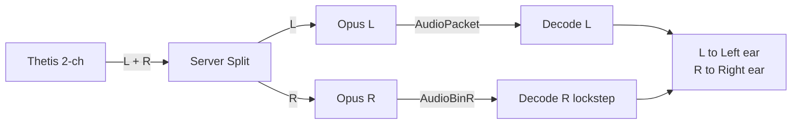
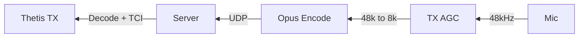
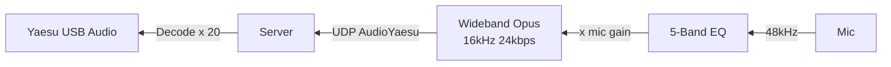
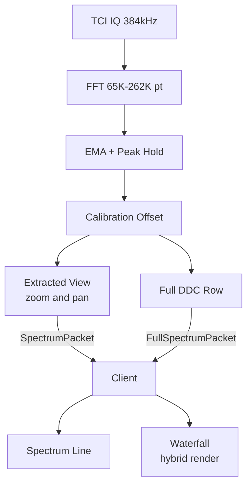
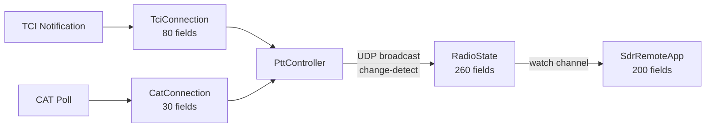
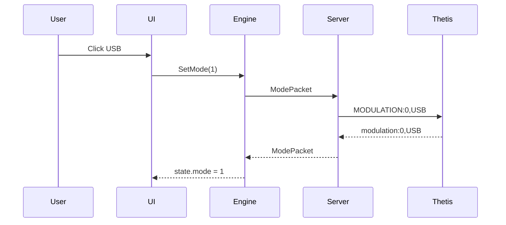

# ThetisLink Architecture

## System Overview



## Audio Data Flow

### RX Audio (Thetis to Client)


### Binaural Stereo (BIN mode)


### TX Audio (Client to Thetis)


### Yaesu TX Audio


## Spectrum Pipeline


## State Flow


## Control Command Sequence


## Crate Structure

```
sdr-remote/
  sdr-remote-core/        (2,634 lines)
    protocol.rs            Packets, ControlId, PacketType
    codec.rs               Opus encoder/decoder
    jitter.rs              Jitter buffer
    auth.rs                HMAC-SHA256 auth

  sdr-remote-logic/        (3,198 lines)
    engine.rs              Network loop + audio pipeline
    commands.rs            Command enum (UI to Engine)
    state.rs               RadioState (Engine to UI)
    eq.rs                  5-band parametric EQ
    audio.rs               AudioBackend trait

  sdr-remote-server/       (17,641 lines)
    network.rs             UDP service + broadcast + dispatch
    tci.rs                 TCI WebSocket + state + parser
    spectrum.rs            FFT + smoothing + calibration
    ptt.rs                 PTT controller + radio backend
    cat.rs                 TCP CAT polling
    yaesu.rs               FT-991A serial + audio
    rotor.rs               EA7HG Visual Rotor
    main.rs                Server startup + config

  sdr-remote-client/       (11,761 lines)
    ui/mod.rs              App state (200 fields) + rendering
    ui/screens.rs          TCI controls + MIDI
    ui/spectrum.rs         Spectrum + waterfall
    ui/devices.rs          Equipment panels + Yaesu popout
    ui/meters.rs           S-meter + TX power bars
    ui/helpers.rs          Level bars, formatting
    audio.rs               cpal audio + stereo ring buffer
    midi.rs                MIDI controller (48 actions)
    main.rs                App entry point

  sdr-remote-android/      (Kotlin + Rust bridge)
    src/bridge.rs          UniFFI bridge
    android/               Compose UI
```

## Refactoring Priorities

| # | Task | Effort | Impact |
|---|------|--------|--------|
| 1 | Extract audio loops to audio_loops.rs, unify 3 identical TCI loops | Low | High |
| 2 | Split broadcast task (700 lines) to broadcast.rs | Medium | High |
| 3 | Collapse RX1/RX2 into ReceiverState[2] | High | High |
| 4 | Replace manual from_u8 with num_enum derive | Low | Medium |
| 5 | Break up SdrRemoteApp (200 fields) into sub-structs | High | High |
| 6 | Extract control dispatch to control_dispatch.rs | Low | Medium |
| 7 | Shared utils (freq mapping, dB conversion, resampler params) | Low | Medium |
