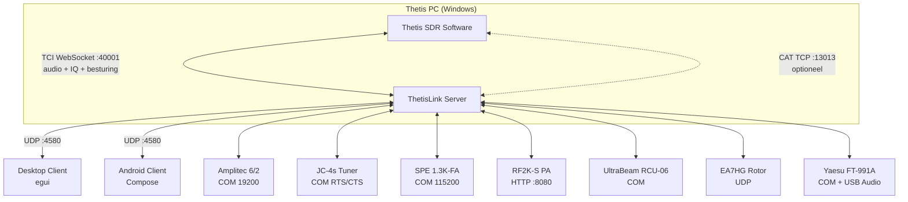
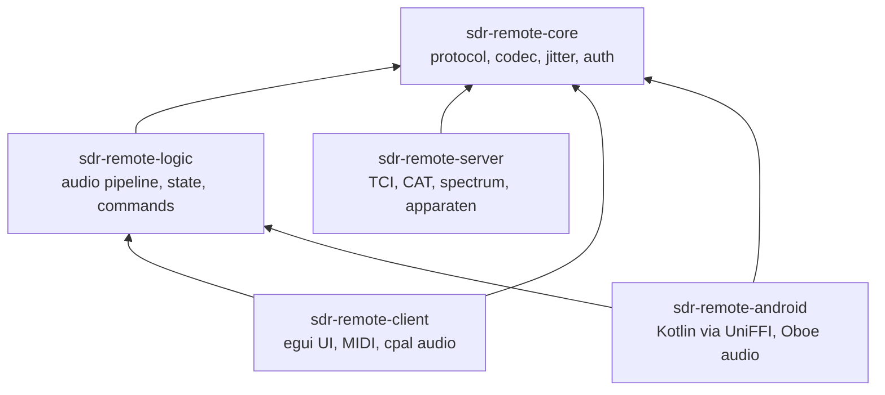
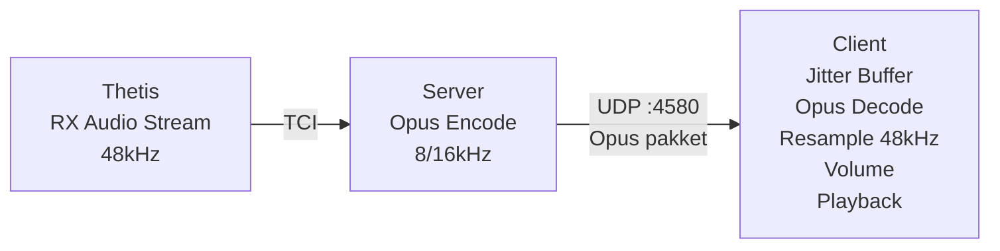
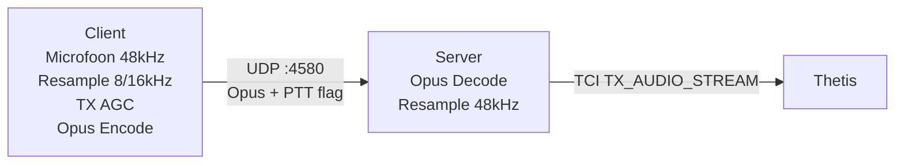
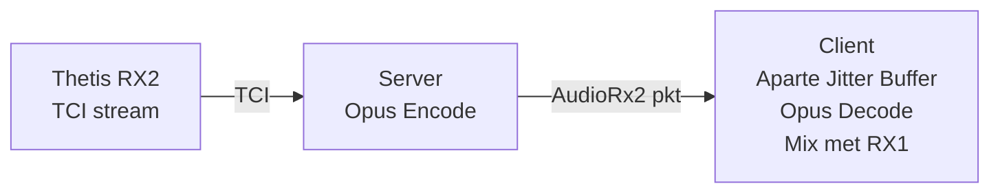
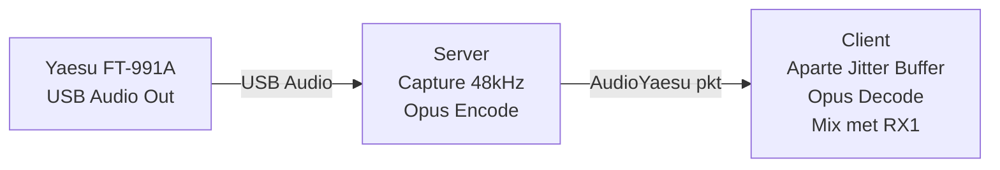
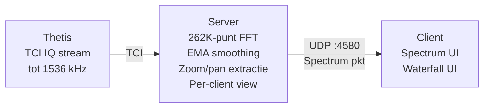

<!-- ThetisLink v0.6.8 -->
# ThetisLink Architectuur

## Overzicht

ThetisLink is een remote besturingssysteem voor de ANAN 7000DLE SDR met Thetis software. Het systeem bestaat uit een Windows-server (draait naast Thetis), en meerdere clients (Windows desktop, Android).

**Ontwerpprioriteit:** latency > bandbreedte > features



## Verbinding met Thetis

De server verbindt met Thetis via TCI WebSocket. Alles gaat via dit ene kanaal:

1. **TCI WebSocket** (`ws://...:40001`) -- het enige vereiste kanaal:
   - RX audio streams (RX_AUDIO_STREAM)
   - TX audio streams (TX_AUDIO_STREAM)
   - IQ data voor spectrum/waterfall (tot 1536 kHz met PA3GHM fork)
   - Radio control (frequentie, modus, volume, filters, etc.)
   - Push-notificaties bij state changes (met PA3GHM fork)
2. **CAT TCP** (`...:13013`) -- optioneel, alleen bij standaard Thetis (zonder PA3GHM fork) voor commando's die TCI niet ondersteunt (TX profiles, sommige toggles)

Geen VB-Cable, DDC sniffer of andere drivers nodig. De TCI verbinding vervangt alle eerdere audio- en IQ-routeringen.

## Rust Workspace Structuur



| Crate | Doel | Belangrijkste Dependencies |
|-------|------|---------------------------|
| `sdr-remote-core` | Gedeelde library: protocol, codec, jitter buffer, auth | audiopus, anyhow, bytemuck |
| `sdr-remote-logic` | Client engine: audio pipeline, state, commands | tokio, core, rubato, ringbuf, cpal |
| `sdr-remote-server` | Windows server: TCI, CAT, spectrum, apparaten | tokio, core, eframe/egui, serialport |
| `sdr-remote-client` | Desktop client: egui UI, MIDI | tokio, core, logic, eframe/egui |
| `sdr-remote-android` | Android FFI bridge naar Kotlin/Compose UI | core, logic |

## Audio Routing

### RX Pad (Server naar Client)



### TX Pad (Client naar Server)



### RX2 / VFO-B (apart audio kanaal)



### Yaesu FT-991A (apart audio kanaal)



### Multi-channel mixing (Client)

De client mixt tot drie onafhankelijke audiokanalen (RX1, RX2, Yaesu) naar een stereo output. De audio-modus bepaalt de spatialisatie:

- **Mono:** alle kanalen gemixt op beide oren
- **BIN:** RX1 binaural links/rechts + RX2 (vereist Thetis BIN-modus)
- **Split:** RX1 op links, RX2 op rechts met onafhankelijke volumes

Elk kanaal heeft een eigen jitter buffer en Opus decoder. De volumes (rx, vfoA, vfoB, master) worden per-sample toegepast voor glitch-vrij overschakelen.

## Spectrum Pipeline



Dual channel: RX1 + RX2 onafhankelijk spectrum/waterfall. IQ sample rates: 48, 96, 192, 384, 768, 1536 kHz (PA3GHM fork).

## Protocol

### UDP Pakketformaat

Alle pakketten beginnen met een 4-byte header:

```
+--------+---------+------+-------+
| magic  | version | type | flags |
| 0xAA   | 0x01    | u8   | u8    |
+--------+---------+------+-------+
  byte 0   byte 1   byte 2 byte 3
```

### Pakkettypen

| Type | ID | Richting | Grootte | Beschrijving |
|------|----|----------|---------|--------------|
| Audio | 0x01 | S->C / C->S | 14+N | RX1 audio (Opus gecodeerd) |
| Heartbeat | 0x02 | C->S | 20 | Keep-alive + capabilities |
| HeartbeatAck | 0x03 | S->C | 16 | RTT meting + server capabilities |
| Control | 0x04 | Beide | 7 | Besturingsopdracht (id + waarde) |
| Disconnect | 0x05 | C->S | 4 | Verbreek verbinding |
| PttDenied | 0x06 | S->C | 4 | PTT geweigerd (andere zender actief) |
| Frequency | 0x07 | Beide | 12 | VFO-A frequentie (u64 Hz) |
| Mode | 0x08 | Beide | 5 | VFO-A modus (u8) |
| Smeter | 0x09 | S->C | 6 | S-meter niveau (u16, 0-260) |
| Spectrum | 0x0A | S->C | 18+N | Spectrum bins (per-client view) |
| FullSpectrum | 0x0B | S->C | 18+N | Waterfall data (volledige DDC) |
| EquipmentStatus | 0x0C | S->C | Variabel | Apparaatstatus (CSV gecodeerd) |
| EquipmentCommand | 0x0D | C->S | Variabel | Apparaatopdracht |
| AudioRx2 | 0x0E | S->C | 14+N | RX2 audio (apart kanaal) |
| FrequencyRx2 | 0x0F | Beide | 12 | VFO-B frequentie |
| ModeRx2 | 0x10 | Beide | 5 | VFO-B modus |
| SmeterRx2 | 0x11 | S->C | 6 | RX2 S-meter |
| SpectrumRx2 | 0x12 | S->C | 18+N | RX2 spectrum |
| FullSpectrumRx2 | 0x13 | S->C | 18+N | RX2 waterfall |

### Capabilities (u32 bitmask in Heartbeat)

| Bit | Naam | Beschrijving |
|-----|------|--------------|
| 0 | WIDEBAND_AUDIO | Client ondersteunt 16kHz Opus |
| 1 | SPECTRUM | Client wil spectrum/waterfall data |
| 2 | RX2 | Client ondersteunt dual receiver |

### Control IDs

| ID | Naam | Bereik | Beschrijving |
|----|------|--------|--------------|
| PowerOnOff | u16 | 0/1/2 | Aan/uit, 2=shutdown (ZZBY) |
| TxProfile | u16 | 0-99 | TX profiel nummer |
| NoiseReduction | u16 | 0-4 | 0=uit, 1-4=NR niveau |
| AutoNotchFilter | u16 | 0/1 | ANF aan/uit |
| DriveLevel | u16 | 0-100 | TX drive |
| Rx1AfGain | u16 | 0-100 | Thetis RX1 volume (ZZLA) |
| Rx2AfGain | u16 | 0-100 | Thetis RX2 volume (ZZLE) |
| FilterLow | i16 | Hz | Filter ondergrens |
| FilterHigh | i16 | Hz | Filter bovengrens |
| SpectrumEnable | u16 | 0/1 | Spectrum aan/uit |
| SpectrumFps | u16 | 5-30 | Spectrum framerate |
| SpectrumZoom | u16 | 1-1024 | Spectrum zoom factor |
| SpectrumPan | i16 | -500..500 | Spectrum pan (promille) |
| Rx2Enable | u16 | 0/1 | RX2 aan/uit |
| VfoSync | u16 | 0/1 | VFO-B volgt VFO-A |
| Rx2Spectrum* | | | Zelfde set voor RX2 |
| Rx2NoiseReduction | u16 | 0-4 | RX2 NR niveau |
| Rx2AutoNotchFilter | u16 | 0/1 | RX2 ANF |

## Thetis CAT Commando's

De server pollt Thetis via TCP CAT (poort 13013) als aanvulling op TCI:

### Polling (elke 200ms tenzij anders)

| Commando | Interval | Beschrijving |
|----------|----------|--------------|
| ZZFA; | 200ms | RX1 frequentie uitlezen |
| ZZFB; | 200ms | RX2 frequentie uitlezen |
| ZZMD; | 200ms | RX1 modus |
| ZZME; | 200ms | RX2 modus |
| ZZLA; | 200ms | RX1 AF gain |
| ZZLE; | 200ms | RX2 AF gain |
| ZZPC; | 200ms | TX drive level |
| ZZSM0; | 100ms | RX1 S-meter (peak, 0-260) |
| ZZSM1; | 100ms | RX2 S-meter (peak, 0-260) |
| ZZRM5; | 100ms | Forward power (alleen tijdens TX) |
| ZZNE; | 200ms | Noise reduction niveau |
| ZZNT; | 200ms | Auto-notch filter |

### Aanstuurcommando's

| Commando | Beschrijving |
|----------|--------------|
| ZZFA{freq}; | Stel RX1 frequentie in |
| ZZFB{freq}; | Stel RX2 frequentie in |
| ZZMD{mode}; | Stel RX1 modus in |
| ZZME{mode}; | Stel RX2 modus in |
| ZZTX1; / ZZTX0; | PTT aan/uit |
| ZZTP{N}; | TX profiel selecteren |
| ZZNE{N}; | Noise reduction instellen |
| ZZNT{0/1}; | Auto-notch filter |
| ZZPC{N}; | Drive level instellen |
| ZZLA{N}; | RX1 AF gain instellen |
| ZZLE{N}; | RX2 AF gain instellen |
| ZZBY; | Thetis afsluiten (shutdown) |
| ZZFD{low},{high}; | RX1 filter instellen |
| ZZFS{low},{high}; | RX2 filter instellen |

## Externe Apparaten

```
                    ThetisLink Server
                          |
          +-------+-------+-------+-------+-------+-------+
          |       |       |       |       |       |       |
          v       v       v       v       v       v       v
     Amplitec  JC-4s    SPE    RF2K-S  Ultra-  EA7HG   Yaesu
      6/2     Tuner   1.3K-FA   PA    Beam    Rotor  FT-991A
       |       |       |       |      RCU-06    |       |
      COM     COM     COM     HTTP    COM      UDP     COM
     19200   RTS/CTS 115200  :8080   binary           ASCII
     binary   only   binary  REST   STX/ETX           CAT
```

| Apparaat | Interface | Protocol | Functies |
|----------|-----------|----------|----------|
| Amplitec 6/2 | COM, 19200 baud | Binair | 2x 6-positie antenneschakelaar |
| JC-4s Tuner | COM, RTS/CTS | Alleen lijnen | Tune/abort, status polling |
| SPE Expert 1.3K-FA | COM, 115200 baud | Binair | Operate/tune, telemetrie (power, SWR, temp) |
| RF2K-S | HTTP :8080 | REST | Operate/tune, antenne, tuner, drive, debug |
| UltraBeam RCU-06 | COM | Binair STX/ETX | Retract, frequentie, elementen uitlezen |
| EA7HG Visual Rotor | UDP | Socket | Goto/stop/CW/CCW, hoek uitlezen |
| Yaesu FT-991A | COM | ASCII CAT | Frequentie, modus, PTT, USB audio |

## Multi-Client Architectuur

```
  Client A (Desktop)           Server              Thetis
  ==================     ==================     ==========

  Heartbeat (SPECTRUM|RX2) -->
                          <-- HeartbeatAck

                 Client B (Android)
                 ==================

                 Heartbeat (SPECTRUM) -->
                                     <-- HeartbeatAck

  [Beide clients ontvangen data op basis van hun capabilities]

                          --> Audio + Spectrum + RX2 Audio --> Client A
                          --> Audio + Spectrum             --> Client B

  [Client A drukt PTT]
  Audio + PTT=1 --------->
                          ---> ZZTX1; ---> Thetis
                          [Client A heeft TX lock]

  [Client B probeert PTT]
                 Audio + PTT=1 -->
                               <-- PttDenied
                               [PTT geweigerd]

  [Client A laat PTT los]
  Audio + PTT=0 --------->
                          ---> ZZTX0; ---> Thetis
                          [TX lock vrijgegeven]
```

Meerdere clients kunnen tegelijk verbinden. PTT-arbitratie: de eerste client die TX aanvraagt krijgt de lock, andere clients krijgen een PttDenied pakket. Optioneel HMAC-SHA256 authenticatie.

## Configuratie

### Server (thetislink-server.conf)

JSON-bestand naast de executable met:
- TCI WebSocket adres (standaard ws://127.0.0.1:40001)
- CAT adres (standaard 127.0.0.1:13013)
- Spectrum instellingen
- Thetis.exe pad (autostart)
- COM poorten per apparaat
- RF2K netwerkadres
- Window posities/groottes
- Actieve PA selectie

### Client (thetislink-client.conf)

JSON-bestand naast de executable met:
- Server adres
- Audio devices (input/output)
- Volumes (rx, vfoA, vfoB, master, tx gain)
- Window posities/groottes
- Spectrum instellingen
- Band geheugens (freq/mode/filter/NR per band)

## Server: Two-Phase Connect Pattern

De server gebruikt een two-phase connect pattern voor TCI- en CAT-verbindingen. Verbindingsopbouw (TCP connect, WebSocket handshake) vindt plaats **buiten** de ptt-lock, zodat de hoofdpakketloop niet geblokkeerd wordt door trage of falende connects.

1. **Fase 1 -- Connect (zonder lock):** De TCI/CAT verbinding wordt opgezet in een aparte scope, zonder de ptt mutex vast te houden. Dit voorkomt dat een trage DNS-lookup, TCP timeout of WebSocket handshake de hele pakketverwerking blokkeert.
2. **Fase 2 -- Registreer (met lock):** Pas nadat de verbinding succesvol is, wordt de ptt mutex kort vergrendeld om de verbinding te registreren in de gedeelde state.

Dit patroon is essentieel omdat de pakketloop ook PTT-events verwerkt -- een blokkerende connect zou de PTT-latency onacceptabel verhogen.

## Power State Flow

De `Engine` (in `sdr-remote-logic`) is de **single source of truth** voor de `power_on` state. Het verloop:

1. Client stuurt een PowerOnOff control pakket naar de server.
2. De server voert het CAT/TCI commando uit (bijv. `ZZPS1;` of TCI `start`).
3. De engine publiceert de nieuwe power state **onmiddellijk** naar de UI, zonder te wachten op bevestiging van de server.
4. Om te voorkomen dat een verouderde server-broadcast de lokale state overschrijft, onderdrukt de engine inkomende power-updates van de server gedurende **5 seconden** na het versturen van een power commando.
5. Na de suppressieperiode synchroniseert de engine weer normaal met de server-state.

Zowel de desktop client als de Android client gebruiken exact hetzelfde mechanisme via de gedeelde `Engine` in `sdr-remote-logic`.

## TCI: Lock Contention Fix

In de TCI consumer tasks (die TCI WebSocket berichten verwerken) werd de mutex te lang vastgehouden: de lock bleef actief **over een sleep heen**. Dit veroorzaakte lock contention met de hoofdloop, waardoor commando-responstijden opliepen tot ~600ms.

**Fix:** De mutex wordt nu gedropt **voor** de sleep. Hierdoor daalde de commando-responstijd van ~600ms naar <1ms. Patroon:

```rust
// Fout: lock over sleep heen
let guard = mutex.lock().await;
// ... verwerk data ...
tokio::time::sleep(interval).await; // guard nog actief!

// Goed: drop voor sleep
{
    let guard = mutex.lock().await;
    // ... verwerk data ...
} // guard gedropt
tokio::time::sleep(interval).await;
```
