# ThetisLink v0.5.0 Implementation

Detailed description of the implementation per module, including data flows and algorithms.

## sdr-remote-core

### protocol.rs — Packet Definitions (~900 LOC)

All packet types as Rust structs with `serialize()` / `deserialize()` methods.

**Wire format example — AudioPacket:**
```
Offset  Bytes  Field
0       1      magic (0xAA)
1       1      version (0x01)
2       1      packet_type (0x01)
3       1      flags (bit 0 = PTT)
4       4      sequence (u32 LE)
8       4      timestamp (u32 LE, ms)
12      2      opus_len (u16 LE)
14      N      opus_data
```

#### PacketType enum (0x01–0x32)

| ID | Name | Direction | Description |
|----|------|-----------|-------------|
| 0x01 | Audio | bidi | RX1 audio (Opus narrowband/wideband) |
| 0x02 | Heartbeat | client→server | Heartbeat with timestamp |
| 0x03 | HeartbeatAck | server→client | Echo for RTT measurement |
| 0x04 | Control | bidi | ControlId + u16 value |
| 0x05 | Disconnect | client→server | Disconnect |
| 0x06 | PttDenied | server→client | TX denied (another client is transmitting) |
| 0x07 | Frequency | bidi | VFO-A frequency (u64 Hz) |
| 0x08 | Mode | bidi | Operating mode (u8) |
| 0x09 | Smeter | server→client | RX1 S-meter (u16 raw) |
| 0x0A | Spectrum | server→client | Spectrum view (zoom/pan) |
| 0x0B | FullSpectrum | server→client | Full DDC spectrum (waterfall) |
| 0x0C | EquipmentStatus | server→client | Equipment status (CSV labels) |
| 0x0D | EquipmentCommand | client→server | Equipment command |
| 0x0E | AudioRx2 | server→client | RX2 audio (same format as Audio) |
| 0x0F | FrequencyRx2 | bidi | VFO-B frequency |
| 0x10 | ModeRx2 | bidi | RX2 mode |
| 0x11 | SmeterRx2 | server→client | RX2 S-meter |
| 0x12 | SpectrumRx2 | server→client | RX2 spectrum view |
| 0x13 | FullSpectrumRx2 | server→client | RX2 full DDC spectrum |
| 0x14 | Spot | server→client | DX cluster spot |
| 0x15 | TxProfiles | server→client | TX profile names |
| 0x16 | AudioYaesu | server→client | Yaesu audio (same format as Audio) |
| 0x17 | YaesuState | server→client | Yaesu radio state |
| 0x18 | FrequencyYaesu | client→server | Yaesu frequency set |
| 0x19 | YaesuMemoryData | server→client | Yaesu memory data (tab-separated) |
| 0x30 | AuthChallenge | server→client | 16-byte nonce |
| 0x31 | AuthResponse | client→server | 32-byte HMAC |
| 0x32 | AuthResult | server→client | 0=rejected, 1=accepted |

#### ControlId enum (0x01–0x46)

Each Control packet contains a ControlId (u8) and a value (u16). Bidirectional: server sends current Thetis values, client sends changes.

**Thetis basics (0x01–0x0D):**

| ID | Name | Value | TCI/CAT |
|----|------|-------|---------|
| 0x01 | Rx1AfGain | 0-100 | ZZLA |
| 0x02 | PowerOnOff | 0/1 | ZZPS |
| 0x03 | TxProfile | 0-99 | ZZTP |
| 0x04 | NoiseReduction | 0-4 (0=off, 1-4=NR1-NR4) | ZZNE |
| 0x05 | AutoNotchFilter | 0/1 | ZZNT |
| 0x06 | DriveLevel | 0-100 | ZZPC |
| 0x07 | SpectrumEnable | 0/1 | — |
| 0x08 | SpectrumFps | 5-30 | — |
| 0x09 | SpectrumZoom | zoom x10 (10=1x, 10240=1024x) | — |
| 0x0A | SpectrumPan | (pan+0.5) x10000 (5000=center) | — |
| 0x0B | FilterLow | Hz offset (i16 as u16) | — |
| 0x0C | FilterHigh | Hz offset (i16 as u16) | — |
| 0x0D | ThetisStarting | 0/1 | — |

**RX2 / VFO-B (0x0E–0x1B):**

| ID | Name | Value | TCI/CAT |
|----|------|-------|---------|
| 0x0E | Rx2Enable | 0/1 | — |
| 0x0F | Rx2AfGain | 0-100 | ZZLB |
| 0x10 | Rx2SpectrumZoom | same as SpectrumZoom | — |
| 0x11 | Rx2SpectrumPan | same as SpectrumPan | — |
| 0x12 | Rx2FilterLow | Hz offset (i16 as u16) | — |
| 0x13 | Rx2FilterHigh | Hz offset (i16 as u16) | — |
| 0x14 | VfoSync | 0/1 (VFO-B follows VFO-A) | — |
| 0x15 | Rx2SpectrumEnable | 0/1 | — |
| 0x16 | Rx2SpectrumFps | 5-30 | — |
| 0x17 | Rx2NoiseReduction | 0-4 | — |
| 0x18 | Rx2AutoNotchFilter | 0/1 | — |
| 0x19 | VfoSwap | write-only trigger (ZZVS2) | — |
| 0x1A | SpectrumMaxBins | max bins/packet (0=default) | — |
| 0x1B | Rx2SpectrumMaxBins | same as SpectrumMaxBins | — |

**Spectrum configuration (0x1C–0x1D):**

| ID | Name | Value |
|----|------|-------|
| 0x1C | SpectrumFftSize | size in K (32, 65, 131, 262) |
| 0x1D | SpectrumBinDepth | 8=u8 bins, 16=u16 bins |

**Thetis extended (0x1E–0x1F):**

| ID | Name | Value | TCI/CAT |
|----|------|-------|---------|
| 0x1E | MonitorOn | 0/1 | ZZMO / TCI: MON_ENABLE |
| 0x1F | ThetisTune | 0/1 | ZZTU |

**Yaesu FT-991A (0x20–0x2F):**

| ID | Name | Value |
|----|------|-------|
| 0x20 | YaesuEnable | 0/1 (stream audio+state) |
| 0x21 | YaesuPtt | 0/1 |
| 0x22 | YaesuFreq | (via FrequencyPacket) |
| 0x23 | YaesuMicGain | gain x10 (200=20.0x) |
| 0x24 | YaesuMode | internal mode number |
| 0x25 | YaesuReadMemories | trigger |
| 0x26 | YaesuRecallMemory | channel 1-99 |
| 0x27 | YaesuWriteMemories | trigger |
| 0x28 | YaesuSelectVfo | 0=A, 1=B, 2=swap |
| 0x29 | YaesuSquelch | 0-255 |
| 0x2A | YaesuRfGain | 0-255 |
| 0x2B | YaesuRadioMicGain | 0-100 (radio mic gain) |
| 0x2C | YaesuRfPower | 0-100 |
| 0x2D | YaesuButton | button ID |
| 0x2E | YaesuReadMenus | trigger |
| 0x2F | YaesuSetMenu | menu number (P2 in separate packet) |

**TCI controls (0x30–0x3C):**

| ID | Name | Value | TCI |
|----|------|-------|-----|
| 0x30 | AgcMode | 0=off, 1=long, 2=slow, 3=med, 4=fast, 5=custom | agc_mode |
| 0x31 | AgcGain | 0-120 | agc_gain |
| 0x32 | RitEnable | 0/1 | rit_enable |
| 0x33 | RitOffset | Hz (i16 as u16) | rit_offset |
| 0x34 | XitEnable | 0/1 | xit_enable |
| 0x35 | XitOffset | Hz (i16 as u16) | xit_offset |
| 0x36 | SqlEnable | 0/1 | sql_enable |
| 0x37 | SqlLevel | 0-160 | sql_level |
| 0x38 | NoiseBlanker | 0/1 | rx_nb_enable |
| 0x39 | CwKeyerSpeed | 1-60 WPM | cw_keyer_speed |
| 0x3A | VfoLock | 0/1 | vfo_lock |
| 0x3B | Binaural | 0/1 | rx_bin_enable |
| 0x3C | ApfEnable | 0/1 | rx_apf_enable |

**Diversity (0x40–0x46):**

| ID | Name | Value |
|----|------|-------|
| 0x40 | DiversityEnable | 0/1 |
| 0x41 | DiversityRef | 0=RX2, 1=RX1 |
| 0x42 | DiversitySource | 0=RX1+RX2, 1=RX1, 2=RX2 |
| 0x43 | DiversityGainRx1 | gain x1000 (2500=2.500) |
| 0x44 | DiversityGainRx2 | gain x1000 (2500=2.500) |
| 0x45 | DiversityPhase | phase x100 + 18000 (18000=0 degrees) |
| 0x46 | DiversityRead | trigger (read state from Thetis) |

**EquipmentStatus/Command:** Variable length, CSV-encoded telemetry in a `labels` string field. Each equipment type has its own CSV layout.

### codec.rs — Opus Audio Codec (~230 LOC)

Two codec configurations: narrowband for RX/TX audio and wideband for Thetis TX and Yaesu audio.

| Parameter | Narrowband | Wideband |
|-----------|-----------|----------|
| Sample rate | 8 kHz | 16 kHz |
| Bitrate | 12.8 kbps | 24 kbps |
| Frame size | 160 samples (20ms) | 320 samples (20ms) |
| Bandwidth | Narrowband | Wideband |
| FEC | Inband, 10% loss | Inband, 10% loss |
| DTX | On | On |
| Signal type | Voice | Voice |

**Important:** Narrowband bitrate 12.8 kbps is just above the Opus FEC threshold (12.4 kbps). This guarantees that Forward Error Correction is always included.

**Classes:**
- `OpusEncoder` / `OpusDecoder` — 8 kHz narrowband (RX1/RX2 audio)
- `OpusEncoderWideband` / `OpusDecoderWideband` — 16 kHz wideband (Thetis TX, Yaesu audio)

**Decode methods (OpusDecoder):**
- `decode(opus_data)` — normal decode, returns 160 i16 samples
- `decode_fec(next_opus_data)` — FEC recovery using data from the *next* packet
- `decode_plc()` — Packet Loss Concealment (comfort noise/interpolation) when no data is available

**Constants (lib.rs):**
- `NETWORK_SAMPLE_RATE` = 8000 Hz (narrowband)
- `NETWORK_SAMPLE_RATE_WIDEBAND` = 16000 Hz (wideband)
- `DEVICE_SAMPLE_RATE` = 48000 Hz (cpal/WASAPI/Oboe)
- `FRAME_DURATION_MS` = 20 ms
- `FRAME_SAMPLES` = 160 (8kHz x 20ms)
- `FRAME_SAMPLES_WIDEBAND` = 320 (16kHz x 20ms)

### jitter.rs — Adaptive Jitter Buffer (~350 LOC)

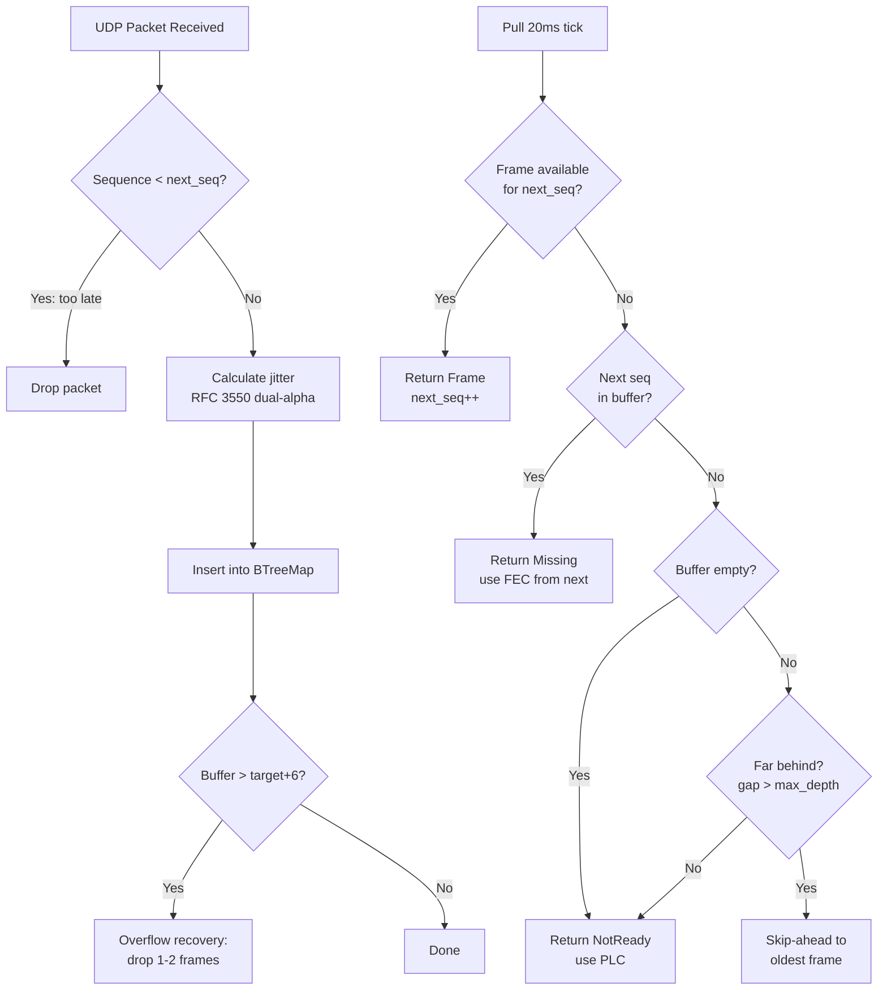

**Jitter estimation (RFC 3550 dual-alpha EMA):**
```
deviation = |expected_interval - actual_interval|

if deviation > current_estimate:
    jitter = jitter + 0.25 * (deviation - jitter)     # fast attack
else:
    jitter = jitter + 0.0625 * (deviation - jitter)   # slow decay
```

The dual-alpha approach (alpha=0.25 on increase, alpha=1/16 on decrease) ensures the buffer reacts quickly to degradation (jitter spikes) but shrinks slowly on improvement. This prevents the buffer from oscillating.

**Spike peak hold:** Peak value with exponential decay (~1 minute at 50 packets/sec, decay factor = 1 - 1/3000). Prevents the buffer from shrinking too quickly after a network spike.

**Target depth formula:**
```
target = max(jitter_estimate, spike_peak) / 15.0 + 2
clamped: 2..40 frames (40ms..800ms)
```

**Grace period:** First 25 pulls (500ms) after connection: no overflow recovery. Allows the buffer to stabilize.

**Underflow recovery:** When the buffer drains completely (`refilling = true`), playout pauses until the buffer refills to target depth. This prevents stuttering during brief network interruptions.

**JitterResult enum:**
- `Frame(BufferedFrame)` — normal frame available
- `Missing` — frame missing, caller uses FEC or PLC
- `NotReady` — buffer not yet filled or empty

## sdr-remote-logic

### commands.rs — Command Enum (~106 variants)

Commands are sent via `mpsc::UnboundedSender<Command>` from UI to engine.

| Group | Commands | Count |
|-------|---------|-------|
| Connection | `Connect(addr, password)`, `Disconnect` | 2 |
| Audio | `SetRxVolume`, `SetLocalVolume`, `SetVfoAVolume`, `SetVfoBVolume`, `SetTxGain`, `SetInputDevice`, `SetOutputDevice` | 7 |
| Radio | `SetPtt`, `SetFrequency`, `SetMode`, `SetControl`, `SetAgcEnabled` | 5 |
| Spectrum | `EnableSpectrum`, `SetSpectrumFps`, `SetSpectrumZoom`, `SetSpectrumPan`, `SetSpectrumMaxBins`, `SetSpectrumFftSize` | 6 |
| RX2/VFO-B | `SetRx2Enabled`, `SetVfoSync`, `SetFrequencyRx2`, `SetModeRx2`, `SetRx2Volume`, `EnableRx2Spectrum`, `SetRx2SpectrumFps`, `SetRx2SpectrumZoom`, `SetRx2SpectrumPan` | 9 |
| Thetis | `ThetisTune(bool)`, `SetMonitor(bool)` | 2 |
| Amplitec | `SetAmplitecSwitchA(u8)`, `SetAmplitecSwitchB(u8)` | 2 |
| Tuner | `TunerTune`, `TunerAbort` | 2 |
| SPE Expert | `SpeOperate`, `SpeTune`, `SpeAntenna`, `SpeInput`, `SpePower`, `SpeBandUp`, `SpeBandDown`, `SpeOff`, `SpePowerOn`, `SpeDriveDown`, `SpeDriveUp` | 11 |
| RF2K-S | `Rf2kOperate(bool)`, `Rf2kTune`, `Rf2kAnt1`–`Rf2kAnt4`, `Rf2kAntExt`, `Rf2kErrorReset`, `Rf2kClose`, `Rf2kDriveUp/Down`, `Rf2kTunerMode/Bypass/Reset/Store/LUp/LDown/CUp/CDown/K`, `Rf2kSetHighPower/Tuner6m/BandGap`, `Rf2kFrqDelayUp/Down`, `Rf2kAutotuneThresholdUp/Down`, `Rf2kDacAlcUp/Down`, `Rf2kZeroFRAM`, `Rf2kSetDriveConfig` | 30 |
| UltraBeam | `UbRetract`, `UbSetFrequency(khz, direction)`, `UbReadElements` | 3 |
| Rotor | `RotorGoTo(angle_x10)`, `RotorStop`, `RotorCw`, `RotorCcw` | 4 |
| Yaesu | `SetYaesuVolume`, `SetYaesuPtt`, `SetYaesuFreq`, `SetYaesuMode`, `SetYaesuMenu`, `WriteYaesuMemories`, `SetYaesuTxGain` | 7 |
| Server | `ServerReboot` | 1 |

### state.rs — RadioState (~250 fields)

Broadcast from engine to UI via `watch::Sender<RadioState>`. UI receives via `watch::Receiver` with change notification.

**Connection & statistics:**
- `connected`, `ptt_denied`, `audio_error`
- `rtt_ms`, `jitter_ms`, `buffer_depth`, `rx_packets`, `loss_percent`

**Audio levels:**
- `capture_level`, `playback_level`, `playback_level_rx2`
- `playback_level_yaesu`, `yaesu_mic_level`

**Radio (Thetis RX1):**
- `frequency_hz`, `mode`, `smeter`
- `power_on`, `tx_profile`, `nr_level`, `anf_on`, `drive_level`
- `rx_af_gain`, `agc_enabled`, `other_tx`
- `filter_low_hz`, `filter_high_hz`
- `thetis_starting`, `mon_on`
- `tx_profile_names: Vec<String>`

**RX2 / VFO-B:**
- `rx2_enabled`, `vfo_sync`
- `frequency_rx2_hz`, `mode_rx2`, `smeter_rx2`
- `rx2_af_gain`, `rx2_nr_level`, `rx2_anf_on`
- `filter_rx2_low_hz`, `filter_rx2_high_hz`

**TCI controls (v0.5.0):**
- `agc_mode` (0=off, 1=long, 2=slow, 3=med, 4=fast, 5=custom)
- `agc_gain` (0-120)
- `rit_enable`, `rit_offset` (Hz)
- `xit_enable`, `xit_offset` (Hz)
- `sql_enable`, `sql_level` (0-160)
- `nb_enable`
- `cw_keyer_speed` (WPM)
- `vfo_lock`, `binaural`, `apf_enable`

**Diversity:**
- `diversity_enabled`, `diversity_ref`, `diversity_source`
- `diversity_gain_rx1`, `diversity_gain_rx2` (x1000)
- `diversity_phase` (phase x100 + 18000)

**Spectrum (RX1 + RX2):**
- `spectrum_bins: Vec<u16>`, `spectrum_center_hz`, `spectrum_span_hz`
- `spectrum_ref_level`, `spectrum_db_per_unit`, `spectrum_sequence`
- `full_spectrum_bins`, `full_spectrum_center_hz`, `full_spectrum_span_hz`, `full_spectrum_sequence`
- (Identical set for RX2 with `rx2_` prefix)

**External equipment — Amplitec 6/2:**
- `amplitec_connected`, `amplitec_switch_a/b` (0=unknown, 1-6), `amplitec_labels`

**JC-4s Antenna Tuner:**
- `tuner_connected`, `tuner_state` (0=Idle, 1=Tuning, 2=DoneOk, 3=Timeout, 4=Aborted), `tuner_can_tune`

**SPE Expert 1.3K-FA:**
- `spe_connected`, `spe_state` (0=Off, 1=Standby, 2=Operate)
- `spe_band`, `spe_ptt`, `spe_power_w`, `spe_swr_x10`, `spe_temp`
- `spe_warning`, `spe_alarm`, `spe_power_level`, `spe_antenna`, `spe_input`
- `spe_voltage_x10`, `spe_current_x10`, `spe_atu_bypassed`
- `spe_available`, `spe_active`

**RF2K-S Power Amplifier:**
- `rf2k_connected`, `rf2k_operate`, `rf2k_band`, `rf2k_frequency_khz`
- `rf2k_temperature_x10`, `rf2k_voltage_x10`, `rf2k_current_x10`
- `rf2k_forward_w`, `rf2k_reflected_w`, `rf2k_swr_x100`
- `rf2k_max_forward_w`, `rf2k_max_reflected_w`, `rf2k_max_swr_x100`
- `rf2k_error_state`, `rf2k_error_text`
- `rf2k_antenna_type`, `rf2k_antenna_number`, `rf2k_tuner_mode`, `rf2k_tuner_setup`
- `rf2k_tuner_l_nh`, `rf2k_tuner_c_pf`, `rf2k_tuner_freq_khz`, `rf2k_segment_size_khz`
- `rf2k_drive_w`, `rf2k_modulation`, `rf2k_max_power_w`, `rf2k_device_name`
- `rf2k_available`, `rf2k_active`
- Debug (Phase D): `rf2k_debug_available`, `rf2k_bias_pct_x10`, `rf2k_psu_source`, `rf2k_uptime_s`, `rf2k_tx_time_s`, `rf2k_error_count`, `rf2k_error_history`, `rf2k_storage_bank`, `rf2k_hw_revision`, `rf2k_frq_delay`, `rf2k_autotune_threshold_x10`, `rf2k_dac_alc`, `rf2k_high_power`, `rf2k_tuner_6m`, `rf2k_band_gap_allowed`, `rf2k_controller_version`, `rf2k_drive_config_ssb/am/cont`

**UltraBeam RCU-06:**
- `ub_connected`, `ub_frequency_khz`, `ub_band`, `ub_direction`
- `ub_off_state`, `ub_motors_moving`, `ub_motor_completion`
- `ub_fw_major`, `ub_fw_minor`, `ub_available`, `ub_elements_mm: [u16; 6]`

**DX Cluster:**
- `dx_spots: Vec<DxSpotInfo>` — callsign, frequency_hz, mode, spotter, comment, age/expiry

**EA7HG Visual Rotor:**
- `rotor_connected`, `rotor_angle_x10`, `rotor_rotating`, `rotor_target_x10`, `rotor_available`

**Yaesu FT-991A:**
- `yaesu_connected`, `yaesu_freq_a`, `yaesu_freq_b`, `yaesu_mode`, `yaesu_smeter`
- `yaesu_tx_active`, `yaesu_power_on`, `yaesu_af_gain`, `yaesu_tx_power`
- `yaesu_squelch`, `yaesu_rf_gain`, `yaesu_mic_gain`, `yaesu_split`
- `yaesu_vfo_select` (0=VFO, 1=Memory, 2=MemTune), `yaesu_memory_channel`
- `yaesu_memory_data: Option<String>`

**Authentication:**
- `auth_rejected`

### engine.rs — ClientEngine (~2,181 LOC)

The engine is the heart of every client. Runs as an async tokio task.

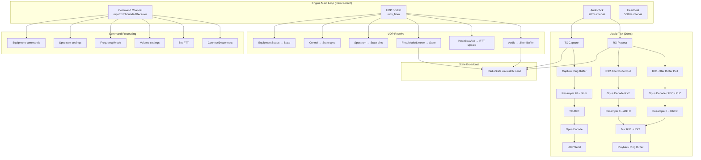

#### Audio Playout (RX) — Detail

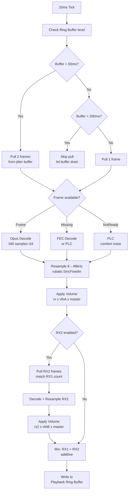

#### Audio Capture (TX) — Detail

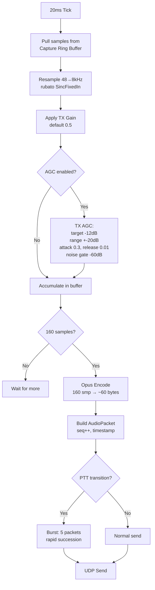

#### Frequency Synchronization

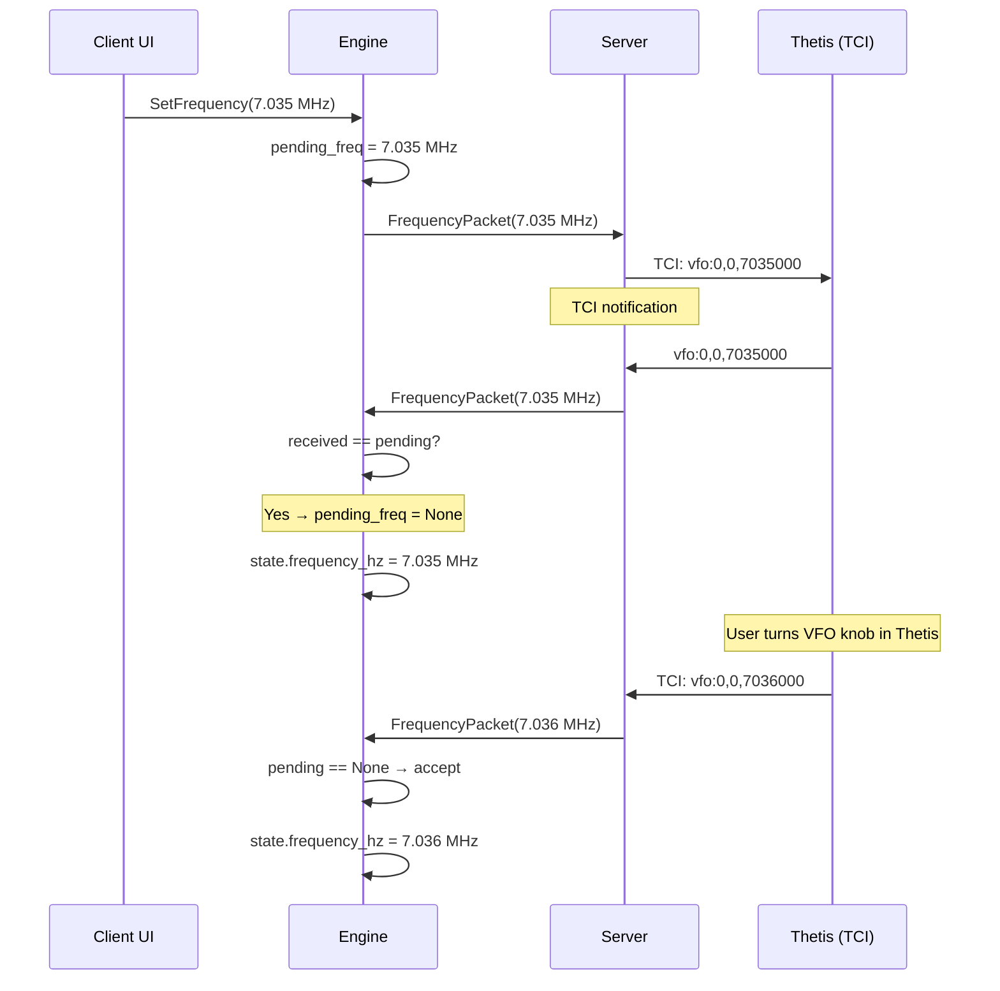

#### Volume Synchronization

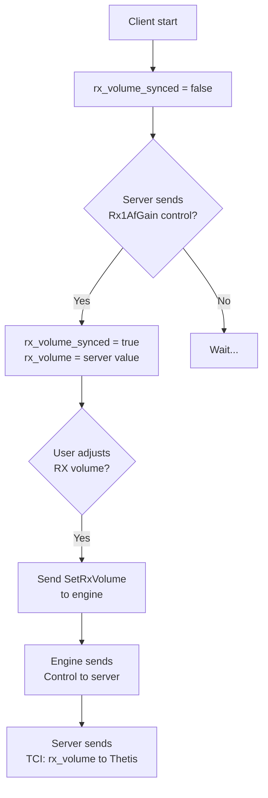

## sdr-remote-server

### TCI as the Only Connection Mode

The server connects exclusively via TCI (Thetis Control Interface) to Thetis. The TCI WebSocket connection handles:
- RX audio (IQ or demodulated)
- Frequency, mode, S-meter and all radio controls
- Spectrum data (when enabled)
- TX audio
- PTT, volume, and all other controls

### Main Structure

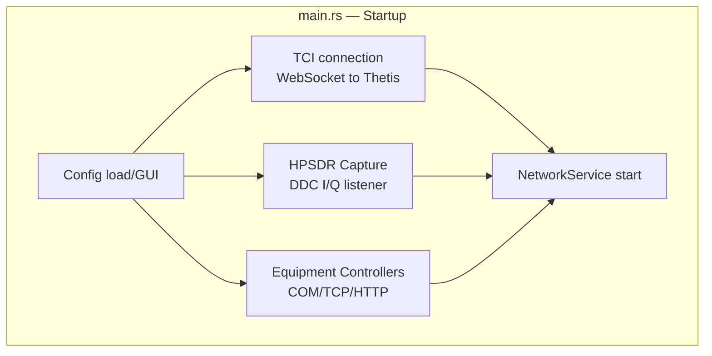

### network.rs — NetworkService (~1,363 LOC)

Manages all UDP communication with clients.

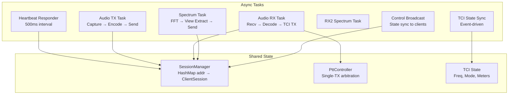

### Two-Phase Connect & Lock Contention Fix

The connection to the Thetis TCI WebSocket uses a two-phase connect pattern:

1. **Phase 1 — needs_connect_info():** The TCI module signals that a (re)connection is needed.
2. **Phase 2 — accept_stream():** The caller (network.rs) establishes the TCP/WebSocket connection in a background tokio task with timeout (500ms), and passes the connected stream through.

This prevents a blocking connect from stalling the main loop.

**Lock contention fix:** The three TCI consumer tasks (audio, spectrum, control) share a `Mutex<TciClient>`. To prevent contention:
- `drop(ptt_guard)` is called before every `sleep` in the tasks
- Connect timeouts: 100ms TCP, 500ms WebSocket
- Reconnect interval: 1 second

### tci.rs — TCI Interface

TCI (Thetis Control Interface) is a WebSocket-based protocol for bidirectional communication with Thetis SDR. Unlike polling, TCI receives event-driven updates.

**TCI provides:**
- Real-time frequency/mode/S-meter notifications (no polling needed)
- Audio streaming (RX and TX) via the WebSocket protocol
- Direct control of all radio parameters
- Spectrum data

**State sync:** TCI automatically sends updates when values change in Thetis, providing lower latency than polling-based alternatives.

### spectrum.rs — SpectrumProcessor (~994 LOC)

**DDC FFT Pipeline:**

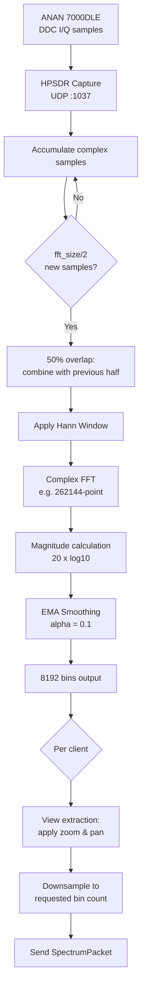

**FFT size selection:**
```
target = sample_rate / 6
fft_size = next_power_of_two(target)
minimum = 4096

Examples:
  1536 kHz → 262144 (~12 FPS)
   384 kHz →  65536 (~12 FPS)
    96 kHz →  16384 (~12 FPS)
    48 kHz →   8192 (~12 FPS)
```

### ptt.rs — PTT Controller (~559 LOC)

**Single-TX Arbitration:**

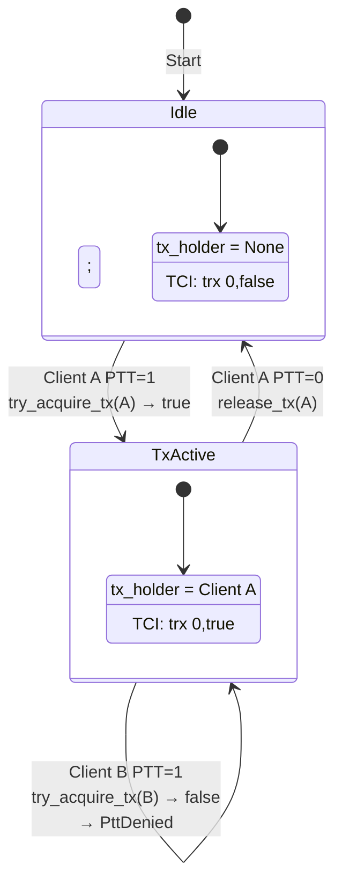

### Equipment Handlers

All equipment handlers follow the same pattern:

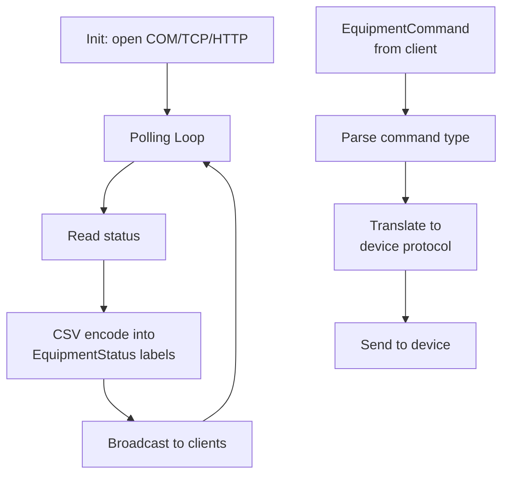

| Handler | Interface | Poll Interval | Telemetry Fields |
|---------|-----------|---------------|-----------------|
| amplitec.rs (220 LOC) | COM 9600 | 1s | switch_a, switch_b, labels |
| tuner.rs (503 LOC) | COM 9600 | 500ms | state, can_tune |
| spe_expert.rs (568 LOC) | COM 9600 | 500ms | 12 fields (power, SWR, temp, ...) |
| rf2k.rs (1082 LOC) | HTTP :8080 | 500ms | 28+ fields incl. debug |
| ultrabeam.rs (461 LOC) | COM 9600 | 1s | freq, band, direction, elements |
| rotor.rs (245 LOC) | TCP :3010 | 500ms | angle, rotating, target |

### Yaesu FT-991A Integration

The server supports an optional Yaesu FT-991A radio alongside Thetis/ANAN. The Yaesu is controlled via a serial CAT protocol (separate from the TCI connection to Thetis).

**Functionality:**
- Separate audio stream (AudioYaesu, 0x16) via wideband Opus (16 kHz)
- Own frequency/mode/S-meter in YaesuState packets
- Memory channel read/write (YaesuMemoryData, tab-separated)
- VFO-A/B selection and swap
- Squelch, RF gain, mic gain, RF power control
- EX menu read and write
- Buttons (button IDs) for functions without their own ControlId

**Audio:** Yaesu audio uses a separate codec path with wideband Opus (16 kHz, 24 kbps) for better audio quality.

### Diversity Control

Diversity combining uses two receive antennas via RX1 and RX2 of the ANAN 7000DLE.

**Controls (via ControlId 0x40–0x46):**
- Enable/disable diversity mode
- Reference source selection (RX1 or RX2)
- Listening source selection (RX1+RX2 combined, RX1 only, RX2 only)
- Gain per receiver (0.000 to 65.535, resolution 0.001)
- Phase setting (-180.00 to +180.00 degrees, resolution 0.01)
- Read trigger to load current state from Thetis

## sdr-remote-client

### main.rs — Startup

```mermaid
graph TD
    A[Start] --> B[Init tokio runtime]
    B --> C[Create ClientAudio<br/>cpal devices]
    C --> D[Create ClientEngine<br/>from sdr-remote-logic]
    D --> E[Spawn engine<br/>in background]
    E --> F[Start eframe/egui<br/>rendering loop]
    F --> G[UI update() per frame]
```

### audio.rs — ClientAudio

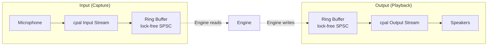

### ui.rs — Desktop UI (~5,668 LOC)

See separate document: [UI.md](UI.md)

## sdr-remote-android

### Architecture

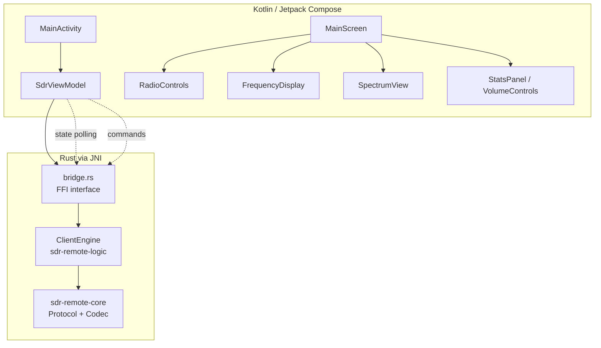

**Bridge functions (Rust → Kotlin):**
- `version()` → String
- `state()` → BridgeRadioState (250+ fields)
- `connect(addr, password)`, `disconnect()`
- `set_ptt(bool)`, `set_frequency(hz)`, `set_mode(u8)`
- `set_rx_volume(f32)`, `set_local_volume(f32)`, `set_tx_gain(f32)`
- `set_control(id, value)`
- `enable_spectrum(bool)`, `set_spectrum_fps/zoom/pan()`

**Audio:** Oboe (Android Native Audio), 48kHz mono f32

## Network Timing & Reliability

### Timeline of an audio frame

```
t=0ms    Client capture ring buffer → samples available
t=1ms    Resample 48→8kHz, Opus encode
t=2ms    UDP send
t=Xms    Network transit (RTT/2)
t=X+1ms  Server receive
t=X+2ms  Opus decode, resample 8→48kHz
t=X+3ms  Via TCI to Thetis TX
```

Total one-way latency: ~3ms processing + network transit + jitter buffer (40-800ms adaptive)

### Heartbeat & Connection Detection

```
Interval:     500ms
Timeout:      max(6000ms, RTT x 8)
RTT measurement: Echo timestamp in HeartbeatAck
Loss%:        Rolling window per heartbeat interval
Reconnect:    Reset codec + jitter buffer on first HeartbeatAck
```

### Packet Loss Recovery

| Scenario | Recovery Method |
|----------|----------------|
| 1 packet lost | FEC from next packet |
| 2+ packets lost | PLC (Packet Loss Concealment) |
| Burst loss | Jitter buffer absorbs up to target depth |
| Network spike | Spike peak hold prevents too-fast buffer shrink |
| Connection lost | Timeout after 6s, reconnect on new HeartbeatAck |

## Authentication

Optional password protection via HMAC-SHA256 challenge-response:

1. Server sends `AuthChallenge` with 16-byte random nonce
2. Client computes HMAC-SHA256(nonce, password) and sends `AuthResponse`
3. Server verifies and sends `AuthResult` (0=rejected, 1=accepted)

On incorrect password: `state.auth_rejected = true`, connection is dropped.

## PowerOnOff & State Sync

Power on/off logic with race condition prevention:

- **Local state:** `value == 1` for correct toggle
- **state_tx.send()** immediately after PowerOnOff for instant UI update
- **power_suppress_until:** 5-second suppression of server power broadcasts after local toggle, prevents server state from reverting the local change
