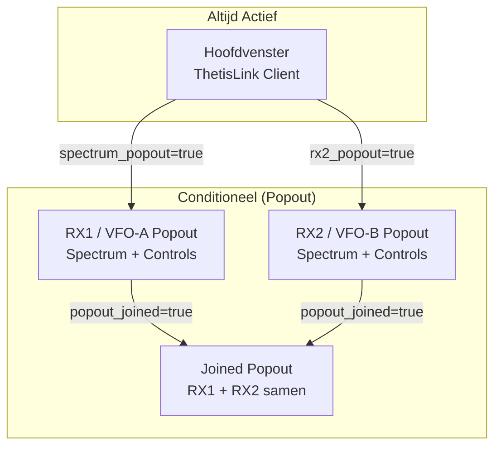
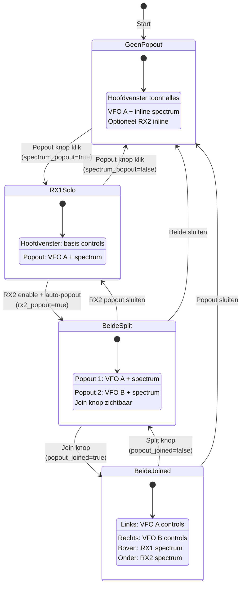
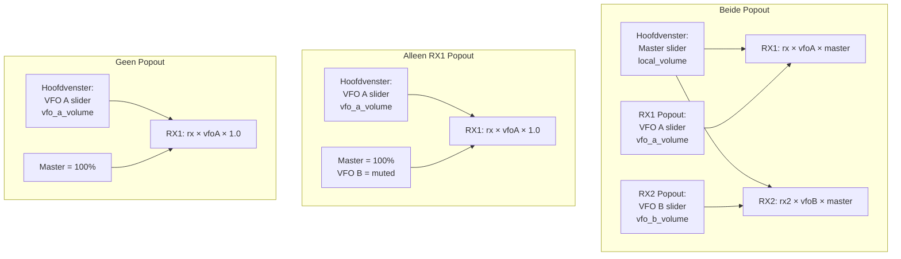
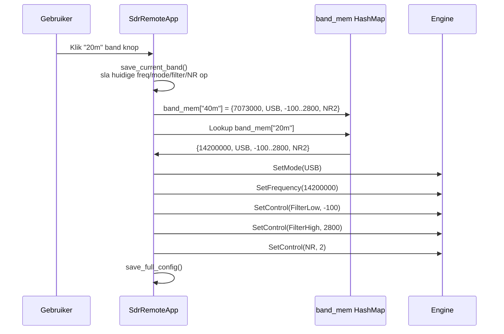

<!-- ThetisLink v0.6.7 -->
# ThetisLink Desktop Client UI

Gedetailleerde documentatie van `sdr-remote-client/src/ui.rs` (~5.668 LOC).

## Window Architectuur



### Popout State Machine



## Hoofdvenster Layout

```mermaid
graph TD
    subgraph "Hoofdvenster"
        TOP[Top Panel]
        RADIO[Radio Scherm]
        DEVICES[Apparaten Scherm]
        LOG[Log Panel]

        TOP --> RADIO
        TOP --> DEVICES
        RADIO --> LOG
        DEVICES --> LOG
    end

    subgraph "Top Panel"
        PTT[PTT Knop + Spatiebalk]
        TUNE[Tune Knop<br/>als tuner beschikbaar]
        PA_STATUS[PA Status<br/>SPE/RF2K compact]
        RX_VOL[RX Volume Slider<br/>Thetis ZZLA]
        TX_GAIN[TX Gain Slider]
    end

    subgraph "Radio Scherm"
        CONN[Verbinding: adres + knop]
        STATUS[Status: RTT, jitter, loss]
        VFO_A[VFO A: frequentie + S-meter]
        BANDS[Band knoppen: 160m–6m]
        MODE[Mode: LSB/USB/CW/AM/FM/DIG]
        FILTER[Filter: low/high Hz + presets]
        NR_ANF[NR niveau + ANF toggle]
        DRIVE[Drive level + Power knop]
        VOLUME[Volume slider<br/>rol hangt af van popout state]
        RX2_SECT[RX2 sectie<br/>als rx2_enabled]
        SPEC[Spectrum + Waterfall<br/>als niet popout]
    end

    subgraph "Apparaten Scherm"
        TABS[Tabs: Amplitec|Tuner|SPE|RF2K|UB|Rotor]
        DEV_CONTENT[Apparaat-specifieke UI]
    end
```

## Render Functies Overzicht

### Gedeelde Functies (gebruikt door meerdere windows)

| Functie | Regels | Gebruikt Door | Beschrijving |
|---------|--------|---------------|--------------|
| `render_rx1_controls()` | 2421–2664 | Popout solo, Joined links | VFO A: freq scroll, mode, S-meter, band, filter, NR/ANF, volume |
| `render_rx2_controls_with_split()` | 2674–2918 | Main (inline), Popout solo, Joined rechts | VFO B: freq, mode, S-meter, band, filter, NR/ANF, volume |
| `render_spectrum_content()` | 2289–2420 | Main (inline), Popout | RX1 spectrum + waterfall + sliders |
| `render_rx2_spectrum_only()` | 2926–3069 | RX2 popout, Joined onder | RX2 spectrum + waterfall |
| `smeter_bar()` | 4638–4795 | Overal waar S-meter nodig is | S-meter visualisatie met dB schaal |
| `render_freq_scroll()` | ~4500 | Alleen popout VFO's | Per-digit frequentie scroll |

### Wrapper Functies

| Functie | Regels | Window | Inhoud |
|---------|--------|--------|--------|
| `render_rx1_popout_content()` | 2665–2670 | RX1 popout (solo) | rx1_controls + spectrum_content |
| `render_rx2_content()` | 2919–2923 | RX2 popout (solo) | rx2_controls + rx2_spectrum |

### Apparaat Functies

| Functie | Regels | LOC | Apparaat |
|---------|--------|-----|----------|
| `render_devices_screen()` | 1092–1124 | ~30 | Tab selector |
| `render_device_amplitec()` | 1125–1223 | ~100 | Amplitec 6/2 antenneschakelaar |
| `render_device_tuner()` | 1224–1290 | ~70 | JC-4s tuner |
| `render_device_spe()` | 1291–1488 | ~200 | SPE Expert 1.3K-FA |
| `render_device_rf2k()` | 1489–2012 | ~520 | RF2K-S PA (incl. debug/drive) |
| `render_device_ultrabeam()` | 2013–2153 | ~140 | UltraBeam RCU-06 |
| `render_device_rotor()` | 2154–2287 | ~130 | EA7HG Visual Rotor |

### Spectrum Functies

| Functie | Regels | Beschrijving |
|---------|--------|--------------|
| `spectrum_plot()` | 4797–5185 | RX1 spectrum lijn + waterfall + freq schaal |
| `rx2_spectrum_plot()` | 5189–5530 | RX2 spectrum (apart, duplicaat logica) |
| `WaterfallRingBuffer` | ~5530–5668 | Ring buffer voor waterfall rijen + egui texture |

## Functie per Window Matrix

| Functie | Hoofd | RX1 Solo | RX2 Solo | Joined |
|---------|:-----:|:--------:|:--------:|:------:|
| render_rx1_controls | - | ja | - | links |
| render_rx2_controls_with_split | inline | - | ja | rechts |
| render_spectrum_content | inline | ja | - | boven |
| render_rx2_spectrum_only | - | - | ja | onder |
| smeter_bar | ja | ja | ja | ja |
| render_freq_scroll | - | ja | ja | ja |
| Band knoppen | ja | ja | ja | ja |
| Mode selector | ja | ja | ja | ja |
| Filter controls | ja | ja | ja | ja |
| Volume slider | ja | ja | ja | ja |

**Opmerking:** `render_freq_scroll` (per-digit scroll) is **alleen** in popout windows. Het hoofdvenster heeft een gewone klikbare frequentie label.

## Volume Routing



### Routing Regels (in update())

```
als spectrum_popout EN rx2_popout:
    → Hoofdvenster slider = Master (local_volume)
    → Popout sliders = VFO A / VFO B

als spectrum_popout EN NIET rx2_popout:
    → Master geforceerd op 1.0
    → VFO B geforceerd op 0.001 (gedempt)
    → Hoofdvenster slider = VFO A

als NIET spectrum_popout:
    → Master geforceerd op 1.0
    → Hoofdvenster slider = VFO A
```

## Band Geheugen Systeem



### BandMemory Struct

```rust
struct BandMemory {
    frequency_hz: u64,    // Laatst gebruikte frequentie
    mode: u8,             // LSB/USB/CW/AM/FM/DIG
    filter_low_hz: i32,   // Filter ondergrens (Hz)
    filter_high_hz: i32,  // Filter bovengrens (Hz)
    nr_level: u8,         // Noise Reduction niveau (0-4)
}
```

### Opslag in Config

```
band_mem_40m=7073000:1:-100:2800:2
band_mem_20m=14200000:1:-100:2800:2
band_mem_80m=3573000:0:-2800:100:0
```

Format: `band_mem_{label}={freq}:{mode}:{filter_low}:{filter_high}:{nr}`

## SdrRemoteApp State Groepen

### Totaal: ~280+ velden

| Groep | Aantal | Beschrijving |
|-------|--------|--------------|
| Verbinding & UI | ~20 | server_input, connected, show_log, show_devices |
| Audio volumes | ~6 | rx_volume, vfo_a/b, local, tx_gain, rx2_volume |
| Radio state (cache) | ~18 | frequency, mode, smeter, power, filters, NR/ANF |
| Spectrum RX1 | ~22 | bins, center, span, zoom, pan, waterfall, auto_ref |
| Spectrum RX2 | ~20 | Kopie van RX1 met rx2_ prefix |
| RX2 / VFO-B | ~15 | frequency, mode, smeter, filters, popout state |
| Amplitec | ~5 | connected, switch_a/b, labels, log |
| Tuner | ~4 | connected, state, can_tune, tune_freq |
| SPE Expert | ~16 | connected, state, power, SWR, temp, antenna, ... |
| RF2K-S basis | ~25 | connected, operate, band, freq, power, SWR, ... |
| RF2K-S debug | ~20 | bias, PSU, uptime, error, drive config tabellen |
| UltraBeam | ~12 | connected, freq, band, direction, motors, elements |
| Rotor | ~6 | connected, angle, rotating, target |
| Band geheugen | ~4 | band_mem, current_band, wf_contrast_per_band |
| Kanalen | 2 | state_rx (watch), cmd_tx (mpsc) |

## Gedupliceerde Code (Refactoring Kandidaten)

### 1. Spectrum Rendering (~400 LOC × 2)
- `render_spectrum_content()` (RX1) en `render_rx2_spectrum_only()` (RX2)
- Identieke logica met verschillende variabelen (spectrum_* vs rx2_spectrum_*)
- **Refactoring:** Parametriseren met een `SpectrumState` struct

### 2. Spectrum Plot (~400 LOC × 2)
- `spectrum_plot()` (RX1) en `rx2_spectrum_plot()` (RX2)
- Zelfde plot logica, waterfall, freq schaal
- **Refactoring:** Eén functie met `SpectrumState` parameter

### 3. Controls Rendering (~250 LOC × 2)
- `render_rx1_controls()` en `render_rx2_controls_with_split()`
- Grotendeels identiek: freq, mode, S-meter, band, filter, NR/ANF
- Verschillen: VFO A vs B variabelen, Split knop, is_popout parameter
- **Refactoring:** Eén functie met `VfoContext` (rx1/rx2 enum + state refs)

### 4. Band Geheugen (~60 LOC × 2)
- `save_current_band()` / `restore_band()` (RX1)
- `save_current_band_rx2()` / `restore_band_rx2()` (RX2)
- **Refactoring:** Parametriseren met VFO identifier

### 5. Apparaat State (~100 velden)
- Alle apparaatvelden direct in SdrRemoteApp
- **Refactoring:** Per apparaat een struct (AmplitecState, TunerState, etc.)

## Config Persistentie

### Opgeslagen Velden (thetislink-client.conf)

| Veld | Type | Standaard |
|------|------|-----------|
| server | String | "" |
| volume (rx) | f32 | 0.5 |
| tx_gain | f32 | 0.5 |
| vfo_a_volume | f32 | 1.0 |
| vfo_b_volume | f32 | 1.0 |
| local_volume | f32 | 1.0 |
| rx2_volume | f32 | 0.2 |
| input_device | String | "" |
| output_device | String | "" |
| agc_enabled | bool | false |
| spectrum_enabled | bool | false |
| spectrum_ref_db | f32 | -20.0 |
| spectrum_range_db | f32 | 100.0 |
| auto_ref_enabled | bool | false |
| waterfall_contrast | f32 | 1.2 |
| wf_contrast_per_band | HashMap | {} |
| rx2_spectrum_* | | (zelfde set) |
| popout_joined | bool | false |
| band_mem_{label} | BandMemory | per band |
| tx_profiles | Vec | [] |
| memories | [Memory; 5] | leeg |

### Opslag Triggers

- `save_full_config()` wordt aangeroepen bij:
  - Volume wijziging (alle sliders)
  - Band wissel (band geheugen opslaan)
  - Spectrum instelling wijziging
  - Popout join/split
  - Config gerelateerde UI interacties
