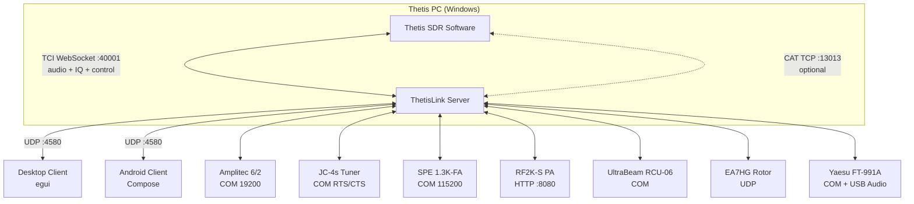

# ThetisLink v0.7.0 - User Manual

## Table of Contents

1. [Overview](#overview)
2. [Server configuration](#server-configuration)
3. [Starting the server](#starting-the-server)
4. [Connecting the client](#connecting-the-client)
5. [Operation](#operation)
6. [Devices](#devices)
7. [Yaesu FT-991A](#yaesu-ft-991a)
8. [Diversity reception](#diversity-reception)
9. [DX Cluster](#dx-cluster)
10. [Macros](#macros)
11. [Naming conventions](#naming-conventions)

---

## Overview

ThetisLink is a remote control application for the ANAN 7000DLE SDR with Thetis. It consists of:

- **ThetisLink Server** — runs on the Thetis PC (Windows), controls the radio via TCI
- **ThetisLink Client** — desktop client (Windows/macOS/Linux) with spectrum, waterfall and full control
- **ThetisLink Android** — mobile client app

The server communicates with Thetis via TCI WebSocket for both control and audio. Audio is transmitted via the Opus codec over UDP with minimal latency.

### Thetis version

ThetisLink has been tested with and requires **Thetis v2.10.3.13** (official release by ramdor). This is the base version: all core functionality (audio, spectrum, PTT, TCI control) works fully with unmodified Thetis.

Optionally there is the **PA3GHM Thetis fork** with ThetisLink-specific extensions. These extensions are behind the "ThetisLink extensions" checkbox in Thetis (Setup > Network > IQ Stream). With the checkbox unchecked, Thetis behaves identically to the original release. ThetisLink automatically detects whether extensions are available and switches over. Advantages of the fork:

- Full TCI control without an auxiliary CAT connection
- Additional TCI commands for NB2, DDC sample rate and extended IQ
- Push notifications from Thetis to ThetisLink clients

### Distribution

ThetisLink is distributed as a zip file with the following contents:

| File | Description |
|---------|-------------|
| `ThetisLink-Server.exe` | Server executable (Windows) |
| `ThetisLink-Client.exe` | Desktop client executable |
| `ThetisLink-0.7.0.apk` | Android client app |
| `thetislink-server.conf` | Server configuration (example) |
| `thetislink-client.conf` | Client configuration (example) |
| `Installation.pdf` | Installation guide |
| `Technical-Reference.pdf` | Technical reference |
| `User-Manual.pdf` | User manual (this document) |
| `LICENSE` | License |

### System requirements

- **Server:** Windows 10/11, Thetis v2.10.3.13 or PA3GHM fork, ANAN 7000DLE (or compatible)
- **Client:** Windows/macOS/Linux or Android 8+
- **Network:** WiFi or LAN, UDP port 4580

---

This manual assumes that ThetisLink has been installed and configured according to the **Installation Guide** (`Installation.md`). There you will find: installation of the server, desktop client and Android app, Thetis TCI/CAT configuration, firewall settings and network/port forwarding.

---

### Architecture



All audio (RX/TX), IQ spectrum data and control go through the TCI WebSocket connection. The CAT connection is only needed with standard Thetis (without the PA3GHM fork). No VB-Cable or other drivers required.

---


## Server configuration

The basic connection with Thetis (TCI/CAT addresses, device COM ports) is set up during installation — see `Installation.md`. Below are the advanced configuration options.

### DX Cluster

| Setting | Example | Description |
|---|---|---|
| `dxcluster_server` | `dxc.pi4cc.nl:8000` | DX cluster server address |
| `dxcluster_callsign` | `PA3GHM` | Callsign for cluster login |
| `dxcluster_enabled` | `true` | DX cluster on/off |
| `dxcluster_expiry_min` | `10` | Spot expiry time in minutes |

### Amplitec labels

```
amplitec_label1=JC-4s
amplitec_label2=A2
amplitec_label3=A3
amplitec_label4=A4
amplitec_label5=DummyL
amplitec_label6=UltraBeam
```

> **Important:** See [Naming conventions](#naming-conventions) for special integrations.

---

## Starting the server

1. Start Thetis and enable TCI (Setup > CAT > TCI)
2. Start `ThetisLink-Server.exe`
3. Check the connection settings
4. Check the desired devices
5. Click **Start**
6. The server listens on UDP port 4580

### Server UI

The server displays:
- Connection status (TCI/CAT)
- Active device windows (Tuner, Amplitec, SPE, RF2K, UltraBeam, Rotor, Yaesu)
- Macro buttons (2 rows of 12)
- Uptime and client info

---

## Connecting the client

1. Start the client
2. Enter the server IP address (e.g. `192.168.1.79`)
3. Click **Connect**

The client automatically receives:
- Real-time spectrum and waterfall
- VFO frequency, mode and filter
- S-meter values
- Device status (Amplitec, UltraBeam, Yaesu, etc.)
- DX cluster spots

---

## Operation

### VFO and frequency

- **Frequency display:** click to enter a frequency directly
- **Step buttons:** +/- in steps of 10 Hz, 100 Hz, 1 kHz, 10 kHz
- **Scroll wheel:** on the spectrum = 1 kHz steps
- **Click on spectrum:** tune to that frequency
- **Waterfall click (Android):** tune to click position

### Band memory

Per band the following is automatically saved:
- Frequency
- Mode (LSB/USB/CW/AM/FM/DIG)
- Filter width
- NR level

When changing bands these are automatically restored. In addition there are 5 free memory slots (M1-M5).

### Mode

Selectable: LSB, USB, CW, AM, FM, DIG

### Filter

The filter width is adjustable with +/- buttons. Presets are available per mode:
- **CW:** 50, 100, 200, 500, 1000 Hz
- **SSB:** 1800, 2400, 2700, 3100, 3600 Hz
- **AM/FM:** 6000, 8000, 10000, 12000 Hz

### Volume

- **RX Volume:** receive level (ZZLA command)
- **TX Gain:** microphone preamplification
- **Drive:** transmit power 0-100%
- **Mic AGC:** automatic microphone gain (on/off)

### Noise Reduction & Notch

- **NR:** cyclic: OFF > NR1 > NR2 > NR3 > NR4
- **ANF:** Auto Notch Filter on/off

### PTT (Push-to-Talk)

ThetisLink offers three PTT modes:

- **Push-to-talk (spacebar):** hold the spacebar to transmit, release to stop
- **Toggle:** click the PTT button to switch between transmit and receive
- **MIDI PTT:** separate MIDI PTT mode via an assigned MIDI controller button, independent of the desktop PTT mode

### Spectrum and waterfall

- **Zoom:** adjustable, provides more accurate frequency display
- **Pan:** shift the visible spectrum left/right (0 = centered on VFO)
- **Reference level:** shift the dB range up/down
- **Auto Ref:** automatic reference level adjustment based on noise floor
- **Contrast:** waterfall brightness per band (remembered)

#### TX spectrum override

During transmission (TX) the spectrum is automatically adjusted for good display of the transmit signal:
- **Reference level:** overridden to -30 dB
- **Range:** overridden to 120 dB
- **Auto Ref:** automatically disabled during TX and the setting is saved
- After releasing PTT the original settings (including Auto Ref) are restored with a short delay, so the spectrum returns stably

### Popout windows

The client supports separate windows:
- **RX1 spectrum** — RX1 spectrum + waterfall with controls only
- **RX2 spectrum** — RX2 spectrum + waterfall with controls only
- **Joined** — RX1 and RX2 side by side with shared controls

In popout windows the following are available:
- S-meter (bar or analog needle meter, switchable via toggle button)
- All band/mode/filter/NR/ANF controls
- VFO A<>B swap button (bottom-left with analog needle meter)

### VFO B / RX2

Full second receiver support:
- Independent frequency, mode, filter, S-meter
- Own spectrum and waterfall
- VFO Sync: VFO B automatically follows VFO A
- A<>B: swap VFO A and B

### WebSDR/KiwiSDR (Desktop)

Built-in WebView for WebSDR and KiwiSDR reception:
- Frequency synchronization: WebSDR follows the VFO
- Automatically muted during transmission
- Favorites list with star icon

### MIDI Controller

Desktop and Android support USB MIDI controllers:
- **Scan** button searches for available MIDI devices
- **Learn** mode: press a MIDI button/slider, assign a function
- Available functions: PTT (with LED), VFO tune, volumes, drive, NR, ANF, mode, band, power
- Encoder steps: 1 Hz, 10 Hz, 100 Hz, 1 kHz
- **MIDI PTT mode:** separate PTT mode for MIDI, independent of the spacebar PTT mode

---

## Devices

### Amplitec 6/2 Antenna Switch

Serial USB connection (19200 baud). Displays:
- Current switch position port A and B
- 6 antenna positions with configurable labels
- Switch buttons per port

### JC-4s Automatic Tuner

Serial USB connection. Functions:
- **Tune** button: start tuning
- **Abort** button: cancel tuning
- Status display: Tuning, Done, Timeout, Aborted
- Log window (optional)

The tuner works together with amplifiers (SPE/RF2K) for safe tuning: the PA automatically goes to standby during tuning.

> **Tuner button visibility:** The Tune button in the main screen is only visible if an Amplitec label contains the word "JC-4s" (or "JC4s" or "Tuner"). See [Naming conventions](#naming-conventions).

### SPE Expert 1.3K-FA

Serial USB connection. Displays:
- Power, SWR, temperature
- Antenna selection
- Operate/Standby status

### RF2K-S

TCP/IP connection (port 8080). ThetisLink supports both the original RF2K-S firmware and the modified v190 firmware with extended drive control.

**Original firmware — basic functionality:**
- Band and frequency readout
- Operate/Standby switching
- Tuner control (mode, L/C values)
- Error status and antenna selection
- Power, SWR, temperature

**Modified firmware (v190+) — additional functionality:**
- Drive power readout and adjustment (increment/decrement)
- Drive configuration per band and modulation type (SSB/AM/Continuous)
- Debug telemetry (bias voltage, PSU voltage, uptime)
- Controller version with hardware revision

ThetisLink automatically detects which firmware is active. With the original firmware everything works except drive control.

The RF2K-S can be reset via the server UI when needed.

### UltraBeam RCU-06

Serial USB connection (19200 baud). Functions:
- **Frequency display** with band indication
- **Direction buttons:** Normal, 180 degrees, Bi-Dir
- **Frequency step buttons:** -100, -50, -25, +25, +50, +100 kHz
- **Sync VFO:** set the UltraBeam to the current VFO frequency (A or B, depending on Amplitec switch position)
- **Auto:** automatic frequency tracking of the active VFO
  - Minimum step: 25 kHz (prevents motor overload)
  - VFO selection is automatically determined via the Amplitec (see [Naming conventions](#naming-conventions))
- **Band presets:** quick-select buttons per band
- **Motor progress:** progress bar during element movement
- **Retract:** retract all elements (with confirmation)
- **Element display:** current element lengths in mm

### EA7HG Visual Rotor

UDP connection. Displays:
- Compass circle with current direction
- Azimuth and elevation
- Click on compass to rotate
- Manual input for target direction

---

## Yaesu FT-991A

ThetisLink can control a Yaesu FT-991A transceiver as a second radio alongside the ANAN. The Yaesu is connected via a serial USB COM port.

### Functions

- **Frequency:** read and set the current frequency
- **Mode:** read and set (LSB, USB, CW, AM, FM, DIG)
- **VFO A/B:** switch between VFO A and VFO B
- **Memory channels:** automatically loaded when the Yaesu is enabled in the server. Channels with a name are displayed in the UI
- **Menu editor:** read and modify Yaesu menu settings via the server UI
- **Audio:** the Yaesu USB audio is captured by the server and sent via the AudioRx2 channel to the client, where it is mixed with the ANAN RX signal

### Configuration

```
yaesu_port=COM5
yaesu_enabled=true
```

The Yaesu audio is automatically played on the client when the device is enabled.

---

## Diversity reception

ThetisLink supports diversity reception via RX1 and RX2. This combines two antennas (for example the ANAN on two different antenna inputs) for improved reception.

### Usage

1. Enable RX2 via the client
2. Set both VFOs to the same frequency (or use VFO Sync)
3. The server sends independent spectrum and audio streams for RX1 and RX2
4. Use the volume controls to set the balance between RX1 and RX2

Diversity also works in combination with the popout windows (Joined view) for a clear display of both receivers.

### Smart and Ultra Auto-Null (Diversity)

In addition to manual diversity adjustment, ThetisLink offers two automatic null algorithms:

- **Smart:** performs an AVG sweep over 360° + 90° in steps of 5° with settle time per step. Takes approximately 9 seconds. Reliable and accurate.
- **Ultra:** continuous forward/backward sweep without settle time, considerably faster (approximately 5 seconds). Suitable when you want to quickly find a null.

Both algorithms are available in the dropdown next to the **Auto Null** button. After completion the result is shown in dB improvement: green means a good null, orange means little difference from the starting situation.

On Android there is a **Smart Null** button that shows the result in dB after completion.

---

### Audio recording and playback

The client has a built-in audio recorder and player:

- **Record** button in the Server tab with checkboxes for **RX1**, **RX2** and **Yaesu** — select which audio channels you want to record
- Recordings are saved as WAV files (8 kHz, mono) next to the client executable, with a timestamp in the filename
- **Play** button plays back the last recording:
  - **Without PTT:** the recorded audio is played through the speakers, mixed with the receive audio
  - **With PTT held:** the recording replaces the microphone (TX inject) — useful for testing your own modulation or repeating a CQ message
- **Stop** button cancels playback. At the end of the recording it stops automatically.

---

### Spectrum and waterfall colors

The spectrum and waterfall use a signal level-dependent color scale:

- **Blue** (weak signal) -> **cyan** -> **yellow** -> **red** -> **white** (strong signal)
- Both the spectrum line and the waterfall use the same color scale
- The colors are identical on desktop and Android

---

### Remote management

In the Server tab there is a **Remote Reboot / Shutdown** button with which you can remotely restart or shut down the server PC:

- After clicking, choose between **reboot** or **shutdown**
- For reboot a `ThetisLinkReboot` scheduled task is required on the server PC (see Installation.md for the configuration)

---

### Audio mode (Mono/BIN/Split)

In the RX1 section there is a dropdown for the audio mode:

- **Mono:** RX1 and RX2 audio are mixed on both ears (default)
- **BIN:** RX1 binaural audio on left and right + RX2 (requires Thetis to be in BIN mode)
- **Split:** RX1 on the left ear, RX2 on the right ear, with independent volume controls per channel

---

## DX Cluster

ThetisLink connects directly to a DX cluster server (telnet). Spots are:
- Displayed on the spectrum as colored dotted lines with callsign labels
- Filtered on the band of VFO A and VFO B
- Automatically removed after the configured expiry time

**Spot colors per mode:**
- CW: yellow
- SSB/Phone: green
- FT8/FT4/Digital: cyan
- Other: white

Spots are also forwarded to Thetis via TCI `SPOT:` command, so they also appear on the Thetis panorama.

---

## Macros

The server supports 24 programmable macro buttons in 2 rows:
- **Row 1:** F1 through F12 (typically VFO A presets)
- **Row 2:** ^F1 through ^F12 (typically VFO B presets)

### Macro actions

Each macro can contain a sequence of actions:
- **CAT command:** e.g. `ZZFA00014292000;` (set VFO A to 14.292 MHz)
- **Delay:** e.g. `delay:200` (wait 200ms)
- **Tune:** start the JC-4s tuner

### Macro configuration

Macros are stored in `thetislink-macros.conf`:
```
macro_0_label=20m 14292
macro_0=ZZFA00014292000; ZZMD01;
```

### Common CAT commands

| Command | Description |
|---|---|
| `ZZFA00014292000;` | VFO A to 14.292 MHz |
| `ZZFB00007073000;` | VFO B to 7.073 MHz |
| `ZZMD00;` | VFO A mode to CW |
| `ZZMD01;` | VFO A mode to LSB |
| `ZZME00;` | VFO B mode to CW |
| `ZZME01;` | VFO B mode to LSB |

> **Note:** Use `ZZFA`/`ZZMD` for VFO A and `ZZFB`/`ZZME` for VFO B. A common mistake is using ZZMD in VFO B macros — this then changes the mode of VFO A!

---

## Naming conventions

ThetisLink uses the Amplitec antenna label names for automatic integrations between devices. If the label names are incorrect nothing breaks, but certain automatic functions will not work.

### UltraBeam integration

The Amplitec label for the UltraBeam antenna output must contain one of these words (case insensitive):
- `UltraBeam`
- `Ultra Beam`
- `UB`

**What this provides:**
- The **Sync VFO** button and **Auto** tracking in the UltraBeam panel automatically choose the correct VFO:
  - If Amplitec port **B** is on the UltraBeam position -> follows **VFO B**
  - If Amplitec port **A** is on the UltraBeam position -> follows **VFO A**
  - No match -> default **VFO A**

### JC-4s Tuner integration

The Amplitec label for the JC-4s tuner output must contain:
- `JC-4s`
- `JC4s`
- `Tuner`

**What this provides:**
- The **Tune** button in the main screen is only visible if an Amplitec label contains one of these words
- Automatic antenna selection for safe tune

**Example configuration:**
```
amplitec_label1=JC-4s
amplitec_label2=Dipole
amplitec_label3=Vertical
amplitec_label4=Beverage
amplitec_label5=DummyLoad
amplitec_label6=UltraBeam
```

In this example the JC-4s tuner is on position 1 and the UltraBeam on position 6. If you switch Amplitec port B to position 6, the UltraBeam automatically follows VFO B.

---

## Troubleshooting

For connection and installation problems (server won't start, client cannot connect, firewall, COM ports, password and 2FA), see `Installation.md`.

### Audio stutters

High loss% (visible at the bottom of the client) indicates a network problem. Try a wired connection instead of WiFi. On mobile (4G/5G) the jitter buffer adjusts automatically, but with high packet loss audio will continue to stutter.

### BT headset not recognized (Android)

Re-pair the headset via Android Bluetooth settings and restart the ThetisLink app.

### UltraBeam timeout when stepping quickly

The UltraBeam RCU-06 has a limited serial command speed. When pressing step buttons in rapid succession, intermediate commands are skipped and only the last one is sent. This is normal behavior and prevents motor overload.

### Spectrum and waterfall out of sync

If the spectrum (line) and the waterfall are not in sync when panning, check the client version. This is fixed in v0.4.2+.

---

## Version history

| Version | Highlights |
|---|---|
| 0.5.0 | Yaesu FT-991A support, Bluetooth headset (Android), diversity reception fix, TCI controls, RF2K-S reset, PTT modes, DX Cluster |
| 0.4.9 | Wideband Opus TX, device switch fix |
| 0.4.2 | Configurable FFT format, dynamic spectrum bins, Android power button fix |
| 0.4.1 | WebSDR/KiwiSDR integration, frequency sync, TX spectrum auto-override |
| 0.4.0 | TCI WebSocket, waterfall click-to-tune Android |
| 0.3.2 | MIDI controller support, PTT toggle with LED, Mic AGC |
| 0.3.1 | Band memory, FM filter fix, macOS client |
| 0.3.0 | Full RX2/VFO-B support, DDC spectrum+waterfall |
