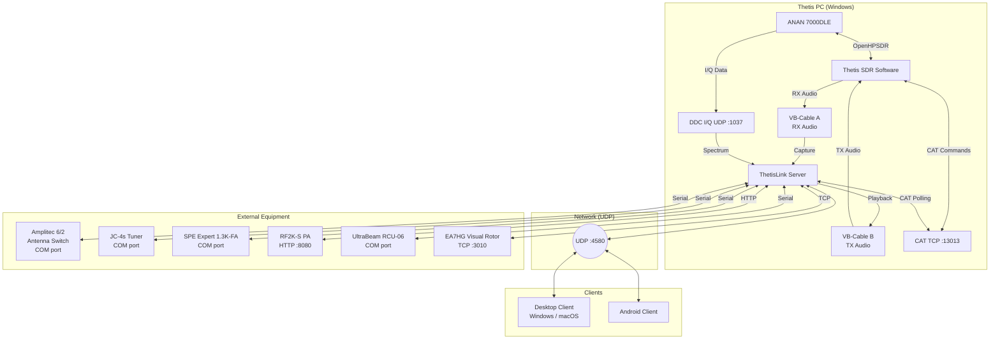
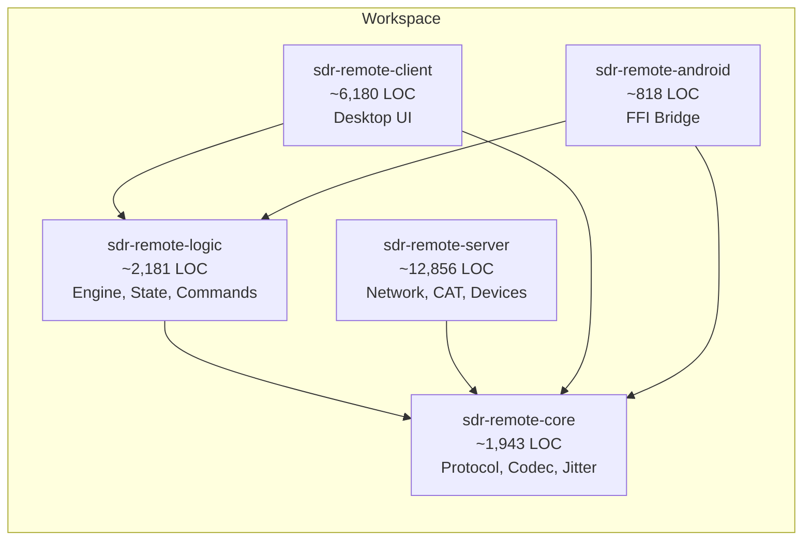
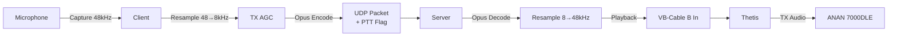
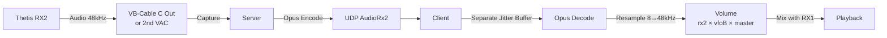
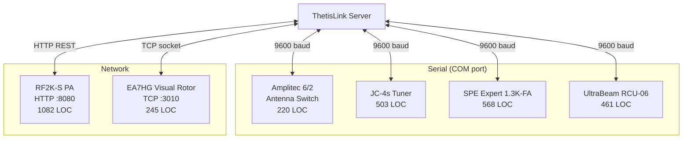
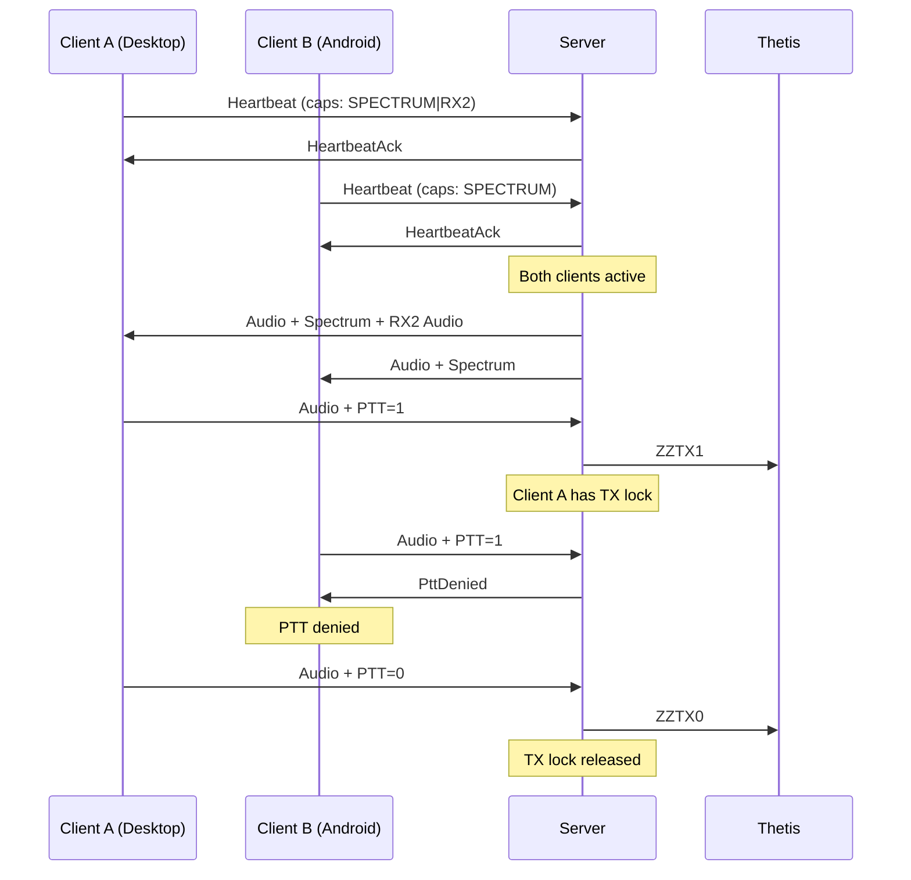

# ThetisLink Architecture

## Overview

ThetisLink is a remote control system for the ANAN 7000DLE SDR with Thetis software. The system consists of a Windows server (runs alongside Thetis), and multiple clients (Windows/macOS desktop, Android).

**Design priority:** latency > bandwidth > features



## Rust Workspace Structure



| Crate | Purpose | Key Dependencies |
|-------|---------|------------------|
| `sdr-remote-core` | Shared library: protocol, codec, jitter buffer | audiopus, anyhow, bytemuck |
| `sdr-remote-logic` | Client engine: audio pipeline, state, commands | tokio, core, rubato, ringbuf, cpal |
| `sdr-remote-server` | Windows server: network, CAT, spectrum, devices | tokio, core, eframe/egui, serialport |
| `sdr-remote-client` | Desktop client: egui UI | tokio, core, logic, eframe/egui |
| `sdr-remote-android` | Android FFI bridge to Kotlin/Compose UI | core, logic |

## Audio Routing

### RX Path (Server → Client)

```mermaid
graph LR
    A[ANAN 7000DLE] -->|OpenHPSDR| B[Thetis]
    B -->|RX Audio 48kHz| C[VB-Cable A Out]
    C -->|Capture 48kHz| D[Server]
    D -->|Resample 48→8kHz| E[Opus Encode<br/>12.8 kbps]
    E -->|UDP Packet| F[Client]
    F -->|Jitter Buffer| G[Opus Decode]
    G -->|Resample 8→48kHz| H[Volume<br/>rx × vfoA × master]
    H -->|Playback 48kHz| I[Speakers]
```



### TX Path (Client → Server)



### RX2 / VFO-B (separate audio channel)



## Protocol

### UDP Packet Format

All packets start with a 4-byte header:

```
[magic: 0xAA] [version: 0x01] [type: u8] [flags: u8]
```

### Packet Types

| Type | ID | Direction | Size | Description |
|------|----|-----------|------|-------------|
| Audio | 0x01 | S→C / C→S | 14+N | RX1 audio (Opus encoded) |
| Heartbeat | 0x02 | C→S | 20 | Keep-alive + capabilities |
| HeartbeatAck | 0x03 | S→C | 16 | RTT measurement + server capabilities |
| Control | 0x04 | Both | 7 | Control command (id + value) |
| Disconnect | 0x05 | C→S | 4 | Disconnect |
| PttDenied | 0x06 | S→C | 4 | PTT denied (another transmitter active) |
| Frequency | 0x07 | Both | 12 | VFO-A frequency (u64 Hz) |
| Mode | 0x08 | Both | 5 | VFO-A mode (u8) |
| Smeter | 0x09 | S→C | 6 | S-meter level (u16, 0-260) |
| Spectrum | 0x0A | S→C | 18+N | Spectrum bins (per-client view) |
| FullSpectrum | 0x0B | S→C | 18+N | Waterfall data (full DDC) |
| EquipmentStatus | 0x0C | S→C | Variable | Equipment status (CSV encoded) |
| EquipmentCommand | 0x0D | C→S | Variable | Equipment command |
| AudioRx2 | 0x0E | S→C | 14+N | RX2 audio (separate channel) |
| FrequencyRx2 | 0x0F | Both | 12 | VFO-B frequency |
| ModeRx2 | 0x10 | Both | 5 | VFO-B mode |
| SmeterRx2 | 0x11 | S→C | 6 | RX2 S-meter |
| SpectrumRx2 | 0x12 | S→C | 18+N | RX2 spectrum |
| FullSpectrumRx2 | 0x13 | S→C | 18+N | RX2 waterfall |

### Capabilities (u32 bitmask in Heartbeat)

| Bit | Name | Description |
|-----|------|-------------|
| 0 | WIDEBAND_AUDIO | Client supports 16kHz Opus |
| 1 | SPECTRUM | Client wants spectrum/waterfall data |
| 2 | RX2 | Client supports dual receiver |

### Control IDs

| ID | Name | Range | Description |
|----|------|-------|-------------|
| PowerOnOff | u16 | 0/1/2 | On/off, 2=shutdown (ZZBY) |
| TxProfile | u16 | 0-99 | TX profile number |
| NoiseReduction | u16 | 0-4 | 0=off, 1-4=NR level |
| AutoNotchFilter | u16 | 0/1 | ANF on/off |
| DriveLevel | u16 | 0-100 | TX drive |
| Rx1AfGain | u16 | 0-100 | Thetis RX1 volume (ZZLA) |
| Rx2AfGain | u16 | 0-100 | Thetis RX2 volume (ZZLE) |
| FilterLow | i16 | Hz | Filter low cutoff |
| FilterHigh | i16 | Hz | Filter high cutoff |
| SpectrumEnable | u16 | 0/1 | Spectrum on/off |
| SpectrumFps | u16 | 5-30 | Spectrum frame rate |
| SpectrumZoom | u16 | 1-1024 | Spectrum zoom factor |
| SpectrumPan | i16 | -500..500 | Spectrum pan (permille) |
| Rx2Enable | u16 | 0/1 | RX2 on/off |
| VfoSync | u16 | 0/1 | VFO-B follows VFO-A |
| Rx2Spectrum* | | | Same set for RX2 |
| Rx2NoiseReduction | u16 | 0-4 | RX2 NR level |
| Rx2AutoNotchFilter | u16 | 0/1 | RX2 ANF |

## Thetis CAT Commands

The server polls Thetis via TCP CAT (port 13013):

### Polling (every 200ms unless noted otherwise)

| Command | Interval | Description |
|---------|----------|-------------|
| ZZFA; | 200ms | Read RX1 frequency |
| ZZFB; | 200ms | Read RX2 frequency |
| ZZMD; | 200ms | RX1 mode |
| ZZME; | 200ms | RX2 mode |
| ZZLA; | 200ms | RX1 AF gain |
| ZZLE; | 200ms | RX2 AF gain |
| ZZPC; | 200ms | TX drive level |
| ZZSM0; | 100ms | RX1 S-meter (peak, 0-260) |
| ZZSM1; | 100ms | RX2 S-meter (peak, 0-260) |
| ZZRM5; | 100ms | Forward power (during TX only) |
| ZZNE; | 200ms | Noise reduction level |
| ZZNT; | 200ms | Auto-notch filter |

### Control Commands

| Command | Description |
|---------|-------------|
| ZZFA{freq}; | Set RX1 frequency |
| ZZFB{freq}; | Set RX2 frequency |
| ZZMD{mode}; | Set RX1 mode |
| ZZME{mode}; | Set RX2 mode |
| ZZTX1; / ZZTX0; | PTT on/off |
| ZZTP{N}; | Select TX profile |
| ZZNE{N}; | Set noise reduction |
| ZZNT{0/1}; | Auto-notch filter |
| ZZPC{N}; | Set drive level |
| ZZLA{N}; | Set RX1 AF gain |
| ZZLE{N}; | Set RX2 AF gain |
| ZZBY; | Shut down Thetis |
| ZZFD{low},{high}; | Set RX1 filter |
| ZZFS{low},{high}; | Set RX2 filter |

## External Equipment



| Device | Interface | Protocol | Functions |
|--------|-----------|----------|----------|
| Amplitec 6/2 | COM | Serial | 2x 6-pos antenna switch |
| JC-4s Tuner | COM | Serial | Tune/abort, status polling |
| SPE Expert 1.3K-FA | COM | Serial | Operate/tune, telemetry (power, SWR, temp) |
| RF2K-S | HTTP :8080 | REST | Operate/tune, antenna, tuner, drive, debug |
| UltraBeam RCU-06 | COM | Serial | Retract, frequency, read elements |
| EA7HG Visual Rotor | TCP :3010 | Socket | Goto/stop/CW/CCW, read bearing |

## Multi-Client Architecture



## Configuration

### Server (thetislink-server.conf)

JSON file next to the executable containing:
- Audio devices (input, input2 for RX2, output)
- CAT address (default 127.0.0.1:13013)
- ANAN interface and DDC sample rate
- Spectrum settings
- Thetis.exe path (autostart)
- COM ports per device
- RF2K network address
- Window positions/sizes
- Active PA selection

### Client (thetislink-client.conf)

JSON file next to the executable containing:
- Server address
- Audio devices (input/output)
- Volumes (rx, vfoA, vfoB, master, tx gain)
- Window positions/sizes
- Spectrum settings
- Band memories (freq/mode/filter/NR per band)

## Server: Two-Phase Connect Pattern

The server uses a two-phase connect pattern for TCI and CAT connections. Connection establishment (TCP connect, WebSocket handshake) happens **outside** the ptt lock, so the main packet loop is never blocked by slow or failing connects.

1. **Phase 1 — Connect (without lock):** The TCI/CAT connection is established in a separate scope, without holding the ptt mutex. This prevents a slow DNS lookup, TCP timeout, or WebSocket handshake from blocking all packet processing.
2. **Phase 2 — Register (with lock):** Only after the connection succeeds, the ptt mutex is briefly locked to register the connection in the shared state.

This pattern is essential because the packet loop also processes PTT events — a blocking connect would raise PTT latency to unacceptable levels.

## Power State Flow

The `Engine` (in `sdr-remote-logic`) is the **single source of truth** for the `power_on` state. The flow:

1. The client sends a PowerOnOff control packet to the server.
2. The server executes the CAT/TCI command (e.g., `ZZPS1;` or TCI `start`).
3. The engine publishes the new power state **immediately** to the UI, without waiting for server confirmation.
4. To prevent a stale server broadcast from overwriting the local state, the engine suppresses incoming power updates from the server for **5 seconds** after sending a power command.
5. After the suppression period, the engine resumes normal synchronization with the server state.

Both the desktop client and the Android client use the exact same mechanism through the shared `Engine` in `sdr-remote-logic`.

## TCI Mode: Lock Contention Fix

In the TCI consumer tasks (which process TCI WebSocket messages), the mutex was held too long: the lock remained active **across a sleep**. This caused lock contention with the main loop, pushing command response times up to ~600ms.

**Fix:** The mutex is now dropped **before** the sleep. This reduced command response time from ~600ms to <1ms. Pattern:

```rust
// Wrong: lock held across sleep
let guard = mutex.lock().await;
// ... process data ...
tokio::time::sleep(interval).await; // guard still active!

// Correct: drop before sleep
{
    let guard = mutex.lock().await;
    // ... process data ...
} // guard dropped
tokio::time::sleep(interval).await;
```
