# ThetisLink Implementatie

Gedetailleerde beschrijving van de implementatie per module, inclusief datastromen en algoritmen.

## sdr-remote-core

### protocol.rs — Pakketdefinities (~900 LOC)

Alle pakkettypen als Rust structs met `serialize()` / `deserialize()` methoden.

**Wire format voorbeeld — AudioPacket:**
```
Offset  Bytes  Veld
0       1      magic (0xAA)
1       1      version (0x01)
2       1      packet_type (0x01)
3       1      flags (bit 0 = PTT)
4       4      sequence (u32 LE)
8       4      timestamp (u32 LE, ms)
12      2      opus_len (u16 LE)
14      N      opus_data
```

**ControlId enum:** 25+ besturingscommando's, elk met u8 ID en u16 waarde. Gebruikt voor bidirectionele state sync tussen server en client.

**EquipmentStatus/Command:** Variabele lengte, CSV-gecodeerde telemetrie in een `labels` string veld. Elke apparaattype heeft een eigen CSV-layout.

### codec.rs — Opus Audio Codec (~200 LOC)

| Parameter | Narrowband | Wideband |
|-----------|-----------|----------|
| Sample rate | 8 kHz | 16 kHz |
| Bitrate | 12.8 kbps | 24 kbps |
| Frame size | 160 samples (20ms) | 320 samples (20ms) |
| Bandwidth | Narrowband | Wideband |
| FEC | Inband, 10% loss | Inband, 10% loss |
| DTX | Aan | Aan |
| Signaaltype | Voice | Voice |

**Belangrijk:** Bitrate 12.8 kbps ligt net boven de Opus FEC drempel (12.4 kbps). Dit garandeert dat Forward Error Correction altijd meegestuurd wordt.

### jitter.rs — Adaptieve Jitter Buffer (~350 LOC)

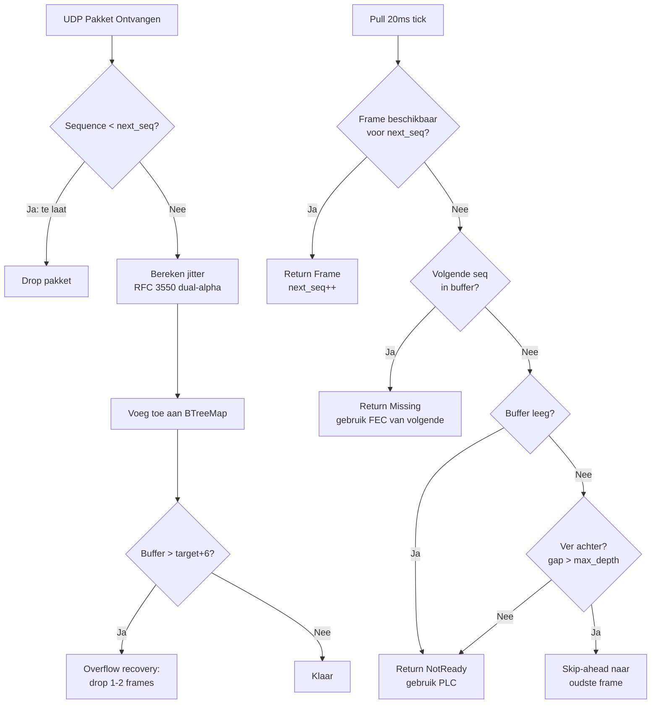

**Jitter schatting (RFC 3550 variant):**
```
deviation = |verwachte_interval - werkelijke_interval|

als deviation > huidige_schatting:
    jitter = jitter + 0.25 × (deviation - jitter)     # snelle attack
anders:
    jitter = jitter + 0.0625 × (deviation - jitter)   # trage decay
```

**Spike peak hold:** Piekwaarde met exponentieel verval (~1 minuut). Voorkomt dat buffer te snel krimpt na een netwerkpiek.

**Target depth formule:**
```
target = max(jitter_estimate, spike_peak) / 15.0 + 2
clamped: 2..40 frames (40ms..800ms)
```

**Grace period:** Eerste 25 pulls (500ms) na verbinding: geen overflow recovery. Laat buffer stabiliseren.

## sdr-remote-logic

### commands.rs — Command Enum (~90 varianten)

Commands worden via `mpsc::UnboundedSender<Command>` van UI naar engine gestuurd. Groepen:

| Groep | Voorbeelden | Aantal |
|-------|------------|--------|
| Verbinding | Connect, Disconnect | 2 |
| Audio | SetRxVolume, SetLocalVolume, SetVfoAVolume, SetTxGain | 7 |
| Radio | SetPtt, SetFrequency, SetMode, SetControl | 6 |
| Spectrum | EnableSpectrum, SetSpectrumFps/Zoom/Pan | 8 |
| RX2 | SetRx2Enabled, SetFrequencyRx2, SetModeRx2 | 12 |
| Amplitec | SetAmplitecSwitchA/B | 2 |
| Tuner | TunerTune, TunerAbort | 2 |
| SPE Expert | SpeOperate, SpeTune, SpeAntenna, ... | 11 |
| RF2K-S | Rf2kOperate, Rf2kTune, Rf2kAnt1-4, ... | 23 |
| UltraBeam | UbRetract, UbSetFrequency, UbReadElements | 3 |
| Rotor | RotorGoTo, RotorStop, RotorCw, RotorCcw | 4 |

### state.rs — RadioState (~170+ velden)

Broadcast van engine naar UI via `watch::Sender<RadioState>`. UI ontvangt via `watch::Receiver` met change notification.

**Belangrijkste groepen:**
- Verbinding: connected, rtt_ms, jitter_ms, buffer_depth, loss_percent
- Audio: capture_level, playback_level, playback_level_rx2
- Radio: frequency_hz, mode, smeter, power_on, filter_low/high_hz
- RX2: rx2_enabled, frequency_rx2_hz, mode_rx2, smeter_rx2
- Spectrum: spectrum_bins[], center_hz, span_hz, ref_level (RX1 + RX2)
- Apparaten: ~100 velden voor 6 apparaattypen

### engine.rs — ClientEngine (~2.181 LOC)

De engine is het hart van elke client. Draait als async tokio task.

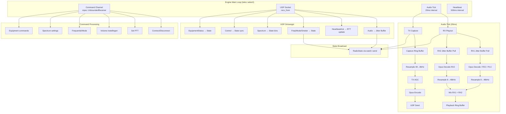

#### Audio Playout (RX) — Detail

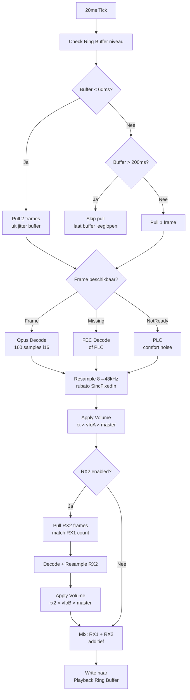

#### Audio Capture (TX) — Detail

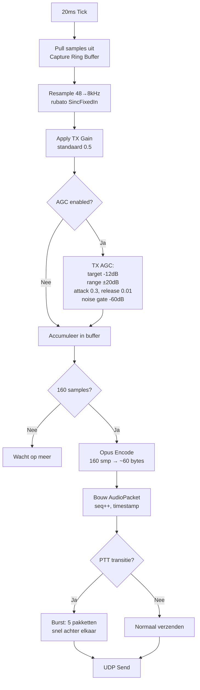

#### Frequentie Synchronisatie

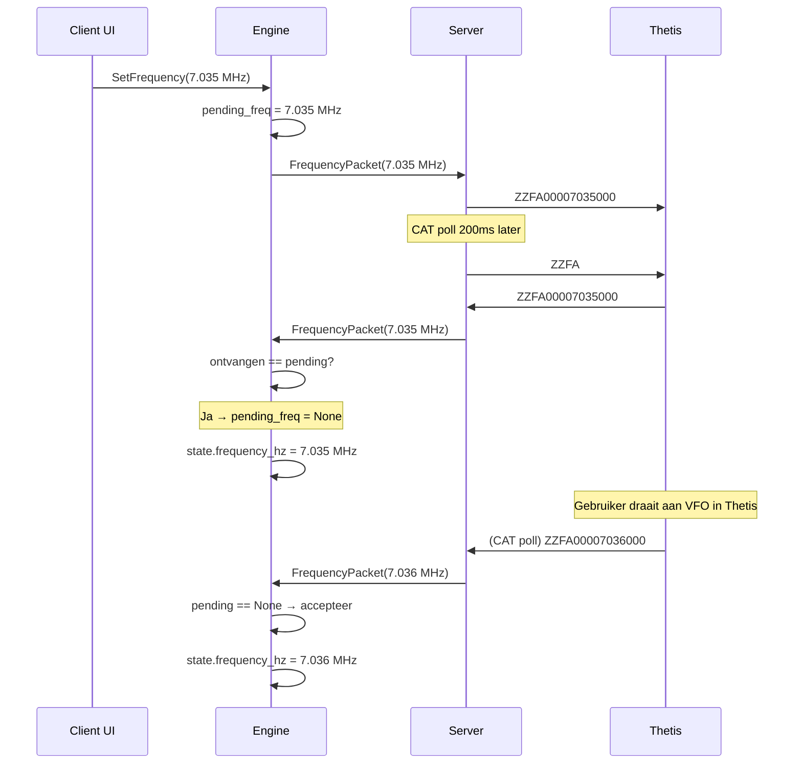

#### Volume Synchronisatie

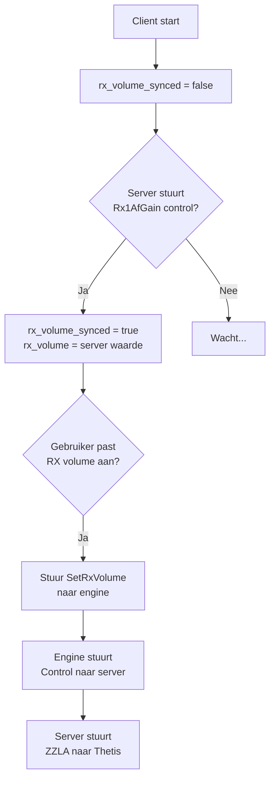

## sdr-remote-server

### Hoofdstructuur

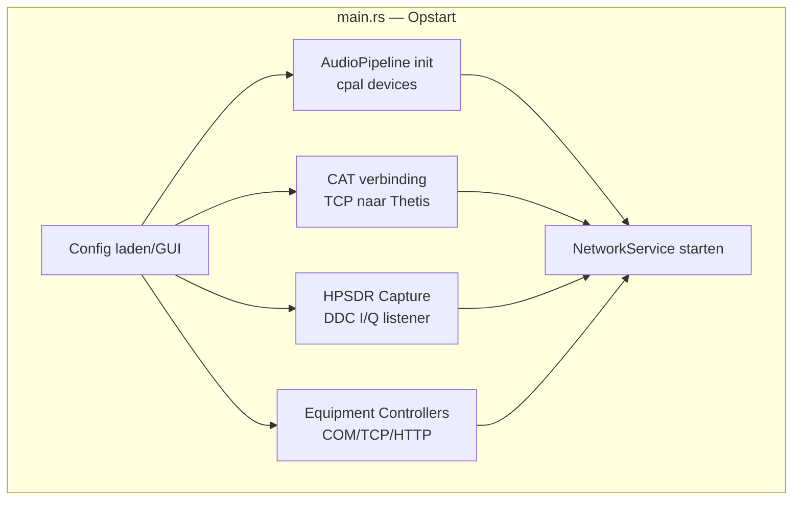

### network.rs — NetworkService (~1.363 LOC)

Beheert alle UDP communicatie met clients.

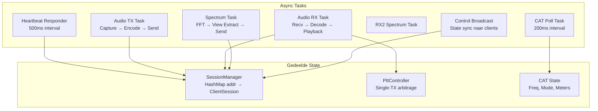

### cat.rs — CAT Interface (~834 LOC)

**Polling cyclus:**

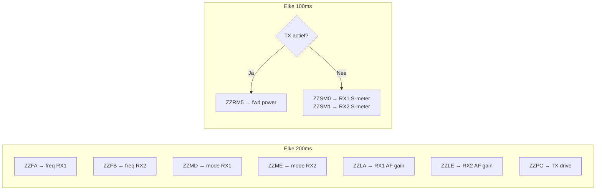

**S-meter verwerking:**
1. ZZSM geeft raw waarde (0-260)
2. Conversie: `dBm = raw / 2 - 140`
3. Opslag als lineaire milliwatt: `mW = 10^(dBm/10)`
4. RMS middeling over sliding window (4 samples, ~0.4 sec)
5. Terug naar display: `avg_mw → dBm → raw (0-260)`

### spectrum.rs — SpectrumProcessor (~994 LOC)

**DDC FFT Pipeline:**

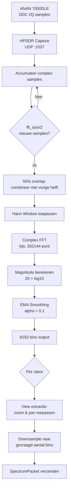

**FFT grootte selectie:**
```
target = sample_rate / 6
fft_size = next_power_of_two(target)
minimum = 4096

Voorbeelden:
  1536 kHz → 262144 (~12 FPS)
   384 kHz →  65536 (~12 FPS)
    96 kHz →  16384 (~12 FPS)
    48 kHz →   8192 (~12 FPS)
```

### ptt.rs — PTT Controller (~559 LOC)

**Single-TX Arbitrage:**

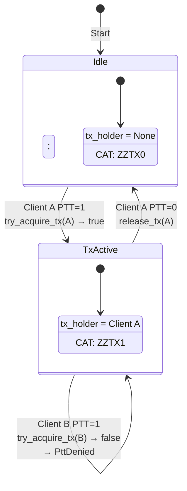

### Equipment Handlers

Alle apparaathandlers volgen hetzelfde patroon:

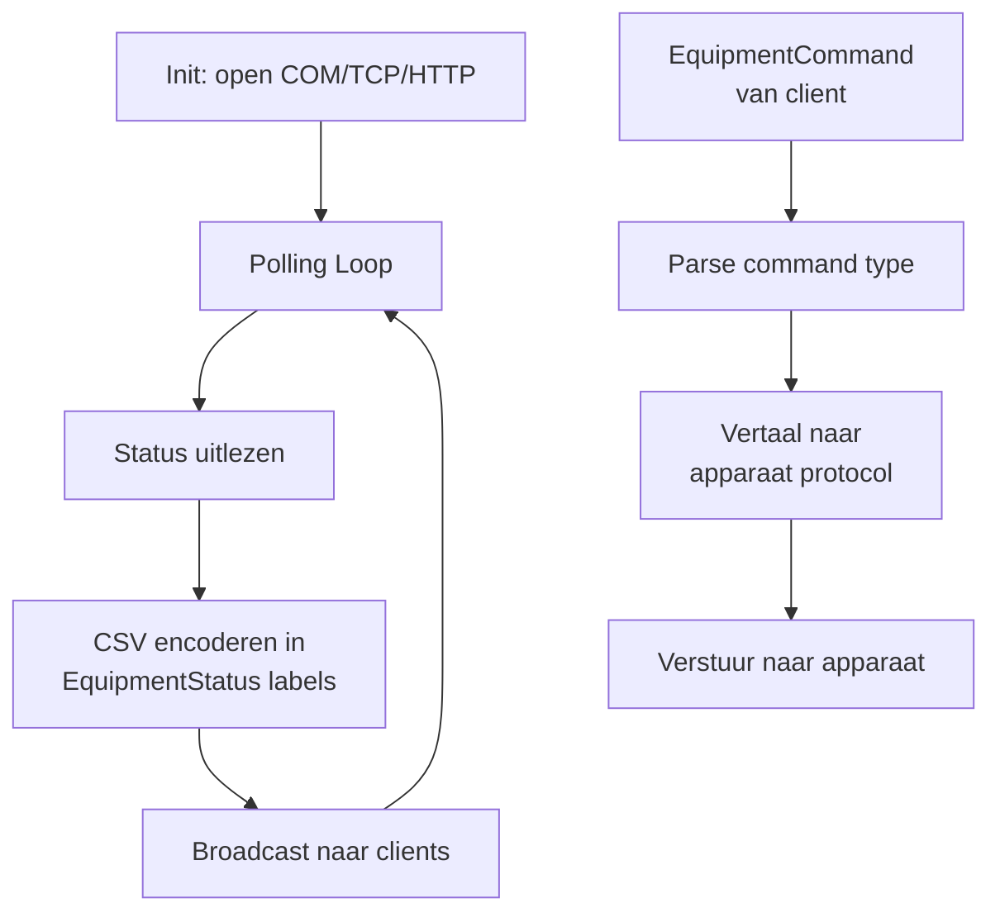

| Handler | Interface | Poll Interval | Telemetrie Velden |
|---------|-----------|---------------|-------------------|
| amplitec.rs (220 LOC) | COM 9600 | 1s | switch_a, switch_b, labels |
| tuner.rs (503 LOC) | COM 9600 | 500ms | state, can_tune |
| spe_expert.rs (568 LOC) | COM 9600 | 500ms | 12 velden (power, SWR, temp, ...) |
| rf2k.rs (1082 LOC) | HTTP :8080 | 500ms | 28+ velden incl. debug |
| ultrabeam.rs (461 LOC) | COM 9600 | 1s | freq, band, direction, elements |
| rotor.rs (245 LOC) | TCP :3010 | 500ms | angle, rotating, target |

## sdr-remote-client

### main.rs — Opstart

```mermaid
graph TD
    A[Start] --> B[Init tokio runtime]
    B --> C[Maak ClientAudio<br/>cpal devices]
    C --> D[Maak ClientEngine<br/>uit sdr-remote-logic]
    D --> E[Spawn engine<br/>in achtergrond]
    E --> F[Start eframe/egui<br/>rendering loop]
    F --> G[UI update() per frame]
```

### audio.rs — ClientAudio

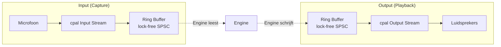

### ui.rs — Desktop UI (~5.668 LOC)

Zie apart document: [UI.md](UI.md)

## sdr-remote-android

### Architectuur

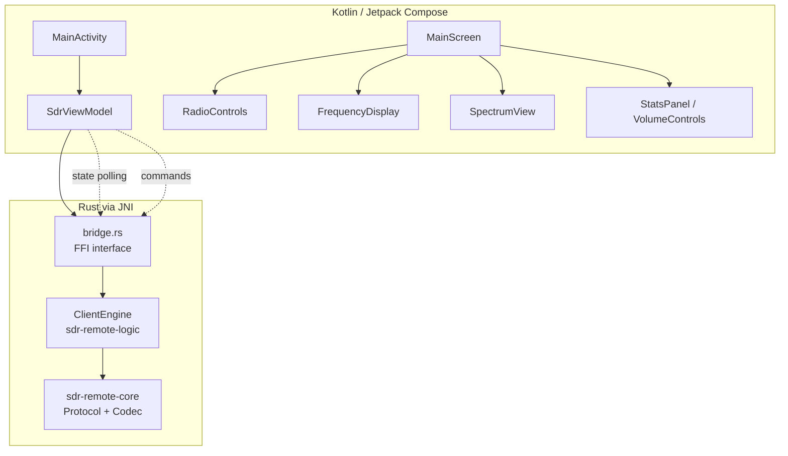

**Bridge functies (Rust → Kotlin):**
- `version()` → String
- `state()` → BridgeRadioState (130+ velden)
- `connect(addr)`, `disconnect()`
- `set_ptt(bool)`, `set_frequency(hz)`, `set_mode(u8)`
- `set_rx_volume(f32)`, `set_local_volume(f32)`, `set_tx_gain(f32)`
- `set_control(id, value)`
- `enable_spectrum(bool)`, `set_spectrum_fps/zoom/pan()`

**Audio:** Oboe (Android Native Audio), 48kHz mono f32

## Netwerk Timing & Betrouwbaarheid

### Tijdslijn van een audio frame

```
t=0ms    Client capture ring buffer → samples beschikbaar
t=1ms    Resample 48→8kHz, Opus encode
t=2ms    UDP verzenden
t=Xms    Netwerk transit (RTT/2)
t=X+1ms  Server ontvangst
t=X+2ms  Opus decode, resample 8→48kHz
t=X+3ms  Playback ring buffer → naar Thetis
```

Totale one-way latency: ~3ms processing + netwerk transit + jitter buffer (40-800ms adaptief)

### Heartbeat & Verbindingsdetectie

```
Interval:     500ms
Timeout:      max(6000ms, RTT × 8)
RTT meting:   Echo timestamp in HeartbeatAck
Loss%:        Rolling window per heartbeat interval
Reconnect:    Reset codec + jitter buffer bij eerste HeartbeatAck
```

### Pakketverlies Herstel

| Scenario | Herstel Methode |
|----------|----------------|
| 1 pakket verloren | FEC uit volgend pakket |
| 2+ pakketten verloren | PLC (Packet Loss Concealment) |
| Burst verlies | Jitter buffer absorbeert tot target depth |
| Netwerk piek | Spike peak hold voorkomt te snelle buffer krimp |
| Verbinding weg | Timeout na 6s, reconnect bij nieuwe HeartbeatAck |

## v0.4.1 Wijzigingen

### ptt.rs — Two-Phase Connect

Verbinding met Thetis CAT is herschreven naar een two-phase connect patroon:

- **Nieuw:** `needed_connections()` — retourneert welke verbindingen opgezet moeten worden (CAT en/of TCI)
- **Nieuw:** `accept_connections()` — accepteert reeds verbonden TCP streams van de caller
- **Verwijderd:** `try_connect_cat()`, `ptt_flag()` — niet meer nodig door two-phase patroon
- `set_power()` ongewijzigd, maar wordt nu correct aangeroepen na ZZBY commando

### cat.rs — Two-Phase Connect

CAT interface gebruikt nu hetzelfde two-phase connect patroon:

- **Nieuw:** `needs_connect()` — geeft aan of een (her)verbinding nodig is
- **Nieuw:** `accept_stream()` — accepteert een reeds verbonden TcpStream
- **Verwijderd:** `try_connect()` (was dead code)
- `send()` triggert geen verbindingspogingen meer; retourneert stil als niet verbonden
- **Rate limit:** 1s interval tussen reconnect pogingen

### tci.rs — Two-Phase Connect

TCI WebSocket interface volgt hetzelfde patroon:

- **Nieuw:** `needs_connect_info()` — geeft aan of een (her)verbinding nodig is
- **Nieuw:** `accept_stream()` — accepteert een reeds verbonden WebSocket stream
- **Verwijderd:** `try_connect()` (was dead code)
- `send()` triggert geen verbinding meer; retourneert stil als niet verbonden
- **Rate limit:** 1s reconnect interval (was 2s)

### network.rs — Achtergrond Connect Tasks

De verbindingslogica is verplaatst naar achtergrond tokio tasks:

- `cat_tick` spawnt een achtergrond tokio task voor two-phase connect
- Drie TCI consumer tasks: `drop(ptt_guard)` voor `sleep` om lock contention te voorkomen
- `freq_tick`: 100ms interval (was 500ms) voor snellere frequentie-updates
- **Connect timeouts:** 100ms TCP, 500ms WebSocket — voorkomt blokkering van de main loop

### engine.rs — PowerOnOff & State Sync (sdr-remote-logic)

Power on/off logica verbeterd:

- **PowerOnOff lokale state:** `value == 1` (was `value != 0`) voor correcte toggle
- **state_tx.send()** direct na PowerOnOff voor onmiddellijke UI update
- **power_suppress_until:** 5 seconden onderdrukking van server power broadcasts na lokale toggle, voorkomt dat server state de lokale wijziging terugdraait
