# ThetisLink Implementation

Detailed description of the implementation per module, including data flows and algorithms.

## sdr-remote-core

### protocol.rs — Packet Definitions (~900 LOC)

All packet types as Rust structs with `serialize()` / `deserialize()` methods.

**Wire format example — AudioPacket:**
```
Offset  Bytes  Field
0       1      magic (0xAA)
1       1      version (0x01)
2       1      packet_type (0x01)
3       1      flags (bit 0 = PTT)
4       4      sequence (u32 LE)
8       4      timestamp (u32 LE, ms)
12      2      opus_len (u16 LE)
14      N      opus_data
```

**ControlId enum:** 25+ control commands, each with u8 ID and u16 value. Used for bidirectional state sync between server and client.

**EquipmentStatus/Command:** Variable length, CSV-encoded telemetry in a `labels` string field. Each equipment type has its own CSV layout.

### codec.rs — Opus Audio Codec (~200 LOC)

| Parameter | Narrowband | Wideband |
|-----------|-----------|----------|
| Sample rate | 8 kHz | 16 kHz |
| Bitrate | 12.8 kbps | 24 kbps |
| Frame size | 160 samples (20ms) | 320 samples (20ms) |
| Bandwidth | Narrowband | Wideband |
| FEC | Inband, 10% loss | Inband, 10% loss |
| DTX | On | On |
| Signal type | Voice | Voice |

**Important:** Bitrate 12.8 kbps is just above the Opus FEC threshold (12.4 kbps). This guarantees that Forward Error Correction is always included.

### jitter.rs — Adaptive Jitter Buffer (~350 LOC)

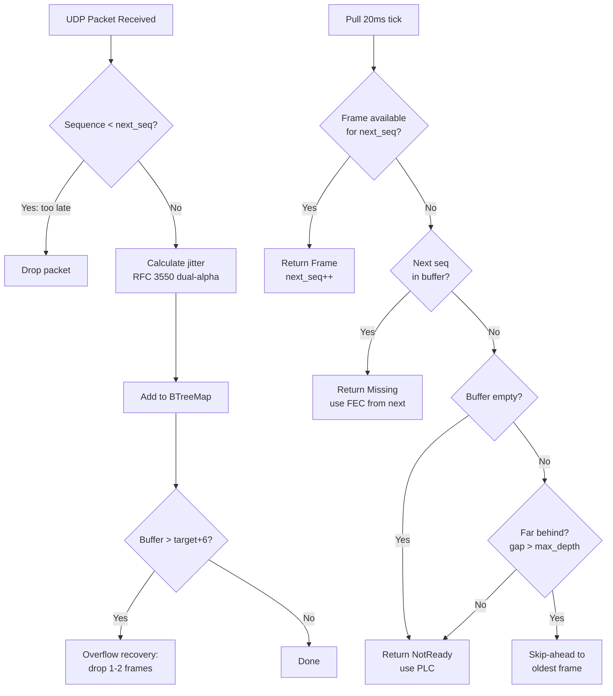

**Jitter estimation (RFC 3550 variant):**
```
deviation = |expected_interval - actual_interval|

if deviation > current_estimate:
    jitter = jitter + 0.25 * (deviation - jitter)     # fast attack
else:
    jitter = jitter + 0.0625 * (deviation - jitter)   # slow decay
```

**Spike peak hold:** Peak value with exponential decay (~1 minute). Prevents the buffer from shrinking too quickly after a network spike.

**Target depth formula:**
```
target = max(jitter_estimate, spike_peak) / 15.0 + 2
clamped: 2..40 frames (40ms..800ms)
```

**Grace period:** First 25 pulls (500ms) after connection: no overflow recovery. Allows the buffer to stabilize.

## sdr-remote-logic

### commands.rs — Command Enum (~90 variants)

Commands are sent from UI to engine via `mpsc::UnboundedSender<Command>`. Groups:

| Group | Examples | Count |
|-------|----------|-------|
| Connection | Connect, Disconnect | 2 |
| Audio | SetRxVolume, SetLocalVolume, SetVfoAVolume, SetTxGain | 7 |
| Radio | SetPtt, SetFrequency, SetMode, SetControl | 6 |
| Spectrum | EnableSpectrum, SetSpectrumFps/Zoom/Pan | 8 |
| RX2 | SetRx2Enabled, SetFrequencyRx2, SetModeRx2 | 12 |
| Amplitec | SetAmplitecSwitchA/B | 2 |
| Tuner | TunerTune, TunerAbort | 2 |
| SPE Expert | SpeOperate, SpeTune, SpeAntenna, ... | 11 |
| RF2K-S | Rf2kOperate, Rf2kTune, Rf2kAnt1-4, ... | 23 |
| UltraBeam | UbRetract, UbSetFrequency, UbReadElements | 3 |
| Rotor | RotorGoTo, RotorStop, RotorCw, RotorCcw | 4 |

### state.rs — RadioState (~170+ fields)

Broadcast from engine to UI via `watch::Sender<RadioState>`. UI receives via `watch::Receiver` with change notification.

**Main groups:**
- Connection: connected, rtt_ms, jitter_ms, buffer_depth, loss_percent
- Audio: capture_level, playback_level, playback_level_rx2
- Radio: frequency_hz, mode, smeter, power_on, filter_low/high_hz
- RX2: rx2_enabled, frequency_rx2_hz, mode_rx2, smeter_rx2
- Spectrum: spectrum_bins[], center_hz, span_hz, ref_level (RX1 + RX2)
- Equipment: ~100 fields for 6 equipment types

### engine.rs — ClientEngine (~2,181 LOC)

The engine is the heart of every client. Runs as an async tokio task.

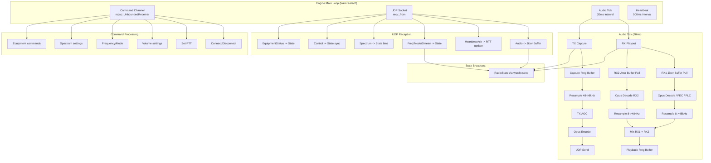

#### Audio Playout (RX) — Detail

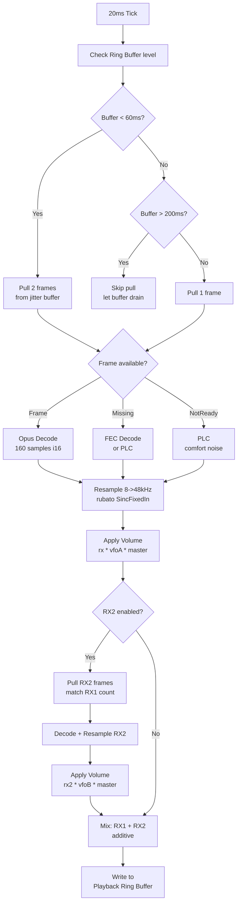

#### Audio Capture (TX) — Detail

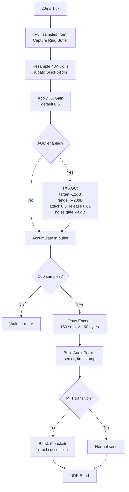

#### Frequency Synchronization

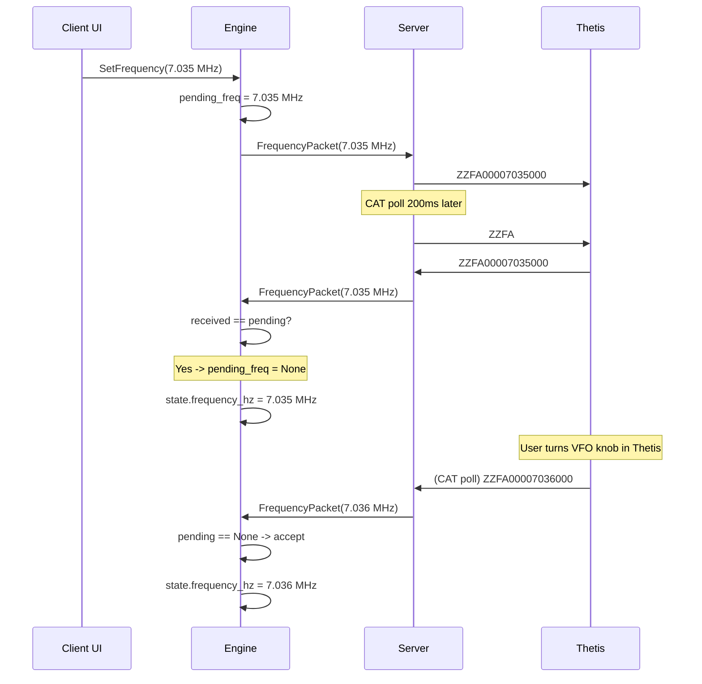

#### Volume Synchronization

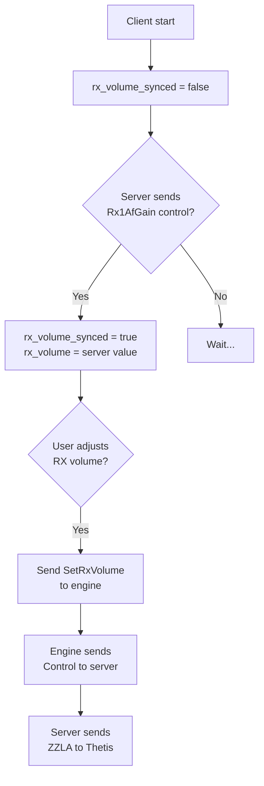

## sdr-remote-server

### Main Structure

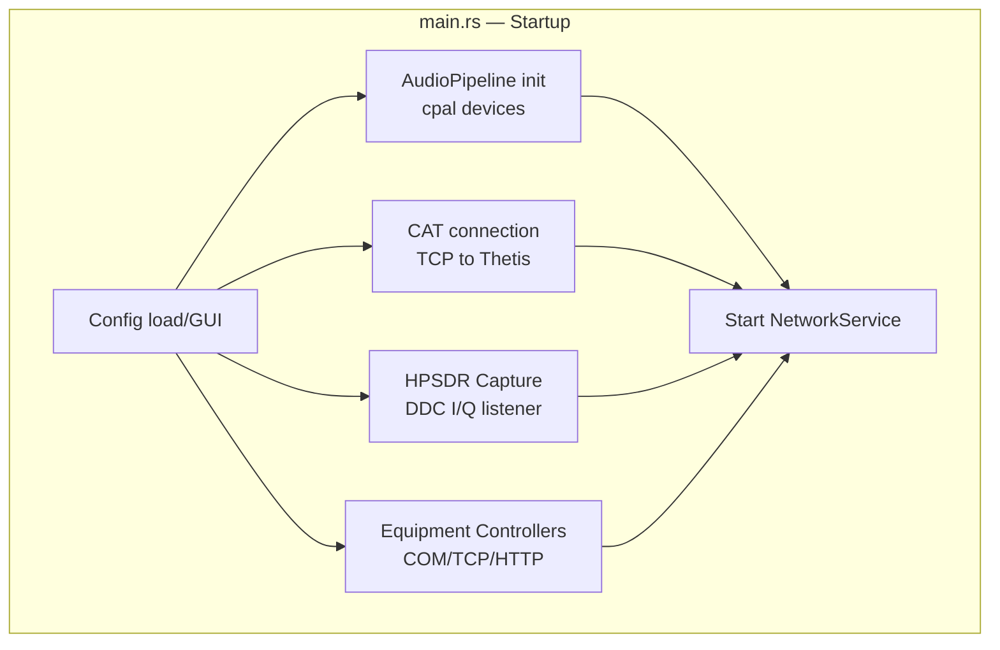

### network.rs — NetworkService (~1,363 LOC)

Manages all UDP communication with clients.

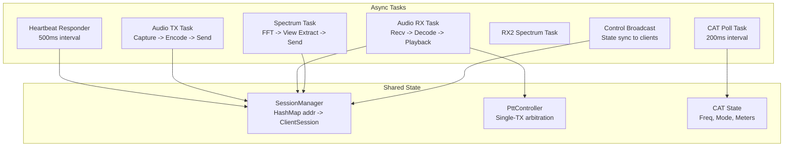

### cat.rs — CAT Interface (~834 LOC)

**Polling cycle:**

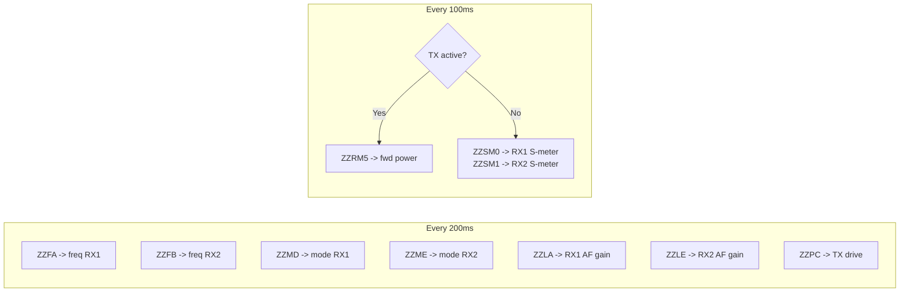

**S-meter processing:**
1. ZZSM provides raw value (0-260)
2. Conversion: `dBm = raw / 2 - 140`
3. Storage as linear milliwatts: `mW = 10^(dBm/10)`
4. RMS averaging over sliding window (4 samples, ~0.4 sec)
5. Back to display: `avg_mw -> dBm -> raw (0-260)`

### spectrum.rs — SpectrumProcessor (~994 LOC)

**DDC FFT Pipeline:**

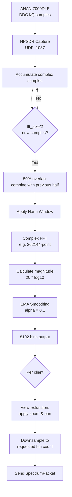

**FFT size selection:**
```
target = sample_rate / 6
fft_size = next_power_of_two(target)
minimum = 4096

Examples:
  1536 kHz -> 262144 (~12 FPS)
   384 kHz ->  65536 (~12 FPS)
    96 kHz ->  16384 (~12 FPS)
    48 kHz ->   8192 (~12 FPS)
```

### ptt.rs — PTT Controller (~559 LOC)

**Single-TX Arbitration:**

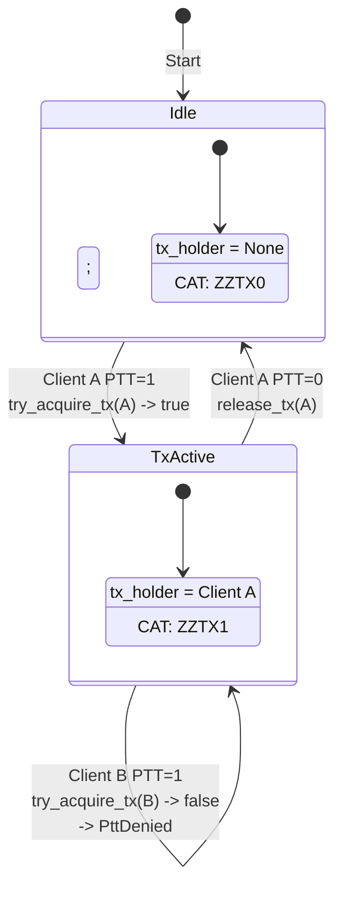

### Equipment Handlers

All equipment handlers follow the same pattern:

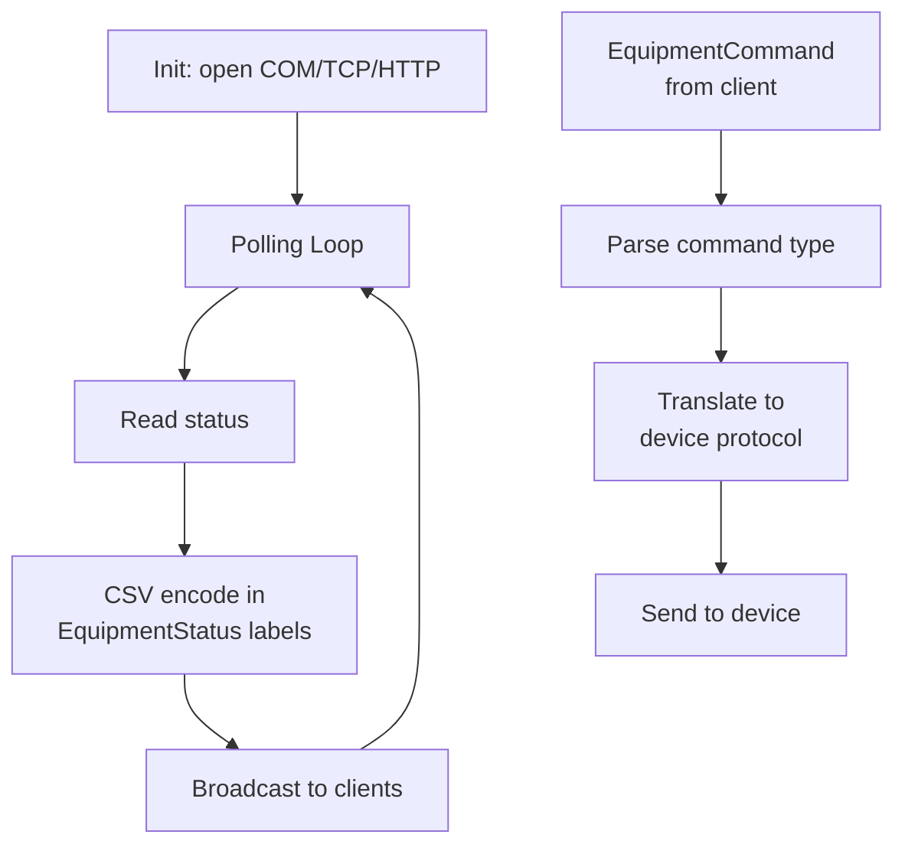

| Handler | Interface | Poll Interval | Telemetry Fields |
|---------|-----------|---------------|------------------|
| amplitec.rs (220 LOC) | COM 9600 | 1s | switch_a, switch_b, labels |
| tuner.rs (503 LOC) | COM 9600 | 500ms | state, can_tune |
| spe_expert.rs (568 LOC) | COM 9600 | 500ms | 12 fields (power, SWR, temp, ...) |
| rf2k.rs (1082 LOC) | HTTP :8080 | 500ms | 28+ fields incl. debug |
| ultrabeam.rs (461 LOC) | COM 9600 | 1s | freq, band, direction, elements |
| rotor.rs (245 LOC) | TCP :3010 | 500ms | angle, rotating, target |

## sdr-remote-client

### main.rs — Startup

```mermaid
graph TD
    A[Start] --> B[Init tokio runtime]
    B --> C[Create ClientAudio<br/>cpal devices]
    C --> D[Create ClientEngine<br/>from sdr-remote-logic]
    D --> E[Spawn engine<br/>in background]
    E --> F[Start eframe/egui<br/>rendering loop]
    F --> G[UI update() per frame]
```

### audio.rs — ClientAudio

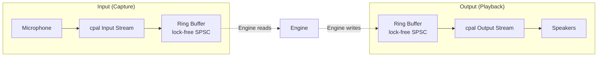

### ui.rs — Desktop UI (~5,668 LOC)

See separate document: [UI.md](UI.md)

## sdr-remote-android

### Architecture

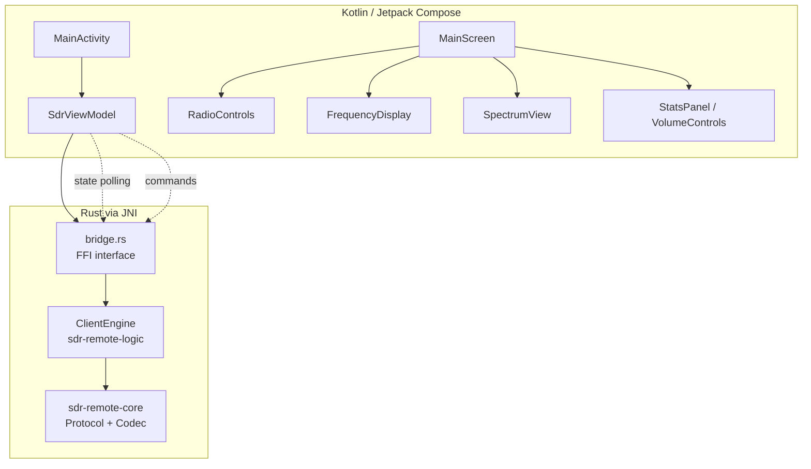

**Bridge functions (Rust -> Kotlin):**
- `version()` -> String
- `state()` -> BridgeRadioState (130+ fields)
- `connect(addr)`, `disconnect()`
- `set_ptt(bool)`, `set_frequency(hz)`, `set_mode(u8)`
- `set_rx_volume(f32)`, `set_local_volume(f32)`, `set_tx_gain(f32)`
- `set_control(id, value)`
- `enable_spectrum(bool)`, `set_spectrum_fps/zoom/pan()`

**Audio:** Oboe (Android Native Audio), 48kHz mono f32

## Network Timing & Reliability

### Timeline of an audio frame

```
t=0ms    Client capture ring buffer -> samples available
t=1ms    Resample 48->8kHz, Opus encode
t=2ms    UDP send
t=Xms    Network transit (RTT/2)
t=X+1ms  Server receive
t=X+2ms  Opus decode, resample 8->48kHz
t=X+3ms  Playback ring buffer -> to Thetis
```

Total one-way latency: ~3ms processing + network transit + jitter buffer (40-800ms adaptive)

### Heartbeat & Connection Detection

```
Interval:     500ms
Timeout:      max(6000ms, RTT * 8)
RTT measurement: Echo timestamp in HeartbeatAck
Loss%:        Rolling window per heartbeat interval
Reconnect:    Reset codec + jitter buffer on first HeartbeatAck
```

### Packet Loss Recovery

| Scenario | Recovery Method |
|----------|----------------|
| 1 packet lost | FEC from next packet |
| 2+ packets lost | PLC (Packet Loss Concealment) |
| Burst loss | Jitter buffer absorbs up to target depth |
| Network spike | Spike peak hold prevents buffer from shrinking too quickly |
| Connection lost | Timeout after 6s, reconnect on new HeartbeatAck |

## v0.4.1 Changes

### ptt.rs — Two-Phase Connect

The Thetis CAT connection has been rewritten to a two-phase connect pattern:

- **New:** `needed_connections()` — returns which connections need to be established (CAT and/or TCI)
- **New:** `accept_connections()` — accepts already-connected TCP streams from the caller
- **Removed:** `try_connect_cat()`, `ptt_flag()` — no longer needed with the two-phase pattern
- `set_power()` unchanged, but now called correctly after the ZZBY command

### cat.rs — Two-Phase Connect

The CAT interface now uses the same two-phase connect pattern:

- **New:** `needs_connect()` — indicates whether a (re)connection is needed
- **New:** `accept_stream()` — accepts an already-connected TcpStream
- **Removed:** `try_connect()` (was dead code)
- `send()` no longer triggers connect attempts; silently returns if not connected
- **Rate limit:** 1s interval between reconnect attempts

### tci.rs — Two-Phase Connect

The TCI WebSocket interface follows the same pattern:

- **New:** `needs_connect_info()` — indicates whether a (re)connection is needed
- **New:** `accept_stream()` — accepts an already-connected WebSocket stream
- **Removed:** `try_connect()` (was dead code)
- `send()` no longer triggers connect; silently returns if not connected
- **Rate limit:** 1s reconnect interval (was 2s)

### network.rs — Background Connect Tasks

Connection logic has been moved to background tokio tasks:

- `cat_tick` spawns a background tokio task for two-phase connect
- Three TCI consumer tasks: `drop(ptt_guard)` before `sleep` to avoid lock contention
- `freq_tick`: 100ms interval (was 500ms) for faster frequency updates
- **Connect timeouts:** 100ms TCP, 500ms WebSocket — prevents blocking the main loop

### engine.rs — PowerOnOff & State Sync (sdr-remote-logic)

Power on/off logic improved:

- **PowerOnOff local state:** `value == 1` (was `value != 0`) for correct toggle behavior
- **state_tx.send()** immediately after PowerOnOff for instant UI update
- **power_suppress_until:** 5-second suppression of server power broadcasts after local toggle, prevents the server state from reverting the local change
