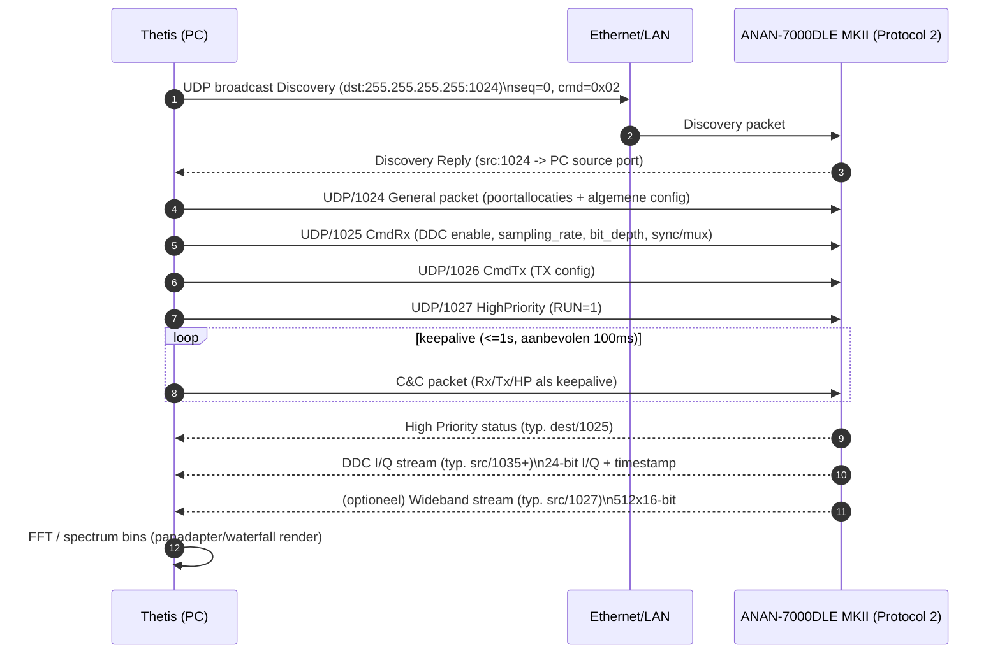

# Interactie tussen Thetis SDR en Apache Labs ANAN‑7000DLE MKII via Protocol 2 over Ethernet met focus op spectrum‑datastroom

## Samenvatting voor management

Thetis (ramdor/Thetis) communiceert met de ANAN‑7000DLE MKII via **UDP** volgens de openHPSDR *Protocol 2*‑familie: eerst **Discovery** naar UDP/1024, daarna configuratie via **General** (naar UDP/1024) en **C&C**‑stromen (o.a. Rx‑specific UDP/1025, Tx‑specific UDP/1026, High‑Priority van PC UDP/1027), en vervolgens continue datastromen voor de spectrumweergave. citeturn40view5turn40view3

De **spectrum/panadapter‑weergave** in Thetis wordt primair gevoed door **DDC I/Q‑samplepaketten** (narrowband) en optioneel door **Wideband data** (brede “bandscope”/waterfall‑achtige weergaven). In de protocoldocumentatie wordt wideband data gespecificeerd als 512×16‑bit samples (standaardpoort 1027) en DDC‑streaming als 24‑bit I/Q met o.a. een 64‑bit timestamp en een expliciete “I‑blok dan Q‑blok” sample‑volgorde. citeturn40view6turn40view7

De meest waarschijnlijke oorzaken van spectrum‑issues bij Protocol‑2‑koppeling zijn (a) **poort‑/stream‑mismatch** (DDC‑basispoort of wideband‑poort wijkt af), (b) **keepalive/C&C‑onderbreking** waardoor de radio uit RUN valt en streaming stopt, (c) **endianness/veld‑offset mismatch** (o.a. sequence/timestamp) waardoor parsing “verschuift”, of (d) **I/Q‑interpretatie** waardoor het spectrum gespiegeld/reversed kan lijken. citeturn40view4turn40view7turn40view3

Voor troubleshooting is een gerichte packet capture (Wireshark/tcpdump/dumpcap) op UDP/1024, 1025, 1026, 1027 en de **DDC‑poortrange** (typisch vanaf 1035) het snelst: je controleert dan discovery, configuratie, RUN/keepalive en of de eigenlijke I/Q‑data binnenkomt. Daarnaast is in de Thetis broncode goed te herleiden waar de poorten geprogrammeerd worden (**CmdGeneral()**) en hoe frames binnenkomen (**recvfrom()**, **ReadUDPFrame()**, event‑gedreven FD_READ loop). citeturn40view3turn40view2

## Bronnen en methodologie

De analyse is gebaseerd op primaire/official bronnen (waar mogelijk) en op broncode‑inspectie:

De officiële Apache Labs downloadpagina toont dat zowel de **ANAN‑7000DLE MKII User Manual** als de **Thetis Manual** officieel aangeboden worden. citeturn11search17turn21search14  
Voor inhoudelijke citaten is gebruikgemaakt van een exact‑gelijke PDF‑kopie van de **ANAN‑7000DLE MKII User Guide (26 Feb 2019)** en een publiek beschikbare **openHPSDR Ethernet Protocol v3.6** PDF (Protocol‑2 documentatie). citeturn13view0turn23view0

De Thetis‑implementatie is geanalyseerd op basis van de **ramdor/Thetis** repository, in het bijzonder het native “ChannelMaster” gedeelte waar de Protocol‑2 UDP‑transport en packet handling zichtbaar is (o.a. `network.c`, `netInterface.c`). citeturn25view0turn36view0turn40view3

Nederlandstalige, officiële documentatie over openHPSDR Protocol‑2 en de ANAN‑7000DLE MKII is in deze onderzoeksronde niet betrouwbaar of volledig gevonden; de beschikbare kernbronnen zijn overwegend Engelstalig. (Wel bestaan er community‑vertalingen in andere talen, maar die zijn niet “official” en/of niet stabiel bereikbaar in deze sessie.) citeturn11search17turn23view0

## Protocol 2 netwerkarchitectuur en spectrum‑datastromen

### Discovery, sessie‑opbouw, keepalive en RUN‑controle

Protocol 2 start met een **Discovery broadcast** naar `255.255.255.255:1024`. De host (PC) kiest een eigen source port; alle SDR’s die op 1024 luisteren antwoorden met hun IP/poortgegevens, waarmee een command/response kanaal ontstaat. citeturn40view4turn40view5

Cruciaal voor “het spectrum blijft lopen”: na configuratie moet de host een **High Priority packet met RUN‑bit** sturen om datastromen te starten, en vervolgens moet er minimaal elke seconde (de documentatie beveelt **100 ms**) een **C&C‑packet** van host naar hardware blijven gaan. Als dat uitblijft terwijl de hardware in RUN staat, schakelt de hardware terug naar standby (o.a. TX/PTT gereset). Dit mechanisme is een klassieke oorzaak van “spectrum komt even op en bevriest daarna”. citeturn40view4turn40view2

Zoals in de protocoltekst expliciet staat, beginnen de Ethernet‑payloads doorgaans met een **32‑bit sequence number**, bedoeld om verloren pakketten te detecteren. citeturn40view4turn40view3

### Wideband data versus DDC I/Q data

Voor spectrumweergave zijn er twee relevante dataklassen:

**Wideband Data Packet**  
Dit is bedoeld voor zeer brede “spectral/waterfall” displays. Het voorbeeldformaat gaat uit van **512 samples per pakket**, **16 bits per sample**, met in bytes 0–3 het sequence number en daarna sample‑woorden in `[15:8]` / `[7:0]` byte‑volgorde. De documentatie noemt **default port 1027** (wideband). citeturn40view6turn24view2

**DDC I/Q stream** (de kern voor panadapter in “narrowband receiver view”)  
De DDC‑poort wordt door de **General Packet** toegewezen; als die op nul staat, **default** de bronpoort volgens de documentatie naar **1035 voor DDC0**, en 1036 voor DDC1, enzovoort. In de DDC‑payload zitten o.a. een **64‑bit timestamp** (samplecount‑achtig), een field voor **bits per sample** (huidige FPGA code: **24 bits per sample**), en het aantal I/Q samples in het frame. De samples worden beschreven als signed 2’s complement. citeturn40view7turn24view1

Belangrijk: de DDC sample‑volgorde is volgens het document “**I‑samples gevolgd door Q‑samples**”, en er wordt expliciet gewaarschuwd dat, afhankelijk van hoe “I” en “Q” geïnterpreteerd worden, een FFT‑spectrum **reversed** kan lijken; in dat geval zou je I/Q omwisselen. citeturn40view7turn24view3

## Thetis implementatie in ramdor/Thetis met focus op spectrum‑datastroom

### Waar Thetis de Protocol‑2 poorten en streams configureert

In `Project Files/Source/ChannelMaster/network.c` bouwt Thetis (ChannelMaster‑laag) de **General packet** in `CmdGeneral()` en programmeert daar expliciet een set poorten:

- General command gaat naar **port 1024** (`CmdGeneral() { // port 1024 }`)  
- Rx‑specific control: **1025**  
- Tx‑specific control: **1026**  
- High priority **van PC**: **1027**  
- High priority **naar PC**: **1025**  
- Rx audio: **1028**  
- Tx0 I&Q: **1029**  
- En een DDC‑basispoort die in de comments/structuur als **Rx0 port #1035** wordt aangeduid (`packetbuf[17..18] = prn->rx_base_port`). citeturn40view3

Dit is een “load‑bearing” observatie: als jouw 7000DLE MKII firmware of jouw Protocol‑2 variant andere portallocaties verwacht (bijv. wideband/DDC op andere poorten), dan kan Thetis wél verbinden maar géén bruikbare samples voor de spectrumweergave ontvangen.

### Inkomende UDP‑frames, sequence parsing en error handling

In dezelfde `network.c` is zichtbaar dat Thetis een UDP leespad heeft dat:

- `recvfrom()` gebruikt en op errors zoals `WSAEWOULDBLOCK` en `WSAEMSGSIZE` logt (typische indicatie dat een frame te groot is of non‑blocking reads geen data hebben). citeturn40view3  
- Het 32‑bit sequence number uit de eerste vier bytes uitpakt door bytes om te keren (`seqbytep[3]=readbuf[0]` … `seqbytep[0]=readbuf[3]`), wat in de praktijk consistent is met “network‑order” (MSB‑first) verzending. Dit is gevoelig voor endian‑mismatches: als firmware sequence anders endian encodeert, ziet Thetis “sprongen” of ongeldige sequence. citeturn40view3turn40view6  
- In een FD_READ event‑loop `ReadUDPFrame()` aanroept en de returnwaarde (`rc`) gebruikt als discriminator; er is expliciet een `case 1025:` (High priority/status) zichtbaar, waarna `xrouter(..., rc, ..., prn->RxReadBufp)` wordt aangeroepen om gegevens verder het systeem in te routeren. citeturn40view3

Voor spectrumdata is dit relevant omdat DDC‑streams (typisch 1035+) en/of wideband frames (vaak 1027 als bronpoort bij hardware) in deze routinglaag correct herkend moeten worden; als `ReadUDPFrame()` de bronpoort/stream verkeerd classificeert, komt er geen bruikbaar sampleblok aan bij de analyzer/FFT.

### Start/stop van streaming

Thetis heeft functies die RUN/streaming beïnvloeden:

- `SendStart()` zet `prn->run = 1;` en roept `CmdHighPriority(); //1027`. Dit past conceptueel bij de protocol‑documentatie: High Priority met RUN‑bit start streaming. citeturn40view2turn40view4  
- `SendStop()` zet `prn->run = 0;` en roept opnieuw `CmdHighPriority();`. citeturn40view2  
- `StartReadThread()` roept `SendStart()` en faalt als dat niet lukt; `StopReadThread()` kan een `SendStop()` doen (afhankelijk van protocol). citeturn40view2

Dit is belangrijk in debugging: als Thetis wel discovery doet maar `SendStart()`/`CmdHighPriority()` niet wordt geaccepteerd (bv. firmware verwacht andere poort/packetlayout), dan blijft de spectrumweergave leeg doordat de hardware nooit echt gaat streamen.

## Vergelijking tussen veldverwachtingen en wat de 7000DLE MKII waarschijnlijk levert

### Vergelijking van poortmodel

Onderstaande tabel zet het “protocoldocument default” naast wat Thetis in `CmdGeneral()` hard programmeert. Let op: *default ports* in het protocoldocument slaan soms op bronpoorten van hardware wanneer bepaalde velden nul zijn; Thetis kan die via General wel degelijk overschrijven, maar in praktijk zijn defaults vaak leidend als firmware daarop is gebouwd.

| Stream / functie | Protocol 2 documentatie | Thetis (ramdor) configuratie/indicatie | Risico voor spectrum |
|---|---|---|---|
| Discovery | UDP dest **1024**; command=0x02; payload 60 bytes (seq=0) | Past bij Protocol‑2 flow; Thetis gebruikt General naar 1024 | Als discovery ontbreekt: geen connectie; niet spectrum‑specifiek maar blocking. citeturn40view5turn40view3 |
| Command/Control “General” | Na discovery registers instellen; RUN via High Priority; C&C keepalive vereist | `CmdGeneral() // port 1024` | Als keepalive/C&C stopt: spectrum stopt/freeze. citeturn40view4turn40view3 |
| High Priority (host→hardware) | High Priority packet met RUN bit (poort niet in deze ene screenshot gespecificeerd; conceptueel onderdeel van C&C) | “High priority from PC port **1027**” in `CmdGeneral()`; `CmdHighPriority()` wordt ook naar **1027** gestuurd | Firmware kan andere destport of veldlayout verwachten → RUN komt niet aan → geen data. citeturn40view2turn40view3turn40view4 |
| High Priority status (hardware→host) | Default **1025** (status‑packet) | “High Priority to PC port **1025**” | Als status binnenkomt maar geen DDC: probleem zit in DDC‑streaming of routing. citeturn40view3turn24view0 |
| Wideband data (hardware→host) | Default bronpoort **1027**, 512×16‑bit samples per packet | Thetis gebruikt 1027 als High‑Priority host→hardware; wideband enable/poort lijkt niet expliciet in deze code‑uitsnede | Mogelijke verwarring/mismatch bij wideband/WB‑display (niet per se panadapter). citeturn40view6turn40view3 |
| DDC I/Q data (hardware→host) | Default bronpoort **1035** voor DDC0; 24‑bit I/Q; timestamp | Thetis zet `rx_base_port` (comment “Rx0 port #1035”) in General; Rx‑DDC settings via `CmdRx() // port 1025` incl. `sampling_rate` en `bit_depth` | Als firmware niet op 1035+ streamt of samples anders encodeert: leeg of corrupte spectrum. citeturn40view7turn40view3 |

### Packetveld‑vergelijking voor spectrumrelevante payloads

**Discovery request (PC→HW)**  
Uit de spec: bytes 0–3 sequence (0), byte 4 = `0x02`, bytes 5–59 = 0. citeturn40view5  
Dit kun je direct als hexdump herkennen.

**Wideband Data Packet (HW→PC)**  
Uit de spec: bytes 0–3 sequence; vanaf byte 4 sample0 (16‑bit, `[15:8]` dan `[7:0]`), tot en met sample511; totaal 1028 bytes sampledata + 4 bytes seq = 1032 bytes payload. citeturn40view6

**DDC I/Q stream (HW→PC)**  
Uit de spec: bronpoort default 1035 voor DDC0; sequence field; 64‑bit timestamp; bits‑per‑sample (24); aantal samples; I‑blok gevolgd door Q‑blok; en expliciete waarschuwing dat het spectrum reversed kan lijken als I/Q anders geïnterpreteerd wordt. citeturn40view7  

**Thetis sequence‑parsing**  
Thetis leest bytes 0–3 en draait ze om in memory‑layout (`seqbytep[3]=readbuf[0] ... seqbytep[0]=readbuf[3]`). Dit sluit aan bij MSB‑first transmissie zoals de tabellen in de spec voor 16‑bit fields suggereren (hi‑byte eerst). citeturn40view3turn40view6

### 7000DLE MKII netwerkpraktijk die spectrum beïnvloedt

De MKII handleiding benadrukt dat **hubs niet werken** en dat een **full‑duplex gigabit switch (1000Base‑T)** wordt aanbevolen; een slechte L2/L3 infrastructuur kan packet loss/jitter veroorzaken wat direct zichtbaar is in FFT/spectrum. citeturn40view8turn39view1

Verder is relevant dat de radio bij directe PC‑koppeling vaak een **APIPA‑adres (169.254/16)** krijgt; als de IP‑toewijzing traag is of op 0.0.0.0 blijft hangen, komt er uiteraard geen UDP‑sampleflow binnen. citeturn40view9turn39view2

## Debugging, packet capture, code‑haakjes en compatibiliteitsaanbevelingen

### Packet capture aanpak en Wireshark filters

Neem een capture op de NIC waarmee de MKII verbonden is (bij voorkeur dedicated NIC zoals in veel OpenHPSDR‑setups wordt aanbevolen in de handleiding), en filter op de control‑ en datapoorten.

Praktische Wireshark display filters (begin hiermee en verfijn daarna):

```text
udp.port == 1024 || udp.port == 1025 || udp.port == 1026 || udp.port == 1027 || udp.port == 1035
```

Voor DDC‑streams met meerdere receivers:

```text
udp.srcport >= 1035 && udp.srcport <= 1100
```

Voor discovery specifiek:

```text
udp.dstport == 1024 && frame.len <= 200
```

Wat je verwacht te zien in de timeline:

- PC → broadcast: UDP/1024 discovery (seq=0, cmd=0x02) citeturn40view5  
- PC → radio: General packet naar UDP/1024, gevolgd door Rx control (1025), Tx control (1026), High priority (1027) citeturn40view3turn40view2  
- Radio → PC: High priority status (vaak dest/1025) citeturn40view3turn24view0  
- Radio → PC: DDC I/Q op 1035+ en eventueel wideband op 1027 (afhankelijk van enable/firmware) citeturn40view7turn40view6  

Als je géén DDC‑packets ziet maar wél status, zit het probleem meestal in (a) RUN niet gezet/blijft niet gezet, (b) DDC enable/samplingrate niet gezet zoals firmware verwacht, of (c) poortallocatie mismatch (rx_base_port). citeturn40view2turn40view3turn40view7

### Voorbeeld hex dumps

**Discovery request** (60 bytes payload; seq=0, cmd=0x02, rest 0):

```text
00 00 00 00  02 00 00 00  00 00 00 00  00 00 00 00
00 00 00 00  00 00 00 00  00 00 00 00  00 00 00 00
00 00 00 00  00 00 00 00  00 00 00 00  00 00 00 00
00 00 00 00  00 00 00 00  00 00 00 00
```

Dit dump‑patroon komt direct overeen met de Discovery‑tabel (byte 4 = 0x02; bytes 5–59 0). citeturn40view5

**Wideband data header herkenning**  
Een wideband packet begint met 4 bytes sequence en daarna 16‑bit samples hi‑byte/lo‑byte (bijv. sample0 = bytes 4–5). citeturn40view6

### Code‑locaties in Thetis waar spectrumdata het systeem binnenkomt

Voor Protocol‑2 over Ethernet (ETH) binnen ramdor/Thetis zijn de belangrijkste instappunten:

- `Project Files/Source/ChannelMaster/network.c`
  - `CmdGeneral()` — zet **poortallocaties** en platform‑config in de General packet (naar UDP/1024). citeturn40view3  
  - `CmdRx()` — zet per receiver o.a. **ADC‑selectie**, **sampling_rate**, **bit_depth** en “sync/mux” bytes; verstuurt naar UDP/1025. Dit is relevant omdat sample rate en bit depth rechtstreeks de FFT‑schaal en datadecodering beïnvloeden. citeturn40view3  
  - `SendStart()`/`SendStop()` — RUN aan/uit via `CmdHighPriority()` (naar UDP/1027). citeturn40view2turn40view4  
  - `ReadUDPFrame()` + FD_READ loop — ontvangt frames via `recvfrom()`, behandelt errors, pakt sequence bytes uit, en routeert data door (o.a. via `xrouter(...)`). citeturn40view3

- `Project Files/Source/ChannelMaster/netInterface.c`
  - Bevat veel “setter”‑API’s die bij wijzigingen `CmdRx()`, `CmdTx()` of `CmdHighPriority()` triggeren (bijv. bij attenuator‑, CW‑, puresignal‑wijzigingen). Dit is indirect relevant omdat C&C frequentie/keepalive mede hierdoor kan blijven lopen. citeturn38view0turn40view2

Aanvullend (niet volledig uitgewerkt in deze bron‑uitsnede, maar zichtbaar als modules in de repo) zitten routing en analysering typisch in `router.c/h` en `analyzers.c/h` in dezelfde ChannelMaster map; die vormen doorgaans de brug van “ruwe I/Q” naar spectrum/FFT. citeturn36view0turn40view3

### Waarschijnlijke mismatch‑categorieën en concrete acties

Mismatchcategorie: DDC/wideband poorten komen niet overeen  
- Symptoom: Thetis “connect” maar panadapter blijft leeg; in capture zie je wel status maar geen DDC op 1035+.  
- Actie: controleer in Wireshark of radio werkelijk op 1035+ uitzendt (zoals de spec en Thetis comment suggereren). citeturn40view7turn40view3  
- Code‑aanknopingspunt: `CmdGeneral()` zet `prn->rx_base_port` (comment “Rx0 port #1035”). Als jouw firmware een andere base gebruikt, is een configuratiemogelijkheid of conditional compile/firmware‑detectie nodig. citeturn40view3

Mismatchcategorie: RUN/keepalive wegvallend  
- Symptoom: spectrum start kort en stopt; of stopt bij CPU‑spikes.  
- Actie: check of er elke ≤1 s (liefst 100 ms) een C&C packet blijft gaan. Als niet: zoek blokkerende threads/UI deadlocks of netwerkproblemen. citeturn40view4turn40view2turn40view8  
- Netwerkactie: gebruik een echte gigabit **switch** (geen hub) en vermijd power‑saving op de NIC. De handleiding is expliciet dat hubs niet werken. citeturn40view8turn39view1

Mismatchcategorie: endian/veld‑offset mismatch in DDC payload  
- Symptoom: zwaar “ruisachtig” spectrum, rare sprongen, of crashes/bad packet.  
- Actie: valideer met Wireshark of samplewoorden hi‑byte/lo‑byte consistent zijn; check Thetis sequence‑unpacking en vergelijk met wire‑order. citeturn40view3turn40view6  
- Code‑suggestie: voeg in `ReadUDPFrame()` of direct na `seq` parsing debug‑logging toe voor `nrecv`, `rc`, `seq`, en (bij DDC) de parsed `bits_per_sample`/timestamp offsets. (Let erop dat `WSAEMSGSIZE` duidt op grotere‑dan‑buffer frames; vergroot buffer of corrigeer expected payload size.) citeturn40view3

Mismatchcategorie: I/Q omwisseling leidt tot reversed spectrum  
- Symptoom: spectrum is gespiegeld (links‑rechts om).  
- Actie: test een I/Q‑swap in de keten vóór FFT (of activeer een bestaande “I/Q swap” optie als aanwezig). De spec waarschuwt expliciet voor deze situatie. citeturn40view7turn24view3  
- Code‑aanknopingspunt: plek waar samples naar analyzer/FFT gaan — vermoedelijk rond `xrouter()` → analyzer input; daar kan conditioneel de I/Q volgorde omgedraaid worden.

### Mermaid tijdlijn van verbinding en dataflow



Deze sequence volgt direct uit de discovery‑/keepalive‑regels en de packet/poortdefinities. citeturn40view4turn40view5turn40view6turn40view7turn40view3

## RX2 / DDC3 datastroom (meerdere ontvangers)

De ANAN 7000DLE MKII ondersteunt meerdere gelijktijdige DDC-ontvangers. In Thetis is standaard DDC2 (poort 1037) de primaire ontvanger (RX1) en DDC3 (poort 1038) de tweede ontvanger (RX2). Elke DDC heeft een eigen I/Q datastroom op een aparte UDP-poort.

### DDC poort toewijzing

De DDC basispoort wordt in het General packet ingesteld (standaard 1035 voor DDC0). De toewijzing is:

| DDC | UDP source poort | Thetis functie |
|-----|-----------------|----------------|
| DDC0 | 1035 | (niet standaard in gebruik) |
| DDC1 | 1036 | (niet standaard in gebruik) |
| DDC2 | 1037 | **RX1** — Primaire ontvanger |
| DDC3 | 1038 | **RX2** — Tweede ontvanger |
| DDC4-7 | 1039-1042 | Extra ontvangers (indien beschikbaar) |

**Let op:** De toewijzing DDC2→RX1, DDC3→RX2 is een Thetis conventie, geen Protocol 2 vereiste. In de DDC Specific packets (CmdRx) configureert Thetis welke DDC aan welke ADC gekoppeld is en met welke sample rate.

### HP Packet NCO phasewords voor meerdere DDCs

Het High Priority packet (poort 1025, hardware→PC) bevat NCO phasewords voor alle DDC ontvangers:

```
Offset 9-12:   DDC0 NCO phaseword (slot 0)
Offset 13-16:  DDC1 NCO phaseword (slot 1)
Offset 17-20:  DDC2 NCO phaseword (slot 2) ← RX1 center
Offset 21-24:  DDC3 NCO phaseword (slot 3) ← RX2 center
Offset 25-40:  DDC4-DDC7 NCO phasewords
```

De phaseword → Hz conversie is identiek voor alle slots: `freq_hz = (phaseword × 122_880_000) >> 32`

In ThetisLink worden slot 0 (RX1) en slot 3 (RX2) uitgelezen. Slot 0 wordt gebruikt omdat sommige Thetis versies DDC0 als alias voor de actieve primaire ontvanger gebruiken; slot 3 is specifiek voor DDC3/RX2.

### RX2 DDC3 I/Q data format

Het dataformaat van DDC3 packets (poort 1038) is identiek aan DDC2 (poort 1037):
- 16 bytes header (sequence, timestamp, bits_per_sample, samples_per_frame)
- 238 I/Q sample-paren, elk 6 bytes (3 bytes I + 3 bytes Q, 24-bit signed big-endian)

De sample rate van DDC3 wordt apart geconfigureerd in de DDC Specific packets maar is in de praktijk altijd gelijk aan DDC2 (typisch 1536 kHz).

### Wireshark filters voor RX2 capture

```text
# DDC3/RX2 I/Q data
ip.src == <RADIO_IP> && udp.srcport == 1038

# Beide DDC ontvangers
ip.src == <RADIO_IP> && (udp.srcport == 1037 || udp.srcport == 1038)

# HP packets met NCO phasewords
ip.src == <RADIO_IP> && udp.srcport == 1025

# Compleet: HP + DDC2 + DDC3
ip.src == <RADIO_IP> && (udp.srcport == 1025 || udp.srcport == 1037 || udp.srcport == 1038)
```

### CTUN effect op RX2

CTUN geldt globaal voor de hele radio (niet per ontvanger). Bij CTUN aan:
- DDC2 center (RX1) bevriest op `CentreFrequency` (niet VFO-A)
- DDC3 center (RX2) bevriest op de RX2 panadapter center (niet VFO-B)
- VFO-A en VFO-B markers bewegen binnen hun respectieve DDC bereiken

De HP packet NCO phasewords geven altijd de werkelijke DDC center weer, ongeacht CTUN status. Dit is de meest betrouwbare bron voor spectrum rendering in een externe applicatie.

---

## Aannames en expliciete onzekerheden

Er zijn enkele punten die normaliter afhankelijk zijn van jouw exacte setup/firmware, en die ik daarom als aannames markeer:

De term “protocol 2” wordt hier geïnterpreteerd als openHPSDR Ethernet Protocol‑2 stijl zoals gedocumenteerd in **openHPSDR Ethernet Protocol v3.6**. Andere firmwarebranches (met o.a. latere protocolversies) kunnen velden toevoegen/wijzigen. citeturn23view0turn40view7

De concrete veldoffsets van het volledige DDC I/Q frame (exacte byteposities van timestamp/bits‑per‑sample/samples) zijn in dit rapport beschreven op basis van de documentatiepagina’s; de exacte parsing in Thetis buiten de getoonde `ReadUDPFrame()`‑/routing‑snippets kan additionele aannames bevatten (bijv. fixed 24‑bit packing, alignment, of verschillende layouts per hardware). citeturn40view3turn40view7

De 7000DLE MKII handleiding beschrijft netwerk/IP‑praktijk (APIPA, switches) maar niet de volledige wire‑level Protocol‑2 implementatie van Apache Labs firmware. Daarom is de wire‑level vergelijking “Thetis verwacht vs 7000DLE zendt” primair gebaseerd op openHPSDR Protocol‑documentatie plus de Thetis code. citeturn13view0turn40view3turn40view7

## Bronnenlinks

```text
Randor/Thetis (hoofdrepo)
https://github.com/ramdor/Thetis

Thetis Protocol-2 netwerkcode (ChannelMaster)
https://github.com/ramdor/Thetis/blob/master/Project%20Files/Source/ChannelMaster/network.c
https://github.com/ramdor/Thetis/blob/master/Project%20Files/Source/ChannelMaster/netInterface.c

openHPSDR Ethernet Protocol v3.6 (Protocol 2 documentatie, PDF)
https://ad0es.net/dfcSDR/fpga/files/openHPSDR_Ethernet_Protocol_v3.6.pdf

Apache Labs officiële downloads pagina (verwijst naar Thetis Manual en 7000DLE MKII manual)
https://apache-labs.com/instant-downloads.html

ANAN-7000DLE MKII User Guide (PDF kopie gebruikt voor citaten; inhoudelijk identiek aan Apache Labs manual)
https://manuals.plus/m/07b7f5462f4960fcee08f1af40b992962dda23950ac174f36e5c788660c31005_optim.pdf

Thetis User Manual (HTML mirror; nuttig als documentatiebron wanneer PDF-hosting niet stabiel toegankelijk is)
https://docslib.org/doc/2361981/thetis-user-manual
```